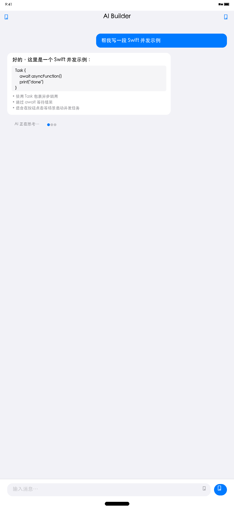
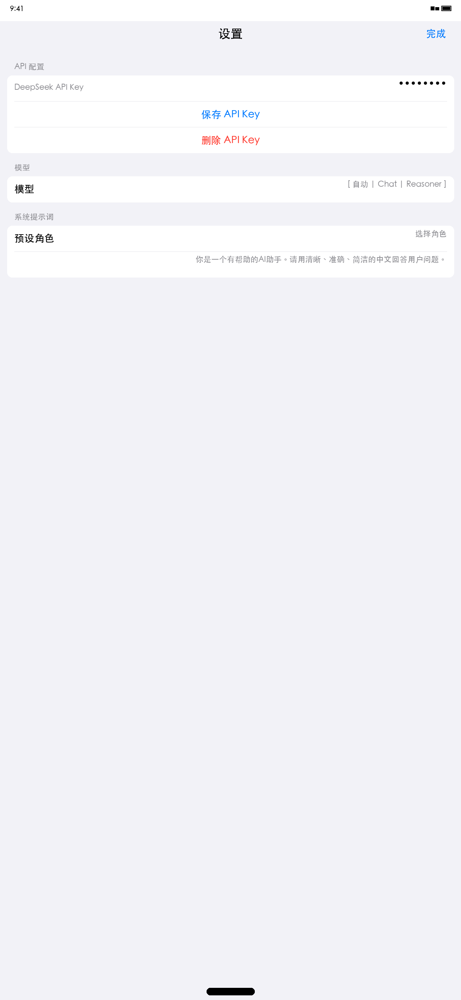
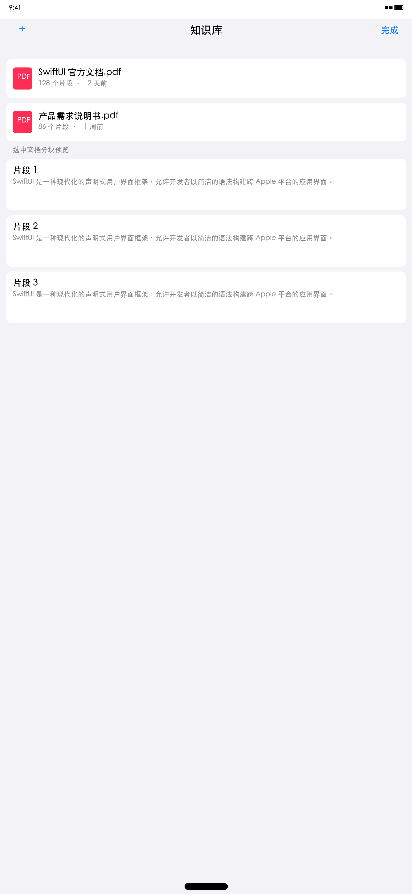
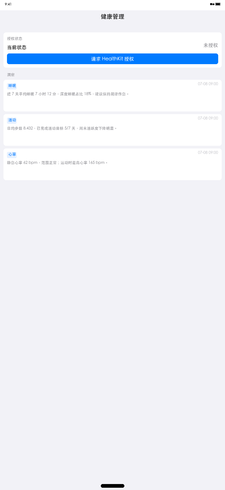
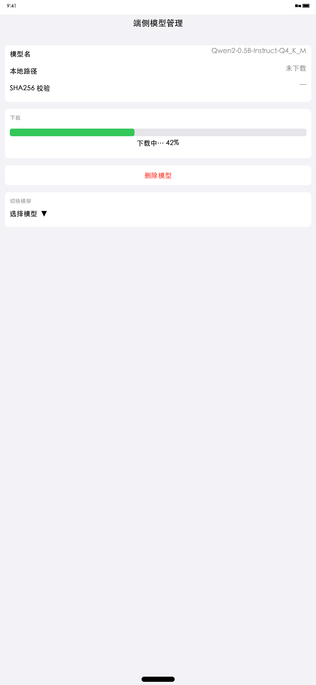
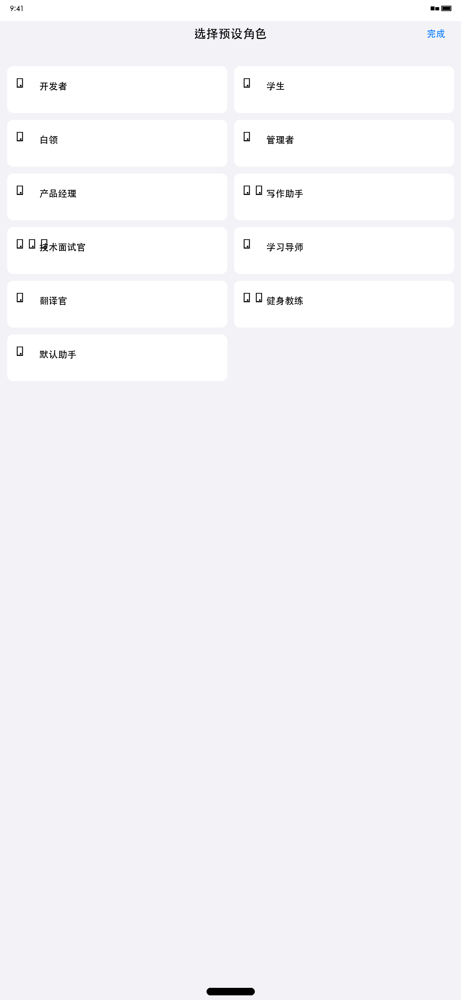
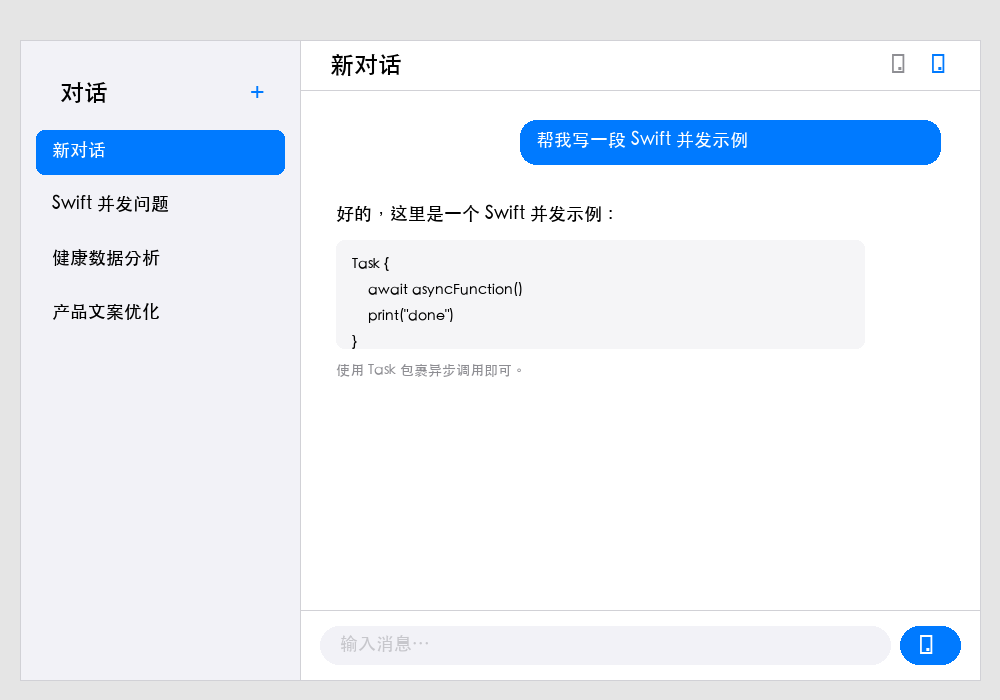
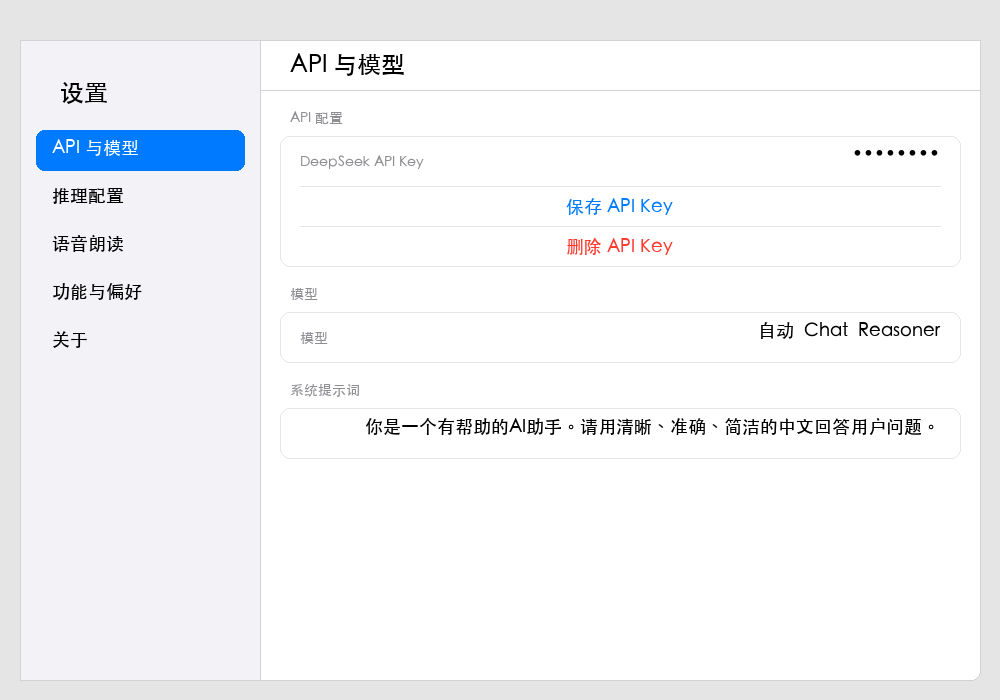

# Aether（以太）

<!-- doc-stats: i18n=888 tools=26 tests=2661 -->

> 一个原生 SwiftUI AI 对话助手，支持 iOS / iPad / macOS 三端，采用**液态玻璃 + 深空主题**视觉语言。基于多 LLM Provider（DeepSeek / Qwen / BFF 代理 / 端侧 MLX），覆盖流式对话、RAG 知识库、ReAct 工具调用、语义缓存、端侧离线推理、语音合成与识别、健康洞察、灵动岛 Live Activity、Watch App、桌面 Widget、DeepLink 等能力。底层引入 Rust 核心引擎（aether-core-ffi，xcframework 分发），提供跨平台统一的高性能算法（SHA-256 哈希、Token 计数、文档分块、向量相似度、SSE 解析、WASM 沙箱、Candle 推理、令牌桶限流、敏感信息脱敏）。支持 8 种语言（简中 / 繁中 / 英 / 日 / 韩 / 法 / 德 / 西）。

## 截图

| iOS 主对话 | iOS 设置 | iOS 知识库 | iOS 健康洞察 |
|---|---|---|---|
|  |  |  |  |

| iOS 端侧模型 | iOS 预设提示词 | macOS 对话 | macOS 设置 |
|---|---|---|---|
|  |  |  |  |

## 功能特性

- **流式对话**：基于 SSE 打字机效果，支持 DeepSeek / Qwen / BFF 代理 / 端侧 MLX 四种 Provider，逐 chunk 实时输出。
- **ReAct 工具调用**：15 个跨平台工具 + 11 个 macOS 独有工具，基于 function calling 循环执行，最大 5 轮，单工具超时 15s 不中断。
- **RAG 知识库**：本地文档导入（PDF / 文本）→ 分块 → 嵌入 → 余弦相似度 topK 检索 → `[1][2]` 编号注入 prompt。
- **语义缓存**：基于 embedding 余弦相似度（阈值 0.92）匹配历史 query，命中跳过 LLM 请求，减少重复调用。
- **端侧推理**：MLX 离线模式，设备本地运行 Llama-3.2-1B-Instruct Q4_K_M 量化模型，断网自动切换。
- **语音合成与识别**：SFSpeechRecognizer 实时语音输入，AVSpeechSynthesizer 朗读 AI 回复，TTS 音色可调节。
- **健康洞察**（iOS）：HealthKit 读取步数 / 心率 / 睡眠，生成中文洞察文本并持久化。
- **灵动岛 Live Activity**（iOS）：ActivityKit 状态机「思考中 → 回复中 → 完成」。
- **SmartRouter 智能模型路由**：基于规则与历史成功率在多 Provider 间动态路由，失败自动 Fallback。
- **Watch App**（iOS 配对）：watchOS 独立 App，TabView 三标签（快速对话 / 健康洞察 / 设置），通过 WatchConnectivity 与主 App 双向同步。⚠️ 需在 Xcode 中手动创建 Watch target。
- **桌面 Widget**：三个 Widget（QuickChat 快捷提问 / HealthInsight 健康洞察 / RecentConversations 最近会话），通过 App Group 共享 SwiftData。⚠️ 需在 Xcode 中手动创建 Widget target。
- **DeepLink 支持**：`aether://ask?query=` 快捷提问、`aether://conversation/<uuid>` 跳转指定会话。
- **多语言支持**：8 种语言（zh-Hans / zh-Hant / en / ja / ko / fr / de / es），App 内切换并提示重启。
- **无障碍**：VoiceOver 标签与提示、Dynamic Type 适配、accessibilityIdentifier 覆盖关键交互控件。
- **深色模式默认 + 液态玻璃 UI**：深空黑基底 + 神秘紫强调 + 电光蓝交互 + 液态玻璃卡片，深色模式开箱即用。

## 技术栈

- **SwiftUI**（`@Observable` / `@Bindable` / `@FocusState` / NavigationSplitView）
- **SwiftData**（`@Model` 宏自动生成 schema 与迁移，7 个持久化实体）
- **Rust**（aether-core-ffi，C ABI 绑定，xcframework 三架构分发，cbindgen 生成头文件）
- **MLX**（端侧推理，Llama-3.2-1B-Instruct Q4_K_M 量化）
- **Candle**（Rust 跨平台推理引擎，safetensors 模型，macOS）
- **wasmtime**（Rust WASM 运行时，Pulley 解释器，无 JIT，macOS）
- **AVFoundation**（AVAudioSession / AVSpeechSynthesizer 语音输入输出）
- **BackgroundTasks**（BGTaskScheduler 后台刷新，iOS）
- **ActivityKit**（Live Activities 灵动岛，iOS）

其他依赖：EventKit / PhotosUI / PDFKit / NLTokenizer / Keychain / CoreSpotlight / AppIntents / NetworkExtension / HealthKit / WatchConnectivity / Vision / NSAppleScript / NSWorkspace / Process。

## 快速开始

1. clone 仓库
2. 用 Xcode 16+ 打开 `Aether.xcodeproj`
3. **Rust 依赖**（可选，xcframework 已预编译）：
   ```bash
   rustup target add aarch64-apple-ios aarch64-apple-ios-simulator aarch64-apple-darwin
   cd rust/aether-core-ffi && cargo build --release
   ```
4. iOS 运行：选 iPhone 17 模拟器 → `Cmd + R`
5. macOS 运行：选 My Mac 目标 → `Cmd + R`
6. 运行后进入设置填入 DeepSeek API Key（https://platform.deepseek.com 申请）

## 项目结构

项目采用 MVVM + Service 分层架构，详见 [架构文档](doc/ARCHITECTURE.md)。简要结构：

```
Aether.xcodeproj/           # Xcode 工程文件
rust/
├── aether-core/             # 纯 Rust 算法 crate（sha2 / unicode-segmentation / tokenizers / candle / wasmtime / regex）
└── aether-core-ffi/         # C ABI 绑定层 + cbindgen.toml
Packages/
└── AetherCore/              # SPM 模块化包
    ├── Sources/
    │   ├── AetherFoundation/  # 核心协议与常量（LLMProvider / ToolProtocol / APIConfig）
    │   ├── AetherRust/        # Rust FFI Swift 包装器（10 个文件）
    │   ├── AetherServices/    # 服务层（LLM / RAG / Cache / Plugin / Telemetry 等）
    │   ├── AetherDesign/      # 设计系统 Token（颜色 / 字体 / 圆角 / 布局）
    │   └── AetherUI/          # 通用 UI 组件（AvatarView / CardStyle / ErrorBanner 等）
    ├── Tests/AetherCoreTests/
    └── aether_core.xcframework/  # Rust 三架构静态库
Aether/                     # 主 App（iOS / iPad / macOS）
├── App/                    # App 入口（AetherApp.swift，含 DeepLink 处理）
├── AppIntents/             # App Intents（AskAether / NewConversation / SwitchConversation）
├── Core/                   # 核心协议与常量（LLMProvider / ToolProtocol / APIConfig）
├── DesignSystem/           # 设计系统 Token（颜色 / 字体 / 间距 / 圆角 / 动画）
├── Models/                 # SwiftData @Model（Conversation / ChatMessage / DocumentChunk 等 7 实体）
├── Resources/              # 资源（Assets / Info.plist / Localizable.xcstrings 8 语言 / PrivacyInfo）
├── Services/               # 服务层（19 子模块：LLM / RAG / Tools / Cache / Voice / OnDevice / Health 等）
├── ViewModels/             # MVVM ViewModel（ChatViewModel / ConversationListVM / KnowledgeBaseVM / SettingsViewModel）
└── Views/                  # SwiftUI 视图（Chat / Components / Conversation / OnDevice / RAG / Settings）
AetherWatch/                # watchOS App（TabView：快速对话 / 健康洞察 / 设置）
AetherWidgets/              # Widget Extension（QuickChat / HealthInsight / RecentConversations）
CloudflareWorkers/          # BFF 代理层（worker.js + wrangler.toml）
AetherTests/                # 单元测试（151 文件 / 2661 用例）
AetherUITests/              # UI 测试（2 文件 / 13 用例）
```

## 文档导航

| 文档 | 用途 |
|------|------|
| [架构文档](doc/ARCHITECTURE.md) | 分层架构图、模块职责、数据流、关键设计决策、技术栈映射、测试架构 |
| [使用文档](doc/USAGE.md) | 环境要求、功能流程、FAQ |
| [API 契约](doc/API.md) | LLMProvider / ToolProtocol 协议、ToolDefinition JSON Schema、SSE 格式 |
| [贡献指南](doc/CONTRIBUTING.md) | 开发环境、代码规范、提交规范、PR 流程 |
| [变更日志](doc/CHANGELOG.md) | Day 1–20 全部里程碑记录 |
| [路线图](doc/ROADMAP.md) | 后续任务方向 |
| [优化方案](doc/OPTIMIZATION.md) | 性能与体验优化 |
| [样式指南](doc/Style%20Guide.md) | 液态玻璃 + 深空主题设计规范 |
| [手测清单](doc/MANUAL_TEST_CHECKLIST.md) | 多平台适配、工具能力等手测模块 |
| [发布清单](doc/ReleaseChecklist.md) | 多平台构建验证、工具数量审计 |
| [BFF 部署](doc/BFF_DEPLOYMENT.md) | Cloudflare Workers 代理层部署指南 |
| [DMG 打包](doc/DMG_PACKAGING.md) | macOS .dmg 打包与公证流程 |
| [架构图](doc/diagrams/README.md) | PlantUML 架构图渲染说明 |

## 环境要求

- Xcode 16+
- iOS Deployment Target 17.0+
- macOS Deployment Target 14+
- watchOS Deployment Target 10+（Watch App 可选）
- DeepSeek API Key（云端模式）
- mlx-swift SPM 依赖（端侧推理可选）
- Rust 1.75+（构建 aether-core-ffi xcframework 需要，可选）
- App Group `group.com.aether.app`（Widget 共享 SwiftData 可选）

> **Watch App 与 Widget 注意事项**：源代码已就绪（`AetherWatch/` 与 `AetherWidgets/`），但需在 Xcode 中手动创建对应的 target 并关联源文件、配置 App Group 与 Capabilities。详见 [贡献指南](doc/CONTRIBUTING.md) 中的 Watch / Widget 开发指南。

## License

MIT
