# Aether 架构文档

> 本文基于 Aether 多平台项目（iOS / iPad / macOS 原生） Day 1–20 实际代码撰写，描述系统分层、模块职责、数据流与关键技术决策。
> 所有引用的文件路径均与磁盘一致，技术术语保留英文原文。架构与流程图统一使用 Mermaid 描述。

---

## 目录

1. [项目概述](#1-项目概述)
2. [分层架构图](#2-分层架构图)
3. [模块职责](#3-模块职责)
4. [数据流](#4-数据流)
5. [关键设计决策](#5-关键设计决策)
6. [技术栈映射](#6-技术栈映射)
7. [测试架构](#7-测试架构)
8. [目录结构](#8-目录结构)

---

## 1. 项目概述

**项目定位**：Aether 是一款 AI Native 多平台 App（iOS / iPad / macOS 原生），基于 SwiftUI + 多 LLM Provider（DeepSeek / Qwen / 端侧 MLX）构建，覆盖流式对话、多轮记忆、RAG 检索增强、ReAct 工具调用、语音输入输出、视觉多模态、Markdown 富文本渲染、TTS 音色可调节、BFF 代理、端侧 MLX 推理、HealthKit 健康洞察、App Intents 系统集成、智能路由与 Fallback、远程配置与遥测、崩溃监控、性能监控、隐私清单等 Day 1–20 全部能力。底层引入 Rust FFI 层（aether-core-ffi）提供跨平台统一的高性能核心算法。

**核心能力清单**（20+ 项）：

### Day 1–11 基础能力

1. **流式对话**：基于 OpenAI 兼容 chat completions SSE 流式接口，逐 chunk yield 文本，前端实时打字效果展示。
2. **多轮记忆**：SwiftData 持久化 Conversation + ChatMessage，会话级消息历史注入 LLM 上下文，支持 system prompt 自定义。
3. **RAG 检索增强**：本地知识库（PDF/文本）→ DocumentChunker 分块 → EmbeddingService 嵌入 → 余弦相似度 topK=5 检索 → 拼 `[1][2]` 编号 prompt 注入。
4. **ReAct 工具调用**：基于 function calling，ToolRegistry 注册 14 跨平台 + 11 macOS 独有工具（共 25 个，原 4 个 + 新增 21 个：跨平台 7 个 LocationTool / DeviceInfoTool / ClipboardTool（Read+Write 两个注册项）/ OpenURLTool / ContactsTool / WeatherTool，快捷指令 3 个 RunShortcutTool / ListShortcutsTool / CreateShortcutTool，macOS 独有 11 个 AppleScriptTool / ScreenshotTool / OCRTool / TerminalCommandTool / WindowManagementTool / AppManagementTool / FileOperationTool / FinderTool / SafariControlTool / SystemControlTool / InputAutomationTool，macOS 独有工具用 `#if os(macOS)` 条件注册），最大循环 5 轮，单工具超时 15s 不中断循环。
5. **语音输入输出**：AVAudioSession + SFSpeechRecognizer 实时语音识别写入输入框，AVSpeechSynthesizer 朗读 AI 回复。
6. **视觉多模态**：用户从相册选择图片，base64 编码后以 `image_url` 形式嵌入 content 数组，多模态下发 LLM。
7. **用户偏好记忆**：UserPreference @Model 持久化语气偏好 / 偏好工具 / 自定义事实，注入 systemPrompt 末尾个性化 AI 回复。
8. **调试面板**：DebugInfo 记录最近一次请求的 promptJSON / apiResponse / embeddingDimension / toolCalls，仅当前会话不持久化。
9. **灵动岛 Live Activity**：ActivityKit TimerActivityAttributes，状态机「思考中 → 回复中 → 完成」，iOS 16.1+ 可用低版本静默降级。
10. **BGTaskScheduler + 本地通知**：注册每日刷新后台任务（`com.aether.daily-refresh`），UNUserNotificationCenter 在工具调用成功 / AI 回复完成等场景推送本地通知。BGTask `register` 在 `init` 中（系统要求），`schedule` 调度延迟到首次进入后台 `scenePhase == .background` 时懒执行，减少冷启动耗时。

### Day 12–20 扩展能力

11. **Markdown 渲染**：消息气泡支持代码块（`CodeBlockView` + `CodeSyntaxHighlighter` 高亮）/ 表格（`MarkdownTableParser` + `MarkdownTableView`）/ 任务列表（`TaskListView`）/ 标题分级（`HeadingView`）/ 富文本段落（`MarkdownText`），保留行内 code 与 bold/italic。
12. **TTS 音色可调节**：`TTSConfig` 持久化音色 ID / 语速 / 音调 / 音量到 UserDefaults，`TTSVoiceCatalog` 提供系统音色目录，`TTSVoicePickerView` 提供试听，`VoiceService` 在朗读前应用配置。
13. **消息复制与重新提问**：MessageBubble 长按 contextMenu 提供「复制 / 重新提问」操作，复制写入系统剪贴板并 toast 反馈，重新提问将原文回填到输入框并发送。
14. **批量多选删除会话**：会话列表支持编辑模式（多选 / 全选 / 删除选中），含二次确认弹窗，删除走 ChatStorage 批量删除并触发 Spotlight 索引清理。
15. **智能路由（SmartRouter）**：基于规则与历史成功率在多 Provider 间路由（DeepSeek ↔ Qwen），失败自动 Fallback，记录遥测数据。
16. **多 Provider 支持**：`ModelProvider` enum 抽象 DeepSeek / Qwen / 端侧三类，`ModelProviderFactory` 创建对应 client，`FallbackLLMProvider` 包装自动降级，`RateLimiter` 客户端令牌桶限流。
17. **BFF 代理层**：`BFFProxyClient` 走 Cloudflare Workers 网关中转，设备端仅持 `userToken`，不持上游 API Key；`BFFConfig` 承载 endpoint / token / 限流参数，UserDefaults 持久化。
18. **MLX 端侧推理**：`MLXInferenceEngine` 在设备本地运行 Llama-3.2-1B-Instruct Q4_K_M 量化模型，`OnDeviceModelDownloader` 从 HuggingFace CDN 下载并 SHA256 校验，`OfflineLLMProvider` 实现 `LLMProvider` 协议，断网时自动切换。
19. **HealthKit 健康洞察**：`HealthKitService` 读取步数 / 心率 / 睡眠数据，`HealthInsightGenerator` 生成洞察文本并持久化到 `HealthInsight` @Model，`HealthSettingsView` 管理授权与展示。
20. **App Intents / Shortcuts**：`AskAetherIntent` / `NewConversationIntent` / `SwitchConversationIntent` 三个 Intent，集成 Shortcuts / Spotlight / Siri，`IntentChatService` 处理 Intent 触发的会话路由。
21. **Spotlight 索引**：`SpotlightIndexer` 为 Conversation 创建/更新 `CSSearchableItem`，支持系统搜索直达会话。
22. **WatchConnectivity**：`WatchConnectivityService` 与 AetherWatch watchOS App 双向通信，同步 Quick Chat 与健康洞察。
23. **远程配置与遥测**：`RemoteConfigService` 拉取远程开关/限流配置，`TelemetryService` 收集使用指标，`LogUploader` 上传脱敏日志。
24. **崩溃监控**：`CrashReportService` 捕获未捕获异常与信号崩溃，落盘后在下次启动上报。
25. **性能监控**：`PerformanceMonitor` 记录首屏渲染 / 流式首字 / 工具执行等关键耗时指标。
26. **网络监听自动切换**：`NetworkMonitor` 基于 `NWPathMonitor` 实时检测网络状态变化，断网时触发 OnDeviceConfig.autoSwitchOnNetworkLoss 自动切到端侧。
27. **隐私清单与投诉反馈**：`PrivacyInfo.xcprivacy` 声明隐私 API 用途，`PrivacyPolicyView` 展示隐私政策，`FeedbackService` 提供反馈/投诉入口（持久化到 `MessageFeedback` @Model）。
28. **多平台适配**：SwiftUI 原生渲染支持 iOS / iPad / macOS 三端，通过 `#if os(iOS)` 条件编译隔离 iOS-only 框架（BGTaskScheduler / ActivityKit / HealthKit / WatchConnectivity）让 macOS 优雅降级；macOS 加入窗口默认尺寸 1000×700、菜单栏快捷键（⌘N 新建 / ⌘K 搜索 / ⌘, 设置）、⌘Enter 发送；UIKit 组件替换为 SwiftUI 跨平台组件（DocumentPickerView 用 `.fileImporter`、FeedbackService 用 `ProcessInfo`）；SettingsView / KnowledgeBaseView 用 NavigationSplitView 双栏布局适配多平台。
29. **工具能力增强**：ToolRegistry 从 4 个工具扩展到 14 跨平台 + 11 macOS 独有（共 25 个），新增 21 个工具分三类：跨平台 7 个（LocationTool / DeviceInfoTool / ClipboardTool（Read+Write 两个注册项）/ OpenURLTool / ContactsTool / WeatherTool）、macOS 独有 11 个（AppleScriptTool / ScreenshotTool / OCRTool / TerminalCommandTool / WindowManagementTool / AppManagementTool / FileOperationTool / FinderTool / SafariControlTool / SystemControlTool / InputAutomationTool，用 `#if os(macOS)` 守卫）、快捷指令 3 个（RunShortcutTool / ListShortcutsTool / CreateShortcutTool，CreateShortcutTool 通过 WFWorkflow plist 生成 .shortcut 文件支持 open_url / run_script / show_text / copy_to_clipboard 四种动作）。
30. **预设系统提示词**：`PresetPrompts.swift` 提供 11 个预设角色（默认助手 / 开发者 / 学生 / 白领 / 管理者 / 产品经理 / 写作助手 / 技术面试官 / 学习导师 / 翻译官 / 健身教练），每个含详细完整的 system prompt 文本（≥ 150 字）；SettingsView 的 `systemPromptSection` 上方新增「预设角色」Menu，选中后填入 TextEditor 保留可编辑性，复用现有「完成」按钮回写逻辑。
31. **macOS 体验修复**：设置二级 / 三级页面导航修复（`regularLayout` detail 包 `NavigationStack`，二级页 TTS / 隐私政策 / 端侧模型管理有返回按钮）；工具项中文化（SettingsView `preferenceSection` 的 Toggle 用中文 `description` 替代英文 `name`）；macOS markdown 视觉层次修复（MessageBubble.swift NSColor shim 的 systemGray3 / 5 / 6 改为不同灰阶 separatorColor / textBackgroundColor / controlBackgroundColor）；macOS 语音朗读 UI 修复（MarkdownText 加 `parseBlocks` NSCache 缓存 countLimit=200，VoiceService 加 `@MainActor`、`didCancel` 兜底清理、voice nil 降级、移除 spokenText 死状态）；18 个工具文件 + ToolRegistry 补充文件级 / 方法级 / 行内中文注释。

---

## 2. 分层架构图

Aether 采用 5 层分层架构（表现层 / 领域层 / 服务层 / Rust FFI 层 / 数据层），依赖方向自上而下单向流动。下图使用 Mermaid `flowchart TB` 描述，每个 subgraph 代表一个分层。

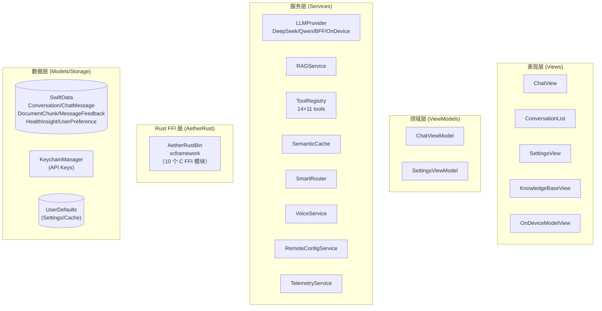

**依赖方向说明**：

| 上层模块 | 下层依赖 |
|---------|---------|
| 表现层 (Views) | 领域层 (ViewModels) |
| 领域层 (ViewModels) | 服务层 (Services) + 数据层 (Models) |
| 服务层 (Services) | Rust FFI 层 (AetherRust) + 数据层 (SwiftData / Keychain / UserDefaults) |
| Rust FFI 层 (AetherRust) | aether-core-ffi Rust 库 / xcframework |
| Tests | 所有层 |

**各层职责概览**：

| 层级 | 职责 | 文件数 |
|------|------|--------|
| 表现层 (Views) | SwiftUI 视图，6 个子模块（Chat / Components / Conversation / OnDevice / RAG / Settings），含液态玻璃 + 深空主题 DesignSystem | 37 |
| 领域层 (ViewModels) | `@Observable` 状态管理 + 业务编排（ChatViewModel / ConversationListVM / KnowledgeBaseVM / SettingsViewModel） | 4 |
| 服务层 (Services) | 20 个子模块业务实现（Auth / Cache / Connectivity / Crash / Feedback / Health / Intents / LLM / Language / Network / OnDevice / Performance / RAG / RemoteConfig / Routing / Search / Storage / Telemetry / Tools / Voice） | 54 |
| Rust FFI 层 (AetherRust) | 10 个 Swift 包装器，通过 `AetherRustBin` xcframework 调用 Rust aether-core-ffi C ABI，提供高性能核心算法（Sha256 / Token / Chunker / Vector / SSE / Sandbox / Inference / RateLimiter / Redactor / FFIError） | 10 |
| 数据层 (Models/Storage) | SwiftData `@Model`（7 实体）+ KeychainManager（API Keys）+ UserDefaults（Settings/Cache） | 7 |

### 2.1 模块依赖图

下图使用 Mermaid `classDiagram` 展示核心 ViewModel 对 LLMProvider 协议及其 4 个实现的依赖关系。`ChatViewModel` 依赖 `LLMProvider` / `RAGService` / `ToolRegistry` 三个服务编排 ReAct 循环。

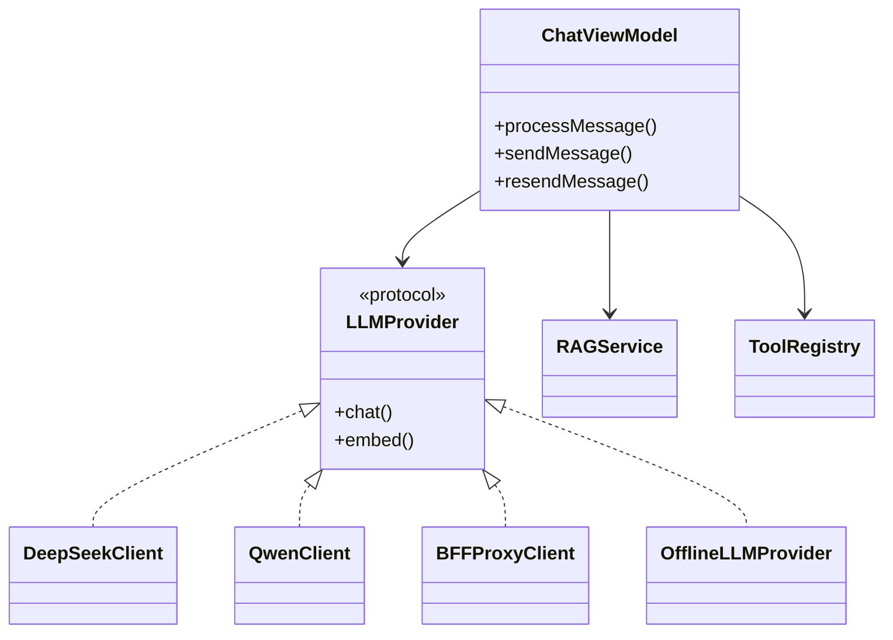

---

## 3. 模块职责

### 3.1 Core 层

Core 层除协议/常量/扩展/Actor 外，新增 `Core/Models` 子目录承载 BFF、端侧推理等配置数据模型（非 SwiftData `@Model`，仅 `Codable + Sendable` 结构）。

| 文件 | 职责 |
|------|------|
| `Core/Actors/ChatActor.swift` | ~~自定义 `@globalActor`，目前仅占位未实际应用到具体方法上。~~ **已移除**（ChatActor.swift 已删除）。 |
| `Core/Constants/APIConfig.swift` | 定义 `APIConfig`（DeepSeek 端点 URL + 模型名常量）与 `ChatConfig`（model / systemPrompt / maxTokens / temperature）。 |
| `Core/Constants/ModelProvider.swift` | Day 13 LLM 供应商抽象 enum：`deepseek` / `qwen` / `onDevice` 三 case，承载 displayName / baseURL / chatEndpoint / embeddingEndpoint / defaultChatModel / defaultReasonerModel / defaultEmbeddingModel / keychainAccount / fallback（deepseek ↔ qwen 互备，onDevice 备用 deepseek）。 |
| `Core/Extensions/String+TokenCount.swift` | `estimatedTokens` 扩展，按空格分词后乘 1.3 系数粗略估算 token 数，用于 tokenLimit 截断。 |
| `Core/Models/BFFConfig.swift` | Day 15 BFF 代理配置：enabled / endpointURL / userToken / chatRateLimitPerMin / embedRateLimitPerMin，Codable + Sendable，UserDefaults 持久化（键 `bff_config_cache`）。 |
| `Core/Models/OnDeviceConfig.swift` | Day 16 端侧推理配置：enabled / modelPath / autoSwitchOnNetworkLoss / maxTokens / temperature / modelName / downloadURL / expectedSHA256，UserDefaults 持久化（键 `ondevice_config_cache`）。 |
| `Core/Models/OnDeviceError.swift` | Day 16 端侧推理错误枚举：insufficientMemory / modelNotFound / sha256Mismatch / unsupportedQuantization / loadFailed，`LocalizedError` 提供用户友好描述。 |
| `Core/Protocols/LLMProvider.swift` | `LLMProvider` 协议（chat 流式 + embed）+ `APIMessage` / `ToolCallParam` / `FunctionCall` 数据结构。 |
| `Core/Protocols/ToolProtocol.swift` | `ToolDefinition`（name + description + JSON Schema parameters）+ `ToolProtocol` 协议（definition + execute）。 |

#### 关键公开 API 一览

| 类型 | 方法签名 | 返回值 | 备注 |
|------|---------|--------|------|
| `LLMProvider` | `chat(messages:config:apiKey:)` | `AsyncStream<String>` | 纯文本流式 chat |
| `LLMProvider` | `chat(messages:config:tools:apiKey:)` | `AsyncStream<ParsedChunk>` | 带工具调用流式 chat |
| `LLMProvider` | `embed(texts:apiKey:)` | `[[Float]]` | 批量嵌入，HTTP 错误抛 `LLMError` |
| `ToolProtocol` | `definition` (getter) | `ToolDefinition` | 暴露给 LLM 的元信息 |
| `ToolProtocol` | `execute(arguments:)` | `String` | 接收参数字典执行实际逻辑 |

### 3.2 Models 层

| 文件 | 职责 |
|------|------|
| `Models/ChatMessage.swift` | 持久化聊天消息 `@Model`，含 role / content / imageData / attachedImage / toolCallData / toolCallId / toolName，提供 `toAPIMessage()` 转换。 |
| `Models/Conversation.swift` | `Conversation` `@Model`（title / systemPrompt / isPinned / messages cascade 关系）+ `UserPreference` `@Model`（preferredTone / preferredTools / customFact）。 |
| `Models/DocumentChunk.swift` | RAG 文档分块 `@Model`，含 content / source / embedding 向量，供 RAGService 检索。 |
| `Models/HealthInsight.swift` | Day 18 HealthKit 健康洞察 `@Model`：type / summary / detail / generatedAt / relatedDateRange，持久化 `HealthInsightGenerator` 生成结果。 |
| `Models/MessageFeedback.swift` | Day 12 用户反馈 `@Model`：messageId / conversationId / rating（like/dislike）/ comment / createdAt，供 FeedbackService 与 FeedbackBar 使用。 |
| `Models/RemoteConfig.swift` | Day 14 远程配置 `@Model`：featureFlags / rateLimits / updatedAt，缓存 RemoteConfigService 拉取的配置。 |
| `Models/ChatChunk.swift` | SSE 响应数据结构集合：`ChatChunk`（SSE chunk）+ `AccumulatedToolCall`（跨 chunk 累积的工具调用）+ `ParsedChunk`（解析结果）+ `ChatRequestBody`（请求体）+ `ToolDef`（工具定义）+ `AnyCodable`（动态类型包装）+ `EmbeddingResponse`（嵌入响应）+ `LLMError`（统一错误枚举）。 |

### 3.3 Services 层（19 个子模块）

#### 子模块业务域分布

下图使用 Mermaid `flowchart LR` 按 4 个业务域分组 19 个子模块，颜色仅作视觉区分。

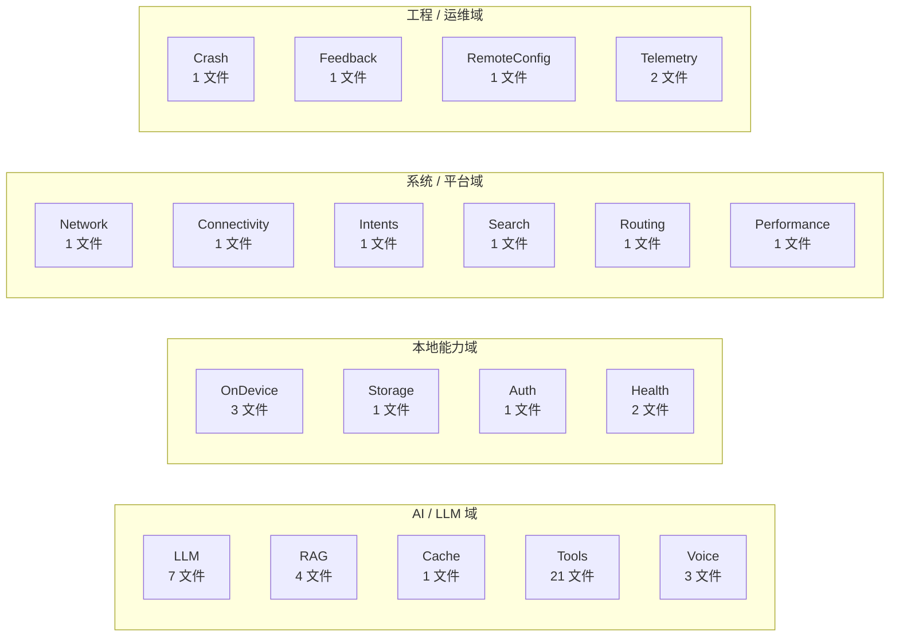

#### 子模块清单与职责

| 子模块 | 文件 | 职责 |
|--------|------|------|
| Auth | `Services/Auth/KeychainManager.swift` | Keychain 单例，封装 API Key 的 save / load / delete，按 `ModelProvider.keychainAccount` 隔离存储。 |
| Cache | `Services/Cache/SemanticCache.swift` | `@MainActor` 语义缓存，基于 embedding 余弦相似度（阈值 0.92）匹配历史 query，命中跳过 LLM 请求；FIFO 容量 100。 |
| Connectivity | `Services/Connectivity/WatchConnectivityService.swift` | Day 17 WatchConnectivity 双向通信，与 AetherWatch 同步 Quick Chat 与健康洞察。 |
| Crash | `Services/Crash/CrashReportService.swift` | Day 14 崩溃监控：捕获未捕获异常与信号崩溃（SIGABRT/SIGSEGV），落盘到本地，下次启动时上报。 |
| Feedback | `Services/Feedback/FeedbackService.swift` | Day 12 用户反馈/投诉：写入 `MessageFeedback` @Model，提供按会话查询与批量导出。 |
| Health | `Services/Health/HealthKitService.swift` | Day 18 HealthKit 读取：步数 / 心率 / 睡眠 / 活动能量，按日期范围查询。 |
| Health | `Services/Health/HealthInsightGenerator.swift` | Day 18 健康洞察生成：基于 HealthKitService 数据生成中文洞察文本，持久化到 `HealthInsight` @Model。 |
| Intents | `Services/Intents/IntentChatService.swift` | Day 18 App Intents 路由：根据 Intent 类型（Ask / NewConversation / SwitchConversation）解析参数并切换/创建会话。 |
| LLM | `Services/LLM/DeepSeekClient.swift` | `nonisolated final class`，实现 `LLMProvider`，提供 DeepSeek chat 流式 + embed。 |
| LLM | `Services/LLM/QwenClient.swift` | Day 13 Qwen 客户端，走阿里云百炼 DashScope OpenAI 兼容端点，实现 `LLMProvider`。 |
| LLM | `Services/LLM/BFFProxyClient.swift` | Day 15 BFF 代理客户端：请求经 Cloudflare Workers 中转，仅传 `userToken`，不持上游 API Key；支持 chat / embed / 限流。 |
| LLM | `Services/LLM/FallbackLLMProvider.swift` | Day 12 Fallback 包装器：primary 失败自动切 fallback provider，记录失败原因与遥测。 |
| LLM | `Services/LLM/ModelProviderFactory.swift` | Day 13 Provider 工厂：根据 `ModelProvider` enum 与当前配置创建对应 client（DeepSeek / Qwen / BFFProxy / Offline）。 |
| LLM | `Services/LLM/RateLimiter.swift` | Day 13 客户端令牌桶限流：按 `BFFConfig.chatRateLimitPerMin` / `embedRateLimitPerMin` 控制请求速率。 |
| LLM | `Services/LLM/SSEParser.swift` | SSE 流解析器，`parseChunk` 解析纯文本 chunk，`parseWithToolAccumulation` 累积跨 chunk 的 tool_calls。 |
| Network | `Services/Network/NetworkMonitor.swift` | Day 16 网络监听：`NWPathMonitor` 实时检测 Wi-Fi/蜂窝/无网状态，触发 OnDeviceConfig.autoSwitchOnNetworkLoss。 |
| OnDevice | `Services/OnDevice/MLXInferenceEngine.swift` | Day 16 MLX 推理引擎：在设备本地运行 Llama-3.2-1B-Instruct Q4_K_M 量化模型，流式生成 token。 |
| OnDevice | `Services/OnDevice/OnDeviceModelDownloader.swift` | Day 16 模型下载器：从 HuggingFace CDN 下载 + SHA256 校验 + 断点续传。 |
| OnDevice | `Services/OnDevice/OfflineLLMProvider.swift` | Day 16 端侧 LLMProvider 实现：包装 MLXInferenceEngine，对外暴露 `LLMProvider` 协议。 |
| Performance | `Services/Performance/PerformanceMonitor.swift` | Day 14 性能监控：首屏渲染 / 流式首字 / 工具执行 / RAG 检索等关键耗时记录。 |
| RAG | `Services/RAG/DocumentChunker.swift` | 基于 `NLTokenizer` 的文档分块器，支持 overlap。 |
| RAG | `Services/RAG/EmbeddingService.swift` | 嵌入服务，封装 LLM embedding API 调用。 |
| RAG | `Services/RAG/PDFExtractor.swift` | 基于 `PDFKit` 的 PDF 文本提取器。 |
| RAG | `Services/RAG/RAGService.swift` | `@MainActor` RAG 检索增强服务，提供 `indexDocument` 索引、`retrieve` topK 检索、`buildAugmentedContext` 构建带 `[1][2]` 编号的 prompt 并复用 queryEmbedding。 |
| RemoteConfig | `Services/RemoteConfig/RemoteConfigService.swift` | Day 14 远程配置拉取：从远端拉取 featureFlags / rateLimits，缓存到 `RemoteConfig` @Model，支持过期重拉。 |
| Routing | `Services/Routing/SmartRouter.swift` | Day 12 智能路由：基于规则与历史成功率在多 Provider 间路由，失败自动 Fallback，记录遥测。 |
| Search | `Services/Search/SpotlightIndexer.swift` | Day 18 Spotlight 索引：为 Conversation 创建/更新 `CSSearchableItem`，删除时清理索引。 |
| Storage | `Services/Storage/ChatStorage.swift` | `@MainActor` SwiftData 持久化服务，封装 Conversation / ChatMessage / UserPreference 的 CRUD，含 `fetchPreference` / `savePreference` / `cleanupEmptyConversations`（批量清理空会话）。 |
| Telemetry | `Services/Telemetry/TelemetryService.swift` | Day 14 遥测采集：收集 Provider 选择 / 路由决策 / Fallback 触发 / 缓存命中等事件，脱敏后批量上报。 |
| Telemetry | `Services/Telemetry/LogUploader.swift` | Day 14 日志上传：脱敏后压缩上传到服务端，配合 CrashReportService 在下次启动时上报崩溃日志。 |
| Tools | `Services/Tools/ToolRegistry.swift` | `@MainActor` 单例工具注册中心，注册 14 跨平台 + 11 macOS 独有工具（共 25 个），含 `NotificationService`（UNUserNotificationCenter 本地通知）。 |
| Tools | `Services/Tools/AlarmTool.swift` | 基于 `EventKit EKAlarm` 的闹钟工具。 |
| Tools | `Services/Tools/ReminderTool.swift` | 基于 `EventKit EKReminder` 的提醒工具。 |
| Voice | `Services/Voice/VoiceService.swift` | 语音服务，`AVAudioSession` + `SFSpeechRecognizer` 录音识别 + `AVSpeechSynthesizer` 朗读合成，朗读前应用 `TTSConfig`。 |
| Voice | `Services/Voice/TTSConfig.swift` | Day 19 TTS 配置：voiceID / rate / pitch / volume，Codable + Sendable，UserDefaults 持久化。 |
| Voice | `Services/Voice/TTSVoiceCatalog.swift` | Day 19 TTS 音色目录：枚举 `AVSpeechSynthesisVoice` 系统音色，按语言分组供 Picker 展示。 |

#### 关键公开 API 一览（按子模块）

##### Auth / KeychainManager

| 方法签名 | 返回值 | 备注 |
|---------|--------|------|
| `saveAPIKey(_ key: String)` | `Void`（throws） | 旧 API，等价于 `provider: .deepseek` |
| `getAPIKey()` | `String?` | 旧 API，无记录返回 nil |
| `deleteAPIKey()` | `Void` | 旧 API，幂等 |
| `saveAPIKey(_ key: String, for provider: ModelProvider)` | `Void`（throws） | Day 13 多 provider 命名空间 |
| `getAPIKey(for provider: ModelProvider)` | `String?` | Day 13 多 provider 命名空间 |
| `deleteAPIKey(for provider: ModelProvider)` | `Void` | Day 13 多 provider 命名空间，幂等 |

##### Cache / SemanticCache

| 方法签名 | 返回值 | 备注 |
|---------|--------|------|
| `get(query: String, embedding: [Float])` | `String?` | 余弦相似度 > 0.92 命中 |
| `set(query: String, embedding: [Float], response: String)` | `Void` | 容量满时 FIFO 移除最早项 |

##### Connectivity / WatchConnectivityService（iOS only）

| 方法签名 | 返回值 | 备注 |
|---------|--------|------|
| `activate()` | `Void` | 设备不支持时静默返回 |
| `sendActiveConversation(_ id: UUID)` | `Void` | 同步当前活跃会话 ID 到 watchOS |
| `sendQuickChat(_ message: String)` | `Void` | 发送快速对话消息到 watchOS |

##### Crash / CrashReportService

| 方法签名 | 返回值 | 备注 |
|---------|--------|------|
| `initialize(appKey: String)` | `Void` | Bugly SDK 初始化，未集成时占位 |
| `setUserId(_ id: String)` | `Void` | 匿名用户标识 |
| `setCustomKey(_ key: String, value: String)` | `Void` | 自定义键值对 |
| `reportException(_ error: Error)` | `Void` | 手动上报异常 |

##### Feedback / FeedbackService

| 方法签名 | 返回值 | 备注 |
|---------|--------|------|
| `collectDeviceInfo()` | `String` | 收集设备型号 / 系统版本 / App 版本 |
| `mailContent()` | `[String: String]` | to / subject / body 三键字典 |
| `mailtoURL()` | `URL?` | 构造 mailto: URL |

##### Health / HealthKitService（iOS only）

| 方法签名 | 返回值 | 备注 |
|---------|--------|------|
| `requestAuthorization()` | `Void`（async throws） | 心率 / 睡眠 / 步数读取授权 |
| `fetchHeartRate(days: Int)` | `[Date: Double]`（async throws） | 按天聚合心率均值（bpm） |
| `fetchSleepAnalysis(days: Int)` | `[Date: Double]`（async throws） | 按天聚合睡眠时长（小时） |
| `fetchStepCount(days: Int)` | `[Date: Int]`（async throws） | 按天聚合步数总和 |
| `fetchDailySummary()` | `HealthDailySummary`（async throws） | 聚合最近 1 天数据 |

##### Health / HealthInsightGenerator

| 方法签名 | 返回值 | 备注 |
|---------|--------|------|
| `generateInsight(days: Int = 7)` | `HealthInsight`（async throws） | 调 LLM 生成洞察并持久化 |
| `sendInsightNotification(_ insight: HealthInsight)` | `Void`（nonisolated） | 推送本地通知 |
| `static make(modelContext: ModelContext)` | `HealthInsightGenerator` | 工厂方法注入默认依赖 |

##### Intents / IntentChatService

| 方法签名 | 返回值 | 备注 |
|---------|--------|------|
| `ask(query: String)` | `String`（async throws） | 累积流式 chunk 返回完整回复 |

##### LLM / DeepSeekClient

| 方法签名 | 返回值 | 备注 |
|---------|--------|------|
| `chat(messages:config:apiKey:)` | `AsyncStream<String>` | 纯文本流式 chat |
| `chat(messages:config:tools:apiKey:)` | `AsyncStream<ParsedChunk>` | 带工具调用流式 chat |
| `embed(texts:apiKey:)` | `[[Float]]`（async throws） | 批量嵌入 |

##### LLM / QwenClient

| 方法签名 | 返回值 | 备注 |
|---------|--------|------|
| `chat(messages:config:apiKey:)` | `AsyncStream<String>` | DashScope OpenAI 兼容端点 |
| `chat(messages:config:tools:apiKey:)` | `AsyncStream<ParsedChunk>` | 带工具调用 |
| `embed(texts:apiKey:)` | `[[Float]]`（async throws） | 批量嵌入 |

##### LLM / BFFProxyClient

| 方法签名 | 返回值 | 备注 |
|---------|--------|------|
| `init(provider:config:session:)` | `BFFProxyClient` | 默认 `session: .shared` |
| `chat(messages:config:apiKey:)` | `AsyncStream<String>` | apiKey 参数不使用，服务端持 key |
| `chat(messages:config:tools:apiKey:)` | `AsyncStream<ParsedChunk>` | 带 `X-BFF-Token` / `X-Provider` Header |
| `embed(texts:apiKey:)` | `[[Float]]`（async throws） | 走 BFF endpoint `/v1/embeddings` |

##### LLM / FallbackLLMProvider

| 方法签名 | 返回值 | 备注 |
|---------|--------|------|
| `init(primary:fallback:primaryProvider:fallbackProvider:)` | `FallbackLLMProvider` | 包装主备 provider |
| `chat(messages:config:apiKey:)` | `AsyncStream<String>` | 主 provider 未产出则降级 |
| `chat(messages:config:tools:apiKey:)` | `AsyncStream<ParsedChunk>` | 降级逻辑同纯文本路径 |
| `embed(texts:apiKey:)` | `[[Float]]`（async throws） | 不降级，直接调主 provider |

##### LLM / ModelProviderFactory

| 方法签名 | 返回值 | 备注 |
|---------|--------|------|
| `static make(_ provider: ModelProvider)` | `LLMProvider` | 创建直连 client |
| `static make(bffConfig:provider:)` | `LLMProvider` | bffConfig.enabled 时返回 BFFProxyClient |

##### LLM / RateLimiter

| 方法签名 | 返回值 | 备注 |
|---------|--------|------|
| `init(chatPerMin:embedPerMin:)` | `RateLimiter` | 默认 20 / 10 |
| `acquireChat()` | `Void`（throws） | 令牌耗尽抛 `rateLimited(retryAfter: 60)` |
| `acquireEmbed()` | `Void`（throws） | 令牌耗尽抛 `rateLimited(retryAfter: 60)` |

##### LLM / SSEParser

| 方法签名 | 返回值 | 备注 |
|---------|--------|------|
| `parse(data: Data)` | `String?` | 解码 UTF-8 文本 |
| `parseChunk(from line: String)` | `ChatChunk?` | 解析单行 SSE 为 ChatChunk |
| `parseWithToolAccumulation(from:accumulated:)` | `ParsedChunk?` | 跨 chunk 累积 tool_calls |

##### Network / NetworkMonitor

| 方法签名 | 返回值 | 备注 |
|---------|--------|------|
| `start()` | `Void` | 启动 NWPathMonitor，已启动时直接返回 |
| `statusStream()` | `AsyncStream<NetworkStatus>` | 订阅状态变化，立即 yield 当前状态 |
| `stop()` | `Void` | 停止监控，结束所有订阅流 |

##### OnDevice / MLXInferenceEngine

| 方法签名 | 返回值 | 备注 |
|---------|--------|------|
| `loadModel(path:expectedSHA256:)` | `Void`（throws） | 内存检查 + 文件检查 + SHA256 + MLX 加载 |
| `generate(prompt:maxTokens:temperature:)` | `AsyncStream<String>` | 流式生成 token |
| `unloadModel()` | `Void` | 释放模型内存 |

##### OnDevice / OnDeviceModelDownloader

| 方法签名 | 返回值 | 备注 |
|---------|--------|------|
| `startDownload(url:to:expectedSHA256:)` | `Void`（async） | 启动下载，完成后自动校验 |
| `resumeDownload()` | `Void`（async） | 断点续传 |
| `cancelDownload()` | `Void` | 取消并保存 resumeData |
| `deleteModel(at url: URL)` | `Void`（throws） | 删除本地模型文件 |
| `verifySHA256(filePath:expected:)` | `Bool` | 校验文件 SHA256 |

##### OnDevice / OfflineLLMProvider

| 方法签名 | 返回值 | 备注 |
|---------|--------|------|
| `chat(messages:config:apiKey:)` | `AsyncStream<String>` | 按 Llama-3 template 拼接 prompt |
| `chat(messages:config:tools:apiKey:)` | `AsyncStream<ParsedChunk>` | tools 非空时发错误通知 |
| `embed(texts:apiKey:)` | `[[Float]]`（async throws） | 384 维 hash 占位向量 |

##### Performance / PerformanceMonitor

| 方法签名 | 返回值 | 备注 |
|---------|--------|------|
| `measure(_ name: String, _ block: () async throws -> T)` | `T`（rethrows） | 自动计时并记录 |
| `getMetrics()` | `[String: Double]` | 读取所有指标（毫秒） |
| `clear()` | `Void` | 清除所有指标 |

##### RAG / DocumentChunker

| 方法签名 | 返回值 | 备注 |
|---------|--------|------|
| `chunkDocument(_ text: String, source: String)` | `[DocumentChunk]` | maxTokens=512，overlap=128 |

##### RAG / EmbeddingService

| 方法签名 | 返回值 | 备注 |
|---------|--------|------|
| `embed(texts:apiKey:)` | `[[Float]]`（async throws） | 透传 DeepSeekClient.embed |
| `embedBatch(_ texts:batchSize:apiKey:)` | `[[Float]]`（async throws） | 默认 batchSize=16 |

##### RAG / PDFExtractor

| 方法签名 | 返回值 | 备注 |
|---------|--------|------|
| `static extractText(from url: URL)` | `String?` | 失败 / 无文本层返回 nil |

##### RAG / RAGService

| 方法签名 | 返回值 | 备注 |
|---------|--------|------|
| `indexDocument(text:source:modelContext:apiKey:)` | `Void`（async throws） | 去重 + 切分 + 嵌入 + 持久化 |
| `retrieve(query:topK:modelContext:apiKey:)` | `[DocumentChunk]`（async throws） | 默认 topK=5，得分 = cosine * weight |
| `buildAugmentedContext(query:modelContext:apiKey:)` | `(context: String, citations: [DocumentChunk], queryEmbedding: [Float])`（async throws） | 复用 queryEmbedding |

##### RemoteConfig / RemoteConfigService

| 方法签名 | 返回值 | 备注 |
|---------|--------|------|
| `fetch()` | `Void`（async） | 失败回退缓存或默认值，不抛错 |

##### Routing / SmartRouter

| 方法签名 | 返回值 | 备注 |
|---------|--------|------|
| `static route(input:toolsEnabled:hasImage:)` | `String` | 返回模型名（deepseek-chat / deepseek-reasoner） |

##### Search / SpotlightIndexer

| 方法签名 | 返回值 | 备注 |
|---------|--------|------|
| `static index(_ conversation: Conversation)` | `Void` | 索引标题 + 最后消息 + createdAt |
| `static removeIndex(conversationId: UUID)` | `Void` | 移除指定会话索引 |
| `static clearAll()` | `Void` | 清空所有会话索引 |

##### Storage / ChatStorage

| 方法签名 | 返回值 | 备注 |
|---------|--------|------|
| `createConversation(title:systemPrompt:)` | `Conversation` | 不立即 save |
| `deleteConversation(_ conversation: Conversation)` | `Void` | 删除并立即 save |
| `renameConversation(_:to:)` | `Void` | 重命名 + Spotlight 重索引 |
| `togglePin(_ conversation: Conversation)` | `Void` | 翻转 isPinned |
| `addMessage(to:role:content:imageData:)` | `ChatMessage` | 关联并 save |
| `fetchConversations()` | `[Conversation]` | isPinned 优先 + createdAt 降序 |
| `cleanupEmptyConversations()` | `Void` | 批量清理空会话 |
| `wipeAllData()` | `Void` | UITEST_RESET_DATA 专用 |
| `fetchPreference()` | `UserPreference` | 无则创建默认 |
| `savePreference(tone:tools:fact:)` | `Void` | 更新或创建 |
| `saveFeedback(messageId:isPositive:citations:)` | `Void` | 反馈 + chunk 权重调整 |
| `fetchFeedback(messageId: UUID)` | `MessageFeedback?` | 查询反馈记录 |
| `updateFeedback(_:isPositive:citations:)` | `Void` | 切换反馈 + 撤销旧权重 |

##### Telemetry / TelemetryService

| 方法签名 | 返回值 | 备注 |
|---------|--------|------|
| `track(_ event: TelemetryEvent)` | `Void` | 写入环形缓冲（上限 1000） |
| `drain()` | `[TelemetryRecord]` | 取出并清空缓冲 |
| `shouldUpload(now:threshold:interval:)` | `Bool` | 默认 threshold=100 / interval=300s |
| `bufferCount` (getter) | `Int` | 当前缓冲事件数 |

##### Telemetry / LogUploader

| 方法签名 | 返回值 | 备注 |
|---------|--------|------|
| `uploadIfNeeded()` | `Void`（async） | drain + 指数退避重试 3 次 |

##### Tools / ToolRegistry

| 方法签名 | 返回值 | 备注 |
|---------|--------|------|
| `static shared` (getter) | `ToolRegistry` | 单例 |
| `register(tool: ToolProtocol)` | `Void` | 同名覆盖 |
| `getTool(named name: String)` | `ToolProtocol?` | 未命中返回 nil |
| `execute(name:arguments:)` | `String`（async throws） | 未注册抛 NSError |
| `allToolDefs` (getter) | `[ToolDef]` | 告知 LLM 可调用工具 |

##### Voice / VoiceService

| 方法签名 | 返回值 | 备注 |
|---------|--------|------|
| `requestPermission()` | `Bool`（async） | 语音识别授权 |
| `startRecording()` | `Void`（throws） | installTap + 启动 audioEngine |
| `stopRecording()` | `Void` | 释放 audio session |
| `speak(_ text: String, config: TTSConfig?)` | `Void` | 应用配置后朗读 |
| `previewVoice(_ text: String, config: TTSConfig)` | `Void` | 试听音色，不影响主流程 |
| `stopPreview()` | `Void` | 停止试听 |
| `stopSpeaking()` | `Void` | 用户主动停止 |

##### Voice / TTSConfig

| 方法签名 | 返回值 | 备注 |
|---------|--------|------|
| `static load()` | `TTSConfig` | UserDefaults 读取，失败回退默认 |
| `func save()` | `Void` | JSON 编码后写 UserDefaults |

##### Voice / TTSVoiceCatalog

| 方法签名 | 返回值 | 备注 |
|---------|--------|------|
| `static allVoices()` | `[TTSVoice]` | 系统音色列表（静态缓存） |
| `static groupedByLanguage()` | `[(language: String, voices: [TTSVoice])]` | 按语言分组（zh-CN 优先） |
| `static reloadVoices()` | `Void` | 清空缓存 |
| `static displayName(for identifier: String)` | `String` | 返回 "Name(language)" |
| `static voice(for identifier: String)` | `AVSpeechSynthesisVoice?` | 查找原始音色 |

### 3.4 ViewModels 层

ViewModels 文件数无新增（仍为 4 个），但内部字段与编排逻辑随 Day 12–20 扩展。P2-6 进一步将 ChatViewModel 中职责清晰的子模块抽取为 10 个 Coordinator（详见 3.4b）。

| 文件 | 职责 |
|------|------|
| `ViewModels/ChatViewModel.swift` | 核心 `@Observable @MainActor` ViewModel。**P2-6 重构后为 Facade**：保留为 View 入口（`@State` / `@Bindable` 注入），方法体委托给 10 个 Coordinator（详见 3.4b）。原始 1253 行降至 690 行，直接依赖的 Service 数从 30+ 降至 15 以下（通过 Coordinator 间接依赖）。仍负责 `processMessage` 状态机编排（preparing → ragRetrieving → cacheChecking → llmStreaming ↔ toolCalling → finishing）与 `sendMessage` / `sendMessageConfirmed` / `switchTo` / `regenerateResponse` / `branch` 等 View 入口方法；`@Observable` 状态属性由 Coordinator 通过 `@MainActor` 闭包回调同步（如 `onIsRecordingChange` / `onFeedbackStatesChange` / `onCurrentCitationsChange`），保持单向数据流。 |
| `ViewModels/ConversationListVM.swift` | 会话列表 ViewModel，管理会话 CRUD 与置顶排序；新增编辑模式（多选 / 全选 / 删除选中）与 `cleanupEmptyConversations` 批量清理。 |
| `ViewModels/KnowledgeBaseVM.swift` | 知识库 ViewModel，管理文档索引与删除。 |
| `ViewModels/SettingsViewModel.swift` | 设置 ViewModel，管理 API Key 保存/删除（按 provider 隔离）、用户偏好读写、TTS 配置 / BFF 配置 / OnDevice 配置 / Health 授权状态读写。 |

> **Agent 模块说明**：Agent 模块（AgentOrchestrator / GoalDecomposer / AgentRole）为完整实现但尚未接入生产 ChatViewModel，保留以备未来接入。

### 3.4b Coordinators 层（P2-6 ChatViewModel 拆分）

P2-6 重构将 ChatViewModel 中职责清晰的子模块抽取为 10 个 Coordinator，每个承担单一职责，通过构造器注入到 ChatViewModel，ChatViewModel 保留为 View 入口的 Facade。所有 Coordinator 显式标注 `@MainActor` 或 `Sendable`，跨 actor 回调通过 `@MainActor` 闭包传递。`CoordinatorProtocol` 为占位协议（`@MainActor protocol Coordinator: AnyObject {}`），便于未来扩展通用能力（如生命周期管理、日志埋点）。

| Coordinator | 文件 | 职责 | 依赖 Service / Repository | 并发隔离 |
|------------|------|------|--------------------------|---------|
| `VoiceCoordinator` | `Aether/Coordinators/VoiceCoordinator.swift` | STT 启停 + TTS 朗读切换 + 朗读完成回调（`onSpeakFinished` 清空 speakingMessageId / `onRecognized` 实时写入 inputText） | `VoiceService`（构造器注入，与 SettingsView 共享同一实例） | `@MainActor` |
| `LiveActivityCoordinator` | `Aether/Coordinators/LiveActivityCoordinator.swift` | iOS 灵动岛 Live Activity 全生命周期（start / update / end），封装 `Activity<TimerActivityAttributes>` 引用，已启动时再调用为 no-op | ActivityKit（iOS-only，无其他 Service 依赖） | `@MainActor`，整个类型 `#if os(iOS)` 包裹 |
| `FeedbackCoordinator` | `Aether/Coordinators/FeedbackCoordinator.swift` | 反馈状态（`feedbackStates`）+ Toast 提示（`feedbackToast`，2s 自动清除，新点击取消未触发的清除 Task）+ 持久化（`saveFeedback` / `updateFeedback` 触发 RAG chunk 权重调整） | `ChatStorage`（按需构造，传入 ModelContext） | `@MainActor` |
| `WatchQuickChatCoordinator` | `Aether/Coordinators/WatchQuickChatCoordinator.swift` | 监听 `.wcQuickChatReceived` 通知，桥接 Watch 快速对话消息到 ChatViewModel.`pendingWatchMessage` | `NotificationCenter`（间接依赖 `WatchConnectivityService` 广播通知） | `@unchecked Sendable`（NSLock 包裹 `NSObjectProtocol` token，支持跨 actor 读写） |
| `HealthContextInjector` | `Aether/Coordinators/HealthContextInjector.swift` | iOS HealthKit 上下文注入：构建最近 24h 健康摘要片段（睡眠 / 心率 / 步数），追加到 systemPrompt 末尾；未授权 / 未启用 / 服务为 nil / fetch 抛错时返回空字符串优雅降级 | `HealthKitService`（通过闭包读取，nil 时降级为空字符串） | `@MainActor`，整个类型 `#if os(iOS)` 包裹 |
| `NetworkFallbackCoordinator` | `Aether/Coordinators/NetworkFallbackCoordinator.swift` | 网络监听（订阅 `NetworkMonitor.statusStream`，断网切端侧 / 联网切回）+ 端侧 ↔ 云端 provider 切换（`switchToOnDevice` / `switchToOriginalProvider`）+ Provider 工厂（BFF / Fallback / 直连三种路径）+ SmartRouter 模型名映射（`mapModelName`） | `NetworkMonitor.shared` / `ModelProviderFactory` / `FallbackLLMProvider` / `BFFProxyClient` / `DeepSeekClient` | `@MainActor` |
| `RetrievalCoordinator` | `Aether/Coordinators/RetrievalCoordinator.swift` | RAG 检索（`handleRAGRetrieving`）+ 语义缓存读写（`checkCache` / `writeCache`，仅非工具模式）+ embedding 降级（DeepSeek 不支持 embedding 时设置错误并清空 citations）+ `ragService` / `ragEmbeddingProvider` 按 `selectedProvider` 懒加载缓存（provider 变化时自动失效重建） | `RAGService` / `SemanticCache`（构造器注入）/ `EmbeddingService` / `KeychainManager.shared` / `DeepSeekClient`（兜底） | `@MainActor` |
| `PromptBuilder` | `Aether/Coordinators/PromptBuilder.swift` | systemPrompt 构建（base + 【用户偏好】 + 【AI人设】）+ token 截断（`limitTokens`，从尾部累加保留最近消息） | 纯值类型（struct），无 Service 依赖 | 纯值类型（struct），无并发隔离标注（纯函数式逻辑） |
| `InjectionGuard` | `Aether/Coordinators/InjectionGuard.swift` | 提示注入检测弹窗（`detect` 调用 `PromptInjectionDetector.isSuspicious`）+ 决策回调（`setDecisionHandler` / `proceed` / `cancel` 三态机，包装闭包路由到 proceed/cancel） | `PromptInjectionDetector`（静态调用） | `@MainActor` |
| `ToolExecutionCoordinator` | `Aether/Coordinators/ToolExecutionCoordinator.swift` | ReAct 工具执行循环：编码 toolCalls 持久化 assistant 消息（含 toolCallData）、逐个执行工具（启用检查 / 授权确认 / 超时保护 `withThrowingTaskGroup` / 审计日志 / 成功通知 / 失败埋点）、追加 tool 结果消息、重置下一轮 apiMessages；`ToolStep` / `ToolStepStatus` 类型迁移至此，ChatViewModel 通过 typealias 兼容 | `ToolRegistry.shared` / `ToolAuthorization.shared` / `ToolAuditLogger.shared` / `NotificationService.shared` / `TelemetryService.shared` | `@MainActor` |

**关键设计要点**：

- **Facade 模式**：ChatViewModel 保留为 View 入口（`@State` / `@Bindable` 注入），方法体委托给 Coordinator（如 `toggleVoiceInput()` → `voiceCoordinator.toggleVoiceInput()`）。原始 1253 行降至 690 行，直接依赖的 Service 数从 30+ 降至 15 以下（通过 Coordinator 间接依赖）。
- **iOS-only Coordinator**：`LiveActivityCoordinator` 与 `HealthContextInjector` 整个类型用 `#if os(iOS)` 包裹，macOS 编译时无符号泄漏；ChatViewModel 调用处亦用 `#if os(iOS)` 守卫。
- **闭包回调同步 @Observable**：Coordinator 不直接持有 ChatViewModel 的 `@Observable` 属性，通过构造器注入的 `@MainActor` 闭包回调同步状态（如 `onIsRecordingChange` / `onFeedbackStatesChange` / `onCurrentCitationsChange` / `onToolStepAppend`），保持单向数据流，便于测试隔离。
- **闭包防循环引用**：所有 Coordinator 闭包使用 `[weak self]` 防止循环引用（VoiceCoordinator / InjectionGuard / 各闭包回调）；VoiceCoordinator 在 init 中注册 `voiceService.onSpeakFinished` / `voiceService.onRecognized` 闭包。
- **状态查询闭包**：Coordinator 读取 ChatViewModel 状态时通过查询闭包（如 `selectedProviderProvider` / `ragEnabledProvider` / `toolsEnabledProvider` / `isRecordingProvider`），避免反向持有 ViewModel。
- **PromptBuilder 例外**：作为纯值类型 struct 不需要 Coordinator 协议（无生命周期管理需求），ChatViewModel 持有 `private let promptBuilder = PromptBuilder()`，`limitTokens` / `buildEffectiveSystemPrompt` 直接转发。
- **WatchQuickChatCoordinator 例外**：标注 `@unchecked Sendable` 而非 `@MainActor`（与 ChatViewModel 私有 `ErrorObserver` 一致），用 NSLock 包裹 `NSObjectProtocol` token（非 Sendable），init 在 `@MainActor` 上写 token，deinit 在 nonisolated 上下文读 token，故用 NSLock 同步。

#### ChatViewModel → Coordinator → Service 依赖图

下图使用 PlantUML 展示 ChatViewModel 作为 Facade 转发逻辑到 10 个 Coordinator，Coordinator 再依赖具体 Service 的三层依赖关系。`#if os(iOS)` 守卫的 Coordinator 用 note 标注，macOS 编译时排除。

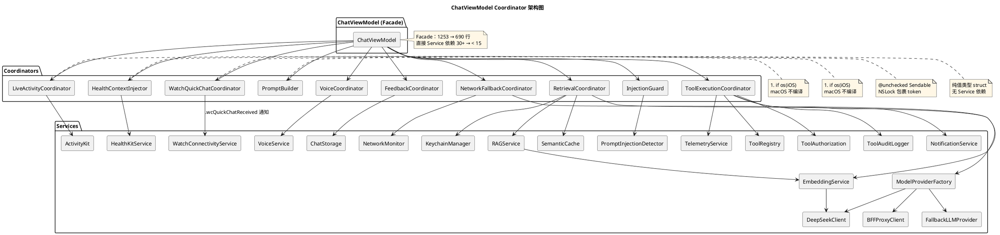

**依赖关系说明**：
- **ChatViewModel → Coordinator**：10 条转发边。ChatViewModel 在 `init` 末尾构造所有 Coordinator 并捕获 `self`（隐式解包可选 `!` 以便构造），方法体直接转发（如 `toggleVoiceInput` / `submitFeedback` / `handleFeedback` / `switchToOnDevice` / `handleRAGRetrieving` / `handleToolCalling` / `limitTokens` / `buildEffectiveSystemPrompt` 等）。
- **Coordinator → Service**：每个 Coordinator 通过构造器注入或 `.shared` 单例访问 Service。`RetrievalCoordinator` 与 `NetworkFallbackCoordinator` 依赖较多 Service，因为承担 RAG 检索 + 缓存 + Provider 工厂的核心数据通路职责。
- **跨 Coordinator 协作**：Coordinator 之间不直接通信，全部通过 ChatViewModel 编排（如 `handleFinishing` 读取 `networkFallbackCoordinator.lastUsedProvider` 写入 DebugInfo，并调用 `retrievalCoordinator.writeCache`）。
- **iOS-only 隔离**：`LiveActivityCoordinator`（依赖 ActivityKit）与 `HealthContextInjector`（依赖 HealthKitService）整个类型 `#if os(iOS)` 包裹，ChatViewModel 中的 `liveActivityCoordinator` 属性与 `startLiveActivity` / `updateLiveActivity` / `endLiveActivity` 调用处亦用 `#if os(iOS)` 守卫，macOS 编译无符号泄漏。

### 3.5 Views 层（6 个子模块）

| 子模块 | 文件 | 职责 |
|--------|------|------|
| Chat | `ChatView.swift` / `ChatInputBar.swift` / `MessageListView.swift` / `MessageBubble.swift` / `CitationCard.swift` / `StepCardView.swift` / `ErrorOverlay.swift` / `TypingIndicator.swift` | 聊天主界面、输入栏、消息列表、消息气泡、RAG 引用卡片、ReAct 步骤卡片、错误浮层、打字指示器。 |
| Chat | `CodeBlockView.swift` / `CodeSyntaxHighlighter.swift` | Day 19 Markdown 代码块渲染 + 语法高亮（按语言 token 着色，支持复制按钮）。 |
| Chat | `MarkdownText.swift` / `HeadingView.swift` | Day 19 Markdown 富文本段落与标题分级（H1–H6 字号梯度）。 |
| Chat | `MarkdownTableParser.swift` / `MarkdownTableView.swift` | Day 19 Markdown 表格解析与渲染（解析 `|` 分隔符生成行列，滚动视图适配宽表）。 |
| Chat | `TaskListView.swift` | Day 19 任务列表渲染（`- [ ]` / `- [x]` 复选框状态）。 |
| Chat | `FeedbackBar.swift` | Day 12 消息反馈条：like / dislike / 投诉按钮，写入 `MessageFeedback` @Model。 |
| Components | `ErrorBanner.swift` / `SkeletonView.swift` | 通用错误横幅 + 骨架屏组件。 |
| Conversation | `ConversationList.swift` / `ConversationRow.swift` | 会话列表 sheet + 会话行（含 contextMenu 置顶/删除/复制/重新提问 + 编辑模式多选）。 |
| OnDevice | `OnDeviceModelView.swift` | Day 16 端侧模型管理：下载进度 / SHA256 校验 / 启用开关 / 自动切换开关 / 模型路径展示。 |
| RAG | `DocumentPickerView.swift` / `KnowledgeBaseView.swift` | 文档选择器（PDF/文本）+ 知识库管理界面。 |
| Settings | `SettingsView.swift` | 设置界面，含 API Key 管理（多 provider）/ 模型切换 / 系统提示词（`systemPromptSection` 上方新增「预设角色」Menu，选中后填入 TextEditor 保留可编辑性）/ 用户偏好 / RAG+Tools Toggle（Toggle 用中文 description）/ 调试面板（`DebugPanelView`）/ BFF 配置入口 / OnDevice 配置入口 / Health 入口 / TTS 入口；`regularLayout` detail 包 `NavigationStack` 让 macOS 二级页有返回按钮。 |
| Settings | `PresetPrompts.swift` | 预设系统提示词清单：`PresetPrompt`（role + prompt）+ `PresetPrompts` enum 提供 11 个预设角色（默认助手 / 开发者 / 学生 / 白领 / 管理者 / 产品经理 / 写作助手 / 技术面试官 / 学习导师 / 翻译官 / 健身教练），每个含 ≥ 150 字完整 system prompt，供 SettingsView Menu 选择。 |
| Settings | `TTSVoicePickerView.swift` | Day 19 TTS 音色选择：音色 Picker / 语速 / 音调 / 音量 / 试听按钮。 |
| Settings | `HealthSettingsView.swift` | Day 18 Health 授权管理 + 健康洞察列表展示。 |
| Settings | `PrivacyPolicyView.swift` | Day 14 隐私政策展示（Markdown 渲染）+ 投诉反馈入口。 |

### 3.5b Rust FFI 层（AetherRust 模块）

项目通过 `Packages/AetherCore` SPM 包引入 Rust FFI 层。Rust 侧 `aether-core-ffi` crate（`rust/aether-core-ffi/`）编译为 C 静态库，通过 `cbindgen` 生成 C 头文件（`aether_core_ffi.h`），打包为 `aether_core.xcframework`（含 ios-arm64 / ios-arm64-simulator / macos-arm64 三架构），作为 `AetherRustBin` binaryTarget 被 Swift 侧引用。Swift 侧 `AetherRust` target 提供 10 个 Swift 友好的包装器，通过 `AetherRustC` modulemap 导入 C 符号，服务层 `AetherServices` 依赖 `AetherRust`。

| 文件 | 职责 |
|------|------|
| `AetherRust/Sha256.swift` | 流式 SHA-256 哈希，替代 CryptoKit。`AetherRustSha256` 类支持分块 `update` + `finalize`，`aetherSha256(of:)` 便捷函数按 4MB 分块读取文件，返回小写十六进制摘要。 |
| `AetherRust/Token.swift` | Token 计数估算，替代 `String.estimatedTokens` 粗估公式。`AetherRustToken.estimateTokens(_:)` 调用 Rust 侧算法，统一 Apple/Workers 两端。 |
| `AetherRust/Chunker.swift` | 文档分块，基于 Rust `unicode-segmentation` crate（UAX #29 句子边界），替代 Apple `NLTokenizer`。`AetherRustChunker.chunkDocument(_:maxChars:overlapChars:)` 返回块文本数组。 |
| `AetherRust/Vector.swift` | 向量数学：`AetherRustVector.cosine`（f32/f64 余弦相似度）+ `topK`（top-K 检索，JSON 序列化进出）。统一 SemanticCache / RAGService / MemoryService 三处重复实现。 |
| `AetherRust/SSE.swift` | SSE 流解析器：`AetherRustSSEParser` 类持有 `AetherSseState` 跨 chunk 累积 tool_calls。提供 `extractContent` / `parseChunk` / `parseWithTools` 三个方法，等价于 Workers 与 Swift 实现。 |
| `AetherRust/Sandbox.swift` | WASM 插件沙箱（`#if !os(iOS)`），基于 Rust `wasmtime` crate（Pulley 解释器，无 JIT）。三层句柄：`AetherRustSandbox`（引擎）→ `AetherRustSandboxModule`（编译产物）→ `AetherRustSandboxInstance`（运行时实例）。强制 CPU fuel 与内存限额，插件 ABI 约定 `execute(args_len: i32) -> i32`。 |
| `AetherRust/Inference.swift` | Candle 推理引擎，替代 Apple-only MLX。`AetherRustInferenceEngine` 加载 safetensors 模型目录，支持 `generate`（流式 token 数组）与 `generateText`（一次性完整文本），配置 `AetherRustInferenceConfig`（temperature / maxTokens / repeatPenalty / topP / seed）。 |
| `AetherRust/RateLimiter.swift` | 令牌桶限流器：`AetherRustTokenBucket` 基于 Rust 连续 refill 算法（每秒按比例补充），调用方传入 `nowMs` 时间戳避免 Rust 侧依赖 `std::time::Instant`（WASM32 不可用）。提供 `acquire` / `availableTokens` / `reset`。 |
| `AetherRust/Redactor.swift` | 敏感信息脱敏：`AetherRustRedactor.redact(_:)` 基于 Rust `regex` crate（RE2 语法，线性时间 NFA + SIMD），脱敏 UUID/邮箱/URL/Token/密码字段/路径，统一 Apple/Workers/Android 三端。 |
| `AetherRust/FFIError.swift` | Rust FFI 调用错误枚举：`AetherRustError`（nullResult / invalidUTF8 / decodeFailed）。 |

**Rust 侧架构**：

- **`aether-core`**（workspace member）：纯 Rust 逻辑 crate，无 unsafe，提供所有算法实现（sha256_hex / estimate_tokens / chunk_document / cosine_similarity / top_k_f32 / parse_chunk / ratelimit / redact 等）。
- **`aether-core-ffi`**（`rust/aether-core-ffi/`）：C ABI 绑定层，所有 `unsafe` 集中于此。返回值均为 C 字符串（JSON），调用方通过 `aether_free_string` 释放。`Cargo.toml` 输出 `staticlib` / `cdylib` / `rlib` 三种 crate-type。条件编译：candle 推理排除 wasm32/android，wasmtime 沙箱排除 wasm32/iOS/android，wasm32 目标引入 `wasm-bindgen`，android 目标引入 `jni`。
- **`cbindgen.toml`**：配置 cbindgen 生成 C 头文件，`AETHER_EXPORT` 宏在静态库中定义为空、动态库中定义为 `__attribute__((visibility("default")))`，`include_guard = "AETHER_CORE_FFI_H"`。
- **`xcframework`**：`aether_core.xcframework` 包含 ios-arm64 / ios-arm64-simulator / macos-arm64 三个 slice，每个含 `Headers/`（`aether_core_ffi.h` + `module.modulemap`）与 `libaether_core_ffi.a`。

### 3.6 工具调用关系图

下图使用 Mermaid `classDiagram` 展示 `ToolProtocol` 协议、`ToolRegistry` 单例与 25 个工具实现的关系。跨平台工具始终实现协议；macOS 独有 11 个工具用 `<<macOS only>>` stereotype 标注，仅在 `#if os(macOS)` 条件下注册。

```mermaid
classDiagram
    class ToolProtocol {
        <<protocol>>
        +definition: ToolDefinition
        +execute(arguments: [String: Any]) String
    }
    class ToolDefinition {
        +name: String
        +description: String
        +parameters: [String: Any]
    }
    class ToolRegistry {
        <<MainActor>>
        +shared: ToolRegistry
        -tools: [String: ToolProtocol]
        +register(tool: ToolProtocol)
        +getTool(named: String) ToolProtocol?
        +execute(name:arguments:) String
        +allToolDefs: [ToolDef]
    }

    class AlarmTool
    class ReminderTool
    class DateTimeTool
    class CalculatorTool
    class LocationTool
    class DeviceInfoTool
    class ClipboardTool
    class OpenURLTool
    class ContactsTool
    class WeatherTool
    class RunShortcutTool
    class ListShortcutsTool
    class CreateShortcutTool

    class AppleScriptTool <<macOS only>>
    class ScreenshotTool <<macOS only>>
    class OCRTool <<macOS only>>
    class TerminalCommandTool <<macOS only>>
    class WindowManagementTool <<macOS only>>
    class AppManagementTool <<macOS only>>
    class FileOperationTool <<macOS only>>
    class FinderTool <<macOS only>>
    class SafariControlTool <<macOS only>>
    class SystemControlTool <<macOS only>>
    class InputAutomationTool <<macOS only>>

    ToolProtocol <|.. AlarmTool
    ToolProtocol <|.. ReminderTool
    ToolProtocol <|.. DateTimeTool
    ToolProtocol <|.. CalculatorTool
    ToolProtocol <|.. LocationTool
    ToolProtocol <|.. DeviceInfoTool
    ToolProtocol <|.. ClipboardTool
    ToolProtocol <|.. OpenURLTool
    ToolProtocol <|.. ContactsTool
    ToolProtocol <|.. WeatherTool
    ToolProtocol <|.. RunShortcutTool
    ToolProtocol <|.. ListShortcutsTool
    ToolProtocol <|.. CreateShortcutTool
    ToolProtocol <|.. AppleScriptTool
    ToolProtocol <|.. ScreenshotTool
    ToolProtocol <|.. OCRTool
    ToolProtocol <|.. TerminalCommandTool
    ToolProtocol <|.. WindowManagementTool
    ToolProtocol <|.. AppManagementTool
    ToolProtocol <|.. FileOperationTool
    ToolProtocol <|.. FinderTool
    ToolProtocol <|.. SafariControlTool
    ToolProtocol <|.. SystemControlTool
    ToolProtocol <|.. InputAutomationTool

    ToolRegistry o--> ToolProtocol : 持有 14 跨平台 + 11 macOS
    ToolDefinition <.. ToolProtocol : 暴露给 LLM
```

**说明**：
- 跨平台工具（14 个，iOS + macOS 都注册，含 ClipboardTool 注册的 Read+Write 两项）：AlarmTool / ReminderTool / DateTimeTool / CalculatorTool / LocationTool / DeviceInfoTool / ReadClipboardTool / WriteClipboardTool / OpenURLTool / ContactsTool / WeatherTool / RunShortcutTool / ListShortcutsTool / CreateShortcutTool。
- macOS 独有工具（11 个，`#if os(macOS)` 守卫）：AppleScriptTool / ScreenshotTool / OCRTool / TerminalCommandTool / WindowManagementTool / AppManagementTool / FileOperationTool / FinderTool / SafariControlTool / SystemControlTool / InputAutomationTool。
- 跨平台注册 14 个、macOS 独有 11 个（共 25 个）。

### 3.7 LLM Provider 抽象关系图

下图使用 Mermaid `classDiagram` 展示 `LLMProvider` 协议与 4 个直接实现、`FallbackLLMProvider` 装饰器、`ModelProviderFactory` 工厂的关系。

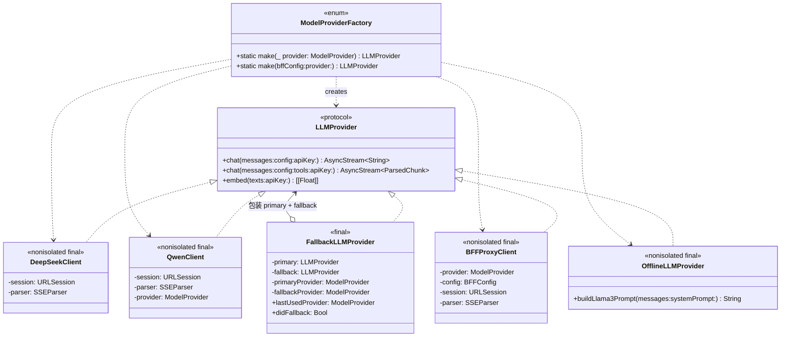

**说明**：
- 4 个直接实现：`DeepSeekClient`（DeepSeek 直连）/ `QwenClient`（阿里云百炼 DashScope）/ `BFFProxyClient`（Cloudflare Workers 网关中转）/ `OfflineLLMProvider`（端侧 MLX）。
- `FallbackLLMProvider` 实现协议同时聚合两个 `LLMProvider`，主 provider 未产出则降级到 fallback；`embed` 路径不降级。
- `ModelProviderFactory` 静态工厂：`make(_:)` 按 enum 创建直连 client；`make(bffConfig:provider:)` 在 `bffConfig.enabled` 时返回 BFFProxyClient。

---

## 4. 数据流

### 4.1 数据流总览

下图使用 Mermaid `flowchart LR` 描述从用户输入到完成回复的 6 步核心数据流：缓存查询 → RAG 检索 → LLM 调用 → 工具调用 → 缓存写入 → 持久化。

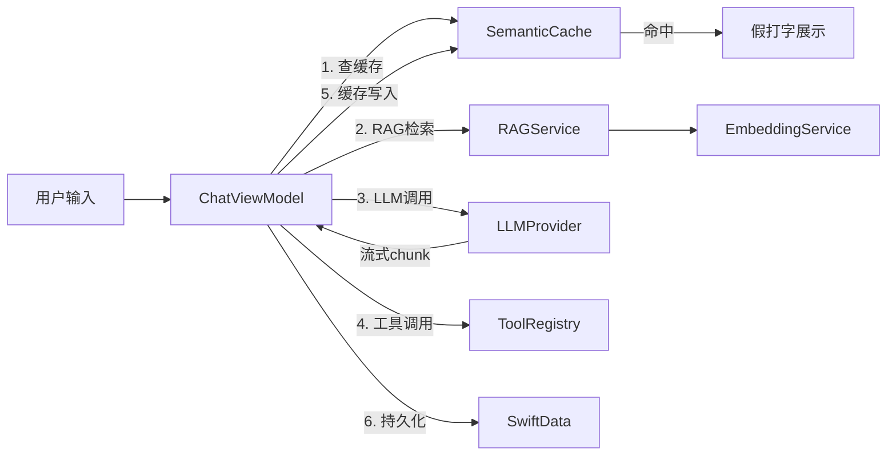

### 4.2 消息处理时序图

下图使用 Mermaid `sequenceDiagram` 描述消息处理的完整时序：含缓存命中 / 未命中两条路径，以及 ReAct 工具调用循环。

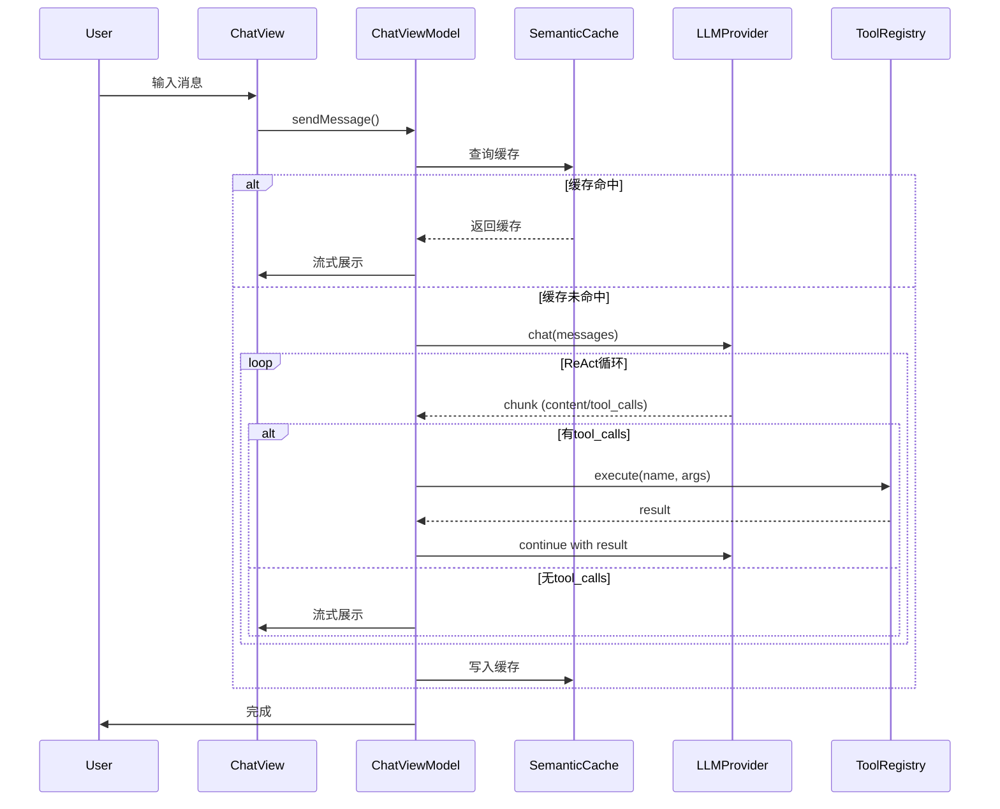

### 4.3 主流程

从用户输入到 AI 回复的完整数据流，含 Provider 选择与流式输出更新。参与者包括用户、ChatView、ChatViewModel、SmartRouter 与 LLMClient。

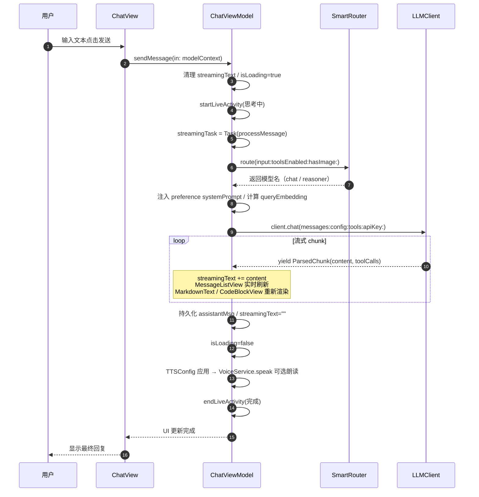

**关键说明**：
- 流式输出期间 `streamingText` 累积，MessageListView / MarkdownText / CodeBlockView / MarkdownTableView 实时重新渲染，每帧约 8–16ms。
- SmartRouter 在工具或图片启用时强制 `deepseek-chat`（reasoner 对 function calling 不稳定）；长文本（≥50 字符）或推理关键词触发 `deepseek-reasoner`。

### 4.4 路径 1：UITEST_DISABLE_NETWORK 桩回复

**触发条件**：`ProcessInfo.processInfo.arguments.contains("UITEST_DISABLE_NETWORK")`

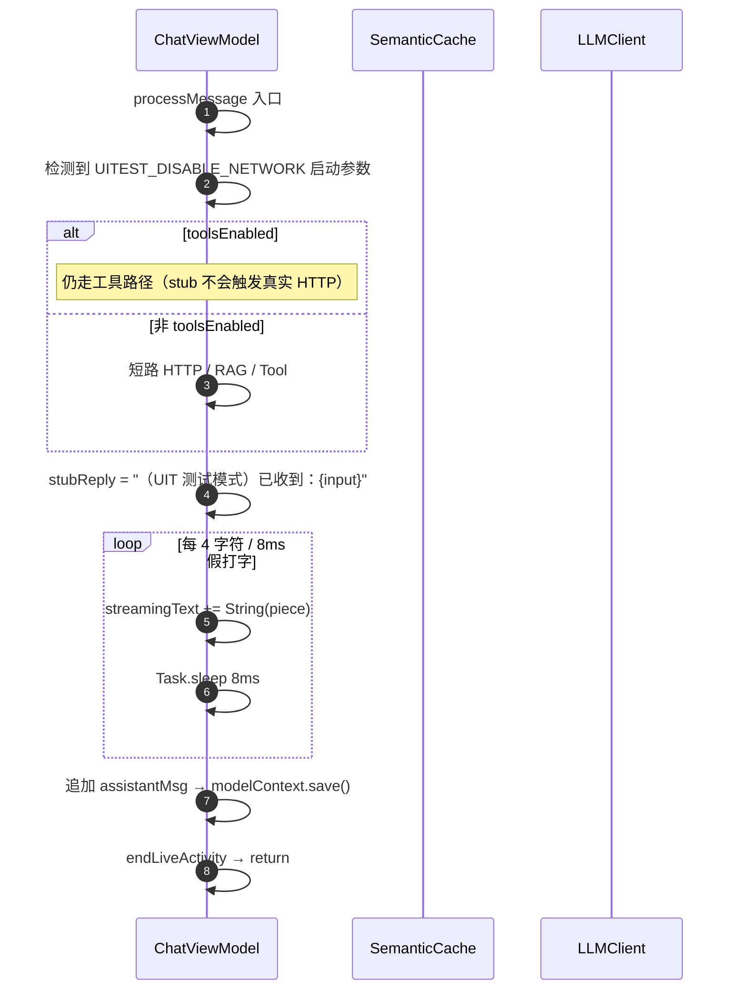

**用途**：UIT 不触发真实 HTTP，复用缓存命中的假打字路径驱动 UI 状态机。

### 4.5 路径 2：缓存命中

**触发条件**：`!toolsEnabled && !queryEmbedding.isEmpty && cache.get(query:embedding:) != nil`（相似度 > 0.92）

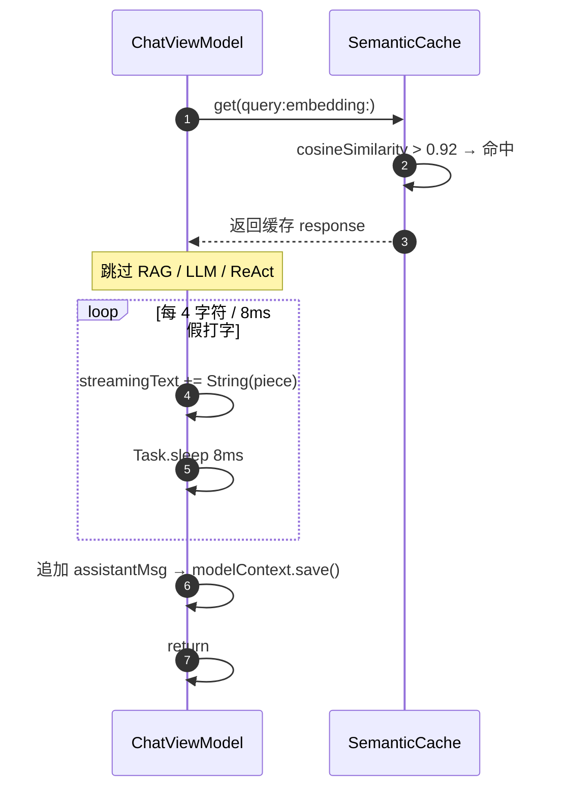

### 4.6 路径 3：正常 RAG + LLM + ReAct

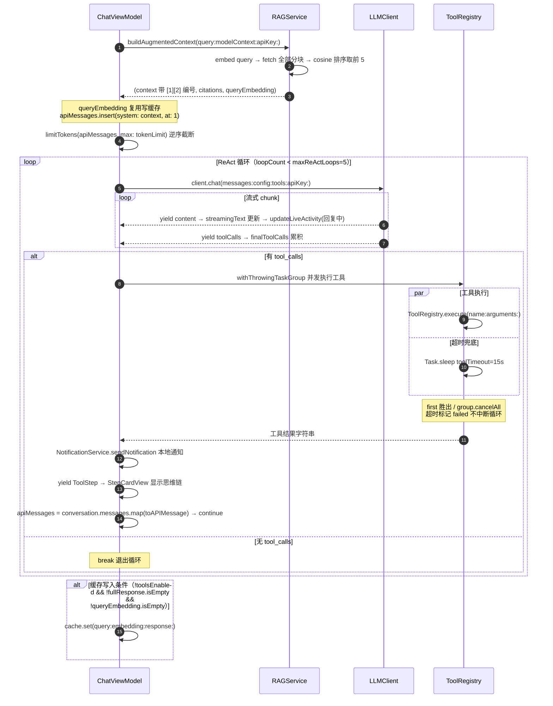

### 4.7 路径 4：BFF 代理路径（Day 15）

**触发条件**：`bffConfig.enabled == true`（设置页启用 BFF）

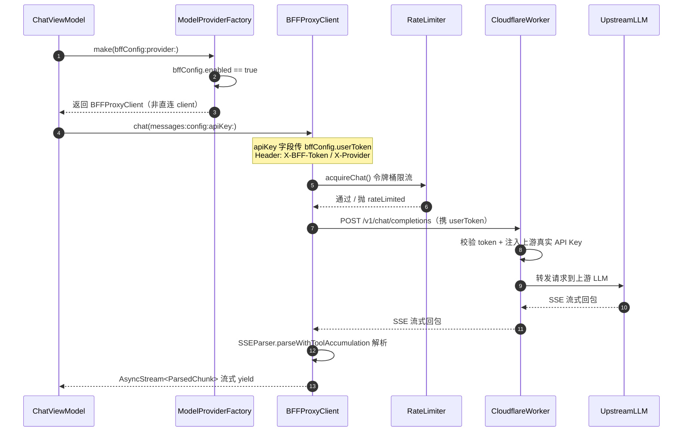

**关键约束**：设备端不持上游 API Key，仅持 `userToken`；上游 Key 仅在 Cloudflare Workers 服务端 secrets 中。`RateLimiter` 按 `chatRateLimitPerMin` 令牌桶控制客户端速率。

### 4.8 路径 5：端侧推理路径（Day 16）

**触发条件**：`onDeviceConfig.enabled == true` 且（手动切换到 `.onDevice` 或 NetworkMonitor 检测到断网且 `autoSwitchOnNetworkLoss == true`）

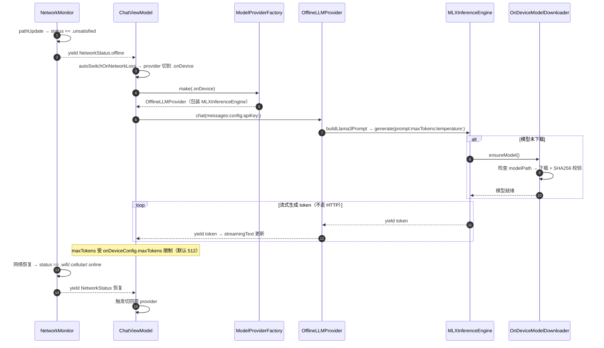

### 4.9 TTS 配置应用流程（Day 19）

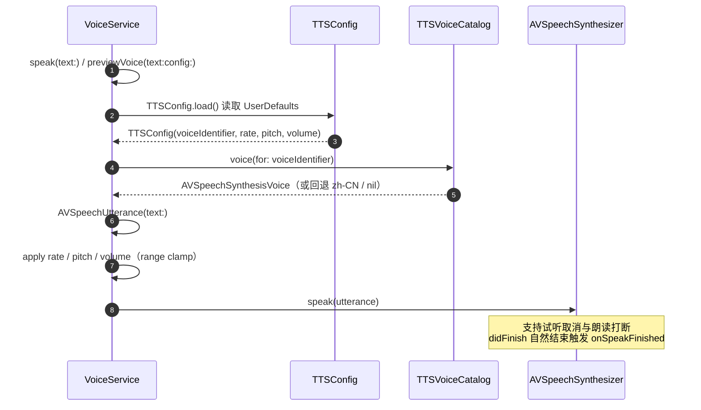

### 4.10 灵动岛状态机

下图使用 Mermaid `stateDiagram-v2` 描述 Live Activity 状态流转。

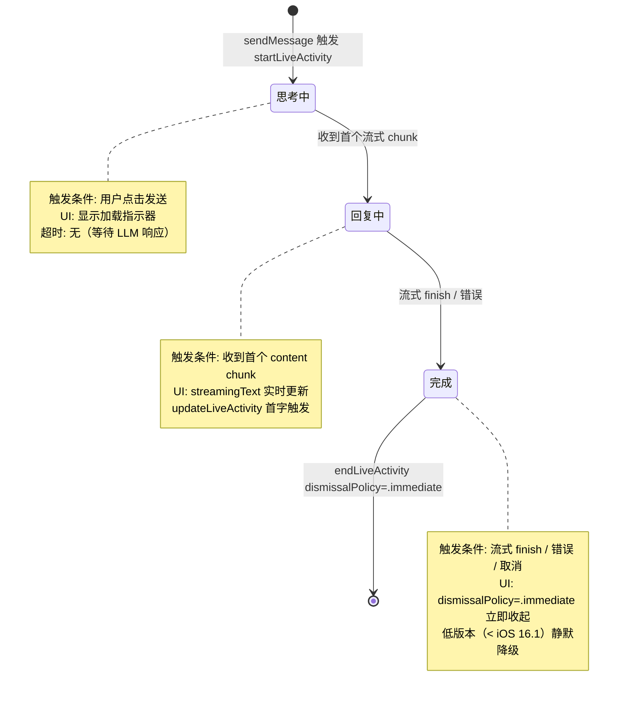

---

## 5. 关键设计决策

### Day 1–11 基础决策

| # | 决策 | 选型理由 | 对应文件 | 影响范围 |
|---|------|---------|---------|---------|
| 1 | MVVM + `@Observable` 不用 Combine | iOS 17+ 新观察模型，比 Combine 更简洁，无需 `ObservableObject` / `@Published` 样板代码。 | `ViewModels/` 4 个文件 | ChatViewModel / ConversationListVM / KnowledgeBaseVM / SettingsViewModel |
| 2 | SwiftData 不用 CoreData / Realm | iOS 17+ 原生持久化，`@Model` 宏自动生成 schema 与迁移，与 SwiftUI 深度集成。 | `Models/` 7 个 `@Model` | ChatMessage / Conversation / UserPreference / DocumentChunk / HealthInsight / MessageFeedback / RemoteConfig |
| 3 | DeepSeek API 合规优先 | 国内可用、协议兼容 OpenAI chat completions，避免 OpenAI 直连的网络与合规问题。 | `Services/LLM/DeepSeekClient.swift` | DeepSeekClient + EmbeddingService + APIConfig |
| 4 | `AsyncStream` 流式不用 Combine Publisher | `AsyncStream<String>` / `AsyncStream<ParsedChunk>` 更适合 SSE 流式解析的逐 chunk yield 语义，比 Publisher 更直观。 | `Services/LLM/DeepSeekClient.swift` `chat` 返回值 | 全部 LLMProvider 实现 + ChatViewModel processMessage |
| 5 | `nonisolated DeepSeekClient` 跨 actor | 允许从 `@MainActor` ViewModel 直接调用，避免 actor hop 开销；HTTP 请求本身在 URLSession 内部异步。 | `DeepSeekClient` 类声明 | DeepSeekClient / QwenClient / BFFProxyClient / OfflineLLMProvider |
| 6 | `@MainActor Service` 线程安全 | `SemanticCache` / `RAGService` / `ToolRegistry` / `ChatStorage` 标 `@MainActor`，与 ViewModel 同 actor 避免 data race。 | 各 Service 文件 | SemanticCache / RAGService / ToolRegistry / ChatStorage |
| 7 | `LLMProvider` 协议注入测试可替换 | `ChatViewModel.init(client:cache:)` 默认 `DeepSeekClient()` / `SemanticCache()` 兜底，测试可注入 mock。 | `ViewModels/ChatViewModel.swift` `init` | ChatViewModel + 全部 LLM Client 测试 |
| 8 | `UITEST_DISABLE_NETWORK` 启动参数桩回复 | UIT 不触发真实 HTTP，避免 API Key 缺失 / 网络不稳导致 UIT 随机失败。 | `ChatViewModel.processMessage` 入口分支 | ChatViewModel + AetherUITests |

### Day 12–20 扩展决策

| # | 决策 | 选型理由 | 对应文件 | 影响范围 |
|---|------|---------|---------|---------|
| 9 | 智能路由 SmartRouter + 自动 Fallback | 多 Provider 可用时按规则与历史成功率动态选择，单点失败自动切 fallback provider，提升可用性。 | `Services/Routing/SmartRouter.swift` / `Services/LLM/FallbackLLMProvider.swift` | SmartRouter + FallbackLLMProvider + ChatViewModel + ModelProviderFactory |
| 10 | BFF Token 设备端不持上游 API Key | 设备端仅持 `userToken`，上游 Key 仅在 Cloudflare Workers secrets 中，避免 Key 泄露与配额盗用。 | `Core/Models/BFFConfig.swift` / `Services/LLM/BFFProxyClient.swift` | BFFConfig + BFFProxyClient + ModelProviderFactory + SettingsViewModel + CloudflareWorkers/ |
| 11 | MLX 端侧模型断网自动切换 | `OnDeviceConfig.autoSwitchOnNetworkLoss` 默认 true，NetworkMonitor 检测断网即切端侧推理，网络恢复自动切回，保证离线可用。 | `Services/Network/NetworkMonitor.swift` / `Services/OnDevice/OfflineLLMProvider.swift` | NetworkMonitor + OfflineLLMProvider + MLXInferenceEngine + OnDeviceModelDownloader + ChatViewModel |
| 12 | TTSConfig UserDefaults 持久化不用 SwiftData | TTS 配置为轻量键值，UserDefaults 比 SwiftData 更轻量，避免迁移复杂度。 | `Services/Voice/TTSConfig.swift` | TTSConfig + VoiceService + TTSVoicePickerView + SettingsViewModel |
| 13 | `UITEST_RESET_DATA` 数据隔离 | UIT 启动时通过环境变量清理历史会话与缓存，保证用例独立可重复执行，避免脏数据干扰。 | `AetherApp.swift` 启动逻辑 | AetherApp + ChatStorage.wipeAllData + AetherUITests |
| 14 | `batch cleanupEmptyConversations` 后台清理 | 后台任务批量清理空会话（无消息或仅 system prompt），控制 SwiftData 体积。 | `Services/Storage/ChatStorage.swift` `cleanupEmptyConversations` | ChatStorage + ConversationListVM + AetherApp BGTask |
| 15 | Markdown 渲染自定义 AttributedString 不引第三方库 | 用 Foundation `AttributedString` + 自定义 parser，避免引入 Down / Ink 等第三方库，控制包体积与依赖。 | `Views/Chat/Markdown*.swift` / `CodeSyntaxHighlighter.swift` | MarkdownText / HeadingView / MarkdownTableParser / MarkdownTableView / TaskListView / CodeBlockView / CodeSyntaxHighlighter |
| 16 | 隐私清单 PrivacyInfo.xcprivacy 显式声明 | App Store 审核要求显式声明 Required Reason API 使用（UserDefaults / FileTimestamp / SystemBootTime 等）。 | `Resources/PrivacyInfo.xcprivacy` | PrivacyInfo.xcprivacy + App Bundle |
| 17 | App Intents 三 Intent 设计 | Ask / NewConversation / SwitchConversation 覆盖 Shortcuts / Spotlight / Siri 三入口，最小可用集。 | `AppIntents/*.swift` | AskAetherIntent + NewConversationIntent + SwitchConversationIntent + IntentChatService |
| 18 | 崩溃日志下次启动上报不上传实时 | 实时上报在崩溃瞬间不可靠（进程已死），落盘 + 下次启动上报更稳。 | `Services/Crash/CrashReportService.swift` | CrashReportService + AetherApp 启动 |
| 19 | 遥测脱敏后批量上报 | 单事件实时上报耗电耗流量，批量 + 脱敏更合规与高效。 | `Services/Telemetry/TelemetryService.swift` | TelemetryService + LogUploader + AetherApp BGTask |

#### 决策：多平台适配（Day 20 后）

- **方案**：采用 SwiftUI 原生渲染 + `#if os(iOS)` 条件编译，而非 Catalyst 或完全双份代码
- **理由**：SwiftUI 跨平台能力强，单份代码覆盖三端；`#if os(iOS)` 隔离 iOS-only 框架让 macOS 优雅降级（HealthKit 入口隐藏但保留 HealthInsight 模型注册维持 schema 一致性）
- **关键替换**：DocumentPickerView 用 SwiftUI `.fileImporter` 替代 UIKit；FeedbackService 用 `ProcessInfo` 替代 `UIDevice`；SettingsView / KnowledgeBaseView 用 NavigationSplitView 双栏布局
- **影响范围**：`AetherApp.swift` + 全部 `Services/` iOS-only 文件（HealthKitService / WatchConnectivityService / ActivityKit / BGTaskScheduler）+ `Views/Settings/SettingsView.swift` + `Views/RAG/DocumentPickerView.swift` + `Services/Feedback/FeedbackService.swift`
- **macOS 原生 UX**：窗口默认 1000×700，菜单栏 ⌘N 新建 / ⌘K 搜索 / ⌘, 设置，⌘Enter 发送

#### 决策：工具能力增强（Day 20 后）

- **方案**：所有新工具统一实现 `ToolProtocol`（definition + execute），按平台用条件编译注册
- **跨平台工具**：无条件注册（LocationTool 用 CheckedContinuation 包装 CLLocationManager 委托 API，WeatherTool 用 Open-Meteo 免费 API 无需 Key）
- **macOS 独有工具**：整体文件用 `#if os(macOS)` 包裹，ToolRegistry init 中用 `#if os(macOS)` 条件注册
- **快捷指令创建**：CreateShortcutTool 构建 WFWorkflow plist 格式序列化为 .shortcut 文件，用 NSWorkspace.open 让 Shortcuts 应用导入；iOS 端 RunShortcutTool 用 NSUserActivity 触发
- **权限**：Info.plist 新增 NSLocationWhenInUseUsageDescription 和 NSContactsUsageDescription
- **影响范围**：`Services/Tools/` 全部 21 个文件 + `ToolRegistry.swift` + `Resources/Info.plist`

#### 决策：预设系统提示词（Day 20 后）

- **方案**：在 `systemPromptSection` 上方加 Menu 选择预设角色，选中后写入 `settingsVM.systemPrompt`（填入而非锁定 TextEditor），复用现有「完成」按钮回写逻辑。
- **理由**：零侵入 ViewModel / Model 层，预设角色仅作为快捷输入入口，填入后仍可二次编辑，兼顾「开箱即用」与「灵活定制」。
- **实现**：`PresetPrompts.swift` 用 `enum PresetPrompts` 暴露 `static let all: [PresetPrompt]`，每个 `PresetPrompt` 含 role + prompt（≥ 150 字），共 11 个角色覆盖开发者 / 学生 / 白领 / 管理者 / 产品经理 / 写作助手 / 技术面试官 / 学习导师 / 翻译官 / 健身教练等典型场景。
- **影响范围**：`Views/Settings/PresetPrompts.swift` + `Views/Settings/SettingsView.swift` `systemPromptSection` + `AetherTests/PresetPromptsTests.swift`

#### 决策：macOS 体验修复（Day 20 后）

- **方案**：针对 macOS 多处体验塌缩定向修复，不引入新依赖。
- **NavigationStack 包裹 detail**：`regularLayout` 的 detail 栏包 `NavigationStack`，解决 macOS 二级页（TTS / 隐私政策 / 端侧模型管理）无返回按钮的问题。
- **工具项中文化**：`preferenceSection` 的 Toggle 文案从 `toolDef.function.name`（英文）改为 `toolDef.function.description`（中文），零改动 ToolProtocol。
- **NSColor shim 改色**：MessageBubble.swift 的 systemGray3 / 5 / 6 在 macOS 上同色导致 markdown 视觉层次塌缩，改为 separatorColor / textBackgroundColor / controlBackgroundColor 三种不同灰阶。
- **MarkdownText parseBlocks 缓存**：用 NSCache（countLimit=200）缓存 parseBlocks 结果，解决语音朗读时反复重渲染卡顿。
- **VoiceService 兜底**：加 `@MainActor` 隔离、`didCancel` 兜底清理（解决按钮卡死）、voice nil 降级（不崩）、移除 `spokenText` 死状态。
- **影响范围**：`Views/Settings/SettingsView.swift` + `Views/Chat/MessageBubble.swift` + `Views/Chat/MarkdownText.swift` + `Services/Voice/VoiceService.swift`

### 5.7 国际化与无障碍

- **String Catalog 统一源语言**：`Localizable.xcstrings` 以 `zh-Hans` 为源语言，支持 **8 种语言**完整翻译（`zh-Hans` 简体中文 / `zh-Hant` 繁体中文 / `en` 英文 / `ja` 日文 / `ko` 韩文 / `fr` 法文 / `de` 德文 / `es` 西班牙文），共 888 keys；SwiftUI 字面量自动提取，动态文本使用 `NSLocalizedString`；App 内「设置 → 语言」支持跟随系统或手动切换 9 种选项（含 8 种语言 + 跟随系统），切换后写入 `AppleLanguages` UserDefaults 并提示重启。
- **accessibility 工程化**：13+ 视图补充 `accessibilityLabel` / `accessibilityHint` / `accessibilityIdentifier`，关键交互控件全部可访问，同时为 UITest 提供稳定定位符；Watch App 与 LaunchScreen 同样补充无障碍标签。
- **截图资产规范化**：`screenshots/` 目录按 iOS / macOS 分类，8 张核心页面截图用于 README 与 App Store 元数据。

### 5.8 平台扩展（Watch App / Widget Extension / DeepLink）

#### Watch App（`AetherWatch/`）

- **架构**：watchOS 独立 App，`WatchApp.swift` 使用 `TabView` 三标签页（快速对话 / 健康洞察 / 设置）。
- **数据同步**：通过 `WatchConnectivityService`（`WCSession`）与 iOS 主 App 双向通信：`transferUserInfo` 推送健康洞察到 Watch；`sendQuickChat` 从 Watch 发送快捷对话消息到 iPhone。
- **依赖**：需 iOS 主 App 配对（`WatchConnectivity` 仅 iOS 端激活），macOS 不支持。
- **⚠️ Target 配置**：源代码已就绪，需在 Xcode 中手动创建 watchOS App target 并关联 `AetherWatch/` 目录下的源文件。

#### Widget Extension（`AetherWidgets/`）

- **架构**：三个 Widget 共用一个 Widget Extension target：
  - `QuickChatWidget`：桌面快捷提问，点击通过 DeepLink `aether://ask?query=` 跳转到主 App 并自动发送。
  - `HealthInsightWidget`：展示最新健康洞察摘要，通过 App Group 共享 SwiftData 读取 `HealthInsight` @Model。
  - `RecentConversationsWidget`：最近会话列表，点击通过 DeepLink `aether://conversation/<uuid>` 跳转。
- **数据共享**：通过 App Group（`group.com.aether.app`）配置共享 `ModelContainer`，Widget 与主 App 读取同一 SwiftData 数据库。
- **技术栈**：`TimelineProvider` + `AppIntentConfiguration`（iOS 17+ / macOS 14+）。
- **⚠️ Target 配置**：源代码已就绪，需在 Xcode 中手动创建 Widget Extension target 并关联 `AetherWidgets/` 目录下的源文件，配置 App Group capability。

#### DeepLink 支持

- **URL Scheme**：`aether://`
- **支持的 DeepLink**：
  - `aether://ask?query=<URL编码文本>`：打开主界面并自动发送指定文本作为消息。
  - `aether://conversation/<uuid>`：跳转到指定 UUID 的会话。
- **实现**：在 `AetherApp.swift` 中通过 `.onOpenURL` 处理，解析 URL 后调用 `IntentChatService` 或 `ConversationListVM` 路由到对应会话。
- **入口**：Widget 点击、Siri / Shortcuts、Spotlight 搜索结果、外部 App 跳转。

#### App Group 共享 SwiftData

- **配置**：App Group identifier `group.com.aether.app`。
- **共享方案**：主 App 与 Widget Extension 的 `ModelContainer` 均指向 App Group 容器目录下的同一 SQLite 数据库文件，Widget 可直接读取主 App 写入的 `Conversation` / `HealthInsight` 数据。
- **影响范围**：`AetherApp.swift`（ModelContainer 初始化）+ Widget Extension（TimelineProvider 读取数据）。

---

## 6. 技术栈映射

| 技术选型 | 实际文件 / 类型 | 版本要求 |
|---------|---------------|---------|
| SwiftUI `@Observable` | `Views/` 全部 + `ViewModels/` 全部 | iOS 17.0+ / macOS 14.0+ / Xcode 16+ / Swift 5.9+ |
| SwiftData `@Model` | `Models/ChatMessage.swift` / `Conversation.swift`（含 `UserPreference`）/ `DocumentChunk.swift` / `HealthInsight.swift` / `MessageFeedback.swift` / `RemoteConfig.swift`；`ChatChunk.swift` 为普通 `Codable` 结构 | iOS 17.0+ / macOS 14.0+ / Xcode 16+ |
| DeepSeek API chat completions | `Services/LLM/DeepSeekClient.swift`（`chat` 流式 + `embed`） | iOS 17.0+ / macOS 14.0+（仅运行时网络） |
| Qwen API（阿里云百炼 DashScope OpenAI 兼容） | `Services/LLM/QwenClient.swift` | iOS 17.0+ / macOS 14.0+（仅运行时网络） |
| BFF 代理（Cloudflare Workers） | `Services/LLM/BFFProxyClient.swift` + `CloudflareWorkers/worker.js` + `CloudflareWorkers/wrangler.toml` | iOS / macOS 客户端无要求；Worker 需 Cloudflare Runtime |
| MLX 端侧推理 | `Services/OnDevice/MLXInferenceEngine.swift` / `OfflineLLMProvider.swift` / `OnDeviceModelDownloader.swift` | iOS 17.0+ / macOS 14+ / Apple Silicon（M1+）；内存 ≥ 4GB |
| DeepSeek API SSE 流式 | `Services/LLM/SSEParser.swift`（`parseChunk` / `parseWithToolAccumulation`） | iOS 17.0+ / macOS 14.0+ |
| DeepSeek API function calling | `Services/Tools/ToolRegistry.swift`（`allToolDefs` → `ToolDef`） | iOS 17.0+ / macOS 14.0+ |
| `AVAudioSession` + `SFSpeechRecognizer` | `Services/Voice/VoiceService.swift`（`startRecording`） | iOS 17.0+（macOS 不支持 SFSpeechRecognizer 录音） |
| `AVSpeechSynthesizer` + TTSConfig | `Services/Voice/VoiceService.swift`（`speak`）/ `TTSConfig.swift` / `TTSVoiceCatalog.swift` | iOS 17.0+ / macOS 14.0+ |
| EventKit `EKAlarm` | `Services/Tools/AlarmTool.swift` | iOS 17.0+ / macOS 14.0+ |
| EventKit `EKReminder` | `Services/Tools/ReminderTool.swift` | iOS 17.0+ / macOS 14.0+ |
| ActivityKit Live Activities | `App/AetherApp.swift` `TimerActivityAttributes` | iOS 16.1+（iPadOS 16.1+，macOS 不支持） |
| `BGTaskScheduler` | `App/AetherApp.swift` `scheduleDailyRefresh` / `handleDailyRefresh` | iOS 13.0+（macOS 不支持） |
| `UserNotifications` | `Services/Tools/ToolRegistry.swift` `NotificationService` | iOS 17.0+ / macOS 14.0+ |
| Keychain | `Services/Auth/KeychainManager.swift`（按 provider 隔离 account） | iOS 17.0+ / macOS 14.0+ / Security.framework |
| PDFKit | `Services/RAG/PDFExtractor.swift` | iOS 17.0+ / macOS 14.0+ |
| NLTokenizer | `Services/RAG/DocumentChunker.swift` | iOS 17.0+ / macOS 14.0+ / NaturalLanguage.framework |
| NSExpression | `Services/Tools/ToolRegistry.swift` `CalculatorTool` | iOS 17.0+ / macOS 14.0+ / Foundation |
| HealthKit | `Services/Health/HealthKitService.swift` / `HealthInsightGenerator.swift` | iOS 17.0+（macOS 不支持） |
| App Intents | `AppIntents/AskAetherIntent.swift` / `NewConversationIntent.swift` / `SwitchConversationIntent.swift` | iOS 16.0+ / macOS 13.0+ / Xcode 16+ |
| Spotlight（CoreSpotlight） | `Services/Search/SpotlightIndexer.swift` | iOS 17.0+ / macOS 14.0+ / CoreSpotlight.framework |
| Handoff（NSUserActivity） | `AetherTests/ConversationActivityTests.swift` 覆盖的 NSUserActivity 恢复逻辑 | iOS 17.0+ / macOS 14.0+ / Foundation |
| CrashReportService | `Services/Crash/CrashReportService.swift` | iOS 17.0+ / macOS 14.0+（Bugly SDK 可选） |
| FeedbackService | `Services/Feedback/FeedbackService.swift` | iOS 17.0+（MFMailComposeViewController 仅 iOS）/ macOS 14.0+（mailto URL） |
| WatchConnectivity | `Services/Connectivity/WatchConnectivityService.swift` + `AetherWatch/` | iOS 17.0+（macOS 不支持）+ watchOS 10+ |
| NWPathMonitor | `Services/Network/NetworkMonitor.swift` | iOS 17.0+ / macOS 14.0+ / Network.framework |
| RemoteConfig | `Services/RemoteConfig/RemoteConfigService.swift` | iOS 17.0+ / macOS 14.0+（仅运行时网络） |
| Telemetry | `Services/Telemetry/TelemetryService.swift` / `LogUploader.swift` | iOS 17.0+ / macOS 14.0+ |
| PerformanceMonitor | `Services/Performance/PerformanceMonitor.swift` | iOS 17.0+ / macOS 14.0+ |
| PrivacyInfo.xcprivacy | `Resources/PrivacyInfo.xcprivacy` | iOS 17.0+ / macOS 14.0+ / Xcode 16+（App Store 审核要求） |
| AttributedString（Markdown） | `Views/Chat/Markdown*.swift` / `CodeSyntaxHighlighter.swift` | iOS 17.0+ / macOS 14.0+ / Foundation |
| XCTest | `AetherTests/` 157 文件（2881 用例） | Xcode 16+ / Swift 5.9+ |
| XCUITest | `AetherUITests/` 7 文件（30 用例） | Xcode 16+ / Swift 5.9+ |
| GitHub Actions | `.github/workflows/ci.yml` | macos-14 runner / Xcode 16+ |
| CoreLocation | CLLocationManager + CLGeocoder | LocationTool 定位与反地理编码 | iOS 17.0+ / macOS 14.0+ / CoreLocation.framework |
| Contacts | CNContactStore | ContactsTool 通讯录搜索 | iOS 17.0+ / macOS 14.0+ / Contacts.framework |
| Vision | VNRecognizeTextRequest | OCRTool 图片文字识别（macOS） | macOS 14+ / Vision.framework |
| CoreGraphics | CGDisplayCreateImage / CGEvent | ScreenshotTool 截屏 + InputAutomationTool 输入模拟（macOS） | macOS 14+ / CoreGraphics.framework |
| NSAppleScript | NSAppleScript | AppleScriptTool / SafariControlTool / SystemControlTool / FinderTool（macOS） | macOS 14+ / Foundation |
| NSWorkspace | NSWorkspace | AppManagementTool / OpenURLTool / FileOperationTool（macOS 部分） | macOS 14+ / AppKit |
| Process | Foundation.Process | TerminalCommandTool + ShortcutsTool CLI（macOS） | macOS 14+ / Foundation |
| Shortcuts CLI | shortcuts run / shortcuts list | RunShortcutTool / ListShortcutsTool（macOS） | macOS 14+ / Shortcuts.app |
| Rust (aether-core) | `rust/aether-core/` | 纯 Rust 算法 crate（sha2 / unicode-segmentation / tokenizers / candle / wasmtime / regex） | Rust 1.75+ |
| Rust (aether-core-ffi) | `rust/aether-core-ffi/` | C ABI 绑定层（staticlib / cdylib / rlib），条件编译支持 wasm32 / android | Rust 1.75+ |
| cbindgen | `rust/aether-core-ffi/cbindgen.toml` | 自动生成 C 头文件 `aether_core_ffi.h` | cbindgen 0.26+ |
| xcframework | `Packages/AetherCore/aether_core.xcframework/` | 三架构（ios-arm64 / ios-arm64-simulator / macos-arm64）静态库包 | Xcode 16+ |

---

## 7. 测试架构

### 7.1 单元测试（UT）

- **Target**：`AetherTests`
- **规模**：157 个测试文件，2881 用例（2881 pass / 0 skip / 0 failures）
- **分层覆盖**：

| 层级 | 测试文件 | 文件数 | 核心断言数（约） | skip 原因 |
|------|---------|--------|----------------|-----------|
| Service 层 | `DeepSeekClientTests` | 1 | 8 | 网络环境依赖 / API Key 缺失 |
| Service 层 | `QwenClientTests` | 1 | 6 | 网络环境依赖 / API Key 缺失 |
| Service 层 | `BFFProxyClientTests` | 1 | 7 | BFF endpoint 未配置 |
| Service 层 | `FallbackLLMProviderTests` | 1 | 6 | — |
| Service 层 | `ModelProviderTests` | 1 | 5 | — |
| Service 层 | `RateLimiterTests` | 1 | 4 | — |
| Service 层 | `SSEParserTests` | 1 | 9 | — |
| Service 层 | `SemanticCacheTests` | 1 | 6 | — |
| Service 层 | `SemanticCacheEdgeTests` | 1 | 5 | — |
| Service 层 | `DocumentChunkerTests` | 1 | 4 | NLTokenizer 未切分多块时 skip |
| Service 层 | `EmbeddingServiceTests` | 1 | 4 | API Key 缺失 |
| Service 层 | `RAGServiceTests` | 1 | 6 | — |
| Service 层 | `PDFExtractorTests` | 1 | 3 | 测试 PDF 资源缺失 |
| Service 层 | `ChatStorageTests` | 1 | 8 | — |
| Service 层 | `KeychainManagerTests` | 1 | 5 | 模拟器 Keychain entitlement 限制 |
| Service 层 | `KeychainManagerMultiProviderTests` | 1 | 4 | 模拟器 Keychain entitlement 限制 |
| Service 层 | `ToolRegistryTests` | 1 | 6 | — |
| Service 层 | `AlarmToolTests` | 1 | 4 | EventKit 权限拒绝 |
| Service 层 | `ReminderToolTests` | 1 | 4 | EventKit 权限拒绝 |
| Service 层 | `CalculatorToolTests` | 1 | 6 | — |
| Service 层 | `DateTimeToolTests` | 1 | 3 | — |
| Service 层 | `NotificationServiceTests` | 1 | 3 | 通知授权拒绝 |
| Service 层 | `VoiceServiceTests` | 1 | 5 | 语音识别器不可用（模拟器） |
| Service 层 | `TTSConfigTests` | 1 | 5 | — |
| Service 层 | `TTSVoiceCatalogTests` | 1 | 4 | — |
| Service 层 | `SmartRouterTests` | 1 | 6 | — |
| Service 层 | `NetworkMonitorTests` | 1 | 4 | — |
| Service 层 | `OfflineLLMProviderTests` | 1 | 5 | MLX 模型未下载 |
| Service 层 | `OnDeviceConfigTests` | 1 | 4 | — |
| Service 层 | `RemoteConfigServiceTests` | 1 | 5 | — |
| Service 层 | `TelemetryServiceTests` | 1 | 5 | — |
| Service 层 | `LogUploaderTests` | 1 | 4 | 上报 endpoint 不可达 |
| Service 层 | `CrashReportServiceTests` | 1 | 3 | — |
| Service 层 | `PerformanceMonitorTests` | 1 | 4 | — |
| Service 层 | `SpotlightIndexerTests` | 1 | 3 | — |
| Service 层 | `IntentChatServiceTests` | 1 | 4 | — |
| Service 层 | `HealthKitServiceTests` | 1 | 4 | HealthKit 授权未授予 |
| Service 层 | `HealthInsightGeneratorTests` | 1 | 4 | HealthKit 授权未授予 |
| Service 层 | `FeedbackServiceTests` | 1 | 4 | — |
| Service 层 | `WatchConnectivityServiceTests` | 1 | 3 | 设备不支持 WatchConnectivity |
| Model 层 | `ChatMessageTests` | 1 | 4 | — |
| Model 层 | `ConversationModelTests` | 1 | 5 | — |
| Model 层 | `MessageFeedbackTests` | 1 | 3 | — |
| Model 层 | `StringTokenCountTests` | 1 | 3 | — |
| Model 层 | `APIConfigTests` | 1 | 3 | — |
| Model 层 | `PresetPromptsTests` | 1 | 4 | — |
| ViewModel 层 | `ChatViewModelTests` | 1 | 6 | — |
| ViewModel 层 | `ConversationListVMTests` | 1 | 4 | — |
| ViewModel 层 | `KnowledgeBaseVMTests` | 1 | 3 | — |
| ViewModel 层 | `SettingsViewModelTests` | 1 | 4 | — |
| 跨层 / 行为 | `ConversationActivityTests`（NSUserActivity / Handoff） | 1 | 4 | — |
| 合计 | — | 157 | — | — |

> **注**：核心断言数为约数（基于测试方法数与典型 XCTest 断言密度估算），实际值以代码为准。skip 用例总数为 3，分布于 Keychain / NLTokenizer / 语音识别器不可用等场景。

- **新增关键测试文件**：
  - `TTSConfigTests.swift`：TTS 配置持久化与默认值
  - `TTSVoiceCatalogTests.swift`：系统音色目录枚举与语言分组
  - `RoutingServiceTests.swift`（实为 `SmartRouterTests.swift`）：智能路由规则与 Fallback 触发
  - `BFFProxyClientTests.swift`：BFF 代理请求构造与 userToken 注入
  - `OfflineLLMProviderTests.swift` / `OnDeviceConfigTests.swift`：端侧推理与配置
  - `HealthKitServiceTests.swift` / `HealthInsightGeneratorTests.swift`：HealthKit 数据读取与洞察生成
  - `IntentChatServiceTests.swift`：App Intents 路由
  - `SpotlightIndexerTests.swift`：Spotlight 索引创建/清理
  - `CrashReportServiceTests.swift` / `PerformanceMonitorTests.swift` / `TelemetryServiceTests.swift` / `LogUploaderTests.swift`：监控与遥测
  - `FeedbackServiceTests.swift` / `MessageFeedbackTests.swift`：反馈持久化
  - `WatchConnectivityServiceTests.swift`：Watch 通信
  - `PresetPromptsTests.swift`：预设系统提示词清单（11 个角色完整性 / prompt 非空 / 角色唯一 / ≥ 150 字校验，4 用例）

- **skip 场景**：Keychain 不可用（模拟器 entitlement 限制）/ 语音识别器不可用 / NLTokenizer 未切分多块 / 权限拒绝 / HealthKit 授权未授予 / MLX 模型未下载 / 网络环境依赖等场景，用 `XCTSkip` / `XCTSkipUnless` 兜底。

### 7.2 UI 测试（UIT）

- **Target**：`AetherUITests`
- **规模**：7 个测试文件，30 用例（30 pass / 0 skip / 0 failures）
- **文件拆分**：

| 文件 | 用例数 | 核心断言数（约） | skip 原因 | 覆盖端到端流 |
|------|--------|----------------|-----------|-------------|
| `AetherUITests.swift` | 12 | 24 | contextMenu 在模拟器上不稳定 / Picker 滚动时机差异 / alert 未在超时内消失 | 启动 / 会话列表 / 创建会话 / API Key 保存/删除 / RAG+Tools Toggle / 模型切换 / 系统提示词 / 用户偏好 / contextMenu / 搜索 / 错误条 / 预设角色（修复 switch 标签定位与 flaky tap） |
| `AetherUITestsLaunchUITests.swift` | 1 | 1 | — | launch 用例 |
| `GestureUITests.swift` | 3 | — | — | 手势交互（下拉关闭键盘等） |
| `MCPSettingsUITests.swift` | 3 | — | — | MCP 服务配置 |
| `MenuBarUITests.swift` | 3 | — | — | macOS 菜单栏 |
| `MultiWindowUITests.swift` | 3 | — | — | 多窗口 |
| `PluginSettingsUITests.swift` | 5 | — | — | 插件配置 |

- **启动参数**：
  - `UITEST_DISABLE_NETWORK`：短路真实 HTTP，注入桩回复「（UIT 测试模式）已收到：{input}」
  - `UITEST_RESET_DATA`：启动时清理历史会话与缓存，保证用例独立可重复执行
- **skip 场景**：contextMenu 在模拟器上不稳定 / Picker / Section 滚动时机差异 / alert 未在超时内消失等，用 `throw XCTSkip` 兜底。

### 7.3 持续集成（CI）

- **配置文件**：`.github/workflows/ci.yml`
- **触发条件**：push to `main` + pull_request to `main`
- **Runner**：`macos-14`
- **执行步骤**：

| 步骤 | 命令 | 版本要求 |
|------|------|---------|
| Checkout | `actions/checkout@v4` | GitHub Actions |
| Build | `xcodebuild build -project Aether.xcodeproj -scheme Aether-iOS -destination 'platform=iOS Simulator,name=iPhone 17' -configuration Debug CODE_SIGNING_ALLOWED=NO` | Xcode 16+ / iPhone 17 Simulator |
| Test (UT + UIT) | `xcodebuild test ... -resultBundlePath TestResults.xcresult CODE_SIGNING_ALLOWED=NO` | Xcode 16+ |
| Upload artifact | `actions/upload-artifact@v4`（`if: always()`，name: `test-results-xcresult`） | GitHub Actions |

- **Destination**：iPhone 17 模拟器。

---

## 8. 目录结构

完整目录树，与磁盘一致：

```
Aether/
├── App/
│   └── AetherApp.swift
├── AppIntents/
│   ├── AskAetherIntent.swift
│   ├── NewConversationIntent.swift
│   └── SwitchConversationIntent.swift
├── Core/
│   ├── Actors/
│   │   └── ChatActor.swift          # 已移除（文件已删除）
│   ├── Constants/
│   │   ├── APIConfig.swift
│   │   └── ModelProvider.swift
│   ├── Extensions/
│   │   └── String+TokenCount.swift
│   ├── Models/
│   │   ├── BFFConfig.swift
│   │   ├── OnDeviceConfig.swift
│   │   └── OnDeviceError.swift
│   └── Protocols/
│       ├── LLMProvider.swift
│       └── ToolProtocol.swift
├── Models/
│   ├── ChatChunk.swift
│   ├── ChatMessage.swift
│   ├── Conversation.swift
│   ├── DocumentChunk.swift
│   ├── HealthInsight.swift
│   ├── MessageFeedback.swift
│   └── RemoteConfig.swift
├── Resources/
│   ├── Assets.xcassets/
│   │   ├── AccentColor.colorset/
│   │   │   └── Contents.json
│   │   ├── AppIcon.appiconset/
│   │   │   ├── AppIcon-1024.png
│   │   │   └── Contents.json
│   │   └── Contents.json
│   ├── Info.plist
│   └── PrivacyInfo.xcprivacy
├── Services/
│   ├── Auth/
│   │   └── KeychainManager.swift
│   ├── Cache/
│   │   └── SemanticCache.swift
│   ├── Connectivity/
│   │   └── WatchConnectivityService.swift
│   ├── Crash/
│   │   └── CrashReportService.swift
│   ├── Feedback/
│   │   └── FeedbackService.swift
│   ├── Health/
│   │   ├── HealthInsightGenerator.swift
│   │   └── HealthKitService.swift
│   ├── Intents/
│   │   └── IntentChatService.swift
│   ├── LLM/
│   │   ├── BFFProxyClient.swift
│   │   ├── DeepSeekClient.swift
│   │   ├── FallbackLLMProvider.swift
│   │   ├── ModelProviderFactory.swift
│   │   ├── QwenClient.swift
│   │   ├── RateLimiter.swift
│   │   └── SSEParser.swift
│   ├── Network/
│   │   └── NetworkMonitor.swift
│   ├── OnDevice/
│   │   ├── MLXInferenceEngine.swift
│   │   ├── OfflineLLMProvider.swift
│   │   └── OnDeviceModelDownloader.swift
│   ├── Performance/
│   │   └── PerformanceMonitor.swift
│   ├── RAG/
│   │   ├── DocumentChunker.swift
│   │   ├── EmbeddingService.swift
│   │   ├── PDFExtractor.swift
│   │   └── RAGService.swift
│   ├── RemoteConfig/
│   │   └── RemoteConfigService.swift
│   ├── Routing/
│   │   └── SmartRouter.swift
│   ├── Search/
│   │   └── SpotlightIndexer.swift
│   ├── Storage/
│   │   └── ChatStorage.swift
│   ├── Telemetry/
│   │   ├── LogUploader.swift
│   │   └── TelemetryService.swift
│   ├── Tools/
│   │   ├── AlarmTool.swift
│   │   ├── AppManagementTool.swift                # macOS
│   │   ├── AppleScriptTool.swift                  # macOS
│   │   ├── ClipboardTool.swift                    # 含 ReadClipboardTool + WriteClipboardTool
│   │   ├── ContactsTool.swift
│   │   ├── DeviceInfoTool.swift
│   │   ├── FileOperationTool.swift                # macOS
│   │   ├── FinderTool.swift                       # macOS
│   │   ├── InputAutomationTool.swift              # macOS
│   │   ├── LocationTool.swift
│   │   ├── OCRTool.swift                          # macOS
│   │   ├── OpenURLTool.swift
│   │   ├── ReminderTool.swift
│   │   ├── SafariControlTool.swift                # macOS
│   │   ├── ScreenshotTool.swift                   # macOS
│   │   ├── ShortcutsTool.swift                    # 含 RunShortcutTool + ListShortcutsTool + CreateShortcutTool
│   │   ├── SystemControlTool.swift                # macOS
│   │   ├── TerminalCommandTool.swift              # macOS
│   │   ├── ToolRegistry.swift
│   │   ├── WeatherTool.swift
│   │   └── WindowManagementTool.swift             # macOS
│   └── Voice/
│       ├── TTSConfig.swift
│       ├── TTSVoiceCatalog.swift
│       └── VoiceService.swift
├── Coordinators/                  # P2-6: ChatViewModel 拆分的 10 个 Coordinator
│   ├── CoordinatorProtocol.swift
│   ├── FeedbackCoordinator.swift
│   ├── HealthContextInjector.swift       # iOS（#if os(iOS)）
│   ├── InjectionGuard.swift
│   ├── LiveActivityCoordinator.swift     # iOS（#if os(iOS)）
│   ├── NetworkFallbackCoordinator.swift
│   ├── PromptBuilder.swift               # 纯值类型 struct
│   ├── RetrievalCoordinator.swift
│   ├── ToolExecutionCoordinator.swift
│   ├── VoiceCoordinator.swift
│   └── WatchQuickChatCoordinator.swift   # @unchecked Sendable
├── ViewModels/
│   ├── ChatViewModel.swift
│   ├── ConversationListVM.swift
│   ├── KnowledgeBaseVM.swift
│   └── SettingsViewModel.swift
└── Views/
    ├── Chat/
    │   ├── ChatInputBar.swift
    │   ├── ChatView.swift
    │   ├── CitationCard.swift
    │   ├── CodeBlockView.swift
    │   ├── CodeSyntaxHighlighter.swift
    │   ├── ErrorOverlay.swift
    │   ├── FeedbackBar.swift
    │   ├── HeadingView.swift
    │   ├── MarkdownTableParser.swift
    │   ├── MarkdownTableView.swift
    │   ├── MarkdownText.swift
    │   ├── MessageBubble.swift
    │   ├── MessageListView.swift
    │   ├── StepCardView.swift
    │   ├── TaskListView.swift
    │   └── TypingIndicator.swift
    ├── Components/
    │   ├── ErrorBanner.swift
    │   └── SkeletonView.swift
    ├── Conversation/
    │   ├── ConversationList.swift
    │   └── ConversationRow.swift
    ├── OnDevice/
    │   └── OnDeviceModelView.swift
    ├── RAG/
    │   ├── DocumentPickerView.swift
    │   └── KnowledgeBaseView.swift
    └── Settings/
        ├── HealthSettingsView.swift
        ├── PresetPrompts.swift
        ├── PrivacyPolicyView.swift
        ├── SettingsView.swift
        └── TTSVoicePickerView.swift

AetherWatch/                  # watchOS App（TabView：快速对话 / 健康洞察 / 设置）
├── Views/
│   ├── WatchHealthInsightView.swift
│   └── WatchQuickChatView.swift
└── WatchApp.swift

AetherWidgets/                # Widget Extension（QuickChat / HealthInsight / RecentConversations）
├── AetherWidgetsBundle.swift
├── QuickChatWidget.swift
├── HealthInsightWidget.swift
└── RecentConversationsWidget.swift

CloudflareWorkers/               # BFF 代理网关
├── worker.js
└── wrangler.toml

AetherTests/                  # 157 个 UT 文件 / 2881 用例
├── APIConfigTests.swift
├── AlarmToolTests.swift
├── BFFProxyClientTests.swift
├── CalculatorToolTests.swift
├── ChatMessageTests.swift
├── ChatStorageTests.swift
├── ChatViewModelTests.swift
├── ConversationActivityTests.swift
├── ConversationListVMTests.swift
├── ConversationModelTests.swift
├── CrashReportServiceTests.swift
├── DateTimeToolTests.swift
├── DeepSeekClientTests.swift
├── DocumentChunkerTests.swift
├── EmbeddingServiceTests.swift
├── FallbackLLMProviderTests.swift
├── FeedbackServiceTests.swift
├── HealthInsightGeneratorTests.swift
├── HealthKitServiceTests.swift
├── IntentChatServiceTests.swift
├── KeychainManagerMultiProviderTests.swift
├── KeychainManagerTests.swift
├── KnowledgeBaseVMTests.swift
├── LogUploaderTests.swift
├── MessageFeedbackTests.swift
├── ModelProviderTests.swift
├── NetworkMonitorTests.swift
├── NotificationServiceTests.swift
├── OfflineLLMProviderTests.swift
├── OnDeviceConfigTests.swift
├── PDFExtractorTests.swift
├── PerformanceMonitorTests.swift
├── PresetPromptsTests.swift
├── QwenClientTests.swift
├── RAGServiceTests.swift
├── RateLimiterTests.swift
├── ReminderToolTests.swift
├── RemoteConfigServiceTests.swift
├── SSEParserTests.swift
├── SemanticCacheEdgeTests.swift
├── SemanticCacheTests.swift
├── SettingsViewModelTests.swift
├── SmartRouterTests.swift
├── SpotlightIndexerTests.swift
├── StringTokenCountTests.swift
├── TTSConfigTests.swift
├── TTSVoiceCatalogTests.swift
├── TelemetryServiceTests.swift
├── ToolRegistryTests.swift
├── VoiceServiceTests.swift
└── WatchConnectivityServiceTests.swift

AetherUITests/                # 7 个 UIT 文件 / 30 用例
├── AetherUITests.swift
├── AetherUITestsLaunchUITests.swift
├── GestureUITests.swift
├── MCPSettingsUITests.swift
├── MenuBarUITests.swift
├── MultiWindowUITests.swift
├── PluginSettingsUITests.swift
└── Info.plist

Aether.xcodeproj/             # Xcode 工程文件
rust/
├── aether-core/               # 纯 Rust 算法 crate
└── aether-core-ffi/           # C ABI 绑定层 + cbindgen.toml
Packages/
└── AetherCore/                # SPM 模块化包
    ├── Package.swift
    ├── Sources/
    │   ├── AetherFoundation/  # 核心协议与常量（LLMProvider / ToolProtocol / APIConfig）
    │   ├── AetherRust/        # Rust FFI Swift 包装器（10 个文件）
    │   ├── AetherServices/    # 服务层（LLM / RAG / Cache / Plugin / Telemetry 等）
    │   ├── AetherDesign/      # 设计系统 Token（颜色 / 字体 / 圆角 / 布局）
    │   └── AetherUI/          # 通用 UI 组件（AvatarView / CardStyle / ErrorBanner 等）
    ├── Tests/
    │   └── AetherCoreTests/
    └── aether_core.xcframework/  # Rust 三架构静态库
doc/
├── ARCHITECTURE.md              # 本文件
├── USAGE.md
├── API.md
├── CHANGELOG.md
├── CONTRIBUTING.md
├── ROADMAP.md
├── OPTIMIZATION.md
├── Style Guide.md
├── MANUAL_TEST_CHECKLIST.md
├── ReleaseChecklist.md
├── BFF_DEPLOYMENT.md
├── DMG_PACKAGING.md
├── Aether 实战计划.md
└── diagrams/
    ├── README.md
    ├── architecture-overview.puml
    ├── react-loop.puml
    ├── rag-dataflow.puml
    └── provider-fallback.puml
.github/workflows/ci.yml
.trae/specs/                     # 43 个 spec 目录（Day 1–20 + 修复 + 补充 + 文档更新）
README.md
.gitignore
```
