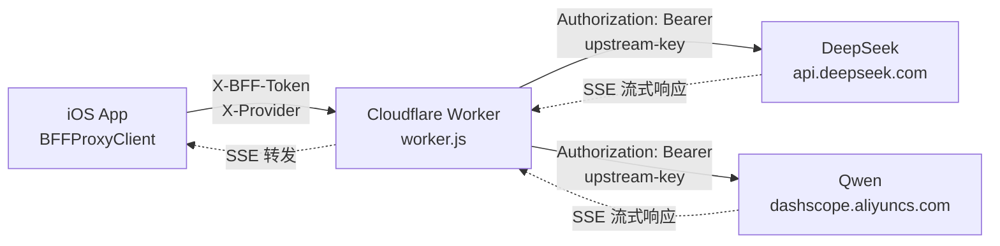

# BFF 代理层部署文档（Day 15）

AIBuilder 的 BFF（Backend For Frontend）代理层运行在 Cloudflare Workers 上，负责在服务端持有上游 LLM API Key，设备端仅持有 BFF Token。本文档描述从账号注册到设备端配置的完整部署流程。

## 架构概览



- 设备端：`BFFProxyClient`（`AIBuilder/Services/LLM/BFFProxyClient.swift`）将请求发往 BFF endpoint，附带 `X-BFF-Token` 与 `X-Provider`，**不携带上游 API Key**。
- BFF：`CloudflareWorkers/worker.js` 校验 token、按 provider 路由、注入上游 key、流式转发 SSE 响应。
- 上游：DeepSeek（`https://api.deepseek.com`）与 Qwen（`https://dashscope.aliyuncs.com/compatible-mode/v1`）。

## 1. Cloudflare 账号注册

1. 访问 https://dash.cloudflare.com/sign-up 注册账号（邮箱 + 密码，免费）。
2. 免费套餐（Workers Free）每日 100,000 次请求，足够开发与小规模生产验证。如需更高配额，升级 Workers Paid（$5/月，1000 万次请求）。

## 2. 安装并登录 Wrangler

```bash
# 安装 wrangler CLI
npm install -g wrangler

# 登录（浏览器授权）
wrangler login
```

## 3. 部署 Worker

```bash
cd CloudflareWorkers

# 首次部署（会读取 wrangler.toml）
wrangler deploy
```

部署成功后，wrangler 输出形如 `https://aibuilder-bff.<your-subdomain>.workers.dev` 的访问地址，即为 BFF endpoint。

## worker.js 关键代码段

以下片段摘自 `CloudflareWorkers/worker.js`，便于快速理解核心逻辑。

### Token 校验

从 header 读取 `X-BFF-Token` 并在 KV `bff_tokens` 中查询合法性，未命中即返回 401。

```javascript
// 1. 校验 BFF Token：缺失或 KV 未命中则 401
const bffToken = request.headers.get("X-BFF-Token");
if (!bffToken) {
  return jsonError(401, "BFF Token 缺失");
}
// 在 KV bff_tokens 中查询，存在即合法
const tokenRecord = await env.bff_tokens.get(bffToken);
if (!tokenRecord) {
  return jsonError(401, "BFF Token 无效");
}
```

### Provider 路由

根据 `X-Provider` 选择上游 endpoint 与对应 API Key，默认 `deepseek`，未知 provider 返回 400。

```javascript
// 默认 deepseek，未知 provider 返回 400
const provider = request.headers.get("X-Provider") || "deepseek";
const upstream = resolveUpstream(provider, env);
if (!upstream) {
  return jsonError(400, "未知的 X-Provider: " + provider);
}

// 按 provider 解析 baseUrl + apiKey
function resolveUpstream(provider, env) {
  switch (provider) {
    case "deepseek":
      return { baseUrl: env.DEEPSEEK_BASE_URL, apiKey: env.DEEPSEEK_API_KEY };
    case "qwen":
      return { baseUrl: env.QWEN_BASE_URL, apiKey: env.QWEN_API_KEY };
    default:
      return null;
  }
}
```

### 上游 key 注入

从 Workers Secrets 读取上游 key，剥离 BFF 专有 header 后注入 `Authorization: Bearer`。

```javascript
// 构造上游 Header：移除 X-BFF-Token / X-Provider，注入上游 Authorization
function buildUpstreamHeaders(headers, apiKey) {
  const out = new Headers(headers);
  out.delete("X-BFF-Token");
  out.delete("X-Provider");
  out.set("Authorization", "Bearer " + apiKey); // apiKey 来自 Workers secret
  return out;
}
```

### SSE 流式转发

上游 2xx 时通过 `TransformStream` 透传 body，`ctx.waitUntil` 在后台管道传输，不阻塞 Response 返回。

```javascript
// 上游 2xx：流式透传 SSE（ReadableStream + TransformStream 透传）
if (upstreamResp.ok) {
  const { readable, writable } = new TransformStream();
  // 后台管道：上游 body → writable → readable，不阻塞 Response 返回
  ctx.waitUntil(upstreamResp.body.pipeTo(writable).catch(() => {}));
  return new Response(readable, {
    status: upstreamResp.status,
    headers: forwardHeaders(upstreamResp.headers),
  });
}
```

## wrangler.toml 完整配置示例

以下为 `CloudflareWorkers/wrangler.toml` 的完整内容（`id` 字段需替换为实际 KV namespace id）：

```toml
name = "aibuilder-bff"
main = "worker.js"
compatibility_date = "2026-07-01"

# BFF Token KV namespace：键为 token 字符串，值为用户元数据（存在即合法）
# 部署后用 `wrangler kv:namespace create bff_tokens` 创建并替换下方 id
[[kv_namespaces]]
binding = "bff_tokens"
id = "your-kv-namespace-id"

# 上游 endpoint（非敏感，明文配置）
# Secrets（DEEPSEEK_API_KEY / QWEN_API_KEY）通过 `wrangler secret put` 配置，不在此明文存储
[vars]
DEEPSEEK_BASE_URL = "https://api.deepseek.com"
QWEN_BASE_URL = "https://dashscope.aliyuncs.com/compatible-mode/v1"
```

> 说明：上游 API Key（`DEEPSEEK_API_KEY` / `QWEN_API_KEY`）通过 `wrangler secret put` 注入，密文存储，不写入此文件；BFF Token 存于 KV `bff_tokens`，而非单一 secret。

## 4. 创建 KV namespace 与配置 Token

KV `bff_tokens` 用于存储合法的 BFF Token（键 = token 字符串，值 = 用户标识/元数据，存在即合法）。

```bash
# 创建 KV namespace（输出 id，填入 wrangler.toml 的 [[kv_namespaces]] id 字段）
wrangler kv:namespace create bff_tokens
```

把输出的 `id` 写回 `CloudflareWorkers/wrangler.toml`：

```toml
[[kv_namespaces]]
binding = "bff_tokens"
id = "<上一步输出的真实 id>"
```

写入一个测试 token（值可任意，例如用户标识）：

```bash
# 写入：wrangler kv:key put --binding=bff_tokens "<token>" "<value>"
wrangler kv:key put --binding=bff_tokens "test-token-abc123" "user:demo"

# 读取验证
wrangler kv:key get --binding=bff_tokens "test-token-abc123"
```

> 生产环境 token 建议用高熵随机串（如 `openssl rand -hex 32`）生成，并按用户隔离。

## 5. 配置上游 Secrets

上游 API Key 通过 `wrangler secret put` 注入到 Worker 运行环境（密文存储，不在 wrangler.toml 明文出现）：

```bash
# DeepSeek API Key
wrangler secret put DEEPSEEK_API_KEY
# 粘贴 DeepSeek 平台获取的 sk-xxx

# Qwen API Key
wrangler secret put QWEN_API_KEY
# 粘贴阿里云百炼 DashScope 的 sk-xxx
```

配置后重新部署使 Secrets 生效（Secrets 与代码版本绑定）：

```bash
wrangler deploy
```

## 6. 自定义域名绑定（Cloudflare DNS + Workers Routes）

默认 `<name>.workers.dev` 域名可直接使用；如需自定义域名：

1. 在 Cloudflare 添加你的域名（NS 托管或 CNAME 接入均可）。
2. 在 `wrangler.toml` 增加 Workers Route（域名需已在 Cloudflare DNS 托管）：

   ```toml
   routes = [
     { pattern = "bff.yourdomain.com/*", zone_name = "yourdomain.com" }
   ]
   ```

3. 在 Cloudflare Dashboard → DNS 增加 `bff.yourdomain.com` 的记录（CNAME 指向 Worker 或由 Workers Route 自动接管）。
4. `wrangler deploy` 后，请求 `https://bff.yourdomain.com/v1/chat/completions` 即由本 Worker 处理。

## 7. 设备端配置（endpoint URL + user token 分发）

在 App「设置 → BFF 代理」中：

1. **启用 BFF 代理**：打开开关。
2. **BFF endpoint**：填入部署地址，例如 `https://aibuilder-bff.your-subdomain.workers.dev` 或自定义域名 `https://bff.yourdomain.com`。
3. **BFF Token**：填入第 4 步生成的 token（如 `test-token-abc123`）。
4. **限流参数**：按需调整 chat / embed 每分钟令牌数（默认 20 / 10）。
5. 离开设置页时配置自动写入 UserDefaults（`bff_config_cache`）。

启用后，App 的 LLM 请求经 `BFFProxyClient` 转发到 BFF，**上游 API Key 不再落设备**，仅 BFF Token 存于 UserDefaults（敏感度低于上游 key，且可随时在服务端 KV 撤销）。

## 8. 限流策略说明

系统采用双层限流：

| 层级 | 位置 | 配置 | 默认值 | 行为 |
|------|------|------|--------|------|
| 客户端 | `RateLimiter.swift`（设备端令牌桶） | `BFFConfig.chatRateLimitPerMin` / `embedRateLimitPerMin` | chat 20 / embed 10 | 令牌耗尽抛 `rateLimited`，UI 提示「请求过于频繁，请 60 秒后重试」 |
| 服务端 | `worker.js`（每 token 计数） | `RATE_LIMIT_PER_MIN` 常量 | 60 次/分钟 | 超额返回 429 + `Retry-After: 60` |

- **客户端限流**先于请求触发，避免无效请求消耗网络与服务端配额；缓存命中（SemanticCache）跳过限流。
- **服务端限流**为兜底防护，防止恶意/异常客户端绕过设备端逻辑。
  > 注：当前服务端计数基于单个 Worker 实例内存（简化版），跨实例不共享。生产环境若需精确全局限流，建议改用 Durable Objects 或 KV 原子计数器。

## 9. 错误码映射

| HTTP | 含义 | iOS 端 `LLMError` | UI 提示 |
|------|------|-------------------|---------|
| 401 | BFF Token 缺失/无效 | `.llmErrorOccurred("BFF Token 无效")` | BFF Token 无效 |
| 429 | 触发限流（服务端或客户端） | `.rateLimited(retryAfter:)` | 请求过于频繁，请 X 秒后重试 |
| 5xx | BFF 服务异常 / 上游不可达 | `.llmErrorOccurred("BFF 服务异常")` | BFF 服务异常 |
| 其他 | 上游业务错误 | `.apiError(code:message:)` | 服务异常（code），请稍后再试 |

## 10. 运维与撤销

- **撤销某用户访问**：在 KV `bff_tokens` 删除对应 token：
  ```bash
  wrangler kv:key delete --binding=bff_tokens "test-token-abc123"
  ```
- **轮换上游 key**：重新 `wrangler secret put DEEPSEEK_API_KEY` 后无需改代码。
- **查看日志**：`wrangler tail` 实时查看 Worker 请求与错误日志。

## 常见部署错误与排查

| 错误现象 | 可能原因 | 排查步骤 |
|---------|---------|---------|
| 401 Unauthorized | X-BFF-Token 不匹配 BFF_TOKEN secret | `wrangler secret list` 确认 BFF_TOKEN 已设置；检查 App 端 BFFConfig.userToken 与服务端一致 |
| CORS 错误 | worker.js 未正确返回 CORS header | 检查 worker.js OPTIONS 预检响应包含 `Access-Control-Allow-Origin: *` |
| 429 Too Many Requests | 触发客户端 RateLimiter 或 BFF 限流 | 检查 BFFConfig.chatRateLimitPerMin 设置；降低请求频率 |
| 上游 401 | DEEPSEEK_API_KEY / QWEN_API_KEY secret 未设置或失效 | `wrangler secret list` 确认 secret 存在；在 DeepSeek/Qwen 控制台验证 key 有效性 |
| SSE 中断 | 上游响应未正确流式转发 | 检查 worker.js 使用 `ReadableStream` 转发而非 `await response.text()` |
| 部署失败 `wrangler deploy` 报错 | wrangler 版本过旧或未登录 | `npm install -g wrangler@latest` + `wrangler login` |
| Worker 启动但无响应 | main 字段路径与文件名不匹配 | 确认 wrangler.toml 的 `main` 指向实际 worker 文件路径 |
