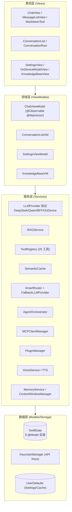
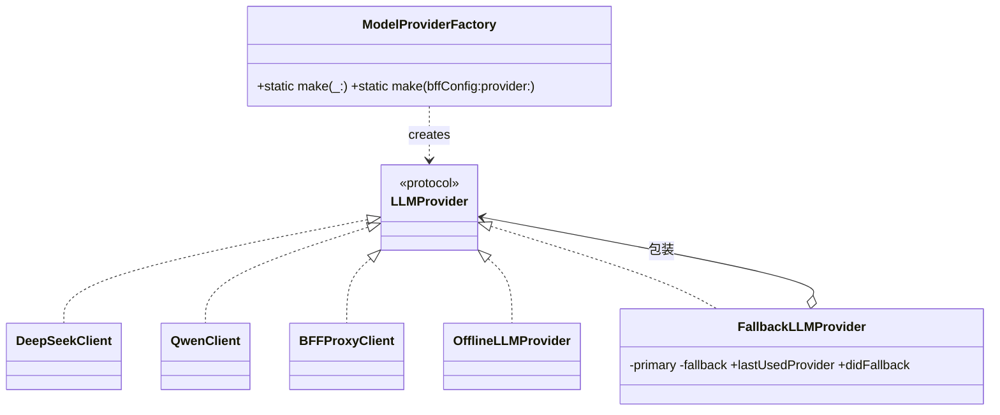
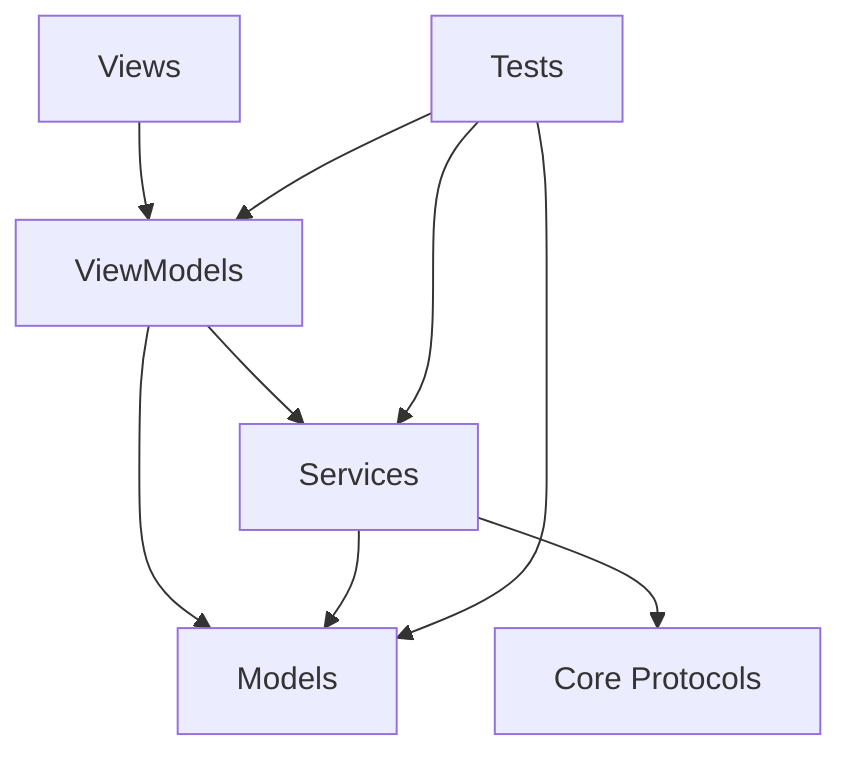
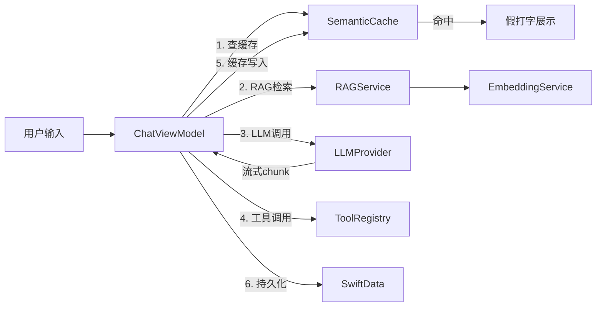
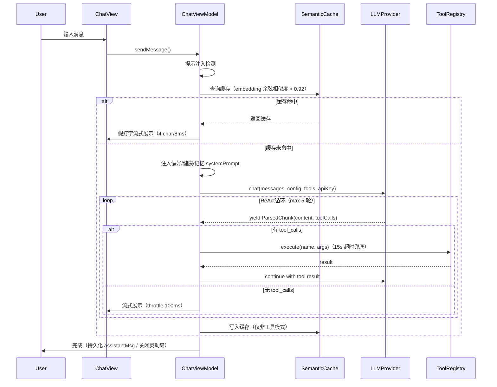
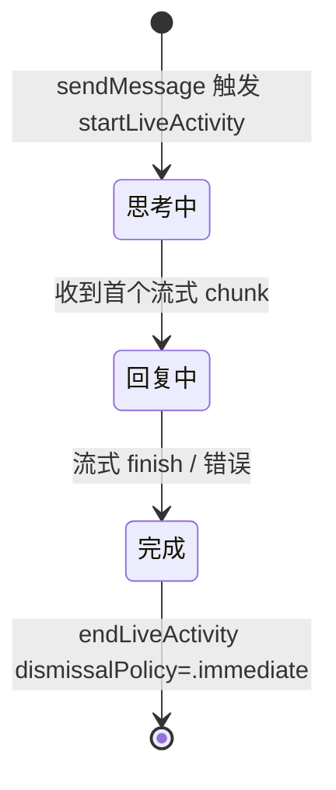

# Aether Code Wiki

> 本文档为 Aether 项目的结构化代码 Wiki，基于源码与现有架构文档整理，覆盖项目整体架构、模块职责、关键类与函数说明、依赖关系及运行方式等关键信息。
> 文中文件引用均使用可点击的 `file:///` 链接，便于在 IDE 中跳转。

---

## 目录

1. [项目概述](#1-项目概述)
2. [项目整体架构](#2-项目整体架构)
3. [目录结构](#3-目录结构)
4. [核心模块详解](#4-核心模块详解)
   - [4.1 App 入口层](#41-app-入口层)
   - [4.2 Core 核心层](#42-core-核心层)
   - [4.3 Models 数据模型层](#43-models-数据模型层)
   - [4.4 Services 服务层](#44-services-服务层)
   - [4.5 ViewModels 领域层](#45-viewmodels-领域层)
   - [4.6 Views 表现层](#46-views-表现层)
   - [4.7 平台扩展](#47-平台扩展watchwidgetmenubar)
5. [关键类与函数说明](#5-关键类与函数说明)
6. [依赖关系](#6-依赖关系)
7. [核心数据流](#7-核心数据流)
8. [项目运行方式](#8-项目运行方式)
9. [测试与持续集成](#9-测试与持续集成)
10. [关键设计决策](#10-关键设计决策)
11. [文档导航索引](#11-文档导航索引)

---

## 1. 项目概述

**Aether（以太）** 是一款 **AI Native 多平台原生应用**（iOS / iPad / macOS / watchOS），基于 SwiftUI + 多 LLM Provider 构建，采用「液态玻璃 + 深空主题」视觉语言。

### 核心能力

| 能力域 | 说明 |
|--------|------|
| 流式对话 | 基于 SSE 打字机效果，支持 DeepSeek / Qwen / BFF 代理 / 端侧 MLX 四种 Provider |
| ReAct 工具调用 | 14 个跨平台工具 + 11 个 macOS 独有工具，基于 function calling 循环执行（最大 5 轮，单工具超时 15s） |
| RAG 知识库 | 本地文档导入 → 分块 → 嵌入 → 余弦相似度 topK 检索 → `[1][2]` 编号注入 prompt |
| 语义缓存 | 基于 embedding 余弦相似度（阈值 0.92）匹配历史 query，命中跳过 LLM 请求 |
| 端侧推理 | MLX 离线模式，设备本地运行 Llama-3.2-1B-Instruct Q4_K_M 量化模型，断网自动切换 |
| 语音合成与识别 | SFSpeechRecognizer 实时语音输入，AVSpeechSynthesizer 朗读（TTS 音色可调节） |
| 健康洞察（iOS） | HealthKit 读取步数 / 心率 / 睡眠，生成中文洞察文本并持久化 |
| 灵动岛 Live Activity（iOS） | ActivityKit 状态机「思考中 → 回复中 → 完成」 |
| SmartRouter 智能路由 | 基于规则与历史成功率在多 Provider 间动态路由，失败自动 Fallback |
| Agent 编排 | 目标分解 → 子任务 DAG 调度 → 多角色协作（planner / executor / reviewer） |
| MCP 协议接入 | 接入外部 MCP Server，统一适配为本地 ToolProtocol |
| 插件系统 | 本地插件安装、权限沙箱、热更新 |
| 多语言支持 | 8 种语言（zh-Hans / zh-Hant / en / ja / ko / fr / de / es） |
| 多端协同 | Watch App / 桌面 Widget / DeepLink / App Group 共享 SwiftData |

### 技术栈

- **SwiftUI**（`@Observable` / `@Bindable` / `@FocusState` / NavigationSplitView）
- **SwiftData**（`@Model` 宏，9 个持久化实体）
- **MLX**（端侧推理，Llama-3.2-1B-Instruct Q4_K_M 量化）
- **AVFoundation** / **ActivityKit** / **BackgroundTasks** / **HealthKit** / **PDFKit** / **NLTokenizer** / **Network** / **Vision** / **EventKit** / **CoreSpotlight** / **AppIntents** / **WatchConnectivity**

### 环境要求

- Xcode 16+ / Swift 5.9+
- iOS Deployment Target 17.0+ / macOS 14.0+ / watchOS 10+
- Apple Silicon（M1+）用于端侧 MLX 推理
- DeepSeek API Key（云端模式，https://platform.deepseek.com 申请）
- App Group `group.com.aether.app`（Widget / Watch 共享 SwiftData）

---

## 2. 项目整体架构

Aether 采用 **MVVM + Service 四层分层架构**（表现层 / 领域层 / 服务层 / 数据层），依赖方向自上而下单向流动。



**分层职责概览**：

| 层级 | 职责 | 关键目录 |
|------|------|---------|
| 表现层 (Views) | SwiftUI 视图，6 个子模块，含 DesignSystem 设计系统 | [Aether/Views](file:///workspace/Aether/Views) / [Aether/DesignSystem](file:///workspace/Aether/DesignSystem) |
| 领域层 (ViewModels) | `@Observable` 状态管理 + 业务编排 | [Aether/ViewModels](file:///workspace/Aether/ViewModels) |
| 服务层 (Services) | 22 个子模块业务实现 | [Aether/Services](file:///workspace/Aether/Services) |
| 数据层 (Models/Storage) | SwiftData `@Model` + Keychain + UserDefaults | [Aether/Models](file:///workspace/Aether/Models) / [Aether/Services/Storage](file:///workspace/Aether/Services/Storage) |
| 核心层 (Core) | 协议、常量、扩展、配置模型 | [Aether/Core](file:///workspace/Aether/Core) |

---

## 3. 目录结构

```
Aether/                          # 主 App（iOS / iPad / macOS）
├── App/                         # App 入口
│   └── AetherApp.swift
├── AppIntents/                  # App Intents（Ask / NewConversation / SwitchConversation）
├── Core/                        # 核心协议、常量、扩展、配置模型
│   ├── Actors/
│   ├── Constants/               # APIConfig / ModelProvider
│   ├── Extensions/              # String+TokenCount
│   ├── Models/                  # BFFConfig / OnDeviceConfig / MCPConfig / AgentTask 等
│   └── Protocols/               # LLMProvider / ToolProtocol
├── DesignSystem/                # 设计系统 Token（颜色 / 字体 / 间距 / 主题）
├── Models/                      # SwiftData @Model（9 实体）
├── Resources/                   # Assets / Info.plist / Localizable.xcstrings / PrivacyInfo
├── Services/                    # 服务层（22 子模块）
│   ├── Agent/                   # Agent 编排（Orchestrator / Role / GoalDecomposer）
│   ├── Auth/                    # KeychainManager
│   ├── Cache/                   # SemanticCache
│   ├── Connectivity/            # WatchConnectivityService
│   ├── Crash/                   # CrashReportService
│   ├── Feedback/                # FeedbackService
│   ├── Health/                  # HealthKitService / HealthInsightGenerator
│   ├── Intents/                 # IntentChatService
│   ├── Language/                # LanguageManager
│   ├── LLM/                     # DeepSeek/Qwen/BFF/Fallback/Factory/RateLimiter/SSEParser
│   ├── MCP/                     # MCPClient / Manager / ToolAdapter / Prompt / Resource
│   ├── Memory/                  # MemoryService / ContextWindowManager / SemanticMemoryStore
│   ├── Network/                 # NetworkMonitor
│   ├── OnDevice/                # MLXInferenceEngine / OfflineLLMProvider / Downloader
│   ├── Performance/             # PerformanceMonitor
│   ├── Plugin/                  # PluginManager / PluginSandbox / PluginToolAdapter
│   ├── RAG/                     # RAGService / EmbeddingService / DocumentChunker / PDFExtractor
│   ├── RemoteConfig/            # RemoteConfigService
│   ├── Routing/                 # SmartRouter
│   ├── Search/                  # SpotlightIndexer
│   ├── Security/                # PromptInjectionDetector
│   ├── Storage/                 # ChatStorage
│   ├── Telemetry/               # TelemetryService / LogUploader / TelemetrySanitizer
│   ├── Theme/                   # ThemeManager
│   ├── Tools/                   # ToolRegistry + 25 个工具实现
│   └── Voice/                   # VoiceService / TTSConfig / TTSVoiceCatalog
├── ViewModels/                  # 4 个 ViewModel
└── Views/                       # 6 个视图子模块（Chat / Components / Conversation / OnDevice / RAG / Settings）

AetherWatch/                     # watchOS App
AetherWidgets/                   # Widget Extension（QuickChat / HealthInsight / RecentConversations）
CloudflareWorkers/               # BFF 代理层（worker.js + wrangler.toml）
AetherTests/                     # 单元测试（约 130+ 文件）
AetherUITests/                   # UI 测试
Shared/                          # 跨 target 共享（AppGroupContainer）
doc/                             # 项目文档
scripts/                         # 构建/CI 脚本
```

---

## 4. 核心模块详解

### 4.1 App 入口层

#### [AetherApp.swift](file:///workspace/Aether/App/AetherApp.swift)

App 主入口，职责：

1. **配置 SwiftData ModelContainer**：使用 App Group 共享存储（`group.com.aether.app`），注册 9 个 `@Model` 实体。容器构建失败时回退到内存存储避免启动崩溃。
2. **注册后台任务**（iOS）：`com.aether.daily-refresh`（每日刷新）/ `com.aether.telemetry-upload`（遥测上报，每 60 分钟）/ `com.aether.health-insight`（健康洞察，每日 09:00）。`register` 在 `init` 中执行（系统要求），`schedule` 延迟到首次进入后台。
3. **macOS 菜单栏命令**：⌘N 新建对话 / ⌘K 搜索会话 / ⌘⇧F 聚焦搜索 / ⌘, 设置 / ⌘⇧N 新建窗口，通过 `NotificationCenter` 广播到 ChatView。
4. **macOS 多窗口与 MenuBarExtra**：`WindowGroup(for: UUID.self)` 支持按会话 ID 打开独立窗口；`MenuBarExtra` 提供常驻菜单栏快捷入口。
5. **崩溃监控初始化**：生成匿名用户标识，初始化 `CrashReportService`。
6. **UITest 数据隔离**：检测 `UITEST_RESET_DATA` 启动参数，调用 `wipeAllDataForUITest()` 清空 SwiftData。
7. **主题与预热**：默认深色模式；首屏出现后预热语音引擎（后台线程加载 `AVSpeechSynthesisVoice.speechVoices()`），延迟 1 秒拉取远程配置。

```swift
@main
struct AetherApp: App {
    static let sharedModelContainer: ModelContainer = { ... }()  // 预构建容器
    init() { /* 注册 BGTask / 初始化崩溃监控 / 迁移 BFF Token */ }
    var body: some Scene { WindowGroup { RootView() } ... }
}
```

**`RootView`**：在 `ChatView` 之上叠加品牌 Splash（开屏展示后淡出），监听 `scenePhase` 在首次进入后台时调度 BGTask 与激活 WatchConnectivity，启动时从 `UserPreference` 同步主题到 `ThemeManager`。

#### AppIntents

三个 Intent 集成 Shortcuts / Spotlight / Siri：

| Intent | 文件 | 职责 |
|--------|------|------|
| `AskAetherIntent` | [AskAetherIntent.swift](file:///workspace/Aether/AppIntents/AskAetherIntent.swift) | 直接提问，返回完整回复 |
| `NewConversationIntent` | [NewConversationIntent.swift](file:///workspace/Aether/AppIntents/NewConversationIntent.swift) | 创建新会话 |
| `SwitchConversationIntent` | [SwitchConversationIntent.swift](file:///workspace/Aether/AppIntents/SwitchConversationIntent.swift) | 切换到指定会话 |

路由由 [IntentChatService.swift](file:///workspace/Aether/Services/Intents/IntentChatService.swift) 处理。

---

### 4.2 Core 核心层

Core 层承载协议契约、常量与配置数据模型。

#### 协议

**[LLMProvider.swift](file:///workspace/Aether/Core/Protocols/LLMProvider.swift)** —— LLM 客户端抽象协议：

```swift
protocol LLMProvider: Sendable {
    func chat(messages: [APIMessage], config: ChatConfig, apiKey: String) -> AsyncStream<String>
    func chat(messages: [APIMessage], config: ChatConfig, tools: [ToolDef], apiKey: String) -> AsyncStream<ParsedChunk>
    func embed(texts: [String], apiKey: String) async throws -> [[Float]]
}
```

关联数据结构：`APIMessage`（system/user/assistant/tool 角色，含 images/toolCallId/toolName/toolCalls）、`ToolCallParam`、`FunctionCall`。

**[ToolProtocol.swift](file:///workspace/Aether/Core/Protocols/ToolProtocol.swift)** —— 工具抽象协议：

```swift
protocol ToolProtocol: Sendable {
    var definition: ToolDefinition { get }
    func execute(arguments: [String: Any]) async throws -> String
}
```

`ToolDefinition`（name + description + JSON Schema parameters）暴露给 LLM。

#### 常量

**[APIConfig.swift](file:///workspace/Aether/Core/Constants/APIConfig.swift)**：DeepSeek 端点 URL（`https://api.deepseek.com`）、chat/embedding 路径、默认模型名（`deepseek-chat` / `deepseek-embedding`）、遥测上传端点占位符。`ChatConfig` 结构含 model / systemPrompt / maxTokens(2048) / temperature(0.7)。

**[ModelProvider.swift](file:///workspace/Aether/Core/Constants/ModelProvider.swift)**：LLM 供应商抽象 enum（`.deepseek` / `.qwen` / `.onDevice`），承载：

| 属性 | DeepSeek | Qwen | OnDevice |
|------|----------|------|----------|
| `baseURL` | `https://api.deepseek.com` | `https://dashscope.aliyuncs.com/compatible-mode/v1` | `""`（不走 HTTP） |
| `defaultChatModel` | `deepseek-chat` | `qwen-plus` | `llama-3.2-1b-instruct` |
| `defaultReasonerModel` | `deepseek-reasoner` | `qwq-32b` | `llama-3.2-1b-instruct` |
| `defaultEmbeddingModel` | `deepseek-embedding` | `text-embedding-v3` | `ondevice-hash-embedding` |
| `keychainAccount` | `apikey-deepseek` | `apikey-qwen` | `apikey-ondevice` |
| `fallback` | `.qwen` | `.deepseek` | `.deepseek` |

#### 配置模型（Core/Models）

| 文件 | 职责 |
|------|------|
| [BFFConfig.swift](file:///workspace/Aether/Core/Models/BFFConfig.swift) | BFF 代理配置（enabled / endpointURL / userToken / 限流参数），UserDefaults 持久化 |
| [OnDeviceConfig.swift](file:///workspace/Aether/Core/Models/OnDeviceConfig.swift) | 端侧推理配置（enabled / modelPath / autoSwitchOnNetworkLoss / 采样参数 / 下载 URL + SHA256），UserDefaults 持久化 |
| [OnDeviceError.swift](file:///workspace/Aether/Core/Models/OnDeviceError.swift) | 端侧推理错误枚举（insufficientMemory / modelNotFound / sha256Mismatch 等） |
| [MCPConfig.swift](file:///workspace/Aether/Core/Models/MCPConfig.swift) | MCP Server 配置（stdio / sse 传输） |
| [AgentTask.swift](file:///workspace/Aether/Core/Models/AgentTask.swift) | Agent 任务实体（goal / subTasks / status / DAG 依赖） |
| [PluginManifest.swift](file:///workspace/Aether/Core/Models/PluginManifest.swift) | 插件清单（tools / permissions / entryPoint） |
| [PluginPermission.swift](file:///workspace/Aether/Core/Models/PluginPermission.swift) | 插件权限声明（network / fileSystem / clipboard 等） |
| [OnDeviceModelCatalog.swift](file:///workspace/Aether/Core/Models/OnDeviceModelCatalog.swift) | 端侧模型目录 |

---

### 4.3 Models 数据模型层

SwiftData `@Model` 持久化实体（共 9 个），均在 [Aether/Models](file:///workspace/Aether/Models) 目录：

| 实体 | 文件 | 职责 |
|------|------|------|
| `Conversation` | [Conversation.swift](file:///workspace/Aether/Models/Conversation.swift) | 会话（title / systemPrompt / isPinned / order / parentConversationID 用于分叉 / cascade messages），含 `userActivity` 支持 Handoff |
| `UserPreference` | [Conversation.swift](file:///workspace/Aether/Models/Conversation.swift) | 用户偏好（preferredTone / preferredTools / customFact / aiPersona / themeName / bubbleStyle / fontSize / lineHeight） |
| `ChatMessage` | [ChatMessage.swift](file:///workspace/Aether/Models/ChatMessage.swift) | 聊天消息（role / content / imageData / attachedImage / toolCallData / toolCallId / toolName），含 `toAPIMessage()` 转换 |
| `DocumentChunk` | [DocumentChunk.swift](file:///workspace/Aether/Models/DocumentChunk.swift) | RAG 文档分块（content / source / embedding / chunkIndex / weight，weight 由反馈闭环调整） |
| `MessageFeedback` | [MessageFeedback.swift](file:///workspace/Aether/Models/MessageFeedback.swift) | 用户反馈（messageId / rating / comment / createdAt） |
| `HealthInsight` | [HealthInsight.swift](file:///workspace/Aether/Models/HealthInsight.swift) | 健康洞察（type / summary / detail / generatedAt / relatedDateRange） |
| `RemoteConfig` | [RemoteConfig.swift](file:///workspace/Aether/Models/RemoteConfig.swift) | 远程配置缓存（featureFlags / rateLimits / updatedAt） |
| `AgentTask` | [Core/Models/AgentTask.swift](file:///workspace/Aether/Core/Models/AgentTask.swift) | Agent 任务（goal / subTasks JSON / status / DAG 依赖调度） |
| `Memory` | [Memory.swift](file:///workspace/Aether/Models/Memory.swift) | 长期记忆（content / embedding / category / importance / sourceConversationID） |

**非 `@Model` 数据结构**（[ChatChunk.swift](file:///workspace/Aether/Models/ChatChunk.swift)）：

- `ChatChunk`：SSE 响应解码结构（choices/delta/content/tool_calls/usage）
- `ParsedChunk`：SSEParser 解析结果（content + 累积 toolCalls）
- `AccumulatedToolCall`：跨 chunk 累积的工具调用
- `ChatRequestBody` / `ToolDef` / `AnyCodable`：请求体序列化结构
- `EmbeddingResponse`：嵌入响应
- `LLMError`：统一错误枚举（networkError / apiKeyMissing / apiKeyInvalid / apiError / timeout / rateLimited / llmErrorOccurred），含 `userMessage` 与 `fromHTTPStatus` 映射

---

### 4.4 Services 服务层

服务层是项目核心，包含 22 个子模块。按业务域分组：

#### 4.4.1 AI / LLM 域

##### LLM 子模块（[Services/LLM](file:///workspace/Aether/Services/LLM)）

**Provider 实现类**：

| 类 | 文件 | endpoint | 说明 |
|----|------|----------|------|
| `DeepSeekClient` | [DeepSeekClient.swift](file:///workspace/Aether/Services/LLM/DeepSeekClient.swift) | `https://api.deepseek.com/chat/completions` | `nonisolated final`，DeepSeek 直连，`Authorization: Bearer <key>`；多模态手动构造 payload |
| `QwenClient` | [QwenClient.swift](file:///workspace/Aether/Services/LLM/QwenClient.swift) | DashScope OpenAI 兼容端点 | 阿里云百炼 |
| `BFFProxyClient` | [BFFProxyClient.swift](file:///workspace/Aether/Services/LLM/BFFProxyClient.swift) | `<endpointURL>/v1/chat/completions` | Cloudflare Workers 中转，header 带 `X-BFF-Token` / `X-Provider`，不带 Authorization |
| `OfflineLLMProvider` | [OfflineLLMProvider.swift](file:///workspace/Aether/Services/OnDevice/OfflineLLMProvider.swift) | 本地 MLX | 端侧推理，断网可用，`buildLlama3Prompt` 拼接 prompt |
| `FallbackLLMProvider` | [FallbackLLMProvider.swift](file:///workspace/Aether/Services/LLM/FallbackLLMProvider.swift) | 包装 primary + fallback | 装饰器模式，primary 失败自动切 fallback，`embed` 路径不降级 |

**辅助类**：

| 类 | 文件 | 职责 |
|----|------|------|
| `ModelProviderFactory` | [ModelProviderFactory.swift](file:///workspace/Aether/Services/LLM/ModelProviderFactory.swift) | 静态工厂，`make(_:)` 创建直连 client，`make(bffConfig:provider:)` 在 BFF 启用时返回 BFFProxyClient |
| `SSEParser` | [SSEParser.swift](file:///workspace/Aether/Services/LLM/SSEParser.swift) | SSE 流解析，`parseChunk` 解析单行，`parseWithToolAccumulation` 跨 chunk 累积 tool_calls |
| `RateLimiter` | [RateLimiter.swift](file:///workspace/Aether/Services/LLM/RateLimiter.swift) | 客户端令牌桶限流，按 `BFFConfig.chatRateLimitPerMin` / `embedRateLimitPerMin` 控制 |

**Provider 关系**：



##### RAG 子模块（[Services/RAG](file:///workspace/Aether/Services/RAG)）

| 类 | 文件 | 职责 |
|----|------|------|
| `RAGService` | [RAGService.swift](file:///workspace/Aether/Services/RAG/RAGService.swift) | `@MainActor`，`indexDocument` 索引、`retrieve` topK 检索（得分 = cosine × chunk.weight）、`buildAugmentedContext` 构建带 `[1][2]` 编号的 prompt 并复用 queryEmbedding |
| `EmbeddingService` | [EmbeddingService.swift](file:///workspace/Aether/Services/RAG/EmbeddingService.swift) | 封装 `LLMProvider.embed`，`embedBatch` 按 batchSize=10 分片；`resolveEmbedding(for:)` 在 DeepSeek 无 embedding 时降级到 Qwen |
| `DocumentChunker` | [DocumentChunker.swift](file:///workspace/Aether/Services/RAG/DocumentChunker.swift) | 基于 `NLTokenizer(unit: .sentence)` 按句切分，maxChars=2048，overlap=256 |
| `PDFExtractor` | [PDFExtractor.swift](file:///workspace/Aether/Services/RAG/PDFExtractor.swift) | 基于 PDFKit 提取 PDF 全文，损坏/无文本层返回 nil |

##### Cache 子模块

[SemanticCache.swift](file:///workspace/Aether/Services/Cache/SemanticCache.swift)：`@MainActor` 语义缓存，基于 embedding 余弦相似度（阈值 0.92）匹配历史 query，FIFO 容量 100。

```swift
func get(query: String, embedding: [Float]) -> String?   // 余弦相似度 > 0.92 命中
func set(query: String, embedding: [Float], response: String)  // 容量满时 FIFO 移除最早项
```

##### Routing 子模块

[SmartRouter.swift](file:///workspace/Aether/Services/Routing/SmartRouter.swift)：`static route(input:toolsEnabled:hasImage:) -> String`，返回模型名（`deepseek-chat` / `deepseek-reasoner`）。规则：工具或图片启用时强制 `deepseek-chat`（reasoner 对 function calling 不稳定）；长文本（≥50 字符）或推理关键词触发 `deepseek-reasoner`。

##### Voice 子模块（[Services/Voice](file:///workspace/Aether/Services/Voice)）

| 类 | 文件 | 职责 |
|----|------|------|
| `VoiceService` | [VoiceService.swift](file:///workspace/Aether/Services/Voice/VoiceService.swift) | `@MainActor`，`AVAudioSession` + `SFSpeechRecognizer` 录音识别 + `AVSpeechSynthesizer` 朗读，朗读前应用 `TTSConfig` |
| `TTSConfig` | [TTSConfig.swift](file:///workspace/Aether/Services/Voice/TTSConfig.swift) | TTS 配置（voiceID / rate / pitch / volume），Codable + Sendable，UserDefaults 持久化 |
| `TTSVoiceCatalog` | [TTSVoiceCatalog.swift](file:///workspace/Aether/Services/Voice/TTSVoiceCatalog.swift) | 系统音色目录，按语言分组供 Picker 展示 |

#### 4.4.2 本地能力域

##### OnDevice 子模块（[Services/OnDevice](file:///workspace/Aether/Services/OnDevice)）

| 类 | 文件 | 职责 |
|----|------|------|
| `MLXInferenceEngine` | [MLXInferenceEngine.swift](file:///workspace/Aether/Services/OnDevice/MLXInferenceEngine.swift) | MLX 推理引擎，`loadModel`（内存检查 + SHA256 + MLX 加载）、`generate` 流式生成 token、`unloadModel` 释放 |
| `OnDeviceModelDownloader` | [OnDeviceModelDownloader.swift](file:///workspace/Aether/Services/OnDevice/OnDeviceModelDownloader.swift) | 从 HuggingFace CDN 下载 + SHA256 校验 + 断点续传 |
| `OfflineLLMProvider` | [OfflineLLMProvider.swift](file:///workspace/Aether/Services/OnDevice/OfflineLLMProvider.swift) | 实现 `LLMProvider`，包装 MLXInferenceEngine，按 Llama-3 template 拼接 prompt |

##### Auth 子模块

[KeychainManager.swift](file:///workspace/Aether/Services/Auth/KeychainManager.swift)：Keychain 单例，封装 API Key 的 save / load / delete，按 `ModelProvider.keychainAccount` 隔离存储。支持旧 API（`saveAPIKey(_:)` 等价 `.deepseek`）与多 provider 命名空间 API。

##### Storage 子模块

[ChatStorage.swift](file:///workspace/Aether/Services/Storage/ChatStorage.swift)：`@MainActor` SwiftData 持久化服务，封装 Conversation / ChatMessage / UserPreference 的 CRUD。关键方法：

```swift
func createConversation(title:systemPrompt:) -> Conversation
func deleteConversation(_:) / renameConversation(_:to:) / togglePin(_:)
func addMessage(to:role:content:imageData:) -> ChatMessage
func fetchConversations() -> [Conversation]  // isPinned 优先 + order + createdAt 降序
func cleanupEmptyConversations()  // 批量清理空会话
func forkConversation(from:at:) throws -> Conversation  // 分叉
func fetchPreference() -> UserPreference / savePreference(...)
func saveFeedback(messageId:isPositive:citations:)  // 反馈 + chunk 权重调整
```

##### Health 子模块（[Services/Health](file:///workspace/Aether/Services/Health)，iOS only）

| 类 | 文件 | 职责 |
|----|------|------|
| `HealthKitService` | [HealthKitService.swift](file:///workspace/Aether/Services/Health/HealthKitService.swift) | HealthKit 读取（步数 / 心率 / 睡眠 / 活动能量），`fetchDailySummary()` 聚合最近 1 天 |
| `HealthInsightGenerator` | [HealthInsightGenerator.swift](file:///workspace/Aether/Services/Health/HealthInsightGenerator.swift) | 调 LLM 生成中文洞察文本，持久化到 `HealthInsight` @Model，`sendInsightNotification` 推送本地通知 |

#### 4.4.3 Agent / MCP / Plugin / Memory 域

##### Agent 子模块（[Services/Agent](file:///workspace/Aether/Services/Agent)）

目标分解与多角色编排引擎：

| 类 | 文件 | 职责 |
|----|------|------|
| `AgentOrchestrator` | [AgentOrchestrator.swift](file:///workspace/Aether/Services/Agent/AgentOrchestrator.swift) | `@MainActor` 编排引擎，启动时自动恢复 inProgress 任务；`startTask` / `executeNext` / `executeAll` / `cancel` / `resumeTask`；按 DAG 顺序执行子任务（工具优先，否则 LLM），可选 reviewer 审查 + 最多 3 次重试，每步持久化支持断点续跑 |
| `AgentRole` | [AgentRole.swift](file:///workspace/Aether/Services/Agent/AgentRole.swift) | enum，planner / executor / reviewer 三角色，各自带 systemPrompt |
| `GoalDecomposer` | [GoalDecomposer.swift](file:///workspace/Aether/Services/Agent/GoalDecomposer.swift) | 调 LLM 把目标分解为 3-7 个子任务，返回 JSON 数组，支持 `[Int]` 索引依赖→UUID 映射的容错解析 |

##### MCP 子模块（[Services/MCP](file:///workspace/Aether/Services/MCP)）

Model Context Protocol 接入层：

| 类 | 文件 | 职责 |
|----|------|------|
| `MCPClient` | [MCPClient.swift](file:///workspace/Aether/Services/MCP/MCPClient.swift) | actor，JSON-RPC 2.0 客户端，封装 `initialize` 握手、请求/响应 id 匹配与超时取消 |
| `MCPClientManager` | [MCPClientManager.swift](file:///workspace/Aether/Services/MCP/MCPClientManager.swift) | `@Observable @MainActor`，维护 serverID→client 映射，连接成功后自动将 MCP 工具经 `MCPToolAdapter` 注册到 `ToolRegistry` |
| `MCPToolAdapter` | [MCPToolAdapter.swift](file:///workspace/Aether/Services/MCP/MCPToolAdapter.swift) | 把 `MCPTool` 映射为 `ToolDefinition`，`execute` 委托 client.callTool |
| `MCPPromptService` / `MCPResourceService` | [MCPPromptService.swift](file:///workspace/Aether/Services/MCP/MCPPromptService.swift) / [MCPResourceService.swift](file:///workspace/Aether/Services/MCP/MCPResourceService.swift) | 聚合多 Server 的 prompts / resources |

传输层支持 `StdioTransport`（macOS Process+Pipe）与 `SSETransport`（URLSession）。

##### Plugin 子模块（[Services/Plugin](file:///workspace/Aether/Services/Plugin)）

本地插件管理与沙箱：

| 类 | 文件 | 职责 |
|----|------|------|
| `PluginManager` | [PluginManager.swift](file:///workspace/Aether/Services/Plugin/PluginManager.swift) | `@Observable @MainActor`，插件安装/卸载、工具加载/卸载（经 `PluginToolAdapter` 注册到 `ToolRegistry`）、版本管理与热更新 |
| `PluginSandbox` | [PluginSandbox.swift](file:///workspace/Aether/Services/Plugin/PluginSandbox.swift) | 基于 manifest.permissions 的权限校验，固定资源限制（30s 超时、50MB 内存） |
| `PluginToolAdapter` | [PluginToolAdapter.swift](file:///workspace/Aether/Services/Plugin/PluginToolAdapter.swift) | 把 `PluginToolDef` 映射为 `ToolDefinition`，`execute` 委托插件入口点 |

##### Memory 子模块（[Services/Memory](file:///workspace/Aether/Services/Memory)）

长期记忆与上下文压缩：

| 类 | 文件 | 职责 |
|----|------|------|
| `MemoryService` | [MemoryService.swift](file:///workspace/Aether/Services/Memory/MemoryService.swift) | `@MainActor`，记忆 CRUD + 语义检索（embedding 余弦相似度）+ 关键词搜索 |
| `SemanticMemoryStore` | [SemanticMemoryStore.swift](file:///workspace/Aether/Services/Memory/SemanticMemoryStore.swift) | 封装 `MemoryService.recall`，输出可注入 systemPrompt 的格式化文本块（`【相关记忆】` 编号列表） |
| `ContextWindowManager` | [ContextWindowManager.swift](file:///workspace/Aether/Services/Memory/ContextWindowManager.swift) | 上下文压缩器，超 token 上限时保留近期消息（70% 预算）+ 重要消息 + 旧消息 LLM 摘要 |
| `PreferenceExtractor` | [PreferenceExtractor.swift](file:///workspace/Aether/Services/Memory/PreferenceExtractor.swift) | 调 LLM 从对话历史提取用户偏好（tone/tool/fact/persona） |

#### 4.4.4 系统平台域

##### Tools 子模块（[Services/Tools](file:///workspace/Aether/Services/Tools)）

[ToolRegistry.swift](file:///workspace/Aether/Services/Tools/ToolRegistry.swift)：`@MainActor` 单例工具注册中心，初始化时按平台条件注册 25 个工具（14 跨平台 + 11 macOS 独有）。关键能力：

- **启用状态管理**：`defaultDisabledTools`（高危工具默认关闭：`run_terminal_command` / `run_applescript` / `control_safari` / `create_shortcut` / `simulate_input`），UserDefaults 持久化
- **敏感工具授权**：`sensitiveTools` 集合需 `ToolAuthorization` 显式授权
- **审计日志**：`ToolAuditLogger` 记录每次工具调用

```swift
static let shared: ToolRegistry
func register(tool:) / unregister(name:) / getTool(named:) -> ToolProtocol?
func execute(name:arguments:) async throws -> String  // 未注册/已禁用抛 NSError
var availableToolDefs: [ToolDef]  // 仅已启用工具，告知 LLM
func isEnabled(name:) -> Bool / setEnabled(name:value:)
func requiresAuthorization(name:) -> Bool
```

**工具清单**：

| 分类 | 工具 |
|------|------|
| 基础（4） | `AlarmTool` / `ReminderTool` / `DateTimeTool` / `CalculatorTool` |
| 跨平台（10） | `LocationTool` / `DeviceInfoTool` / `ReadClipboardTool` / `WriteClipboardTool` / `OpenURLTool` / `ContactsTool` / `WeatherTool` / `RunShortcutTool` / `ListShortcutsTool` / `CreateShortcutTool` |
| macOS 独有（11） | `AppleScriptTool` / `ScreenshotTool` / `OCRTool` / `TerminalCommandTool` / `WindowManagementTool` / `AppManagementTool` / `FileOperationTool` / `FinderTool` / `SafariControlTool` / `SystemControlTool` / `InputAutomationTool` |

`DateTimeTool` / `CalculatorTool` / `NotificationService` 内联在 ToolRegistry.swift 中。

##### 其他系统服务

| 子模块 | 文件 | 职责 |
|--------|------|------|
| Network | [NetworkMonitor.swift](file:///workspace/Aether/Services/Network/NetworkMonitor.swift) | `NWPathMonitor` 实时检测网络状态，`statusStream()` 返回 `AsyncStream<NetworkStatus>`，触发 OnDevice 自动切换 |
| Connectivity | [WatchConnectivityService.swift](file:///workspace/Aether/Services/Connectivity/WatchConnectivityService.swift) | WatchConnectivity 双向通信（iOS only） |
| Intents | [IntentChatService.swift](file:///workspace/Aether/Services/Intents/IntentChatService.swift) | App Intents 路由，`ask(query:)` 累积流式 chunk 返回完整回复 |
| Search | [SpotlightIndexer.swift](file:///workspace/Aether/Services/Search/SpotlightIndexer.swift) | 为 Conversation 创建/更新 `CSSearchableItem` |
| Language | [LanguageManager.swift](file:///workspace/Aether/Services/Language/LanguageManager.swift) | 多语言切换，写入 `AppleLanguages` UserDefaults |
| Theme | [ThemeManager.swift](file:///workspace/Aether/Services/Theme/ThemeManager.swift) | `@Observable` 主题管理（deepSpace / dawn / aurora） |
| Security | [PromptInjectionDetector.swift](file:///workspace/Aether/Services/Security/PromptInjectionDetector.swift) | 提示注入检测，`isSuspicious` + `reason` |

#### 4.4.5 工程 / 运维域

| 子模块 | 文件 | 职责 |
|--------|------|------|
| Crash | [CrashReportService.swift](file:///workspace/Aether/Services/Crash/CrashReportService.swift) | 捕获未捕获异常与信号崩溃，落盘后下次启动上报 |
| Feedback | [FeedbackService.swift](file:///workspace/Aether/Services/Feedback/FeedbackService.swift) | 用户反馈/投诉，写入 `MessageFeedback` @Model，构造 mailto URL |
| RemoteConfig | [RemoteConfigService.swift](file:///workspace/Aether/Services/RemoteConfig/RemoteConfigService.swift) | 拉取远程 featureFlags / rateLimits，缓存到 `RemoteConfig` @Model |
| Telemetry | [TelemetryService.swift](file:///workspace/Aether/Services/Telemetry/TelemetryService.swift) / [LogUploader.swift](file:///workspace/Aether/Services/Telemetry/LogUploader.swift) / [TelemetrySanitizer.swift](file:///workspace/Aether/Services/Telemetry/TelemetrySanitizer.swift) | 遥测采集（环形缓冲上限 1000）+ 脱敏 + 批量上传 |
| Performance | [PerformanceMonitor.swift](file:///workspace/Aether/Services/Performance/PerformanceMonitor.swift) | 首屏渲染 / 流式首字 / 工具执行耗时记录 |

---

### 4.5 ViewModels 领域层

[Aether/ViewModels](file:///workspace/Aether/ViewModels) 目录下 4 个 `@Observable @MainActor` ViewModel：

#### [ChatViewModel.swift](file:///workspace/Aether/ViewModels/ChatViewModel.swift) —— 核心 ViewModel

管理消息列表 / 流式输出 / 工具调用 / RAG 检索 / 语音 / 灵动岛，编排 ReAct 循环与缓存读写。

**关键状态字段**：

```swift
var messages: [ChatMessage]              // 当前会话消息列表
var streamingText: String                // 当前流式输出文本（实时更新）
var isLoading: Bool                      // 是否正在等待/流式输出
var currentToolSteps: [ToolStep]         // ReAct 循环的工具步骤
var ragEnabled / toolsEnabled: Bool      // RAG / 工具开关
var selectedProvider: ModelProvider      // 当前 LLM 供应商
var fallbackProvider: ModelProvider?     // 备用供应商
var bffConfig: BFFConfig / onDeviceConfig: OnDeviceConfig / ttsConfig: TTSConfig
var currentCitations: [DocumentChunk]    // RAG 引用分块
var lastDebugInfo: DebugInfo?            // 调试信息
```

**关键方法**：

| 方法 | 职责 |
|------|------|
| `sendMessage(in:modelContext:)` | 发送消息，发送前检测提示注入，命中弹确认弹窗 |
| `processMessage(_:conversation:modelContext:)` | 消息处理主流程：UIT 短路 → 注入偏好/健康/记忆 systemPrompt → 计算 embedding → 缓存命中则跳过 ReAct → ReAct 循环 → 缓存写入 |
| `resendMessage(content:in:modelContext:)` | 重新提问 |
| `regenerateResponse(assistantMessage:in:modelContext:)` | 重新生成最后一条 AI 回复 |
| `branch(from:in:modelContext:)` | 从指定消息处分叉创建新会话 |
| `makeLLMProvider()` | 按 selectedProvider / fallbackProvider / bffConfig 构造 LLMProvider（Fallback 装饰 / BFF 代理 / 工具降级云端） |
| `effectiveProviderForRequest()` | 端侧不支持工具时降级到云端 fallback |
| `switchToOnDevice()` / `switchToOriginalProvider()` | 断网/联网自动切换 |
| `toggleVoiceInput()` / `toggleSpeak(messageId:content:)` | 语音输入/朗读切换 |
| `submitFeedback(...)` / `handleFeedback(...)` | 反馈闭环，触发 RAG chunk 权重调整 |
| `limitTokens(_:max:)` | token 上限截断（逆序保留） |
| `buildEffectiveSystemPrompt(base:preference:)` | 拼接 systemPrompt + 用户偏好 + AI 人设 |

**ReAct 循环核心**（`processMessage` 内）：

```swift
while loopCount < maxReActLoops {  // maxReActLoops = 5
    let stream = llmClient.chat(messages:apiMessages, config:chatConfig, tools:tools, apiKey:apiKey)
    for await chunk in stream {
        streamingText = fullResponse + chunkContent  // throttle 100ms 更新 UI
        if let calls = chunk.toolCalls { finalToolCalls = calls }
    }
    if let toolCalls = finalToolCalls, !toolCalls.isEmpty {
        // 并发执行工具（withThrowingTaskGroup + 15s 超时兜底）
        // 工具结果作为 tool role 消息回传 LLM，continue 下一轮
    } else { break }
}
```

#### 其他 ViewModel

| 文件 | 职责 |
|------|------|
| [ConversationListVM.swift](file:///workspace/Aether/ViewModels/ConversationListVM.swift) | 会话列表 CRUD、置顶排序、编辑模式（多选/全选/删除）、`cleanupEmptyConversations` |
| [KnowledgeBaseVM.swift](file:///workspace/Aether/ViewModels/KnowledgeBaseVM.swift) | 知识库文档索引与删除 |
| [SettingsViewModel.swift](file:///workspace/Aether/ViewModels/SettingsViewModel.swift) | API Key 管理（按 provider 隔离）、用户偏好、TTS/BFF/OnDevice/Health 配置读写；`migrateLegacyBFFConfigIfNeeded` 迁移 BFF Token 到 Keychain |

---

### 4.6 Views 表现层

[Aether/Views](file:///workspace/Aether/Views) 下 6 个子模块：

#### Chat 子模块（[Views/Chat](file:///workspace/Aether/Views/Chat)）

| 文件 | 职责 |
|------|------|
| [ChatView.swift](file:///workspace/Aether/Views/Chat/ChatView.swift) | 聊天主界面，监听菜单栏通知、Watch 消息、DeepLink |
| [ChatInputBar.swift](file:///workspace/Aether/Views/Chat/ChatInputBar.swift) | 输入栏（文本 + 图片附件 + 语音按钮） |
| [MessageListView.swift](file:///workspace/Aether/Views/Chat/MessageListView.swift) | 消息列表，流式实时刷新 |
| [MessageBubble.swift](file:///workspace/Aether/Views/Chat/MessageBubble.swift) | 消息气泡，长按 contextMenu（复制/重新提问/分叉/重新生成） |
| [MarkdownText.swift](file:///workspace/Aether/Views/Chat/MarkdownText.swift) | Markdown 富文本段落（NSCache 缓存 parseBlocks，countLimit=200） |
| [CodeBlockView.swift](file:///workspace/Aether/Views/Chat/CodeBlockView.swift) + [CodeSyntaxHighlighter.swift](file:///workspace/Aether/Views/Chat/CodeSyntaxHighlighter.swift) | 代码块渲染 + 语法高亮 + 复制按钮 |
| [MarkdownTableParser.swift](file:///workspace/Aether/Views/Chat/MarkdownTableParser.swift) + [MarkdownTableView.swift](file:///workspace/Aether/Views/Chat/MarkdownTableView.swift) | Markdown 表格解析与渲染 |
| [TaskListView.swift](file:///workspace/Aether/Views/Chat/TaskListView.swift) | 任务列表渲染（`- [ ]` / `- [x]`） |
| [HeadingView.swift](file:///workspace/Aether/Views/Chat/HeadingView.swift) | 标题分级（H1–H6） |
| [CitationCard.swift](file:///workspace/Aether/Views/Chat/CitationCard.swift) | RAG 引用卡片 |
| [StepCardView.swift](file:///workspace/Aether/Views/Chat/StepCardView.swift) | ReAct 步骤卡片（思维链） |
| [FeedbackBar.swift](file:///workspace/Aether/Views/Chat/FeedbackBar.swift) | 消息反馈条（like / dislike / 投诉） |
| [ErrorOverlay.swift](file:///workspace/Aether/Views/Chat/ErrorOverlay.swift) / [TypingIndicator.swift](file:///workspace/Aether/Views/Chat/TypingIndicator.swift) | 错误浮层 / 打字指示器 |

#### 其他视图子模块

| 子模块 | 关键文件 | 职责 |
|--------|---------|------|
| Components | [LaunchScreen.swift](file:///workspace/Aether/Views/Components/LaunchScreen.swift) / [BrandSplash.swift](file:///workspace/Aether/Views/Components/BrandSplash.swift) / [ToastView.swift](file:///workspace/Aether/Views/Components/ToastView.swift) / [SkeletonView.swift](file:///workspace/Aether/Views/Components/SkeletonView.swift) 等 | 通用组件 |
| Conversation | [ConversationList.swift](file:///workspace/Aether/Views/Conversation/ConversationList.swift) / [ConversationRow.swift](file:///workspace/Aether/Views/Conversation/ConversationRow.swift) / [ConversationTreeView.swift](file:///workspace/Aether/Views/Conversation/ConversationTreeView.swift) | 会话列表（含分叉树视图） |
| OnDevice | [OnDeviceModelView.swift](file:///workspace/Aether/Views/OnDevice/OnDeviceModelView.swift) | 端侧模型管理（下载进度 / SHA256 / 启用开关） |
| RAG | [KnowledgeBaseView.swift](file:///workspace/Aether/Views/RAG/KnowledgeBaseView.swift) / [DocumentPickerView.swift](file:///workspace/Aether/Views/RAG/DocumentPickerView.swift) | 知识库管理 + 文档选择器（`.fileImporter`） |
| Settings | [SettingsView.swift](file:///workspace/Aether/Views/Settings/SettingsView.swift) / [PresetPrompts.swift](file:///workspace/Aether/Views/Settings/PresetPrompts.swift) / [MCPSettingsView.swift](file:///workspace/Aether/Views/Settings/MCPSettingsView.swift) / [PluginSettingsView.swift](file:///workspace/Aether/Views/Settings/PluginSettingsView.swift) / [HealthSettingsView.swift](file:///workspace/Aether/Views/Settings/HealthSettingsView.swift) / [TTSVoicePickerView.swift](file:///workspace/Aether/Views/Settings/TTSVoicePickerView.swift) / [PrivacyPolicyView.swift](file:///workspace/Aether/Views/Settings/PrivacyPolicyView.swift) | 设置界面（NavigationSplitView 双栏布局） |

#### DesignSystem（[Aether/DesignSystem](file:///workspace/Aether/DesignSystem)）

设计系统 Token：[ColorTokens.swift](file:///workspace/Aether/DesignSystem/ColorTokens.swift) / [TypographyTokens.swift](file:///workspace/Aether/DesignSystem/TypographyTokens.swift) / [DesignTokens.swift](file:///workspace/Aether/DesignSystem/DesignTokens.swift) / [ThemeTokens.swift](file:///workspace/Aether/DesignSystem/ThemeTokens.swift) / [ResponsiveLayout.swift](file:///workspace/Aether/DesignSystem/ResponsiveLayout.swift) / [AetherIcons.swift](file:///workspace/Aether/DesignSystem/AetherIcons.swift) / [AetherIconRenderer.swift](file:///workspace/Aether/DesignSystem/AetherIconRenderer.swift)。

---

### 4.7 平台扩展（Watch / Widget / MenuBar）

#### [AetherWatch/](file:///workspace/AetherWatch) —— watchOS App

[WatchApp.swift](file:///workspace/AetherWatch/WatchApp.swift) 使用 `TabView` 三标签页（快速对话 / 健康洞察 / 设置）。通过 `WatchConnectivityService` 与 iOS 主 App 双向通信：`transferUserInfo` 推送健康洞察到 Watch；`sendQuickChat` 从 Watch 发送快捷对话。⚠️ 需在 Xcode 中手动创建 watchOS target。

#### [AetherWidgets/](file:///workspace/AetherWidgets) —— Widget Extension

三个 Widget 共用一个 target：

| Widget | 文件 | 职责 |
|--------|------|------|
| `QuickChatWidget` | [QuickChatWidget.swift](file:///workspace/AetherWidgets/QuickChatWidget.swift) | 桌面快捷提问，DeepLink `aether://ask?query=` |
| `HealthInsightWidget` | [HealthInsightWidget.swift](file:///workspace/AetherWidgets/HealthInsightWidget.swift) | 最新健康洞察摘要，App Group 共享 SwiftData |
| `RecentConversationsWidget` | [RecentConversationsWidget.swift](file:///workspace/AetherWidgets/RecentConversationsWidget.swift) | 最近会话列表，DeepLink `aether://conversation/<uuid>` |

技术栈：`TimelineProvider` + `AppIntentConfiguration`（iOS 17+ / macOS 14+）。

#### MenuBarExtra（macOS）

[MenuBarPanel.swift](file:///workspace/Aether/Views/MenuBarExtra/MenuBarPanel.swift)：macOS 菜单栏常驻面板，提供快捷输入与最近对话列表，点击通过 `openConversationFromMenuBar` 通知在主窗口打开。

#### DeepLink 支持

URL Scheme `aether://`：
- `aether://ask?query=<URL编码文本>`：打开主界面并自动发送
- `aether://conversation/<uuid>`：跳转指定会话

在 [AetherApp.swift](file:///workspace/Aether/App/AetherApp.swift) 中通过 `.onOpenURL` 处理。

#### App Group 共享 SwiftData

App Group identifier `group.com.aether.app`，主 App 与 Widget Extension 的 `ModelContainer` 均指向 App Group 容器目录下的同一 SQLite 数据库文件（`Aether.sqlite`），Widget 可直接读取主 App 写入的数据。配置在 `AetherApp.sharedModelConfiguration`。

---

## 5. 关键类与函数说明

### 5.1 核心协议 API

#### LLMProvider

```swift
// 纯文本流式 chat
func chat(messages: [APIMessage], config: ChatConfig, apiKey: String) -> AsyncStream<String>
// 带工具调用流式 chat
func chat(messages: [APIMessage], config: ChatConfig, tools: [ToolDef], apiKey: String) -> AsyncStream<ParsedChunk>
// 批量嵌入，HTTP 错误抛 LLMError
func embed(texts: [String], apiKey: String) async throws -> [[Float]]
```

#### ToolProtocol

```swift
var definition: ToolDefinition { get }
func execute(arguments: [String: Any]) async throws -> String
```

### 5.2 ChatViewModel 关键方法签名

```swift
func sendMessage(in conversation: Conversation, modelContext: ModelContext)
func processMessage(_ text: String, conversation: Conversation, modelContext: ModelContext) async
func resendMessage(content: String, in conversation: Conversation, modelContext: ModelContext)
func regenerateResponse(assistantMessage: ChatMessage, in conversation: Conversation, modelContext: ModelContext)
@discardableResult func branch(from fromMessage: ChatMessage, in conversation: Conversation, modelContext: ModelContext) -> Conversation?
func switchTo(conversation: Conversation)
func toggleVoiceInput() / toggleSpeak(messageId: UUID, content: String)
func handleFeedback(messageId: UUID, isPositive: Bool, modelContext: ModelContext)
func limitTokens(_ messages: [APIMessage], max: Int) -> [APIMessage]
func buildEffectiveSystemPrompt(base: String, preference: UserPreference) -> String
```

### 5.3 ToolRegistry 关键方法签名

```swift
static let shared: ToolRegistry
func register(tool: ToolProtocol) / unregister(name: String) / registerBatch(tools:)
func getTool(named name: String) -> ToolProtocol?
func execute(name: String, arguments: [String: Any]) async throws -> String
var allToolDefs: [ToolDef] / var availableToolDefs: [ToolDef]
func availableTools() -> [ToolDefinition] / var dangerousToolDefs: [ToolDefinition]
func isEnabled(name: String) -> Bool / setEnabled(name: String, value: Bool)
func requiresAuthorization(name: String) -> Bool
```

### 5.4 ChatStorage 关键方法签名

```swift
func createConversation(title: String, systemPrompt: String) -> Conversation
func deleteConversation(_ conversation: Conversation) / renameConversation(_:to:) / togglePin(_:)
func addMessage(to conversation: Conversation, role: String, content: String, imageData: Data?) -> ChatMessage
func fetchConversations() -> [Conversation]
func cleanupEmptyConversations() / wipeAllData()
func forkConversation(from conversation: Conversation, at messageID: UUID) throws -> Conversation
func fetchPreference() -> UserPreference / savePreference(tone:tools:fact:)
func saveFeedback(messageId:isPositive:citations:) / fetchFeedback(messageId:) / updateFeedback(_:isPositive:citations:)
```

### 5.5 RAGService 关键方法签名

```swift
func indexDocument(text: String, source: String, modelContext: ModelContext, apiKey: String) async throws
func retrieve(query: String, topK: Int = 5, modelContext: ModelContext, apiKey: String) async throws -> [DocumentChunk]
func buildAugmentedContext(query: String, modelContext: ModelContext, apiKey: String) async throws -> (context: String, citations: [DocumentChunk], queryEmbedding: [Float])
```

### 5.6 AgentOrchestrator 关键方法签名

```swift
func startTask(goal: String, conversationID: UUID? = nil) async throws -> AgentTask
func executeNext() async throws / func executeAll() async throws
func cancel() throws / func resumeTask(_ task: AgentTask) async throws
```

### 5.7 MCPClientManager 关键方法签名

```swift
func connect(config: MCPConfig) async throws
func disconnect(serverID: String) async / disconnectAll() async
func getConnectedServers() -> [MCPServerInfo] / getClient(serverID: String) -> MCPClientProtocol?
```

### 5.8 错误处理

[LLMError](file:///workspace/Aether/Models/ChatChunk.swift) 统一错误枚举：

```swift
enum LLMError: Error, Sendable, LocalizedError {
    case networkError(String)        // 网络连接错误
    case apiKeyMissing               // API Key 缺失
    case apiKeyInvalid               // API Key 无效（401）
    case apiError(code: Int, message: String)
    case timeout
    case unknown(String)
    case rateLimited(retryAfter: TimeInterval)  // 限流（429）
    case llmErrorOccurred(String)    // BFF 通用错误
}
```

错误通过 `NotificationCenter.default.post(name: .llmErrorOccurred, userInfo: ["error": err])` 广播，ChatViewModel 监听后更新 UI。`.userMessage` 提供本地化友好提示。

---

## 6. 依赖关系

### 6.1 模块依赖方向



### 6.2 ChatViewModel 依赖图

`ChatViewModel` 是核心编排者，依赖：

- `LLMProvider`（通过 `makeLLMProvider()` 工厂构造，支持 Fallback 装饰 / BFF 代理 / 端侧降级）
- `RAGService`（按需构造，DeepSeek 不支持 embedding 时降级 Qwen）
- `ToolRegistry.shared`（单例，工具执行）
- `SemanticCache`（语义缓存）
- `VoiceService`（语音输入输出）
- `ChatStorage`（SwiftData 持久化）
- `SmartRouter`（模型路由）
- `NetworkMonitor`（断网切换）
- `KeychainManager`（API Key 读取）
- `TelemetryService` / `CrashReportService`（埋点与崩溃上报）
- `ContextWindowManager` / `SemanticMemoryStore`（可选，上下文压缩与记忆注入）
- `PromptInjectionDetector`（发送前安全检测）

### 6.3 LLMProvider 实现依赖

| 实现 | 依赖 |
|------|------|
| `DeepSeekClient` | URLSession / SSEParser / APIConfig |
| `QwenClient` | URLSession / SSEParser / ModelProvider |
| `BFFProxyClient` | URLSession / SSEParser / BFFConfig / RateLimiter |
| `OfflineLLMProvider` | MLXInferenceEngine / OnDeviceConfig |
| `FallbackLLMProvider` | 包装两个 LLMProvider |

### 6.4 外部框架依赖

| 框架 | 用途 | 平台 |
|------|------|------|
| SwiftUI | UI 框架 | 全平台 |
| SwiftData | 持久化 | iOS 17+ / macOS 14+ |
| MLX | 端侧推理 | Apple Silicon |
| AVFoundation | 语音输入输出 | iOS / macOS |
| BackgroundTasks | 后台刷新 | iOS |
| ActivityKit | Live Activities | iOS 16.1+ |
| HealthKit | 健康数据 | iOS |
| PDFKit | PDF 提取 | 全平台 |
| NaturalLanguage | 分词 | 全平台 |
| Network | 网络监听 | 全平台 |
| Vision | OCR | macOS |
| EventKit | 闹钟/提醒 | 全平台 |
| CoreSpotlight | 搜索索引 | 全平台 |
| AppIntents | Siri/Shortcuts | iOS 16+ / macOS 13+ |
| WatchConnectivity | Watch 通信 | iOS |
| CoreLocation | 定位 | 全平台 |
| Contacts | 通讯录 | 全平台 |
| NSAppleScript / NSWorkspace / Process | macOS 自动化 | macOS |
| CoreGraphics | 截屏/输入模拟 | macOS |

### 6.5 BFF 代理层依赖

[CloudflareWorkers/worker.js](file:///workspace/CloudflareWorkers/worker.js)：Cloudflare Worker，依赖 KV `bff_tokens`（Token 校验）+ env Secrets（`DEEPSEEK_API_KEY` / `QWEN_API_KEY`）。服务端限流 60 req/min/token（内存计数器），流式转发用 `ReadableStream` + `TransformStream`。

---

## 7. 核心数据流

### 7.1 消息处理主流程

从用户输入到 AI 回复的完整数据流（6 步）：



### 7.2 消息处理时序



### 7.3 五条执行路径

`processMessage` 内根据配置走不同路径：

| 路径 | 触发条件 | 说明 |
|------|---------|------|
| UITEST 桩回复 | `UITEST_DISABLE_NETWORK` 启动参数 | 短路 HTTP/RAG/Tool，注入固定桩回复，复用假打字驱动 UI 状态机 |
| 缓存命中 | `!toolsEnabled && cosine > 0.92` | 跳过 RAG/LLM/ReAct，假打字展示 |
| 正常 RAG + LLM + ReAct | 默认 | RAG 检索 → token 截断 → ReAct 循环 → 缓存写入 |
| BFF 代理 | `bffConfig.enabled == true` | 经 Cloudflare Workers 中转，设备只持 userToken，RateLimiter 限流 |
| 端侧推理 | `onDeviceConfig.enabled` 且（手动切换或断网自动切换） | MLX 本地推理，不走 HTTP，网络恢复自动切回 |

### 7.4 灵动岛状态机（iOS）



低版本（< iOS 16.1）静默降级。

### 7.5 TTS 配置应用流程

`VoiceService.speak` → `TTSConfig.load()` 读取 UserDefaults → `TTSVoiceCatalog.voice(for:)` 查找音色 → `AVSpeechUtterance` 应用 rate/pitch/volume（range clamp）→ `AVSpeechSynthesizer.speak`。支持试听取消与朗读打断。

---

## 8. 项目运行方式

### 8.1 开发环境准备

1. **安装 Xcode 16+**（Mac App Store 或 https://developer.apple.com/xcode）
2. **Clone 仓库**：`git clone <repo-url>`
3. **打开工程**：`open Aether.xcodeproj`（非 Workspace，无 SPM 本地包）

### 8.2 本地运行

| 平台 | 步骤 |
|------|------|
| iOS | 选 iPhone 17 模拟器 → `Cmd + R` |
| macOS | 选 My Mac 目标 → `Cmd + R` |

运行后进入设置填入 DeepSeek API Key（https://platform.deepseek.com 申请）。

### 8.3 配置项

| 配置 | 位置 | 说明 |
|------|------|------|
| DeepSeek API Key | 设置页 / Keychain | 云端模式必需 |
| Qwen API Key | 设置页 / Keychain | RAG embedding 与备用 Provider |
| BFF 配置 | 设置页 → BFF 入口 | endpointURL / userToken / 限流参数 |
| OnDevice 配置 | 设置页 → 端侧模型管理 | 启用开关 / 自动切换 / 模型下载 |
| App Group | Xcode Capabilities | `group.com.aether.app`（Widget/Watch 共享） |

### 8.4 端侧推理启用

1. 设置页 → 端侧模型管理 → 下载模型（Llama-3.2-1B-Instruct Q4_K_M，从 HuggingFace CDN，SHA256 校验）
2. 启用端侧推理开关
3. 可选：启用「断网自动切换」（NetworkMonitor 检测断网即切端侧，联网自动切回）

### 8.5 BFF 代理部署

详见 [BFF_DEPLOYMENT.md](file:///workspace/doc/BFF_DEPLOYMENT.md)。简要：

1. `cd CloudflareWorkers`
2. `wrangler secret put DEEPSEEK_API_KEY` / `wrangler secret put QWEN_API_KEY`
3. 配置 KV `bff_tokens`（键为 BFF Token，值为用户标识）
4. `wrangler deploy`
5. 在 App 设置页填入部署后的 endpointURL 与 userToken

### 8.6 Watch App / Widget 配置

⚠️ 源代码已就绪，但需在 Xcode 中手动创建对应 target 并关联源文件、配置 App Group 与 Capabilities。详见 [CONTRIBUTING.md](file:///workspace/doc/CONTRIBUTING.md)。

### 8.7 macOS 打包

详见 [DMG_PACKAGING.md](file:///workspace/doc/DMG_PACKAGING.md)，使用 [scripts/build-dmg.sh](file:///workspace/scripts/build-dmg.sh)。

---

## 9. 测试与持续集成

### 9.1 单元测试（UT）

- **Target**：`AetherTests`，约 130+ 文件
- **分层覆盖**：Service 层 / Model 层 / ViewModel 层 / 跨层行为
- **skip 场景**：Keychain 不可用（模拟器 entitlement）/ 语音识别器不可用 / NLTokenizer 未切分 / HealthKit 授权未授予 / MLX 模型未下载 / 网络环境依赖，用 `XCTSkip` / `XCTSkipUnless` 兜底

### 9.2 UI 测试（UIT）

- **Target**：`AetherUITests`，覆盖启动 / 会话列表 / API Key / RAG+Tools Toggle / 模型切换 / 系统提示词 / contextMenu / 搜索 / 错误条 / 预设角色
- **启动参数**：
  - `UITEST_DISABLE_NETWORK`：短路真实 HTTP，注入桩回复
  - `UITEST_RESET_DATA`：启动时清理历史会话与缓存
  - `UITEST_FORCE_LLM_ERROR`：强制注入 LLM 错误驱动 ErrorBanner
  - `UITEST_DISABLE_SPLASH`：禁用开屏 Splash

### 9.3 持续集成（CI）

[.github/workflows/ci.yml](file:///workspace/.github/workflows/ci.yml)，触发条件：push to `main` + pull_request to `main`。Runner：`macos-15`。

**Jobs**：

| Job | 说明 |
|-----|------|
| `unit-tests` | build-for-testing → test-without-building（iPhone 17 模拟器）→ 覆盖率检查（≥ 85%，排除 Views/DesignSystem/App/Protocols）→ 生成 cobertura.xml |
| `ui-tests` | 仅运行 AetherUITests |
| `security-tests` | 运行 ToolRegistry / ToolAuthorization / Keychain / TelemetrySanitizer / PromptInjectionDetector / ChatViewModelToolSecurity 等安全相关测试 |
| `security-tests-macos` | macOS 平台运行 TerminalCommandToolTests |
| `coverage-summary` | 覆盖率门禁检查 |
| `code-quality` | SonarQube 静态分析（sonar-project.properties） |

辅助脚本：
- [scripts/ci-setup-simulator.sh](file:///workspace/scripts/ci-setup-simulator.sh)：CI 模拟器预热
- [scripts/run_swiftlint.sh](file:///workspace/scripts/run_swiftlint.sh)：SwiftLint 检查

### 9.4 代码规范

- [.swiftlint.yml](file:///workspace/.swiftlint.yml)：SwiftLint 规则
- [.swiftformat](file:///workspace/.swiftformat)：SwiftFormat 配置
- 中文注释规范：文件级 / 方法级 / 行内注释

---

## 10. 关键设计决策

### 10.1 架构决策

| # | 决策 | 选型理由 |
|---|------|---------|
| 1 | MVVM + `@Observable` 不用 Combine | iOS 17+ 新观察模型，无需 `ObservableObject` / `@Published` 样板代码 |
| 2 | SwiftData 不用 CoreData / Realm | iOS 17+ 原生持久化，`@Model` 宏自动生成 schema 与迁移 |
| 3 | `AsyncStream` 流式不用 Combine Publisher | 更适合 SSE 流式解析的逐 chunk yield 语义 |
| 4 | `nonisolated` LLM Client 跨 actor | 允许从 `@MainActor` ViewModel 直接调用，避免 actor hop 开销 |
| 5 | `@MainActor Service` 线程安全 | SemanticCache / RAGService / ToolRegistry / ChatStorage 与 ViewModel 同 actor |
| 6 | `LLMProvider` 协议注入测试可替换 | `ChatViewModel.init(client:cache:)` 默认兜底，测试可注入 mock |
| 7 | SwiftUI 原生渲染 + `#if os(iOS)` 条件编译 | 单份代码覆盖三端，iOS-only 框架隔离让 macOS 优雅降级 |

### 10.2 安全决策

| # | 决策 | 说明 |
|---|------|------|
| 1 | BFF Token 设备端不持上游 API Key | 设备端仅持 `userToken`，上游 Key 仅在 Cloudflare Workers secrets 中 |
| 2 | 工具启用状态 + 敏感工具授权 | 高危工具默认关闭，敏感工具需 `ToolAuthorization` 显式授权 |
| 3 | 提示注入检测 | 发送前 `PromptInjectionDetector.isSuspicious`，命中弹确认弹窗 |
| 4 | 工具调用审计日志 | `ToolAuditLogger` 记录每次调用（仅参数键，不记录完整内容） |
| 5 | 隐私清单 PrivacyInfo.xcprivacy | 显式声明 Required Reason API 使用，App Store 审核要求 |
| 6 | 遥测脱敏后批量上报 | `TelemetrySanitizer` 脱敏，单事件实时上报耗电耗流量，批量更合规 |

### 10.3 性能决策

| # | 决策 | 说明 |
|---|------|------|
| 1 | BGTask schedule 延迟到首次后台 | 减少冷启动耗时 |
| 2 | 流式 throttle 100ms 更新 UI | 避免 chunk 高频到达导致 `@Observable streamingText` 频繁刷新 UI 抖动 |
| 3 | MarkdownText parseBlocks NSCache 缓存 | countLimit=200，解决语音朗读时反复重渲染卡顿 |
| 4 | 语音引擎后台预热 | `Task.detached(priority: .background)` 加载 `speechVoices()`，避免首次朗读冷启动阻塞主线程 |
| 5 | 远程配置延迟拉取 | 首屏出现后延迟 1 秒，避免影响冷启动 |
| 6 | 单工具超时 15s 不中断 ReAct | `withThrowingTaskGroup` + 超时 Task，超时标记 failed 继续下一轮 |

### 10.4 体验决策

| # | 决策 | 说明 |
|---|------|------|
| 1 | 语义缓存假打字展示 | 缓存命中也走流式打字效果，避免突兀瞬间出现 |
| 2 | 灵动岛状态机 | 思考中 → 回复中 → 完成，低版本静默降级 |
| 3 | 预设系统提示词 | 11 个预设角色（开发者/学生/产品经理等），选中后填入 TextEditor 保留可编辑性 |
| 4 | 消息分叉与重新生成 | 支持从指定消息处分叉创建新会话，重新生成最后一条 AI 回复 |
| 5 | macOS 原生 UX | 窗口默认 1000×700，菜单栏快捷键，⌘Enter 发送，MenuBarExtra 常驻 |

---

## 11. 文档导航索引

| 文档 | 用途 |
|------|------|
| [README.md](file:///workspace/README.md) | 项目总览与快速开始 |
| [doc/ARCHITECTURE.md](file:///workspace/doc/ARCHITECTURE.md) | 详细架构文档（含 Mermaid 图） |
| [doc/API.md](file:///workspace/doc/API.md) | API 契约（LLMProvider / ToolProtocol / SSE 格式） |
| [doc/USAGE.md](file:///workspace/doc/USAGE.md) | 使用指南 |
| [doc/CONTRIBUTING.md](file:///workspace/doc/CONTRIBUTING.md) | 贡献指南（含 Watch/Widget 开发指南） |
| [doc/CHANGELOG.md](file:///workspace/doc/CHANGELOG.md) | 变更日志 |
| [doc/ROADMAP.md](file:///workspace/doc/ROADMAP.md) | 路线图 |
| [doc/OPTIMIZATION.md](file:///workspace/doc/OPTIMIZATION.md) | 性能与体验优化 |
| [doc/Style Guide.md](file:///workspace/doc/Style%20Guide.md) | 液态玻璃 + 深空主题设计规范 |
| [doc/MANUAL_TEST_CHECKLIST.md](file:///workspace/doc/MANUAL_TEST_CHECKLIST.md) | 手测清单 |
| [doc/ReleaseChecklist.md](file:///workspace/doc/ReleaseChecklist.md) | 发布清单 |
| [doc/BFF_DEPLOYMENT.md](file:///workspace/doc/BFF_DEPLOYMENT.md) | BFF 部署指南 |
| [doc/DMG_PACKAGING.md](file:///workspace/doc/DMG_PACKAGING.md) | macOS DMG 打包 |
| [doc/diagrams/](file:///workspace/doc/diagrams) | PlantUML 架构图 |

---

> 本 Wiki 基于源码与现有文档整理，如代码演进请同步更新。技术术语保留英文原文，文件引用使用 `file:///` 链接便于跳转。
