# Aether 总体规划文档

> **统合自 12 份历史规划文档** · 编制日期：2026-07-23 · 范围：v1.0 已实施 + v1.1 ~ v3.0+ 规划
>
> **文档定位：** 本文档为 Aether 项目的总体规划与实施档案，将分散在 `doc/plans/` 目录下的 12 份历史规划文档统合为单一权威来源，覆盖架构、能力、路线图、技术债务与风险。后续新规划应基于本文档延展，避免规划碎片化。

---

## 一、文档说明

### 1.1 文档目的

1. **统一规划视野**：将 12 份历史规划文档汇总为单一总览，避免重复与遗漏。
2. **保留实施档案**：对已实施的规划（MCP / 记忆 / Agent / SDK / 跨平台重构 / Rust 核心）保留完整技术方案与验收标准作为实施档案，便于后续维护与回归参考。
3. **明确版本归属**：为每个功能标注优先级（P1/P2/P3）与预计版本（v1.2 ~ v3.0+），便于按版本排期与资源调度。
4. **暴露依赖与风险**：在动手前梳理跨方向依赖与共享风险（内存预算 / 模型体积 / 隐私合规）。
5. **指导 spec 拆分**：本文档为总览，后续每个功能条目可独立产出实施 spec。

### 1.2 统合来源

本文档统合以下 12 份原始规划文档（均位于 `/Users/xuchen/Documents/AIBuiler/doc/plans/`）：

| # | 文档 | 主题 | 原始日期 | 状态 | 本文档对应章节 |
|---|------|------|----------|------|----------------|
| 1 | `2026-07-14-cross-platform-refactor.md` | 跨平台架构重构 | 2026-07-14 | 已实施 | 3.1 |
| 2 | `2026-07-15-rust-core-introduction-feasibility.md` | Rust 核心引入可行性 | 2026-07-15 | 已实施 | 3.2.1 |
| 3 | `2026-07-15-rust-core-introduction.md` | Rust 核心引入实施 | 2026-07-15 | 已实施 | 3.2.2 |
| 4 | `2026-07-17-aether-sdk.md` | Aether SDK | 2026-07-17 | 已实施 | 3.6 |
| 5 | `2026-07-17-agent-task-planning.md` | Agent 任务规划 | 2026-07-17 | 已实施 | 3.5 |
| 6 | `2026-07-17-long-term-memory.md` | 长期记忆系统 | 2026-07-17 | 已实施 | 3.4 |
| 7 | `2026-07-17-mcp-deep-integration.md` | MCP 深度接入 | 2026-07-17 | 已实施 | 3.3 |
| 8 | `2026-07-17-on-device-multimodal.md` | 端侧多模态 | 2026-07-17 | 部分实施 | 4.1 / 6.1 |
| 9 | `2026-07-17-plugin-system.md` | 插件系统 | 2026-07-17 | 部分实施 | 4.2 / 6.3 |
| 10 | `2026-07-17-team-collaboration.md` | 团队协作 | 2026-07-17 | 仅规划 | 5.1 / 6.2 |
| 11 | `2026-07-17-visionos-adaptation.md` | visionOS 适配 | 2026-07-17 | 仅规划 | 5.2 / 6.2 |
| 12 | `2026-07-22-future-direction-vision.md` | 后期功能展望总览 | 2026-07-22 | 总览文档 | 六、后期功能展望 |

### 1.3 状态标记说明

| 状态 | 含义 | 标记 |
|------|------|------|
| 已实施 | 通过验收并合入主线，作为实施档案保留 | ✅ |
| 部分实施 | 已有原型或部分代码，未达验收 | 🟡 |
| 仅规划 | 已纳入路线图，尚未启动开发 | 🟢 |
| 阻塞 | 被依赖项卡住，无法推进 | 🔴 |

### 1.4 阅读指南

- **快速浏览路线图**：直接查看二、项目概览中的里程碑甘特图与功能依赖图。
- **了解已实施能力**：三、已实施规划章节保留完整技术方案与验收标准。
- **跟踪进行中工作**：四、部分实施规划章节列出剩余工作与验收。
- **规划新功能**：五、六章节列出仅规划与后期展望，含版本归属与依赖。
- **风险评估**：七、技术债务与风险章节汇总跨方向风险与缓解。

**版本号约定**：

| 版本 | 预计时间窗 | 主题 |
|------|------------|------|
| v1.0 | 2026 Q3（已完成） | 多平台首发 + 核心能力落地 |
| v1.1 | 2026-07-24（已完成） | 智能体增强完善（MCP Server 反向暴露 / Agent 多步协作 / 插件市场 MVP / 动态星空背景） |
| v1.2 | 2026-07-25（已完成） | 设计与体验升级 Phase 1（AnimationTokens / AetherIcons / 响应式布局） |
| v1.3 | 2026-07-25（已完成） | 端侧多模态 Phase 1（协议抽象 + 4 个多模态工具 + 跨平台 OCR + 占位引擎） |
| v1.4 | 2026-07-25（已完成） | 端侧多模态 Phase 1.5（Apple 原生引擎：NativeVision / NativeASR / NativeTTS 替换占位） |
| v1.5 | 2026-07-26（已完成） | 跨平台扩展（Windows + Android 双端交付） |
| v1.6 | 2026-07-29（已完成） | 端侧多模态 Phase 2（5 个引擎骨架实现 + 条件编译降级 + 40 个测试用例） |
| v2.0 | 2027 Q4 | 跨端协作（iCloud / Handoff / visionOS / Web 伴侣） |
| v2.5 | 2028 Q1 | 生态扩展（插件市场 / 热更新 / MCP 共建 / Android 深化） |
| v3.0 | 2028 Q2 | 智能平台（Apple Intelligence / 本地 RAG 增强 / AI Workflow / 多 Agent 协作） |
| v3.0+ | 2028 H2 | 远期探索（隐私计算 / 实时协作 / 多模态记忆） |

**优先级约定**：

- **P1**：必须有，影响核心体验或阻塞后续版本。
- **P2**：应该有，显著增强能力或体验。
- **P3**：可以有，探索性或锦上添花。

---

## 二、项目概览

### 2.1 项目愿景

Aether 是一款 iOS / iPadOS / macOS 原生 SwiftUI AI 助手应用，目标是成为**跨端协同的智能体平台**。核心理念：

1. **隐私优先**：默认端侧推理（MLX / candle），本地优先存储（SwiftData + sqlite-vec），不上传敏感数据。
2. **原生体验**：SwiftUI 三端共享，平台专属能力（HealthKit / AppleScript / MenuBarExtra / Vision）按平台条件编译。
3. **智能体架构**：MCP 协议接入外部工具，长期记忆跨会话延续，Agent 任务规划支持多步目标分解与并行执行。
4. **可扩展生态**：Aether SDK 对外暴露统一 API，插件系统支持社区分发，未来覆盖 Android / Windows / visionOS / Web。
5. **跨端共享核心**：通过 Rust 核心（aether-core）+ Swift Package（AetherCore）+ BFF（Cloudflare Workers）三层共享，消除多端重复实现。

### 2.2 当前状态（v1.0 + v1.1 已完成能力）

v1.0.0 已完成多平台首发并落地以下核心能力，v1.1 在此基础上完成智能体增强完善（MCP 生态共建 + Agent 多步协作 + 插件市场 MVP + 动态星空背景）：

| 能力域 | 落地范围 | 关键代码位置 |
|--------|----------|--------------|
| **MCP 协议接入** | 客户端 / Server 动态发现 / 工具自动注册 / Resources + Prompts / 安全加固（签名 / 审计 / 速率 / 防注入） | `Aether/Services/MCP/`（16 文件） |
| **MCP Server 反向暴露（v1.1 新增）** | `actor MCPServer` 接收外部 JSON-RPC 2.0 请求，反向暴露 14 个跨平台工具 / 资源 / Prompts；`ServerStdioTransport` 读写 stdin/stdout；设置 UI 开关 | `Aether/Services/MCP/MCPServer.swift` + `MCPServerProtocol.swift` |
| **长期记忆系统** | 向量库（SQLiteVec + BruteForce 兜底）/ 复合召回 / 老化压缩 / 加密 / 隐私导出 | `Aether/Services/Memory/`（12 文件） |
| **Agent 任务规划** | 层次化分解 / 并行 DAG / 检查点重试 / UI 可视化 / 角色编排 | `Aether/Services/Agent/`（10 文件） |
| **Agent 多步协作（v1.1 新增）** | `AgentInstance` 独立执行单元（id/role/config/history）/ `AgentMessageBus` pub/sub 消息总线（taskDelegation/resultDelivery/statusUpdate）/ `researcher`+`critic`+`coordinator` 三新角色 / SubTask 跨 Agent 委派字段 | `Aether/Services/Agent/AgentInstance.swift` + `AgentMessageBus.swift` |
| **Aether SDK** | 独立 Swift Package，对外暴露 `AetherClient` / `AetherTool` / `AetherDocument` 等 API，含 Documentation.docc | `Packages/AetherCore/Sources/AetherSDK/`（12 文件） |
| **三端原生** | iOS / iPadOS / macOS 共享 SwiftUI 视图层；MenuBarExtra 常驻 / 对话树 / 富媒体消息 / VirtualizedMessageList 已落地 | `Aether/Views/`、`Packages/AetherCore/Sources/AetherUI/` |
| **动态星空背景（v1.1 新增）** | `StarfieldBackgroundView`（Canvas + TimelineView 粒子动画，80 颗星点漂移闪烁，固定种子 LCG）；`AnimationTokens` 新增 `starDrift`/`twinkle`；集成到 ChatView/ConversationList/SettingsView | `Aether/Views/Components/StarfieldBackgroundView.swift` |
| **端侧推理** | MLX/candle 流式文本生成 + 模型下载器 + 离线 LLM Provider | `Aether/Services/OnDevice/` |
| **插件系统** | PluginManager / wasmtime 沙箱 / PluginToolAdapter（v1.1 新增：manifest 扩展 dependencies/hooks/signature、PluginMarketplaceService 远程下载+Ed25519 验签、PluginMarketplaceView 列表+详情+进度、loadPluginTools 正式接入 ToolRegistry） | `Packages/AetherCore/Sources/AetherServices/Plugin/` + `Aether/Services/Plugin/` |
| **跨平台重构** | iOS / macOS 双 target + AetherCore Swift Package + BFF 跨平台网关 + Design Token JSON | `Packages/AetherCore/`、`Aether/App/AetherApp-iOS.swift`、`Aether/App/AetherApp-macOS.swift` |
| **Rust 核心** | aether-core + aether-core-ffi（C ABI / JNI / WASM），SSE 解析器统一 4 端 | `rust/`、`Packages/AetherCore/Sources/AetherRust/` |

### 2.3 里程碑路线图

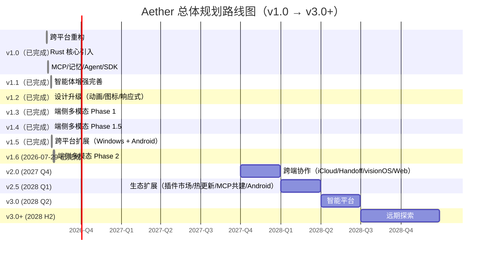
```mermaid
gantt
    title Aether 总体规划路线图（v1.0 → v3.0+）
    dateFormat YYYY-MM-DD
    axisFormat %Y-Q%q

    section v1.0（已完成）
    跨平台重构              :done, v10a, 2026-07-14, 1d
    Rust 核心引入           :done, v10b, 2026-07-15, 1d
    MCP/记忆/Agent/SDK      :done, v10c, 2026-07-17, 1d

    section v1.1（已完成）
    智能体增强完善           :done, v11, 2026-07-24, 1d

    section v1.2（已完成）
    设计升级（动画/图标/响应式） :done, v12, 2026-07-25, 1d

    section v1.3（已完成）
    端侧多模态 Phase 1       :done, v13, 2026-07-25, 1d

    section v1.4（已完成）
    端侧多模态 Phase 1.5     :done, v14, 2026-07-25, 1d

    section v1.5（已完成）
    跨平台扩展（Windows + Android） :done, v15a, 2026-07-26, 1d

    section v1.6 (2026-07-29 已完成)
    端侧多模态 Phase 2       :done, v16, 2026-07-29, 3d

    section v2.0 (2027 Q4)
    跨端协作（iCloud/Handoff/visionOS/Web） :v20, 2027-10-01, 90d

    section v2.5 (2028 Q1)
    生态扩展（插件市场/热更新/MCP共建/Android） :v25, 2028-01-01, 90d

    section v3.0 (2028 Q2)
    智能平台                :v30, 2028-04-01, 90d

    section v3.0+ (2028 H2)
    远期探索                :v3p, 2028-07-01, 180d
```

#### 各里程碑交付摘要

| 版本 | 关键交付 | 主要依赖前置 |
|------|----------|--------------|
| v1.0 ✅ | 跨平台重构 / Rust 核心 / MCP / 记忆 / Agent / SDK | — |
| v1.1 ✅ | MCP Server 反向暴露 / Agent 多步协作 / 插件市场 MVP / 动态星空背景 | v1.0 已落地 |
| v1.2 ✅ | AnimationTokens 全面应用 / AetherIcons / 响应式布局 / Starfield 呼吸效果 | 无外部依赖 |
| v1.3 ✅ | 多模态协议抽象（VisionInferenceEngine / ASREngine / TTSEngine / VoiceCloner / ImageGenerationEngine）/ 4 个多模态工具 / 跨平台 OCR / 占位实现 / MultimodalFacade + MemoryBudget + DeviceCapability | OnDeviceModelDownloader / 全局内存预算器 |
| v1.4 ✅ | NativeVisionEngine（基于 Vision）/ NativeASREngine（基于 SFSpeech）/ NativeTTSEngine（基于 AVSpeechSynthesizer.write）替换占位实现；MultimodalFacade 默认切换为 Native 引擎 | v1.3 协议抽象与 Facade |
| v1.5 ✅ | Windows 端（WPF .NET 8：会话 / 设置 / Markdown / i18n / DPAPI / 流式 / Rust FFI）/ Android 端（Kotlin + Compose：RAG UI / Health UI / Room / 长按菜单 / Markdown / i18n / Rust JNI 4 函数） | v1.0 Rust 核心 + BFF |
| v1.6 ✅ | MLX-VLM / Whisper.cpp ASR + MLX-Voice TTS + OpenVoice 语音克隆 / 端侧图像生成（SD Mobile）骨架实现 + 条件编译降级链路 + 40 个测试用例 | v1.4 Native 引擎作为兜底 |
| v2.0 | iCloud 同步 / Handoff / visionOS 适配 / Web 伴侣 / macOS 多窗口 | v1.6 端侧 VLM / v1.2 设计升级 |
| v2.5 | 社区插件市场 / 插件热更新 / MCP 共建 / Android 伴侣深化 | v2.0 跨端协作 |
| v3.0 | Apple Intelligence 集成 / 本地 RAG 增强 / 多 Agent 协作 / AI Workflow | v1.3 VLM / v2.5 插件市场 |
| v3.0+ | 隐私计算 / 实时协作 / 多模态记忆 | v3.0 全部交付 |

### 2.4 功能依赖图

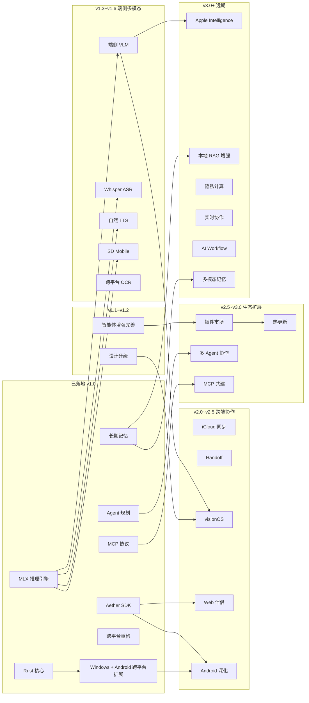
```mermaid
graph LR
    subgraph "已落地 v1.0"
        MLX[MLX 推理引擎]
        MCP[MCP 协议]
        Agent[Agent 规划]
        Memory[长期记忆]
        SDK[Aether SDK]
        Rust[Rust 核心]
        XPlat[跨平台重构]
        WinAndroid[Windows + Android 跨平台扩展]
    end

    subgraph "v1.1~v1.2"
        V11[智能体增强完善]
        V12[设计升级]
    end

    subgraph "v1.3~v1.6 端侧多模态"
        VLM[端侧 VLM]
        ASR[Whisper ASR]
        TTS[自然 TTS]
        SD[SD Mobile]
        OCR[跨平台 OCR]
    end

    subgraph "v2.0~v2.5 跨端协作"
        iCloud[iCloud 同步]
        Handoff[Handoff]
        VisionOS[visionOS]
        Web[Web 伴侣]
        Android[Android 深化]
    end

    subgraph "v2.5~v3.0 生态扩展"
        Market[插件市场]
        HotUpdate[热更新]
        MultiAgent[多 Agent 协作]
        MCPCo[MCP 共建]
    end

    subgraph "v3.0+ 远期"
        AppleIntel[Apple Intelligence]
        LocalRAG[本地 RAG 增强]
        Privacy[隐私计算]
        Realtime[实时协作]
        Workflow[AI Workflow]
        MultiModal[多模态记忆]
    end

    MLX --> VLM
    MLX --> ASR
    MLX --> TTS
    MLX --> SD
    MCP --> MCPCo
    Agent --> MultiAgent
    Memory --> MultiModal
    SDK --> Web
    SDK --> Android
    Rust --> WinAndroid
    WinAndroid --> Android
    VLM --> VisionOS
    V12 --> VisionOS
    V11 --> Market
    Market --> HotUpdate
    VLM --> AppleIntel
    Memory --> LocalRAG
```

#### 关键依赖链

- **端侧 VLM 链**：`MLXInferenceEngine` → 端侧 VLM（v1.3）→ 多模态融合（v1.6）→ visionOS 适配（v2.0）→ Apple Intelligence（v3.0）→ 多模态记忆（v3.0+）。
- **跨端协作链**：iCloud 同步（v2.0）→ Handoff（v2.0）→ Web 伴侣（v2.0）→ Android 伴侣（v2.5）→ 实时协作（v3.0+）。
- **插件生态链**：PluginManager（v1.0 已有）→ 社区市场（v2.5）→ 热更新（v2.5）→ MCP 共建（v2.5）→ AI Workflow（v3.0）。
- **设计升级链**：动态星空（v1.1）→ AnimationTokens + AetherIcons + 响应式布局（v1.2）→ macOS 多窗口（v2.0）→ visionOS 3D UI（v2.0）。

---

## 三、已实施规划（v1.0 核心能力）

本章保留 v1.0 已实施规划的完整技术方案与验收标准，作为**实施档案**供后续维护与回归参考。

### 3.1 跨平台架构重构（2026-07-14，✅ 已实施）

> **统合来源**：原 `doc/plans/2026-07-14-cross-platform-refactor.md`（已统合到本文档）

#### 3.1.1 背景与目标

将 iOS 与 macOS 拆分为独立 target，提取平台无关的公共组件库（AetherCore Swift Package），并扩展到 Android（Kotlin/Compose）与 Windows（WPF .NET 8，v1.5 已交付），通过增强的 BFF 统一业务逻辑与数据层。

**架构策略**：采用"BFF 共享 + 各平台原生 UI"。Apple 平台通过 Swift Package 共享核心逻辑（AetherCore），iOS 与 macOS 拆为独立 target；Android 与 Windows 各自原生实现 UI，通过 BFF（Cloudflare Workers）共享 LLM 代理、RAG 检索、记忆管理等业务逻辑。数据层抽象为仓储协议，各平台独立实现持久化。设计系统提取为平台无关 Token（JSON），各平台编写原生映射器。

**技术栈**：

- Apple 平台共享核心：Swift Package（Swift 5.9+，iOS 17+/macOS 14+）
- iOS App：SwiftUI + SwiftData
- macOS App：SwiftUI + AppKit 增强
- Android App：Kotlin + Jetpack Compose + Room
- Windows App：WPF .NET 8（v1.5 已交付，从最初规划的 WinUI 3 调整为 WPF）
- 跨平台 BFF：Cloudflare Workers（TypeScript）+ D1（SQLite）+ R2（对象存储）+ KV（配置缓存）
- 设计 Token：JSON Schema + 各平台原生映射器

#### 3.1.2 目标架构图

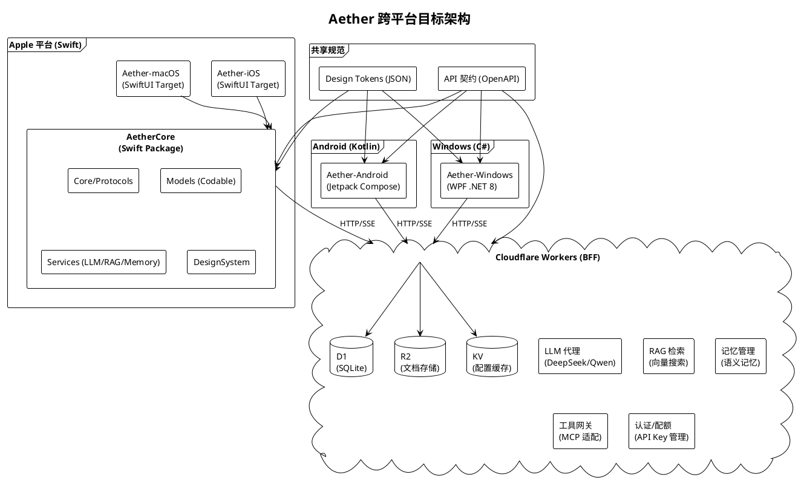
```plantuml
@startuml
!theme plain
title Aether 跨平台目标架构

skinparam componentStyle rectangle
skinparam packageStyle frame

cloud "Cloudflare Workers (BFF)" as BFF {
    component "LLM 代理\n(DeepSeek/Qwen)" as LLMBFF
    component "RAG 检索\n(向量搜索)" as RAGBFF
    component "记忆管理\n(语义记忆)" as MEMBFF
    component "工具网关\n(MCP 适配)" as TOOLBFF
    component "认证/配额\n(API Key 管理)" as AUTHBFF
    database "D1\n(SQLite)" as D1
    database "R2\n(文档存储)" as R2
    database "KV\n(配置缓存)" as KV
}

package "Apple 平台 (Swift)" {
    component "AetherCore\n(Swift Package)" as Core {
        component "Core/Protocols" as Proto
        component "Models (Codable)" as Models
        component "Services (LLM/RAG/Memory)" as Services
        component "DesignSystem" as DesignSys
    }
    component "Aether-iOS\n(SwiftUI Target)" as IOS
    component "Aether-macOS\n(SwiftUI Target)" as MAC
}

package "Android (Kotlin)" {
    component "Aether-Android\n(Jetpack Compose)" as ANDROID
}

package "Windows (C#)" {
    component "Aether-Windows\n(WPF .NET 8)" as WIN
}

package "共享规范" {
    component "Design Tokens (JSON)" as Tokens
    component "API 契约 (OpenAPI)" as APIContract
}

BFF --> D1
BFF --> R2
BFF --> KV
Core --> BFF : HTTP/SSE
IOS --> Core
MAC --> Core
ANDROID --> BFF : HTTP/SSE
WIN --> BFF : HTTP/SSE
Tokens --> Core
Tokens --> ANDROID
Tokens --> WIN
APIContract --> BFF
APIContract --> Core
APIContract --> ANDROID
APIContract --> WIN

@enduml
```

#### 3.1.3 现状分析（迁移基准）

| 维度 | 现状 | 迁移目标 |
|------|------|----------|
| Target 结构 | 1 个 multiplatform target | iOS / macOS 双 target + Swift Package |
| 条件编译 | 102 处 `#if os(iOS)` + 53 处 `#if os(macOS)` | 大幅减少（平台代码归入专属 target） |
| 公共组件库 | 无（`Shared/` 仅 AppGroupContainer.swift） | AetherCore 等 Swift Package |
| Android 支持 | 无 | 原生 Kotlin/Compose 客户端 |
| Windows 支持 | 无 | 原生 WPF .NET 8 客户端（v1.5 已交付） |
| 数据层 | SwiftData 直耦 ViewModel | 仓储协议 + 各平台实现 |
| 设计系统 | 强绑定 SwiftUI | Token JSON + 各平台映射器 |
| BFF | 仅 LLM 代理 + 配置 | 增强为跨平台业务网关 |

#### 3.1.4 阶段划分总览

| 阶段 | 名称 | 范围 | 可交付 | 依赖 |
|------|------|------|--------|------|
| Phase 1 | 公共组件库提取 | Apple 平台共享 Swift Package | AetherCore Package 可编译 | 无 |
| Phase 2 | iOS/macOS target 分离 | 拆分双 target | iOS / macOS 独立构建 | Phase 1 |
| Phase 3 | 跨平台抽象层 | 仓储协议 + Token JSON + BFF 增强 | BFF 跨平台 API 可用 | Phase 1 |
| Phase 4 | Android 客户端 | Kotlin/Compose 原生 App | Android APK 可运行 | Phase 3 |
| Phase 5 | Windows 客户端 | WPF .NET 8 原生 App（v1.5 已交付） | Windows MSIX 可安装 | Phase 3 |

> Phase 3 可与 Phase 2 并行；Phase 4 与 Phase 5 可并行。

#### 3.1.5 关键技术决策

| 决策 | 选项 | 理由 |
|------|------|------|
| 跨平台策略 | BFF 共享 + 各平台原生 UI | 保持各平台最佳体验，现有 Swift 代码无需重写，BFF 统一业务逻辑 |
| 工程结构 | 双 target + Swift Package | 改动可控，CI 可独立化，保留 Xcode 原生开发体验 |
| 数据层 | 抽象仓储协议 + 各平台实现 | 解耦持久化框架，DTO 跨平台共享，SwiftData/Room/EF Core 各自最优 |
| 设计系统 | Token JSON + 各平台映射 | Token 为唯一真相源，各平台原生渲染保留质感 |
| Android 技术栈 | Kotlin + Jetpack Compose | 现代 Android 官方推荐，响应式 UI 与 SwiftUI 范式接近 |
| Windows 技术栈 | WPF .NET 8（v1.5 已交付） | 现代 Windows 桌面官方推荐，Fluent Design 原生支持 |
| BFF 增强 | Cloudflare Workers + D1 + R2 | 已有基础设施，边缘计算低延迟，D1 提供关系型存储 |

#### 3.1.6 Swift Package 分层

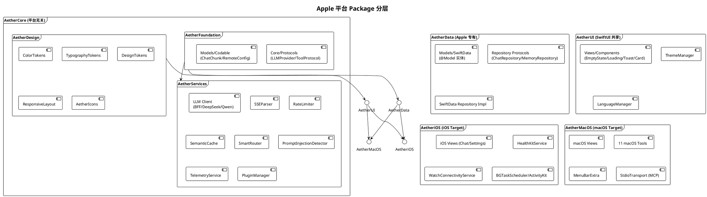
```plantuml
@startuml
!theme plain
title Apple 平台 Package 分层

skinparam packageStyle frame

package "AetherCore (平台无关)" {
    package "AetherFoundation" {
        [Core/Protocols\n(LLMProvider/ToolProtocol)]
        [Models/Codable\n(ChatChunk/RemoteConfig)]
    }
    package "AetherServices" {
        [LLM Client\n(BFF/DeepSeek/Qwen)]
        [SSEParser]
        [RateLimiter]
        [SemanticCache]
        [SmartRouter]
        [PromptInjectionDetector]
        [TelemetryService]
        [PluginManager]
    }
    package "AetherDesign" {
        [ColorTokens]
        [TypographyTokens]
        [DesignTokens]
        [ResponsiveLayout]
        [AetherIcons]
    }
}

package "AetherData (Apple 专有)" {
    [Models/SwiftData\n(@Model 实体)]
    [Repository Protocols\n(ChatRepository/MemoryRepository)]
    [SwiftData Repository Impl]
}

package "AetherUI (SwiftUI 共享)" {
    [Views/Components\n(EmptyState/Loading/Toast/Card)]
    [ThemeManager]
    [LanguageManager]
}

package "AetheriOS (iOS Target)" {
    [iOS Views (Chat/Settings)]
    [HealthKitService]
    [WatchConnectivityService]
    [BGTaskScheduler/ActivityKit]
}

package "AetherMacOS (macOS Target)" {
    [macOS Views]
    [11 macOS Tools]
    [MenuBarExtra]
    [StdioTransport (MCP)]
}

AetherFoundation --> AetherServices
AetherFoundation --> AetherData
AetherDesign --> AetherUI
AetherData --> AetheriOS
AetherData --> AetherMacOS
AetherUI --> AetheriOS
AetherUI --> AetherMacOS

@enduml
```

#### 3.1.7 跨平台数据流（以"发送消息"为例）

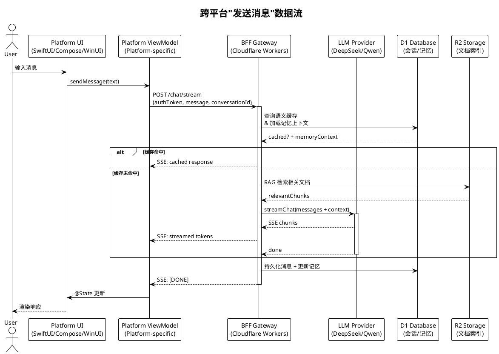
```plantuml
@startuml
!theme plain
title 跨平台"发送消息"数据流

actor User
participant "Platform UI\n(SwiftUI/Compose/WinUI)" as UI
participant "Platform ViewModel\n(Platform-specific)" as VM
participant "BFF Gateway\n(Cloudflare Workers)" as BFF
participant "LLM Provider\n(DeepSeek/Qwen)" as LLM
participant "D1 Database\n(会话/记忆)" as DB
participant "R2 Storage\n(文档索引)" as R2

User -> UI : 输入消息
UI -> VM : sendMessage(text)
VM -> BFF : POST /chat/stream\n(authToken, message, conversationId)
activate BFF

BFF -> DB : 查询语义缓存\n& 加载记忆上下文
DB --> BFF : cached? + memoryContext

alt 缓存命中
    BFF --> VM : SSE: cached response
else 缓存未命中
    BFF -> R2 : RAG 检索相关文档
    R2 --> BFF : relevantChunks
    BFF -> LLM : streamChat(messages + context)
    activate LLM
    LLM --> BFF : SSE chunks
    BFF --> VM : SSE: streamed tokens
    LLM --> BFF : done
    deactivate LLM
end

BFF -> DB : 持久化消息 + 更新记忆
BFF --> VM : SSE: [DONE]
deactivate BFF

VM -> UI : @State 更新
UI --> User : 渲染响应

@enduml
```

#### 3.1.8 跨平台文件结构总览

```
AIBuiler/
├── Packages/
│   └── AetherCore/                    # Swift Package（Apple 平台共享）
│       ├── Package.swift
│       ├── Sources/
│       │   ├── AetherFoundation/      # 协议 + 纯 Codable 模型
│       │   ├── AetherServices/        # 业务逻辑服务
│       │   ├── AetherDesign/          # 设计系统 + Token 生成
│       │   ├── AetherUI/              # 共享 SwiftUI 组件
│       │   ├── AetherRust/            # Rust FFI wrapper
│       │   └── AetherSDK/             # 对外公共 API 入口
│       └── Tests/
├── Aether/                            # iOS/macOS App 源码
│   ├── App/
│   │   ├── AetherApp-iOS.swift        # iOS 入口
│   │   └── AetherApp-macOS.swift      # macOS 入口
│   ├── Services/                      # 平台专属服务
│   │   ├── Health/                    # iOS: HealthKit
│   │   ├── Connectivity/              # iOS: WatchConnectivity
│   │   ├── Search/                    # iOS/macOS: Spotlight
│   │   └── Tools/macOS/               # macOS 11 工具
│   ├── Views/                         # 平台专属视图
│   ├── ViewModels/
│   └── Resources/
├── Aether.xcodeproj/                  # 含 Aether-iOS + Aether-macOS 双 target
├── AetherWatch/                       # watchOS App
├── AetherWidgets/                     # Widget Extension
├── AetherTests/                       # 平台专属测试
├── android/                           # Android 客户端（Kotlin/Compose）
├── windows/                           # Windows 客户端（WPF .NET 8，v1.5 已交付）
├── CloudflareWorkers/                 # 跨平台 BFF
│   ├── src/routes/
│   ├── schema.sql
│   └── openapi.yaml
├── DesignTokens/                      # 平台无关 Token 源
│   ├── tokens.json
│   └── schema.json
├── rust/                              # Rust 核心 workspace
│   ├── aether-core/
│   └── aether-core-ffi/
├── scripts/
│   └── generate-tokens.sh             # 各平台 Token 生成
├── doc/
│   └── plans/                         # 历史规划文档（已被本 MASTER_PLAN 统合）
└── .github/workflows/ci.yml           # iOS + macOS + Android + Windows + Rust CI
```

#### 3.1.9 Design Token JSON Schema

```json
{
  "$schema": "./schema.json",
  "color": {
    "deepSpace": { "value": "#0A0E1A", "type": "color", "description": "深空黑基底" },
    "aetherPurple": { "value": "#7C3AED", "type": "color", "description": "神秘紫强调色" },
    "electricBlue": { "value": "#00D4FF", "type": "color", "description": "电光蓝交互色" },
    "liquidGlass": { "value": "#1C1C2E80", "type": "color", "description": "液态玻璃卡片基底" },
    "nebulaGlow": { "value": "#FFE5B4", "type": "color", "description": "星云光晕高光" },
    "starlight": { "value": "#E5E7EB", "type": "color", "description": "星光白文字" },
    "duskGray": { "value": "#4B5563", "type": "color", "description": "暮色灰" }
  },
  "gradient": {
    "aetherGradient": {
      "value": { "from": "aetherPurple", "to": "electricBlue", "direction": "topLeading-bottomTrailing" },
      "type": "gradient"
    }
  },
  "typography": {
    "title": { "value": { "size": 28, "weight": "semibold" }, "type": "typography" },
    "display": { "value": { "size": 48, "weight": "bold" }, "type": "typography" },
    "body": { "value": { "size": 16, "weight": "regular" }, "type": "typography" }
  },
  "cornerRadius": {
    "small": { "value": 12, "type": "dimension" },
    "medium": { "value": 16, "type": "dimension" },
    "large": { "value": 24, "type": "dimension" }
  },
  "material": {
    "ultraThin": { "value": "ultraThinMaterial", "type": "material", "platform": "apple" },
    "regular": { "value": "regularMaterial", "type": "material", "platform": "apple" }
  }
}
```

#### 3.1.10 BFF D1 数据库 Schema

```sql
CREATE TABLE IF NOT EXISTS conversations (
    id TEXT PRIMARY KEY,
    user_id TEXT NOT NULL,
    title TEXT NOT NULL,
    parent_id TEXT,
    created_at INTEGER NOT NULL,
    updated_at INTEGER NOT NULL,
    last_message_preview TEXT,
    is_pinned INTEGER DEFAULT 0
);

CREATE TABLE IF NOT EXISTS messages (
    id TEXT PRIMARY KEY,
    conversation_id TEXT NOT NULL,
    role TEXT NOT NULL,
    content TEXT NOT NULL,
    tool_calls TEXT,
    feedback INTEGER,
    created_at INTEGER NOT NULL,
    FOREIGN KEY (conversation_id) REFERENCES conversations(id) ON DELETE CASCADE
);

CREATE TABLE IF NOT EXISTS memories (
    id TEXT PRIMARY KEY,
    user_id TEXT NOT NULL,
    content TEXT NOT NULL,
    category TEXT,
    importance REAL DEFAULT 0.5,
    embedding TEXT,
    created_at INTEGER NOT NULL
);

CREATE TABLE IF NOT EXISTS documents (
    id TEXT PRIMARY KEY,
    user_id TEXT NOT NULL,
    title TEXT NOT NULL,
    created_at INTEGER NOT NULL
);

CREATE TABLE IF NOT EXISTS document_chunks (
    id TEXT PRIMARY KEY,
    document_id TEXT NOT NULL,
    content TEXT NOT NULL,
    embedding TEXT,
    metadata TEXT,
    created_at INTEGER NOT NULL,
    FOREIGN KEY (document_id) REFERENCES documents(id) ON DELETE CASCADE
);

CREATE INDEX IF NOT EXISTS idx_messages_conversation ON messages(conversation_id);
CREATE INDEX IF NOT EXISTS idx_conversations_user ON conversations(user_id);
CREATE INDEX IF NOT EXISTS idx_memories_user ON memories(user_id);
```

#### 3.1.11 风险与应对

| 风险 | 影响 | 应对 |
|------|------|------|
| Swift Package 与主 App 的 SwiftData `@Model` 宏跨模块兼容性 | 高 | @Model 留在 App target，Package 中仅用 Codable DTO + 仓储协议 |
| iOS/macOS target 拆分后 pbxproj 冲突频繁 | 中 | 使用 Xcode 16+ 的 build phase 共享配置；必要时改用 xcconfig |
| BFF 单点故障导致所有平台不可用 | 高 | BFF 部署多区域 + 客户端降级为本地缓存模式 |
| Android/Windows 开发资源不足 | 高 | 分阶段交付，优先 Android；复用 BFF 减少重复逻辑 |
| Design Token 跨平台视觉一致性难以保证 | 中 | Token JSON 为唯一真相源，CI 校验生成产物与源一致 |
| macOS entitlements 变更导致签名失败 | 中 | 分离后 macOS target 独立配置证书与 profile |

#### 3.1.12 验收标准

- AetherCore Package 独立编译通过（iOS 17+ / macOS 14+）
- 现有 UT 全部通过（不修改实现代码，仅移动文件）
- `#if os(iOS)` / `#if os(macOS)` 数量减少 70%+
- `Aether-iOS` target 仅支持 iOS/iPad，可在 iPhone 17 Simulator 构建
- `Aether-macOS` target 仅支持 macOS，可在 macOS 原生构建
- macOS-only 工具不再需要 `#if os(macOS)` 文件级包裹
- iOS-only 框架代码不再需要 `#if os(iOS)` 包裹
- CI 新增独立 macOS 全量 UT job
- 仓储协议定义完整，iOS/macOS 已实现适配
- Design Token JSON Schema 发布，各平台可消费
- BFF 新增 `/chat/stream`、`/conversations`、`/memory`、`/rag/search` 端点
- OpenAPI 契约文档生成

---

### 3.2 Rust 核心引入（2026-07-15，✅ 已实施）

> **统合来源**：原 `doc/plans/2026-07-15-rust-core-introduction-feasibility.md` + `doc/plans/2026-07-15-rust-core-introduction.md`（已统合到本文档）

#### 3.2.1 可行性分析报告

##### 结论摘要（TL;DR）

**总体可行性：高（建议推进）。** 引入 Rust 作为跨端共享核心，技术上成熟、生态完备、风险可控。建议采用"渐进式移植 + 单一 Rust 核心多端 FFI"架构，以 **SSE 流解析器作为首个端到端落地单元**（4 端重复实现、内存敏感、收益明确），验证全链路后再按路线图扩展。

| 维度 | 评级 | 关键依据 |
|---|---|---|
| 技术可行性 | ✅ 高 | Rust 官方支持全部 5 个目标平台；FFI 成熟（C ABI/JNI/wasm-bindgen） |
| 收益（安全/内存/性能） | ✅ 高 | 4 端 SSE 重复消除、`#![forbid(unsafe_code)]`、SIMD 算力热点明确 |
| 风险 | ⚠️ 中 | xcframework 二进制体积、调试符号链路、Workers WASM 冷启动 |
| 成本 | ⚠️ 中 | 首个落地单元工作量可控；全量移植（含插件沙箱/端侧推理）成本高 |
| CI 就绪度 | ✅ 高 | 现有 macOS/Ubuntu runner 可直接复用，仅新增 Rust job |

**核心决策**：不做全量重写，而是"新增 Rust 核心 + 按模块渐进替换热点"，每个模块独立成计划、可独立交付、可回退。

##### 现状问题诊断

通过代码审查发现三类问题，Rust 针对性解决：

**安全缺陷：**

| 问题 | 现状文件 | 风险 |
|---|---|---|
| 插件沙箱"形同虚设" | `Packages/AetherCore/Sources/AetherServices/Plugin/PluginSandbox.swift` | 仅声明式权限检查，`maxExecutionTime=30s`/`maxMemoryMB=50` 为未强制常量，无真正隔离 |
| 注入检测仅客户端有 | `Packages/AetherCore/Sources/AetherServices/Security/PromptInjectionDetector.swift` | BFF/Android/Windows 均无，服务端可被绕过 |
| 遥测脱敏仅客户端有 | `Packages/AetherCore/Sources/AetherServices/Telemetry/TelemetrySanitizer.swift` | 服务端日志可能泄露 `sk-`/`Bearer` 凭证 |
| BFF token 比较非常量时间 | `CloudflareWorkers/src/lib/auth.js` | KV 字符串直接比较，理论上可时序侧信道 |

**内存问题：**

| 问题 | 现状文件 | 风险 |
|---|---|---|
| SSE 缓冲无界累积 | 4 端各自实现（Swift 2 处 + JS + Kotlin） | 恶意流可致内存膨胀；部分事件边界处理 bug |
| PDF 整文件入 String | `Aether/Services/RAG/PDFExtractor.swift` | 大 PDF 内存尖峰 |
| 端侧模型文件哈希 | `Aether/Services/OnDevice/MLXInferenceEngine.swift:176-190` | 手写流式 SHA-256，已较小心但可更稳 |
| Swift String 索引 O(n) | 文档分块等 | 超大文档处理性能不可预测 |

**运算速度热点：**

| 热点 | 现状文件 | 问题 |
|---|---|---|
| 余弦相似度线性扫 | `Packages/AetherCore/Sources/AetherServices/Cache/SemanticCache.swift` | `@MainActor` 串行、标量循环、100 项 |
| RAG 检索暴力扫 | `Aether/Services/RAG/RAGService.swift` | O(N×D) 全量扫，无 ANN 索引，cosine 函数重复实现 |
| token 计数粗估 | `Packages/AetherCore/Sources/AetherFoundation/Extensions/String+TokenCount.swift` | `asciiWords×1.3 + nonASCII×1.5`，CJK 误差大 |
| 跨端逻辑重复 | SSE（4 份）、cosine（2 份）、chunking（2 份） | 行为发散、维护成本高 |

##### 分平台可行性评估

| 目标 | triple | 官方支持 | 成熟度 | 备注 |
|---|---|---|---|---|
| iOS (device) | `aarch64-apple-ios` | ✅ Tier 2 | 高 | 已有大量生产案例 |
| iOS (sim) | `aarch64-apple-ios-sim` / `x86_64-apple-ios` | ✅ | 高 | |
| macOS (arm/x86) | `aarch64-apple-darwin` / `x86_64-apple-darwin` | ✅ Tier 1 | 高 | |
| Windows | `x86_64-pc-windows-msvc` | ✅ Tier 1 | 高 | |
| Android | `aarch64-linux-android` / `x86_64-linux-android` | ✅ Tier 2 | 高 | 需 NDK + `cargo-ndk` |
| Workers WASM | `wasm32-unknown-unknown` | ✅ Tier 2 | 高 | `wasm-pack -t web` |

##### FFI 绑定技术选型对比

| 方案 | 跨端一致性 | 学习成本 | 维护成本 | 本计划选择 |
|---|---|---|---|---|
| 手写 C ABI + `cbindgen`/`csbindgen`/`wasm-bindgen`/`jni` | 高 | 中 | 中 | ✅ 采用 |
| `uniffi`（统一生成多端绑定） | 很高 | 低 | 低 | ⏳ 后续可演进 |
| `swift-bridge`（仅 Swift） | 仅 Swift | 低 | 中 | ❌ 不跨端 |

##### 收益分析

**安全收益：**

| 收益 | 量化指标 |
|---|---|
| `unsafe` 收敛 | 核心逻辑 crate `#![forbid(unsafe_code)]`，全部 unsafe 集中在 FFI 层，可审计 |
| 内存安全 | 消除 4 处 SSE 缓冲无界累积；FFI 显式 `aether_free_string` 释放，空指针检查 |
| 安全逻辑统一 | 注入检测/脱敏可服务端强制（当前 BFF 无），消除客户端绕过路径 |
| 沙箱真隔离（后续） | `wasmtime` 嵌入可强制 CPU/内存/时间限额（当前仅声明式） |

**性能收益预估：**

| 模块 | 现状 | Rust 后预估 | 依据 |
|---|---|---|---|
| SSE 解析 | 4 套 JS/Swift/Kotlin | 单一 Rust，解析速度持平或略优 | 解析非算力热点，收益主要在统一与内存安全 |
| 余弦相似度（100×1536） | Swift 标量循环 @MainActor | Rust + SIMD，2-5× | `wide`/`std::simd` AVX2/NEON 自动向量化 |
| RAG 检索（N×D 暴力扫） | O(N×D) | + ANN 索引后近 O(log N) | `usearch`/`instant-distance` |
| token 计数 | 粗估公式 | `tiktoken-rs` 精确 BPE | 误差从 ~30% 降至 ~0 |
| SHA-256（模型文件） | CryptoKit | `sha2` crate | 持平，主收益在跨端 |

##### 决策矩阵

| 维度 | 权重 | Rust 方案 | 保持现状 | C++ | KMP |
|---|---|---|---|---|---|
| 安全收益 | 25% | 5 | 1 | 2 | 4 |
| 性能收益 | 20% | 5 | 2 | 5 | 3 |
| 跨端覆盖 | 20% | 5 | 1 | 4 | 2 |
| 实施风险（低为好） | 15% | 4 | 5 | 2 | 3 |
| 维护成本（低为好） | 10% | 3 | 4 | 2 | 3 |
| 生态成熟度 | 10% | 5 | 5 | 5 | 3 |
| **加权总分** | | **4.75** | **2.35** | **3.25** | **3.05** |

#### 3.2.2 实施档案

##### 目标架构图

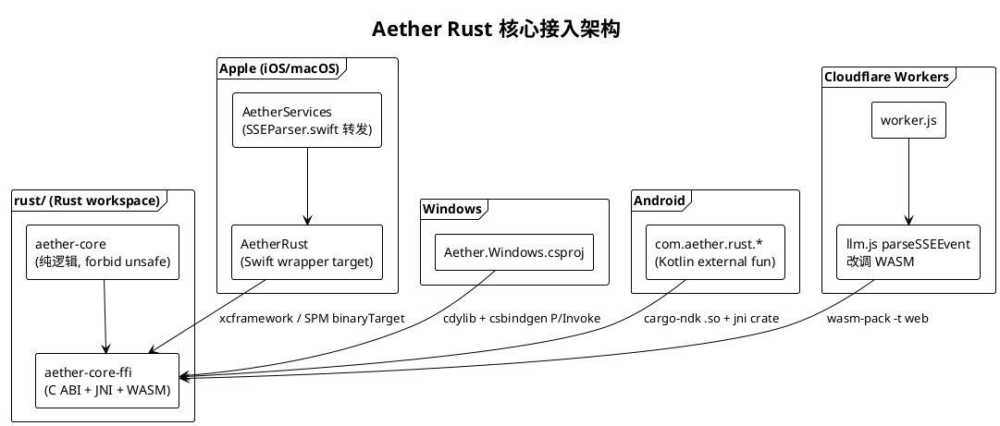
```plantuml
@startuml
!theme plain
title Aether Rust 核心接入架构
skinparam componentStyle rectangle
skinparam packageStyle frame

package "rust/ (Rust workspace)" {
  component [aether-core\n(纯逻辑, forbid unsafe)] as core
  component [aether-core-ffi\n(C ABI + JNI + WASM)] as ffi
  core --> ffi
}
package "Apple (iOS/macOS)" {
  component [AetherRust\n(Swift wrapper target)] as swiftwrap
  component [AetherServices\n(SSEParser.swift 转发)] as svcs
  swiftwrap --> ffi : xcframework / SPM binaryTarget
  svcs --> swiftwrap
}
package "Windows" {
  component [Aether.Windows.csproj] as win
  win --> ffi : cdylib + csbindgen P/Invoke
}
package "Android" {
  component [com.aether.rust.*\n(Kotlin external fun)] as andr
  andr --> ffi : cargo-ndk .so + jni crate
}
package "Cloudflare Workers" {
  component [worker.js] as wjs
  component [llm.js parseSSEEvent\n改调 WASM] as llm
  wjs --> llm
  llm --> ffi : wasm-pack -t web
}
@enduml
```

##### 移植优先级（来自代码审查）

| 层级 | 模块 | 现状文件 | Rust 收益 | 状态 |
|---|---|---|---|---|
| Tier 1 | SSE 解析器 | `SSEParser.swift` + `BFFProxyClient.swift` + `CloudflareWorkers/src/lib/llm.js` + `android/.../ChatStreamClient.kt` | 4 端重复 + 内存敏感 | ✅ 已实施 |
| Tier 1 | 向量数学 / 语义缓存 | `SemanticCache.swift` + `RAGService.swift` | SIMD 热点 + 移出主线程 | ⏳ 后续 |
| Tier 1 | token 计数 | `String+TokenCount.swift` | `tiktoken-rs` 精确且跨端 | ⏳ 后续 |
| Tier 1 | 安全正则 | `PromptInjectionDetector.swift` + `TelemetrySanitizer.swift` | 客户端与服务端统一强制 | ⏳ 后续 |
| Tier 2 | 文档分块 / SHA-256 / PDF | `DocumentChunker.swift` + `MLXInferenceEngine.swift` + `PDFExtractor.swift` | 去 Apple-only 依赖 | ⏳ 后续 |
| Tier 3 | 插件沙箱 / 端侧推理 | `PluginSandbox.swift` + `MLXInferenceEngine.swift` | 真隔离 / 跨端推理 | ⏳ 后续 |

##### Rust Workspace 结构

```toml
# rust/Cargo.toml
[workspace]
resolver = "2"
members = ["aether-core", "aether-core-ffi"]

[workspace.package]
version = "0.1.0"
edition = "2021"
license = "MIT"
authors = ["Aether Contributors"]

[workspace.dependencies]
serde = { version = "1", features = ["derive"] }
serde_json = "1"
thiserror = "1"
aether-core = { path = "aether-core" }
```

```toml
# rust/rust-toolchain.toml
[toolchain]
channel = "1.75"
components = ["rustfmt", "clippy"]
targets = [
  "aarch64-apple-ios", "aarch64-apple-ios-sim", "x86_64-apple-ios",
  "aarch64-apple-darwin", "x86_64-apple-darwin",
  "x86_64-pc-windows-msvc",
  "aarch64-linux-android", "x86_64-linux-android",
  "wasm32-unknown-unknown",
]
```

##### SSE 解析器核心实现（Rust）

```rust
//! SSE 流解析器：统一 Swift / Workers / Android 的解析行为。
use serde::Deserialize;
use std::collections::BTreeMap;

#[derive(Debug, Deserialize)]
struct ChatChunk { choices: Option<Vec<Choice>> }
#[derive(Debug, Deserialize)]
struct Choice { delta: Option<Delta> }
#[derive(Debug, Deserialize)]
struct Delta { content: Option<String>, tool_calls: Option<Vec<ToolCallDelta>> }
#[derive(Debug, Deserialize)]
struct ToolCallDelta {
    index: Option<i64>,
    id: Option<String>,
    #[serde(rename = "type")]
    kind: Option<String>,
    function: Option<FunctionBlock>,
}
#[derive(Debug, Deserialize)]
struct FunctionBlock { name: Option<String>, arguments: Option<String> }

#[derive(Debug, Clone, PartialEq)]
pub struct AccumulatedToolCall {
    pub id: String, pub kind: String, pub name: String, pub arguments: String,
}

#[derive(Debug, Clone, PartialEq)]
pub struct ParsedChunk {
    pub content: Option<String>,
    pub tool_calls: Option<Vec<AccumulatedToolCall>>,
}

/// Workers `parseSSEEvent` 语义：返回 content 字符串。
pub fn extract_content(line: &str) -> Option<String> {
    let data = strip_data_prefix(line)?;
    if data == "[DONE]" { return None; }
    let chunk: ChatChunk = serde_json::from_str(&data).ok()?;
    chunk.choices.and_then(|mut c| c.pop())
        .and_then(|c| c.delta).and_then(|d| d.content)
        .filter(|s| !s.is_empty())
}

/// Swift `parseChunk` 等价物。
pub fn parse_chunk(line: &str) -> Option<Option<String>> {
    let data = strip_data_prefix(line)?;
    if data == "[DONE]" { return Some(None); }
    let chunk: ChatChunk = serde_json::from_str(&data).ok()?;
    let content = chunk.choices.and_then(|mut c| c.pop())
        .and_then(|c| c.delta).and_then(|d| d.content);
    Some(content)
}

fn strip_data_prefix(line: &str) -> Option<String> {
    let trimmed = line.trim_start();
    let rest = trimmed.strip_prefix("data:")?;
    Some(rest.trim_start().to_string())
}
```

##### FFI 绑定（C ABI / WASM / JNI）

- **C ABI**（`aether-core-ffi/src/lib.rs`）：所有 unsafe 集中于此。返回值均为 JSON 字符串，调用方通过 `aether_free_string` 释放。
- **WASM 绑定**（`aether-core-ffi/src/wasm.rs`）：`wasm-bindgen` 暴露 `SseState` 给 Cloudflare Workers。
- **JNI 绑定**（`aether-core-ffi/src/jni.rs`）：仅 Android target 编译，`Java_com_aether_rust_SseBridge_parseWithTools`。

##### Apple 平台接入

- **xcframework 构建**：`rust/scripts/build-apple.sh` 编译 5 个 Apple target（aarch64-apple-ios / aarch64-apple-ios-sim / x86_64-apple-ios / aarch64-apple-darwin / x86_64-apple-darwin），生成 `aether_core.xcframework`。
- **SPM `AetherRust` wrapper target**：`Packages/AetherCore/Sources/AetherRust/` 含 `SSE.swift`、`FFIError.swift`、`include/module.modulemap`。
- **SSEParser.swift 转发**：`Packages/AetherCore/Sources/AetherServices/LLM/SSEParser.swift` 改为转发到 `AetherRustSSEParser`，保留旧 API 签名。

##### Cloudflare Workers 接入

- **WASM 构建**：`rust/scripts/build-wasm.sh` 用 `wasm-pack build -t web` 产出 `aether_sse.js` + `aether_sse_bg.wasm`。
- **llm.js 改造**：`parseSSEEvent` 改为 async，调用 WASM `SseState.extractContent`。
- **D1/KV 绑定保留在 JS 侧**，Rust 仅负责纯计算。

##### 风险评估与缓解

| # | 风险 | 等级 | 概率 | 缓解措施 |
|---|---|---|---|---|
| R1 | xcframework 二进制增大仓库体积 | 中 | 高 | 用 CI 产物 + SPM binaryTarget 远程 URL，或 git-lfs |
| R2 | Rust/Swift 混合栈调试符号链路 | 中 | 中 | 配置 `.dSYM` + Rust PDB；CI 构建保留符号 |
| R3 | Workers WASM 冷启动延迟 | 低 | 中 | 懒加载 + 单例；实测 <5ms 可接受 |
| R4 | Android .so 体积/ABI 维护 | 中 | 中 | 首期仅 arm64；后续按需补 x86_64；启用 strip |
| R5 | FFI 边界内存泄漏（忘记 free） | 中 | 中 | 用 RAII 包装（Swift `deinit`/C# `Dispose`）；加 leak sanitizer 到 CI |
| R6 | JSON 跨 FFI 序列化开销 | 低 | 中 | SSE 用 JSON 简单传递，开销可忽略 |
| R7 | 团队 Rust 熟练度 | 中 | — | 首期代码量小，可由 1 人主导 + review |
| R8 | 行为回归（移植后语义变化） | 中 | 中 | TDD：Rust 单测 + 各端回归测试双保险；保留旧实现可回退 |

##### 后续路线图（9 模块，各自独立成文）

1. **向量数学 / 语义缓存**：`SemanticCache.swift` + `RAGService.swift` → Rust + 可选 SIMD/ANN 索引。
2. **token 计数**：`String+TokenCount.swift` → `tiktoken-rs` 精确 BPE。
3. **安全正则**：`PromptInjectionDetector.swift` + `TelemetrySanitizer.swift` → Rust `regex`。
4. **文档分块**：`DocumentChunker.swift` + `rag.js chunkText` → 共享 Rust `unicode-segmentation`。
5. **SHA-256 流式哈希**：`MLXInferenceEngine.swift:176-190` → `sha2` crate。
6. **PDF 抽取**：`PDFExtractor.swift` → Rust `pdf-extract`。
7. **插件沙箱**：`PluginSandbox.swift` → `wasmtime` 嵌入，真正隔离+限额。
8. **端侧推理**：`MLXInferenceEngine.swift` → `candle`/`llama.cpp`。
9. **速率限制**：`RateLimiter.swift` + `ratelimit.js` → 共享 Rust token-bucket。

##### 验收标准

- [x] `rust/` workspace 编译通过，7 个 Rust 单测绿
- [x] Apple `AetherRust` target 接入，`SSEParserRustTests` 4 个用例绿
- [x] 既有 SSE 相关测试无回归
- [x] Workers `parseSSEEvent` 改调 WASM，4 个 vitest 用例绿
- [x] CI Rust job 绿
- [x] 4 端 SSE 行为统一（同一输入同一输出）

---

### 3.3 MCP 协议深度接入（2026-07-17，✅ 已实施）

> **统合来源**：原 `doc/plans/2026-07-17-mcp-deep-integration.md`（已统合到本文档）

#### 3.3.1 背景与目标

Aether 已在 `Aether/Services/MCP/` 下实现了基础 MCP 客户端（`MCPClient`、`MCPClientManager`、`MCPToolAdapter`），支持 stdio 与 SSE 两种传输，并在连接成功后将工具自动注册到 `ToolRegistry`。但当前接入方式仍是"手动配置 + 单次连接"模式：用户需逐个填写 Server 地址，无网络发现能力；权限仅依赖 `ToolAuthorization` 的运行时确认，缺少信任边界与黑白名单；外部 Server 的攻击面未做系统评估。

**目标：**

1. 引入基于 `mcp.json` 配置文件与 zeroconf（Bonjour/DNS-SD）的动态发现协议，降低配置成本。
2. 建立启动扫描 + 运行时增量注册的工具自动注册流程，与现有 `ToolRegistry.shared.registerBatch` 对齐。
3. 构建分层权限模型（本地 / 局域网 / 公网三档信任边界 + 白名单 / 黑名单 / 用户确认三种策略）。
4. 系统评估外部 MCP Server 攻击面并给出缓解措施。
5. 在 `MCPSettingsView` 上扩展动态发现与权限审批 UI。

#### 3.3.2 架构图

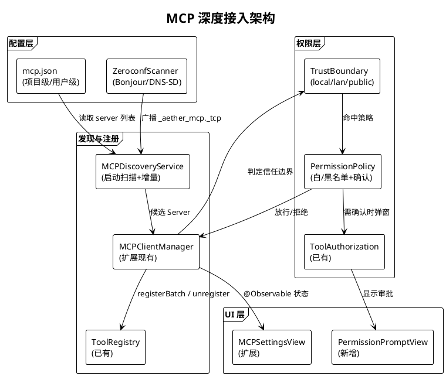
```plantuml
@startuml
!theme plain
title MCP 深度接入架构
skinparam componentStyle rectangle
skinparam packageStyle frame

package "配置层" {
    [mcp.json\n(项目级/用户级)] as Config
    [ZeroconfScanner\n(Bonjour/DNS-SD)] as ZC
}

package "发现与注册" {
    [MCPDiscoveryService\n(启动扫描+增量)] as Disc
    [MCPClientManager\n(扩展现有)] as Mgr
    [ToolRegistry\n(已有)] as Reg
}

package "权限层" {
    [TrustBoundary\n(local/lan/public)] as TB
    [PermissionPolicy\n(白/黑名单+确认)] as PP
    [ToolAuthorization\n(已有)] as Auth
}

package "UI 层" {
    [MCPSettingsView\n(扩展)] as UI
    [PermissionPromptView\n(新增)] as Prompt
}

Config --> Disc : 读取 server 列表
ZC --> Disc : 广播 _aether_mcp._tcp
Disc --> Mgr : 候选 Server
Mgr --> TB : 判定信任边界
TB --> PP : 命中策略
PP --> Auth : 需确认时弹窗
PP --> Mgr : 放行/拒绝
Mgr --> Reg : registerBatch / unregister
Mgr --> UI : @Observable 状态
Auth --> Prompt : 显示审批
@enduml
```

#### 3.3.3 数据流图：动态发现与工具注册

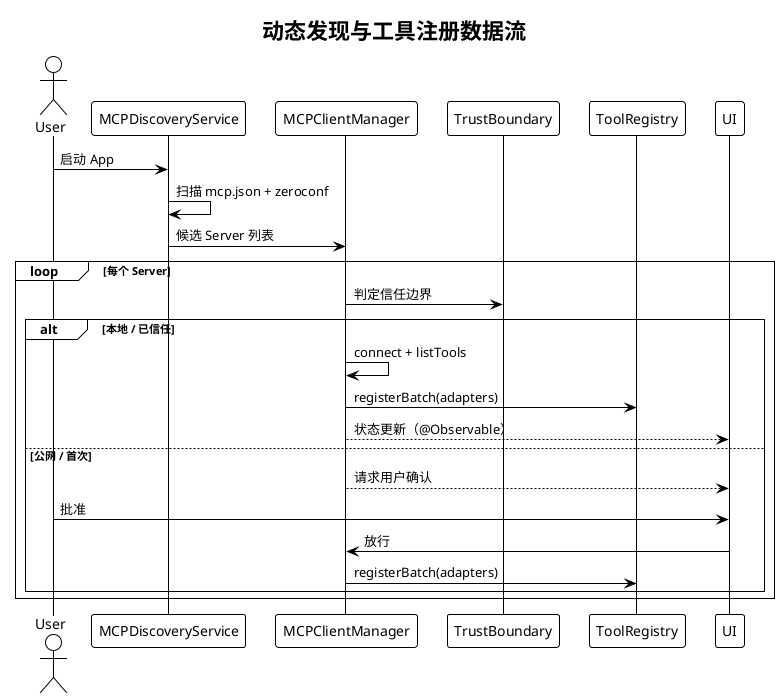
```plantuml
@startuml
!theme plain
title 动态发现与工具注册数据流

actor User
participant "MCPDiscoveryService" as Disc
participant "MCPClientManager" as Mgr
participant "TrustBoundary" as TB
participant "ToolRegistry" as Reg
participant "UI" as UI

User -> Disc : 启动 App
Disc -> Disc : 扫描 mcp.json + zeroconf
Disc -> Mgr : 候选 Server 列表
loop 每个 Server
    Mgr -> TB : 判定信任边界
    alt 本地 / 已信任
        Mgr -> Mgr : connect + listTools
        Mgr -> Reg : registerBatch(adapters)
        Mgr --> UI : 状态更新（@Observable）
    else 公网 / 首次
        Mgr --> UI : 请求用户确认
        User -> UI : 批准
        UI -> Mgr : 放行
        Mgr -> Reg : registerBatch(adapters)
    end
end
@enduml
```

#### 3.3.4 mcp.json 配置文件格式

```json
{
  "servers": [
    {
      "id": "local-fs",
      "name": "本地文件系统",
      "transport": { "type": "stdio", "command": "mcp-fs", "args": [] },
      "trust": "local",
      "autoConnect": true,
      "toolWhitelist": ["fs_read", "fs_list"]
    }
  ],
  "discovery": {
    "zeroconf": true,
    "zeroconfType": "_aether_mcp._tcp.",
    "scanIntervalSec": 60
  },
  "policy": {
    "defaultTrust": "lan",
    "blacklist": ["malicious.example.com"]
  }
}
```

#### 3.3.5 权限模型

**信任边界三档：**

- **local**：本机 stdio 子进程，默认放行（仍受 `ToolAuthorization` 约束）。
- **lan**：局域网 SSE，需用户首次确认；白名单工具自动放行。
- **public**：公网 SSE，强制每次确认或拒绝（黑名单优先）。

**三种策略：** 白名单（自动放行） / 黑名单（自动拒绝） / 用户确认（弹窗 `PermissionPromptView`）。策略优先级：黑名单 > 白名单 > 用户确认。

#### 3.3.6 技术选型

| 选项 | 说明 | 优点 | 缺点 | 选用 |
|------|------|------|------|------|
| 配置格式：JSON | `mcp.json` | 与 `MCPConfig` Codable 对齐 | 无注释 | ✅ |
| 配置格式：YAML | `mcp.yaml` | 支持注释 | 需引入解析库 | ❌ |
| 发现协议：Bonjour | `NetService` iOS/macOS 原生 | 系统级、低功耗 | 仅 Apple 平台 | ✅ |
| 发现协议：手动扫描 | 定期 HTTP 探测 | 跨平台 | 高延迟、耗电 | ❌ |
| 权限存储：SwiftData | 复用现有 `@Model` | 一致性 | — | ✅ |
| 权限存储：UserDefaults | 轻量 | 简单 | 不适合结构化数据 | ❌ |

#### 3.3.7 实施路径

- **阶段 1（基线增强）**：定义 `mcp.json` schema，扩展 `MCPClientManager` 读取配置文件批量连接；新增 `TrustBoundary` 与 `PermissionPolicy` 类型。交付：配置驱动连接。
- **阶段 2（动态发现）**：实现 `MCPDiscoveryService`，集成 `NetService` 扫描 `_aether_mcp._tcp`；启动扫描 + 60s 周期增量。交付：局域网自动发现。
- **阶段 3（权限 UI）**：新增 `PermissionPromptView`，扩展 `MCPSettingsView` 显示候选 Server 与审批流。交付：完整审批闭环。
- **阶段 4（安全加固）**：引入签名校验（Server 公钥指纹）、工具调用审计（复用 `ToolAuditLogger`）、速率限制。交付：生产可用安全基线。

#### 3.3.8 风险评估

| 风险 | 等级 | 影响 | 缓解措施 |
|------|------|------|----------|
| 恶意 Server 注入工具诱导调用危险操作 | 高 | 数据泄露/破坏 | 公网强制确认 + 工具调用审计 + 黑名单 |
| Server 拒绝服务（listTools 返回海量工具） | 中 | 注册风暴、UI 卡顿 | 单 Server 工具数上限 100，增量注册节流 |
| 数据泄露（Server 收集对话内容） | 高 | 隐私违规 | 工具调用参数脱敏（复用 `Redactor`） |
| zeroconf 在 iOS 后台不可用 | 中 | 后台无法发现 | 前台扫描 + 配置文件兜底 |
| stdio Server 逃逸沙箱 | 高 | 系统破坏 | macOS 启用 App Sandbox，限制子进程权限 |
| 配置文件被篡改 | 中 | 加载恶意 Server | `mcp.json` 校验签名（企业部署） |

**攻击面评估：** 外部 MCP Server 的主要攻击面为（1）恶意工具伪装成常用名诱导 LLM 误调；（2）资源读取越权（`resources/read` 返回敏感文件）；（3）提示模板注入（`prompts/get` 返回含 prompt injection 的内容）。缓解：工具名加 Server 前缀（`serverID__toolName`）、资源读取受 `ToolAuthorization` 二次确认、提示模板经 `PromptInjectionDetector` 过滤。

#### 3.3.9 验收标准

1. `mcp.json` 放置于 App Support 后，启动 App 自动连接所有 `autoConnect: true` 的 Server，工具注册到 `ToolRegistry`。
2. 局域网内启动声明 `_aether_mcp._tcp` 的 Server，App 在 60s 内发现并提示用户。
3. 公网 Server 首次连接必弹 `PermissionPromptView`，用户拒绝后不再注册其工具。
4. 黑名单中的 Server 永不连接；白名单工具自动放行不弹窗。
5. 所有 MCP 工具调用经 `ToolAuditLogger` 记录，可在设置页查看审计日志。
6. `MCPSettingsView` 显示已连接/候选/已拒绝三组 Server，支持手动连接/断开/审批。
7. 新增 `MCPDiscoveryServiceTests`、`TrustBoundaryTests`、`PermissionPolicyTests` 全部通过。

---

### 3.4 长期记忆系统（2026-07-17，✅ 已实施）

> **统合来源**：原 `doc/plans/2026-07-17-long-term-memory.md`（已统合到本文档）

#### 3.4.1 背景与目标

Aether 已具备短期语义记忆能力：`MemoryService` 通过 Qwen embedding 生成向量并存入 SwiftData，`SemanticMemoryStore` 封装检索并格式化注入 systemPrompt。但当前实现存在明显短板：记忆全量存储于 SwiftData 单表，`recall` 采用 O(N×D) 暴力扫描（`MemoryService.swift:78-88`），无 ANN 索引，记忆量增长后检索延迟劣化；缺少时间衰减与重要性加权；无老化压缩机制；隐私层面仅本地存储，无端到端加密与导出能力。

**目标：**

1. 选型并接入跨会话长期记忆向量库，支撑万级以上记忆条目的亚秒级召回。
2. 设计多源嵌入策略（自动事实提取 + 用户主动记忆 + 时间衰减权重）。
3. 实现复合召回算法（top-K 相似度 + 时间衰减 + 重要性评分）。
4. 建立隐私模型（本地优先、可选端到端加密、可删除、可导出）。
5. 与现有 `SemanticMemoryStore` / `MemoryService` 无缝集成。
6. 引入记忆老化与压缩策略，控制存储增长。

#### 3.4.2 架构图

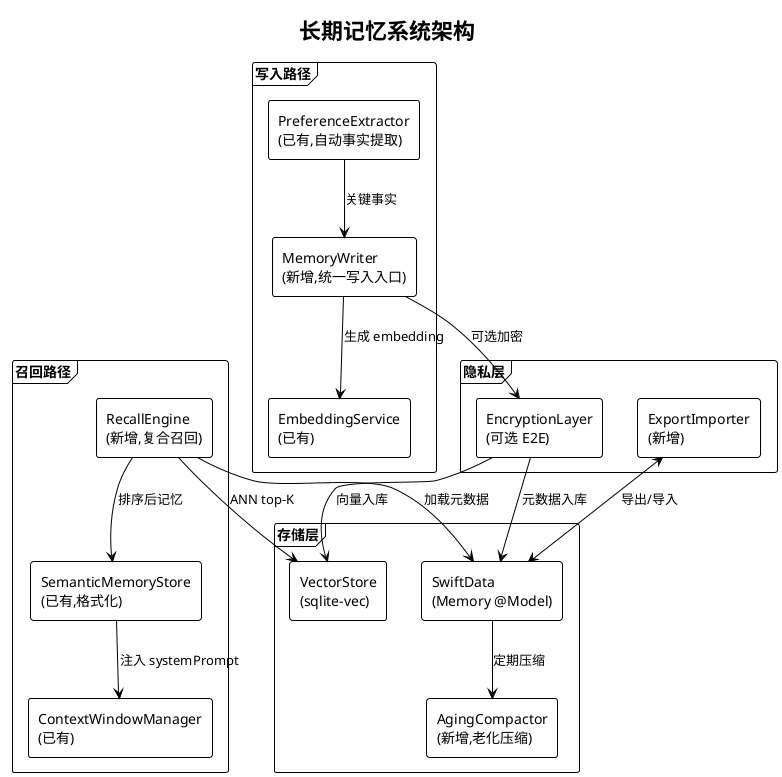
```plantuml
@startuml
!theme plain
title 长期记忆系统架构
skinparam componentStyle rectangle
skinparam packageStyle frame

package "写入路径" {
    [PreferenceExtractor\n(已有,自动事实提取)] as Extract
    [MemoryWriter\n(新增,统一写入入口)] as Writer
    [EmbeddingService\n(已有)] as Emb
}

package "存储层" {
    [VectorStore\n(sqlite-vec)] as VS
    [SwiftData\n(Memory @Model)] as SD
    [AgingCompactor\n(新增,老化压缩)] as Age
}

package "召回路径" {
    [RecallEngine\n(新增,复合召回)] as Recall
    [SemanticMemoryStore\n(已有,格式化)] as SMS
    [ContextWindowManager\n(已有)] as CWM
}

package "隐私层" {
    [EncryptionLayer\n(可选 E2E)] as Enc
    [ExportImporter\n(新增)] as Exp
}

Extract --> Writer : 关键事实
Writer --> Emb : 生成 embedding
Writer --> Enc : 可选加密
Enc --> VS : 向量入库
Enc --> SD : 元数据入库
SD --> Age : 定期压缩
Recall --> VS : ANN top-K
Recall --> SD : 加载元数据
Recall --> SMS : 排序后记忆
SMS --> CWM : 注入 systemPrompt
Exp <-> SD : 导出/导入
@enduml
```

#### 3.4.3 数据流图：记忆写入与召回

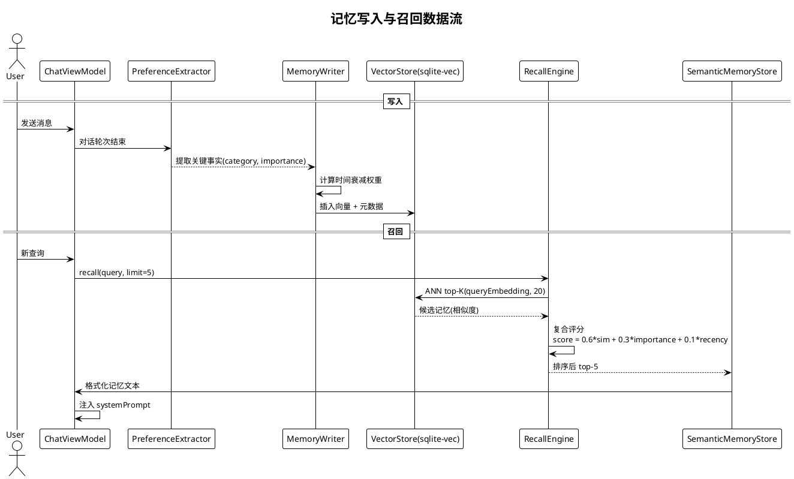
```plantuml
@startuml
!theme plain
title 记忆写入与召回数据流

actor User
participant "ChatViewModel" as Chat
participant "PreferenceExtractor" as Extract
participant "MemoryWriter" as Writer
participant "VectorStore(sqlite-vec)" as VS
participant "RecallEngine" as Recall
participant "SemanticMemoryStore" as SMS

== 写入 ==
User -> Chat : 发送消息
Chat -> Extract : 对话轮次结束
Extract --> Writer : 提取关键事实(category, importance)
Writer -> Writer : 计算时间衰减权重
Writer -> VS : 插入向量 + 元数据

== 召回 ==
User -> Chat : 新查询
Chat -> Recall : recall(query, limit=5)
Recall -> VS : ANN top-K(queryEmbedding, 20)
VS --> Recall : 候选记忆(相似度)
Recall -> Recall : 复合评分\nscore = 0.6*sim + 0.3*importance + 0.1*recency
Recall --> SMS : 排序后 top-5
SMS -> Chat : 格式化记忆文本
Chat -> Chat : 注入 systemPrompt
@enduml
```

#### 3.4.4 嵌入策略

**三源写入：**

1. **自动事实提取**：复用现有 `PreferenceExtractor`，每轮对话结束后提取偏好/事实/指令，按 `category` 分类，`importance` 由 LLM 评分（0.0-1.0）。
2. **用户主动记忆**：用户显式 `"记住：我是素食者"` 触发 `MemoryService.remember()`，`importance` 默认 0.8（高于自动提取）。
3. **时间衰减权重**：写入时记录 `createdAt`，召回时计算 `recency = exp(-Δt/τ)`，半衰期 τ=30 天。

#### 3.4.5 复合召回算法

```
finalScore = 0.6 × cosineSimilarity
           + 0.3 × importance
           + 0.1 × recency
```

流程：ANN 检索 top-20 候选 → 计算复合评分 → 取 top-5 → 去重（同 `category` 仅保留最高分）→ 经 `SemanticMemoryStore.formatMemoriesForPrompt` 格式化注入。

#### 3.4.6 老化与压缩策略

- **老化**：90 天未命中的记忆 `importance *= 0.8`；180 天仍 `importance < 0.2` 的记忆归档。
- **压缩**：同 `category` 下语义相似度 > 0.92 的记忆合并，保留最高 `importance` 版本，其余归档。
- **归档**：从 `VectorStore` 移除向量，元数据保留 `archivedAt` 时间戳，可恢复。

#### 3.4.7 技术选型

| 向量库选项 | 类型 | 优点 | 缺点 | 选用 |
|-----------|------|------|------|------|
| sqlite-vec | SQLite 扩展 | 与 SwiftData 同库、零运维、ANN | 需编译扩展 | ✅ |
| FAISS | 嵌入式库 | 工业级性能 | C++ 依赖重、iOS 集成难 | ❌ |
| Milvus Lite | 嵌入式 | 高性能 | Python 生态、Apple 平台不友好 | ❌ |
| 自研 brute-force | 纯 Swift | 简单 | O(N) 无法扩展 | ❌（已有，作兜底） |

**加密选项：** CryptoKit `AES-GCM`（密钥由 Keychain 派生，可选 iCloud Keychain 同步）。

#### 3.4.8 实施路径

- **阶段 1（向量库接入）**：引入 sqlite-vec，在 `MemoryService` 写入路径双写（SwiftData + sqlite-vec），`recall` 切换为 sqlite-vec ANN。交付：检索性能从 O(N) 降至 O(log N)。
- **阶段 2（复合召回）**：实现 `RecallEngine`，引入重要性评分与时间衰减；扩展 `Memory` 模型增加 `lastAccessedAt` 字段。交付：召回质量提升。
- **阶段 3（老化压缩）**：实现 `AgingCompactor`，后台定期（每周）执行老化与合并。交付：存储增长可控。
- **阶段 4（隐私与导出）**：引入 `EncryptionLayer`（可选开关），实现 JSON 导出/导入。交付：合规可导出。

#### 3.4.9 风险评估

| 风险 | 等级 | 影响 | 缓解措施 |
|------|------|------|----------|
| sqlite-vec 在 iOS 沙箱加载失败 | 高 | 召回不可用 | 降级为现有 SwiftData 暴力扫描 |
| 记忆量增长导致写入延迟 | 中 | 对话卡顿 | 写入异步、批量提交 |
| 时间衰减误降重要记忆 | 中 | 召回遗漏 | 用户主动记忆不衰减、importance 阈值可调 |
| 端到端加密密钥丢失 | 高 | 记忆永久不可读 | Keychain 恢复码机制、导出明文备份选项 |
| 自动事实提取误写入敏感信息 | 高 | 隐私泄露 | 提取前经 `Redactor` 脱敏、用户可审查 |
| 老化压缩误删记忆 | 中 | 数据丢失 | 归档而非删除、30 天可恢复窗口 |

**隐私评估：** 默认全部本地存储（SwiftData + sqlite-vec 均在 App Group 容器）；端到端加密为可选项，启用后向量与元数据均加密存储；用户可在设置页一键导出 JSON（含向量与元数据）或清空全部记忆；不上传任何记忆到云端（除非用户显式通过 BFF `/memory/search` 同步，且该路径需独立授权）。

#### 3.4.10 验收标准

1. sqlite-vec 集成后，10,000 条记忆的 `recall` 召回延迟 < 100ms（现有暴力扫描 > 500ms）。
2. 复合召回算法上线后，人工标注的"相关记忆"召回率 ≥ 85%（对比纯相似度召回的 70%）。
3. 用户主动记忆（`"记住：..."`）的 `importance` 不随时间衰减。
4. 启用端到端加密后，App Group 容器内的 sqlite-vec 与 SwiftData 文件均为密文。
5. 设置页可导出全部记忆为 JSON，可在另一台设备导入恢复。
6. 老化压缩运行 4 周后，归档记忆数可查，存储增长速率下降 50%+。
7. `RecallEngineTests`、`AgingCompactorTests`、`EncryptionLayerTests`、`ExportImporterTests` 全部通过。
8. `SemanticMemoryStore` 对外接口不变，现有调用方零改动。

---

### 3.5 Agent 任务规划（2026-07-17，✅ 已实施）

> **统合来源**：原 `doc/plans/2026-07-17-agent-task-planning.md`（已统合到本文档）

#### 3.5.1 背景与目标

Aether 已在 `Aether/Services/Agent/` 下实现 `AgentOrchestrator`（任务编排）、`GoalDecomposer`（LLM 目标分解）与 `AgentRole`（多角色协作），并在 `Aether/Core/Models/AgentTask.swift` 中定义了 `AgentTask` / `SubTask` / `SubTaskStatus` 数据模型。现有能力支持基于 DAG 依赖的子任务调度、断点续执行（`resumeInProgressTask`）与 reviewer 角色审查重试。但当前实现仍为线性 DAG 执行（`nextExecutableSubTask` 仅返回单一下一个可执行节点），不支持并行执行；任务持久化依赖 SwiftData 全量保存，缺乏细粒度检查点；UI 层仅有 `TaskListView` / `StepCardView` 的线性展示，无 DAG 可视化与用户干预入口。

**目标：**

1. 增强 LLM 驱动的层次化目标分解算法，引入启发式规则约束分解深度与宽度。
2. 实现支持并行节点的 DAG 执行引擎（节点状态机：pending / running / completed / failed / skipped）。
3. 完善断点续执行：细粒度检查点持久化、失败重试策略、任务恢复机制。
4. 明确与现有 `AgentOrchestrator` 的关系（扩展而非替换）。
5. 设计 DAG 可视化 UI，支持进度展示与用户干预（跳过/重试/取消）。
6. 建立性能基线（任务复杂度 / 执行时长 / 成功率）。

#### 3.5.2 架构图

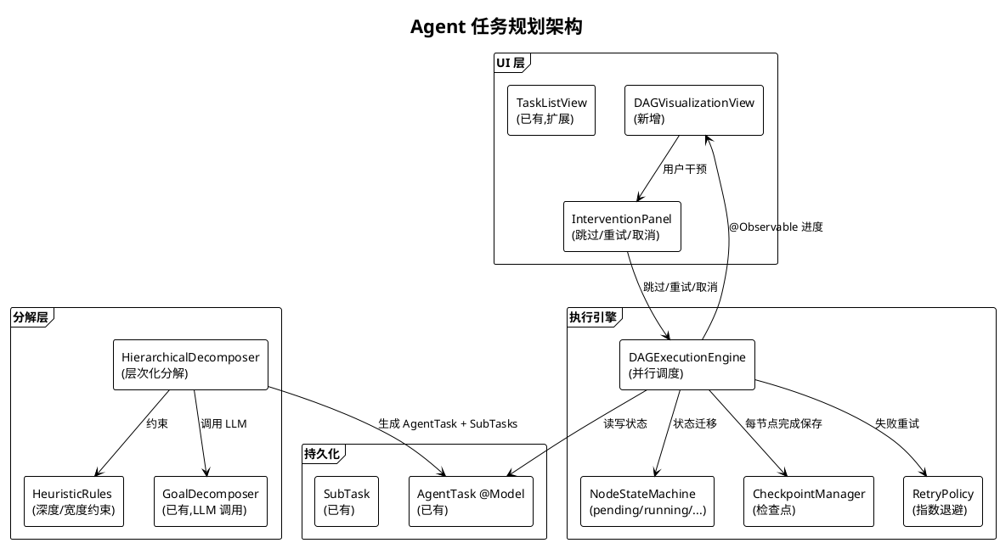
```plantuml
@startuml
!theme plain
title Agent 任务规划架构
skinparam componentStyle rectangle
skinparam packageStyle frame

package "分解层" {
    [HierarchicalDecomposer\n(层次化分解)] as HD
    [HeuristicRules\n(深度/宽度约束)] as HR
    [GoalDecomposer\n(已有,LLM 调用)] as GD
}

package "执行引擎" {
    [DAGExecutionEngine\n(并行调度)] as Engine
    [NodeStateMachine\n(pending/running/...)] as SM
    [CheckpointManager\n(检查点)] as Ckpt
    [RetryPolicy\n(指数退避)] as Retry
}

package "持久化" {
    [AgentTask @Model\n(已有)] as Task
    [SubTask\n(已有)] as Sub
}

package "UI 层" {
    [DAGVisualizationView\n(新增)] as DAGView
    [TaskListView\n(已有,扩展)] as TLV
    [InterventionPanel\n(跳过/重试/取消)] as IP
}

HD --> HR : 约束
HD --> GD : 调用 LLM
HD --> Task : 生成 AgentTask + SubTasks
Engine --> SM : 状态迁移
Engine --> Ckpt : 每节点完成保存
Engine --> Retry : 失败重试
Engine --> Task : 读写状态
Engine --> DAGView : @Observable 进度
DAGView --> IP : 用户干预
IP --> Engine : 跳过/重试/取消
@enduml
```

#### 3.5.3 数据流图：DAG 执行与断点续执行

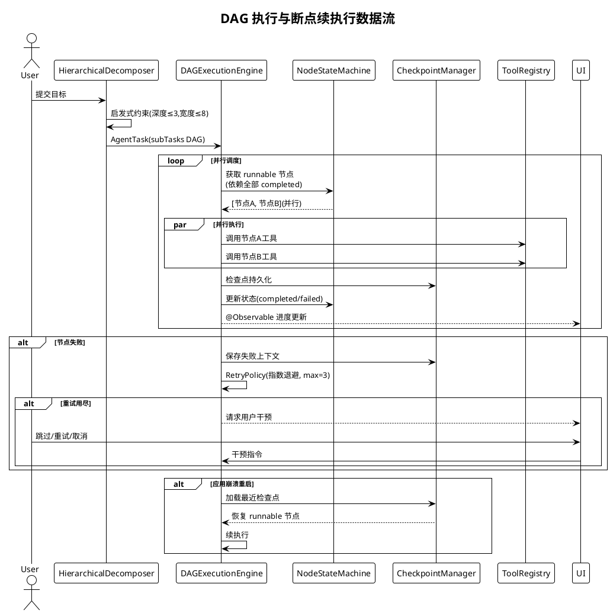
```plantuml
@startuml
!theme plain
title DAG 执行与断点续执行数据流

actor User
participant "HierarchicalDecomposer" as HD
participant "DAGExecutionEngine" as Engine
participant "NodeStateMachine" as SM
participant "CheckpointManager" as Ckpt
participant "ToolRegistry" as Tools
participant "UI" as UI

User -> HD : 提交目标
HD -> HD : 启发式约束(深度≤3,宽度≤8)
HD -> Engine : AgentTask(subTasks DAG)

loop 并行调度
    Engine -> SM : 获取 runnable 节点\n(依赖全部 completed)
    SM --> Engine : [节点A, 节点B](并行)
    par 并行执行
        Engine -> Tools : 调用节点A工具
        Engine -> Tools : 调用节点B工具
    end
    Engine -> Ckpt : 检查点持久化
    Engine -> SM : 更新状态(completed/failed)
    Engine --> UI : @Observable 进度更新
end

alt 节点失败
    Engine -> Ckpt : 保存失败上下文
    Engine -> Engine : RetryPolicy(指数退避, max=3)
    alt 重试用尽
        Engine --> UI : 请求用户干预
        User -> UI : 跳过/重试/取消
        UI -> Engine : 干预指令
    end
end

alt 应用崩溃重启
    Engine -> Ckpt : 加载最近检查点
    Ckpt --> Engine : 恢复 runnable 节点
    Engine -> Engine : 续执行
end
@enduml
```

#### 3.5.4 层次化目标分解算法

**LLM 驱动 + 启发式约束：**

1. 第一层分解由 `GoalDecomposer` 调用 LLM 生成粗粒度子任务（≤5 个）。
2. 对每个子任务判断是否需要进一步分解（复杂度启发式：描述长度 > 100 字或含"并且/然后"等连接词）。
3. 递归分解，约束：最大深度 3 层、每层最大宽度 8、总子任务数 ≤ 50。
4. 生成 DAG 依赖：同层兄弟节点默认串行依赖，可标注 `parallel: true` 的节点无相互依赖。

#### 3.5.5 DAG 执行引擎与节点状态机

**节点状态机：** `pending → running → completed` / `pending → running → failed → (retry) → running` / `pending → skipped`。

**并行调度：** `DAGExecutionEngine` 每轮获取所有 `dependencies` 均为 `completed` 的 `pending` 节点，并行提交执行（受最大并发数 4 限制）。复用 `AgentTask.nextExecutableSubTask()` 逻辑但改为返回数组。

**检查点：** 每个节点完成（无论成功/失败）后，`CheckpointManager` 立即 `modelContext.save()`，并记录 `checkpointAt` 时间戳与已完成节点 ID 集合。

**重试策略：** 失败节点按指数退避重试（1s / 2s / 4s），最大 3 次；用尽后标记 `failed` 并触发用户干预。

#### 3.5.6 技术选型

| 选项 | 说明 | 优点 | 缺点 | 选用 |
|------|------|------|------|------|
| DAG 引擎：自研 | 基于 `SubTask.dependencies` | 与现有模型对齐 | 需实现并行调度 | ✅ |
| DAG 引擎：Swift Concurrency | `TaskGroup` 并行 | 语言原生 | 需重构状态管理 | ✅（结合） |
| DAG 引擎：第三方库 | 如 GraphLib | 成熟 | 引入依赖、SwiftData 兼容差 | ❌ |
| 可视化：SwiftUI Canvas | 自绘 | 灵活、无依赖 | 需手动布局 | ✅ |
| 可视化：WebView + D3 | JS 渲染 | 成熟布局 | 重、跨进程通信复杂 | ❌ |
| 检查点：SwiftData 增量 | 复用现有 | 一致 | — | ✅ |

#### 3.5.7 实施路径

- **阶段 1（层次化分解）**：实现 `HierarchicalDecomposer` 与 `HeuristicRules`，包装 `GoalDecomposer`。交付：分解质量提升、深度宽度受控。
- **阶段 2（并行 DAG 引擎）**：实现 `DAGExecutionEngine`，支持并行节点调度；扩展 `nextExecutableSubTask` 为 `nextExecutableSubTasks`（返回数组）。交付：并行执行能力。
- **阶段 3（检查点与重试）**：实现 `CheckpointManager` 与 `RetryPolicy`，扩展 `resumeInProgressTask` 加载检查点。交付：断点续执行完善。
- **阶段 4（UI 可视化）**：实现 `DAGVisualizationView` 与 `InterventionPanel`，扩展 `TaskListView` 集成。交付：DAG 可视化与用户干预。
- **阶段 5（性能基线）**：建立基准测试集（简单/中等/复杂三级任务），采集执行时长与成功率。交付：性能基线文档。

#### 3.5.8 风险评估

| 风险 | 等级 | 影响 | 缓解措施 |
|------|------|------|----------|
| LLM 分解生成循环依赖 | 高 | 引擎死锁 | 提交前拓扑排序校验、循环检测 |
| 并行节点竞争 ToolRegistry | 中 | 工具状态不一致 | 工具调用加 actor 串行化 |
| 检查点频繁保存导致性能下降 | 中 | 执行卡顿 | 节流保存（最多每 500ms 一次） |
| DAG 可视化大图渲染卡顿 | 中 | UI 掉帧 | 节点数 > 30 时折叠子图 |
| 任务恢复后状态不一致 | 高 | 重复执行/遗漏 | 检查点包含已完成节点 ID 集合，幂等恢复 |
| 用户干预与引擎并发冲突 | 中 | 状态错乱 | 干预操作经 `@MainActor` 串行化 |
| 启发式约束过度限制分解 | 中 | 复杂任务分解不足 | 约束参数可配置、用户可覆盖 |

#### 3.5.9 验收标准

1. `HierarchicalDecomposer` 生成的子任务 DAG 深度 ≤ 3、宽度 ≤ 8、总数 ≤ 50，无循环依赖。
2. `DAGExecutionEngine` 能并行执行无依赖关系的节点，4 个并行节点耗时 ≈ 单节点耗时（而非 4 倍）。
3. 应用崩溃重启后，`resumeInProgressTask` 能从最后一个 `completed` 节点续执行，不重复已完成节点。
4. 节点失败后 `RetryPolicy` 自动重试 3 次（指数退避），用尽后标记 `failed` 并通知 UI。
5. `DAGVisualizationView` 正确渲染节点与依赖边，节点颜色实时反映状态，节点数 ≤ 30 时 60fps 流畅。
6. 用户可通过 `InterventionPanel` 跳过 `failed` 节点（状态变 `skipped`，后续依赖节点自动 `skipped`）。
7. 性能基线：简单任务（≤3 子任务）平均成功率 ≥ 95%，中等任务（4-10 子任务）≥ 85%，复杂任务（11-30 子任务）≥ 70%。
8. `HierarchicalDecomposerTests`、`DAGExecutionEngineTests`、`CheckpointManagerTests`、`RetryPolicyTests` 全部通过。
9. `AgentOrchestrator` 对外接口（`startTask` / `executeAll` / `cancel`）保持不变，现有调用方零改动。

---

### 3.6 Aether SDK（2026-07-17，✅ 已实施）

> **统合来源**：原 `doc/plans/2026-07-17-aether-sdk.md`（已统合到本文档）

#### 3.6.1 背景与目标

Aether 已在 `Packages/AetherCore/` 下沉淀出可复用 SPM 包（AetherFoundation / AetherServices / AetherDesign / AetherUI / AetherRust），含 `LLMProvider` 协议、`ToolProtocol` 协议、`ToolRegistry` 注册中心、RAG 服务、Plugin 系统与 Rust 核心 FFI。但这些模块当前作为 App 内部依赖，未对外暴露公共 API，第三方开发者无法集成 Aether 的对话/工具/RAG 能力到自身 App。`Packages/AetherCore/Package.swift` 仅有 4 个 product 库，无 `AetherSDK` 顶层入口，无 DocC 文档，无示例工程。

**目标：**

1. 将 `AetherCore` SPM 包升级为公共 `AetherSDK`，对外暴露统一入口。
2. 设计 API：`AetherClient.chat()` / `stream()` / `embed()` / `retrieve()`。
3. 支持多分发方式：Swift Package / XCFramework / CocoaPods。
4. 提供鉴权方案：API Key / OAuth 2.0 / JWT / 设备绑定。
5. 提供工具扩展 API：注册自定义工具 / 工具权限模型。
6. 提供配置 API：LLM Provider / 缓存 / RAG / 限流。
7. 设计错误处理与重试策略。
8. 提供 DocC 文档、Sample App、Playground。

#### 3.6.2 架构图

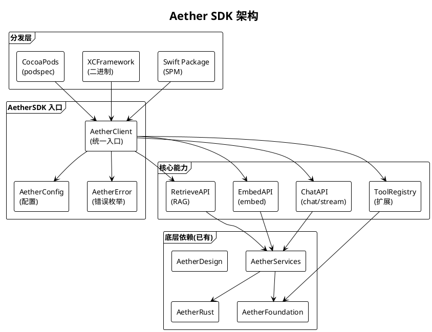
```plantuml
@startuml
!theme plain
title Aether SDK 架构
skinparam componentStyle rectangle
skinparam packageStyle frame

package "分发层" {
    [Swift Package\n(SPM)] as SPM
    [XCFramework\n(二进制)] as XCF
    [CocoaPods\n(podspec)] as Pod
}

package "AetherSDK 入口" {
    [AetherClient\n(统一入口)] as Client
    [AetherConfig\n(配置)] as Cfg
    [AetherError\n(错误枚举)] as Err
}

package "核心能力" {
    [ChatAPI\n(chat/stream)] as Chat
    [EmbedAPI\n(embed)] as Emb
    [RetrieveAPI\n(RAG)] as Ret
    [ToolRegistry\n(扩展)] as TR
}

package "底层依赖(已有)" {
    [AetherFoundation] as F
    [AetherServices] as S
    [AetherRust] as R
    [AetherDesign] as D
}

SPM --> Client
XCF --> Client
Pod --> Client
Client --> Cfg
Client --> Err
Client --> Chat
Client --> Emb
Client --> Ret
Client --> TR
Chat --> S
Emb --> S
Ret --> S
TR --> F
S --> R
S --> F
@enduml
```

#### 3.6.3 数据流图：SDK 调用

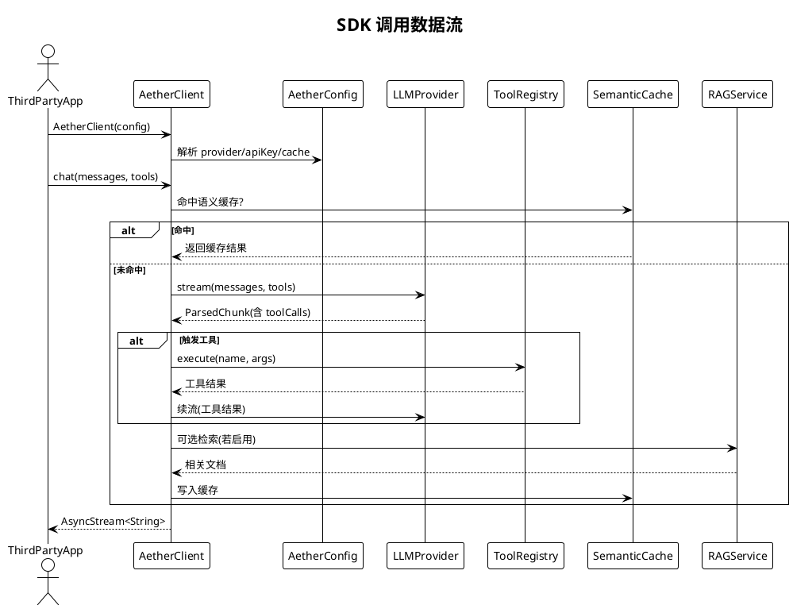
```plantuml
@startuml
!theme plain
title SDK 调用数据流

actor ThirdPartyApp
participant "AetherClient" as Client
participant "AetherConfig" as Cfg
participant "LLMProvider" as LLM
participant "ToolRegistry" as TR
participant "SemanticCache" as Cache
participant "RAGService" as RAG

ThirdPartyApp -> Client : AetherClient(config)
Client -> Cfg : 解析 provider/apiKey/cache
ThirdPartyApp -> Client : chat(messages, tools)
Client -> Cache : 命中语义缓存?
alt 命中
    Cache --> Client : 返回缓存结果
else 未命中
    Client -> LLM : stream(messages, tools)
    LLM --> Client : ParsedChunk(含 toolCalls)
    alt 触发工具
        Client -> TR : execute(name, args)
        TR --> Client : 工具结果
        Client -> LLM : 续流(工具结果)
    end
    Client -> RAG : 可选检索(若启用)
    RAG --> Client : 相关文档
    Client -> Cache : 写入缓存
end
Client --> ThirdPartyApp : AsyncStream<String>
@enduml
```

#### 3.6.4 核心 API 设计

```swift
public final class AetherClient: @unchecked Sendable {
    public init(config: AetherConfig) throws
    public func chat(messages: [AetherMessage], tools: [AetherTool] = []) async throws -> String
    public func stream(messages: [AetherMessage], tools: [AetherTool] = []) -> AsyncStream<AetherChunk>
    public func embed(texts: [String]) async throws -> [[Float]]
    public func retrieve(query: String, topK: Int = 5) async throws -> [AetherDocument]
}
```

#### 3.6.5 配置 API

```swift
public struct AetherConfig {
    public var provider: AetherProvider           // .deepSeek / .qwen / .bff / .onDevice
    public var apiKey: String                     // 或 OAuth token
    public var baseURL: URL?                      // 自定义 BFF
    public var cache: CacheConfig?                // 语义缓存开关与 TTL
    public var rag: RAGConfig?                    // 知识库 ID 与 topK
    public var rateLimit: RateLimitConfig?        // QPS / 并发
    public var auth: AuthConfig                    // .apiKey / .oauth / .jwt / .deviceBound
}
```

#### 3.6.6 工具扩展 API

```swift
public protocol AetherTool: Sendable {
    var definition: AetherToolDefinition { get }
    func execute(arguments: [String: Any]) async throws -> String
}

public extension AetherClient {
    func register(tool: AetherTool)               // 注册自定义工具
    func unregister(tool name: String)
    func setToolPermission(name: String, _ perm: ToolPermission)  // .alwaysAllow / .requireApproval / .deny
}
```

#### 3.6.7 鉴权方案

| 方案 | 适用 | 实现 | 选用 |
|------|------|------|------|
| API Key | 个人开发者 | Header `X-API-Key`，BFF KV 校验 | ✅（默认） |
| OAuth 2.0 | 企业/团队 | Authorization Code Flow，BFF 颁发 access_token | ✅（企业） |
| JWT | 服务间 | RS256 签名，BFF 验证公钥 | ✅（BFF 内部） |
| 设备绑定 | 防滥用 | DeviceID + API Key 绑定，BFF 校验 | ✅（可选） |

#### 3.6.8 错误处理与重试

```swift
public enum AetherError: Error {
    case authFailed(reason: String)               // 401
    case rateLimited(retryAfter: TimeInterval)    // 429
    case providerError(code: Int, message: String) // 上游 4xx/5xx
    case networkUnreachable                       // 离线
    case toolExecutionFailed(name: String, error: Error)
    case ragRetrievalFailed(reason: String)
    case invalidConfig(reason: String)
    case onDeviceInferenceFailed(error: OnDeviceError)
}

public struct RetryPolicy {
    public var maxAttempts: Int = 3
    public var initialDelay: TimeInterval = 1.0
    public var backoffMultiplier: Double = 2.0   // 指数退避
    public var retryableErrors: [AetherError] = [.networkUnreachable, .providerError(code: 503, message: "")]
}
```

#### 3.6.9 技术选型

| 选项 | 说明 | 优点 | 缺点 | 选用 |
|------|------|------|------|------|
| 分发：Swift Package | 官方 | 主流、Xcode 原生 | 不便闭源 | ✅（首选） |
| 分发：XCFramework | 二进制 | 闭源友好、版本固定 | 体积大、调试难 | ✅（企业） |
| 分发：CocoaPods | 老牌 | 老项目兼容 | 衰退 | ✅（兼容） |
| 入口：AetherClient 类 | OOP | 易用 | 实例化 | ✅ |
| 入口：函数式 API | 顶层函数 | 简洁 | 配置难 | ❌ |
| 鉴权：API Key | 简单 | 主流 | 弱 | ✅ |
| 鉴权：OAuth 2.0 | 标准 | 强 | 复杂 | ✅（企业） |
| 重试：自定义 | 灵活 | 控制强 | 需实现 | ✅ |
| 重试：Retry library | 第三方 | 成熟 | 依赖 | ❌ |

#### 3.6.10 实施路径

- **阶段 1（SDK 骨架）**：`AetherCore/Package.swift` 新增 `AetherSDK` target 与 product；定义 `AetherClient` / `AetherConfig` / `AetherError` / `AetherMessage` / `AetherChunk` 公共类型。交付：可 import 的 SDK 骨架。
- **阶段 2（核心 API）**：实现 `chat()` / `stream()` / `embed()` / `retrieve()`，内部委托现有 `LLMProvider` / `RAGService`；接入 `SemanticCache`。交付：核心对话能力可用。
- **阶段 3（工具扩展）**：实现 `AetherTool` 协议与 `register` / `setToolPermission`；桥接 `ToolRegistry`；提供 `AetherToolDefinition` 类型。交付：自定义工具可注册。
- **阶段 4（鉴权与重试）**：实现 `AuthConfig` 四种方案；`RetryPolicy` 与 `AetherError` 自动重试。交付：完整鉴权与容错。
- **阶段 5（分发与文档）**：输出 XCFramework；编写 `podspec`；生成 DocC 文档；交付 Sample App 与 Playground。交付：可分发、有文档。

#### 3.6.11 风险评估

| 风险 | 等级 | 影响 | 缓解措施 |
|------|------|------|----------|
| 公共 API 设计不当需大改 | 高 | 用户断裂 | 1.0 前 beta 收集反馈、SemVer 严格 |
| Rust FFI XCFramework 跨架构 | 高 | 集成失败 | 多 slice fat binary、CI 自动构建 |
| 鉴权泄露（API Key 嵌入） | 高 | 滥用 | 推荐 BFF 代理、Keychain 存储 |
| 工具权限模型不完善 | 中 | 越权调用 | 三级权限（alwaysAllow/requireApproval/deny） |
| 第三方工具崩溃影响 SDK | 中 | 稳定性 | 工具沙箱（复用 PluginSandbox） |
| 文档滞后 | 中 | 用户流失 | DocC 与代码同 PR、CI 校验 |
| 多分发方式版本不一致 | 中 | 兼容问题 | 单一 source of truth（SPM 为主） |
| CocoaPods 维护衰退 | 低 | 分发受限 | 标注 deprecated，引导 SPM |

#### 3.6.12 验收标准

1. `AetherCore/Package.swift` 声明 `AetherSDK` product 与 target，`import AetherSDK` 可成功。
2. `AetherClient.chat(messages:)` 能完成单轮对话，返回非空字符串。
3. `AetherClient.stream(messages:)` 返回 `AsyncStream<AetherChunk>`，逐 chunk yield。
4. `AetherClient.embed(texts:)` 返回 `[[Float]]`，维度与 Provider 一致。
5. `AetherClient.retrieve(query:topK:)` 返回相关文档列表（启用 RAG 时）。
6. 自定义工具实现 `AetherTool` 协议后可通过 `register(tool:)` 注册，LLM 可调用。
7. `AetherError` 覆盖 8 种错误类型，`RetryPolicy` 对网络错误自动重试 3 次。
8. `AuthConfig` 支持 API Key / OAuth 2.0 / JWT / 设备绑定四种方案，BFF 端配套验证。
9. XCFramework 包含 ios-arm64 / ios-arm64-simulator / macos-arm64 三个 slice，可在三端集成。
10. DocC 文档生成无 warning，Sample App 4 个场景可运行，`AetherClientTests` / `AetherConfigTests` / `AetherToolRegistryTests` / `RetryPolicyTests` 全部通过。

---

## 四、部分实施规划（进行中）

### 4.1 端侧多模态（2026-07-17，🟡 部分实施）

> **统合来源**：原 `doc/plans/2026-07-17-on-device-multimodal.md`（已统合到本文档）
>
> **已实现**：MLX 文本推理 / SFSpeech ASR / AVSpeech TTS / macOS OCR
>
> **规划中**：VLM / Whisper / SD Mobile / 语音克隆

#### 4.1.1 背景与目标

Aether 已在 `Aether/Services/OnDevice/MLXInferenceEngine.swift` 实现 MLX 文本模型流式推理（actor 隔离 + Rust candle 兜底），在 `Aether/Services/Voice/VoiceService.swift` 实现 SFSpeechRecognizer 识别与 AVSpeechSynthesizer 合成，在 `Aether/Services/Tools/OCRTool.swift` 实现 macOS Vision 框架 OCR。但当前能力均为单模态：MLX 仅支持文本生成，VoiceService 仅支持系统级 ASR/TTS（无音色克隆），OCRTool 仅 macOS 可用且仅做文字识别，无图像理解、目标检测与端侧图像生成能力。

**目标：**

1. 引入端侧视觉模型，支持图像理解（VLM）、OCR（跨平台）、目标检测。
2. 引入端侧语音增强：高质量 ASR、自然 TTS、语音克隆。
3. 引入端侧图像生成（Stable Diffusion Mobile / Apple Visual Intelligence）。
4. 建立跨设备内存预算与性能基线。
5. 扩展现有 `MLXInferenceEngine` / `VoiceService` / `OCRTool`，不替换。
6. 落地用户场景：拍照即问、实时翻译、语音克隆、离线图像生成。

#### 4.1.2 架构图

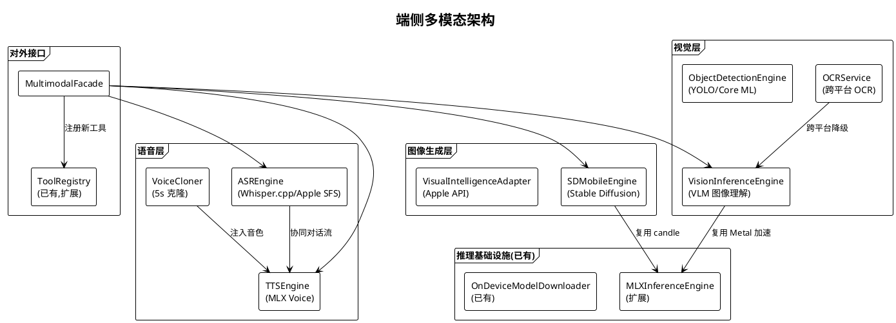
```plantuml
@startuml
!theme plain
title 端侧多模态架构
skinparam componentStyle rectangle
skinparam packageStyle frame

package "视觉层" {
    [VisionInferenceEngine\n(VLM 图像理解)] as VLM
    [OCRService\n(跨平台 OCR)] as OCR
    [ObjectDetectionEngine\n(YOLO/Core ML)] as Det
}

package "语音层" {
    [ASREngine\n(Whisper.cpp/Apple SFS)] as ASR
    [TTSEngine\n(MLX Voice)] as TTS
    [VoiceCloner\n(5s 克隆)] as Clone
}

package "图像生成层" {
    [SDMobileEngine\n(Stable Diffusion)] as SD
    [VisualIntelligenceAdapter\n(Apple API)] as VI
}

package "推理基础设施(已有)" {
    [MLXInferenceEngine\n(扩展)] as MLX
    [OnDeviceModelDownloader\n(已有)] as DL
}

package "对外接口" {
    [MultimodalFacade] as Facade
    [ToolRegistry\n(已有,扩展)] as TR
}

VLM --> MLX : 复用 Metal 加速
OCR --> VLM : 跨平台降级
ASR --> TTS : 协同对话流
Clone --> TTS : 注入音色
SD --> MLX : 复用 candle
Facade --> VLM
Facade --> ASR
Facade --> TTS
Facade --> SD
Facade --> TR : 注册新工具
@enduml
```

#### 4.1.3 数据流图：拍照即问

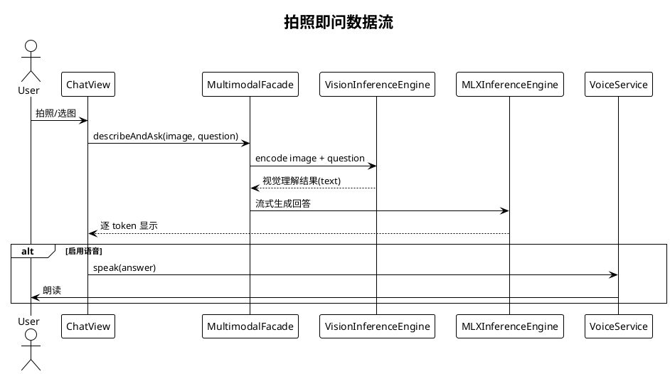
```plantuml
@startuml
!theme plain
title 拍照即问数据流

actor User
participant "ChatView" as UI
participant "MultimodalFacade" as Facade
participant "VisionInferenceEngine" as VLM
participant "MLXInferenceEngine" as MLX
participant "VoiceService" as Voice

User -> UI : 拍照/选图
UI -> Facade : describeAndAsk(image, question)
Facade -> VLM : encode image + question
VLM --> Facade : 视觉理解结果(text)
Facade -> MLX : 流式生成回答
MLX --> UI : 逐 token 显示
alt 启用语音
    UI -> Voice : speak(answer)
    Voice -> User : 朗读
end
@enduml
```

#### 4.1.4 端侧视觉

- **VLM 图像理解**：选用 MLX 适配的 Llama 3.2 Vision（11B/90B 量化版）与 Qwen2-VL（2B/7B Q4）作为备选；iPhone 15 Pro 限定 2B 量化版本，Mac 上可加载 7B+。复用 `MLXInferenceEngine` 的 `ModelContainer.load` 路径，扩展 `generate(prompt:images:)` 接口。
- **OCR 跨平台化**：iOS 上 Vision 已支持 `VNRecognizeTextRequest`，将 `OCRTool` 移除 `import AppKit` 依赖改为 `#if os(macOS)` 截屏分支 + iOS PhotosUI 取图分支；Vision API 跨平台共享。
- **目标检测**：Core ML 集成 YOLOv8n（nano，3.2M 参数）mlmodelc，输出边界框；用于"指着物体提问"场景。

#### 4.1.5 端侧语音

- **ASR 升级**：默认 SFSpeechRecognizer（在线），离线降级 Whisper.cpp（tiny/base 量化版，base 模型 ~150MB）。通过 `ASREngine` 协议抽象，`VoiceService` 持有具体实现。
- **TTS 升级**：引入 MLX Voice（Apple 开源 Kokoro/Matcha-TTS 端侧版），自然度远超 AVSpeechSynthesizer；通过 `TTSEngine` 协议抽象，`VoiceService` 内部委托。
- **语音克隆**：5 秒样本克隆，基于 OpenVoice v2 端侧蒸馏版本（~300MB）；用户首次录音后生成音色嵌入存 Keychain，后续 TTS 注入。

#### 4.1.6 端侧图像生成

- **Stable Diffusion Mobile**：复用 apple/swift-coreml Stable Diffusion 适配（512x512 20 step），Mac 上 8GB 内存可用；iPhone 15 Pro 上启用 256x256 4 step 加速版。
- **Apple Visual Intelligence API**：iOS 18.1+/macOS 15.1+ 系统级图像理解/生成 API（如适用），作为兜底与系统集成入口。

#### 4.1.7 内存预算与性能基线

| 设备 | 总内存 | 多模态预算 | 视觉模型 | 语音模型 | 图像生成 |
|------|--------|-----------|----------|----------|----------|
| iPhone 15 Pro (8GB) | 8GB | ≤3GB | 2B Q4(1.5GB) | Whisper tiny(75MB) | 禁用 |
| iPad Pro (16GB) | 16GB | ≤6GB | 7B Q4(4.5GB) | Whisper base(150MB) | SD Mobile(2GB) |
| Mac (16GB+) | 16GB+ | ≤8GB | 11B Q4(7GB) | Whisper base(150MB) | SD Mobile(4GB) |

**性能基线**：首 token 延迟 ≤2s（VLM）、≤500ms（ASR）；token/s ≥10（iPhone）/≥20（Mac）；OCR ≤300ms（1080p）；图像生成 ≤15s（Mac）/≤30s（iPad）；连续对话 30 分钟耗电 ≤15%。

#### 4.1.8 剩余实施路径

- **阶段 1（视觉理解）**：扩展 `MLXInferenceEngine.generate(prompt:images:)`；实现 `VisionInferenceEngine`；改造 `OCRTool` 跨平台；注册 `describe_image` 工具。交付：拍照即问可用。
- **阶段 2（语音增强）**：实现 `ASREngine` / `TTSEngine` 协议与 Whisper.cpp 集成；`VoiceService` 支持切换引擎；保留 SFSpeechRecognizer 默认。交付：离线 ASR 可用。
- **阶段 3（语音克隆）**：实现 `VoiceCloner`（OpenVoice v2 蒸馏）；新增 `clone_voice` 工具与音色管理 UI。交付：5s 克隆可用。
- **阶段 4（图像生成）**：集成 apple/swift-coreml Stable Diffusion；实现 `SDMobileEngine`；新增 `generate_image` 工具；iOS 18.1+ 接入 Visual Intelligence。交付：离线图像生成。
- **阶段 5（性能基线）**：建立多设备基准测试集，采集首 token 延迟、token/s、内存峰值、耗电；输出性能基线文档。交付：可验收的性能数据。

#### 4.1.9 风险评估

| 风险 | 等级 | 影响 | 缓解措施 |
|------|------|------|----------|
| VLM 模型体积超出 iPhone 内存 | 高 | 加载失败 | 设备能力分级（2B/7B/11B），按设备加载 |
| Whisper.cpp 与 MLX 内存冲突 | 中 | OOM | 互斥使用、空闲卸载 |
| 语音克隆滥用（深度伪造） | 高 | 伦理/法律 | 仅本人音色、加水印、明确告知 |
| SD Mobile 推理发热严重 | 中 | 体验差 | 限制 step、散热提示 |
| Apple Visual Intelligence API 变更 | 中 | 兜底失效 | 保留 SD 路径作为备选 |
| 模型下载流量大 | 中 | 用户不满 | 仅 WiFi 下载、增量更新 |
| Core ML 模型转换精度损失 | 中 | 检测漏检 | 保留 ONNX 验证集对比 |
| 多模态并发内存峰值 | 高 | App 崩溃 | 全局内存预算器、超限自动降级 |

#### 4.1.10 验收标准

1. `MLXInferenceEngine.generate(prompt:images:)` 能在 iPhone 15 Pro 上加载 Qwen2-VL-2B Q4 模型并完成图像理解，首 token 延迟 ≤2s。
2. `OCRTool` 在 iOS 与 macOS 上均可执行 OCR，跨平台测试通过。
3. `VoiceService` 能切换 SFSpeechRecognizer 与 Whisper.cpp 引擎，离线状态下 Whisper tiny 能完成中文识别（WER ≤15%）。
4. `VoiceCloner` 接受 5 秒样本生成定制音色，TTS 自然度评分（MOS）≥3.5。
5. `SDMobileEngine` 在 Mac 上 512x512 20 step 图像生成 ≤15s，内存峰值 ≤4GB。
6. `MultimodalFacade` 4 个接口全部实现并注册到 `ToolRegistry`，LLM 可调用 4 个新工具。
7. 设备能力分级正确：iPhone 15 Pro 自动选择 2B 模型，Mac 自动选择 11B 模型。
8. 连续 30 分钟多模态对话耗电 ≤15%，无 OOM 崩溃。
9. `VisionInferenceEngineTests` / `ASREngineTests` / `TTSEngineTests` / `VoiceClonerTests` / `SDMobileEngineTests` 全部通过。
10. `MLXInferenceEngine` / `VoiceService` / `OCRTool` 对外接口保持兼容，现有调用方零改动。

---

### 4.2 插件系统（2026-07-17，🟡 部分实施 → v1.1 扩展）

> **统合来源**：原 `doc/plans/2026-07-17-plugin-system.md`（已统合到本文档）
>
> **已实现（v1.0）**：PluginManager / PluginSandbox wasmtime / PluginToolAdapter
>
> **已实现（v1.1 新增）**：manifest 扩展（dependencies / hooks / downloadURL / signature / minAppVersion）/ PluginPermission 扩展（health / location / photoLibrary）/ PluginMarketplaceService（远程 manifest 列表 + 下载 + Ed25519 签名校验 + 搜索）/ PluginMarketplaceView（列表 + 详情 + 下载进度）/ loadPluginTools 正式接入 ToolRegistry / PluginToolAdapter 使用 JavaScriptCore 执行 JS 插件
>
> **规划中**：版本管理与热更新 / 进程隔离（XPC）/ SwiftData Container 数据隔离 / 审计日志

#### 4.2.1 背景与目标

Aether 已在 `Packages/AetherCore/Sources/AetherServices/Plugin/` 下实现 `PluginManager`（安装/卸载/版本管理/热更新）、`PluginSandbox`（声明式权限校验 + Rust wasmtime 真隔离）、`PluginToolAdapter`（工具适配），并在 `PluginManifest.swift` 中定义了 manifest 结构（id/name/version/author/tools/permissions/entryPoint）。`PluginSandbox` 已在 macOS 上集成 wasmtime（iOS 降级为声明式伪沙箱），支持 fuel 与内存限额。但当前系统仍存在缺口：manifest 格式未标准化（无 hooks 字段）、版本管理仅占位（`checkForUpdates` 返回 nil）、无分发渠道、权限粒度粗（仅 network/fileSystem/clipboard 三类）、无审计日志。

**目标：**

1. 标准化插件 manifest 格式（JSON，含 name/version/permissions/tools/hooks）。
2. 完善沙箱隔离方案（WASM 沙箱为主、进程隔离为辅、SwiftData Container 数据隔离）。
3. 实现语义化版本管理与依赖解析。
4. 建立多分发渠道（官方市场/GitHub/本地/企业私有）。
5. 扩展现有 `PluginManager` / `PluginSandbox`，不替换。
6. 细化安全模型（权限粒度、用户授权、审计日志）。

#### 4.2.2 架构图

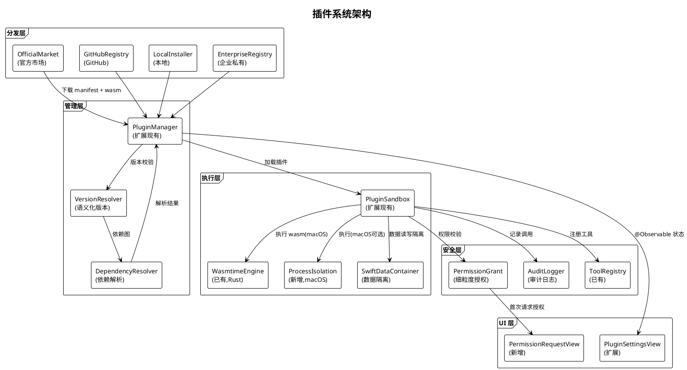
```plantuml
@startuml
!theme plain
title 插件系统架构
skinparam componentStyle rectangle
skinparam packageStyle frame

package "分发层" {
    [OfficialMarket\n(官方市场)] as Market
    [GitHubRegistry\n(GitHub)] as GH
    [LocalInstaller\n(本地)] as Local
    [EnterpriseRegistry\n(企业私有)] as Ent
}

package "管理层" {
    [PluginManager\n(扩展现有)] as PM
    [VersionResolver\n(语义化版本)] as VR
    [DependencyResolver\n(依赖解析)] as DR
}

package "执行层" {
    [PluginSandbox\n(扩展现有)] as PS
    [WasmtimeEngine\n(已有,Rust)] as Wasm
    [ProcessIsolation\n(新增,macOS)] as Proc
    [SwiftDataContainer\n(数据隔离)] as SDC
}

package "安全层" {
    [PermissionGrant\n(细粒度授权)] as Perm
    [AuditLogger\n(审计日志)] as Audit
    [ToolRegistry\n(已有)] as TR
}

package "UI 层" {
    [PluginSettingsView\n(扩展)] as UI
    [PermissionRequestView\n(新增)] as PR
}

Market --> PM : 下载 manifest + wasm
GH --> PM
Local --> PM
Ent --> PM
PM --> VR : 版本校验
VR --> DR : 依赖图
DR --> PM : 解析结果
PM --> PS : 加载插件
PS --> Wasm : 执行 wasm(macOS)
PS --> Proc : 执行(macOS可选)
PS --> SDC : 数据读写隔离
PS --> Perm : 权限校验
Perm --> PR : 首次请求授权
PS --> TR : 注册工具
PS --> Audit : 记录调用
PM --> UI : @Observable 状态
@enduml
```

#### 4.2.3 数据流图：插件安装与执行

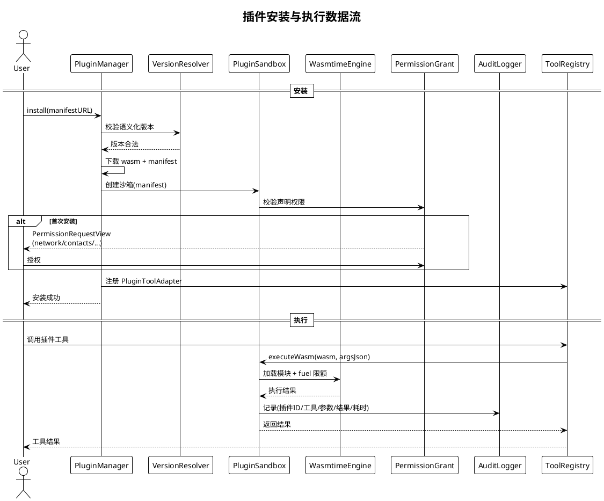
```plantuml
@startuml
!theme plain
title 插件安装与执行数据流

actor User
participant "PluginManager" as PM
participant "VersionResolver" as VR
participant "PluginSandbox" as PS
participant "WasmtimeEngine" as Wasm
participant "PermissionGrant" as Perm
participant "AuditLogger" as Audit
participant "ToolRegistry" as TR

== 安装 ==
User -> PM : install(manifestURL)
PM -> VR : 校验语义化版本
VR --> PM : 版本合法
PM -> PM : 下载 wasm + manifest
PM -> PS : 创建沙箱(manifest)
PS -> Perm : 校验声明权限
alt 首次安装
    Perm --> User : PermissionRequestView\n(network/contacts/...)
    User -> Perm : 授权
end
PM -> TR : 注册 PluginToolAdapter
PM --> User : 安装成功

== 执行 ==
User -> TR : 调用插件工具
TR -> PS : executeWasm(wasm, argsJson)
PS -> Wasm : 加载模块 + fuel 限额
Wasm --> PS : 执行结果
PS -> Audit : 记录(插件ID/工具/参数/结果/耗时)
PS --> TR : 返回结果
TR --> User : 工具结果
@enduml
```

#### 4.2.4 插件 Manifest 格式

```json
{
  "id": "com.aether.plugin.weather-plus",
  "name": "天气增强",
  "version": "1.2.0",
  "author": "Aether Contributors",
  "description": "增强的天气查询插件",
  "minAppVersion": "1.0.0",
  "dependencies": [
    { "id": "com.aether.plugin.geo-base", "version": ">=1.0.0" }
  ],
  "permissions": [
    { "type": "network", "reason": "获取天气数据" },
    { "type": "location", "reason": "本地天气查询" }
  ],
  "tools": [
    {
      "name": "get_forecast",
      "description": "获取 7 天预报",
      "parameters": { "type": "object", "properties": { "city": { "type": "string" } } }
    }
  ],
  "hooks": [
    { "event": "message_received", "handler": "onMessage" }
  ],
  "entryPoint": "main.wasm",
  "signature": "base64-ed25519-signature"
}
```

#### 4.2.5 沙箱隔离方案

**三层隔离：**

1. **WASM 沙箱（主）**：复用 `PluginSandbox.executeWasm()`，Rust wasmtime 强制 fuel（CPU）与线性内存上限。iOS 降级为声明式权限校验（无 WASM 执行）。
2. **进程隔离（辅，macOS）**：高风险插件（声明 `fileSystem` + `network`）可选在独立 `XPC` 子进程执行，崩溃不影响主进程。
3. **SwiftData Container（数据隔离）**：每个插件分配独立 SwiftData Store（`plugin_<id>.store`），插件间数据不可互访；主 App 通过 `PluginDataBridge` 协议按需读取。

#### 4.2.6 版本管理与依赖解析

- **语义化版本**：`MAJOR.MINOR.PATCH`，`VersionResolver` 校验 `version` 与 `minAppVersion` 兼容性。
- **依赖解析**：`DependencyResolver` 构建依赖图，使用回溯算法解析版本约束（`>=1.0.0` / `^1.2.0` / `~1.2.0`）；检测冲突并报错。
- **兼容性检查**：安装前校验 `minAppVersion` ≤ 当前 App 版本；卸载时检查是否有其他插件依赖，有则警告。

#### 4.2.7 分发渠道

| 渠道 | 协议 | 签名 | 适用场景 |
|------|------|------|----------|
| 官方市场 | HTTPS + manifest 索引 | 必须 | 普通用户 |
| GitHub | Release URL + manifest | 推荐 | 开源社区 |
| 本地安装 | 文件选择器 | 可选 | 开发调试 |
| 企业私有 | HTTPS + 企业证书 | 必须 | 企业内网 |

#### 4.2.8 剩余实施路径

- **阶段 1（Manifest 标准化）**：扩展 `PluginManifest` 增加 `dependencies` / `hooks` / `minAppVersion` / `signature` 字段；扩展 `PluginPermission.PermissionType` 增加细粒度权限。交付：标准化格式。
- **阶段 2（版本与依赖）**：实现 `VersionResolver` 与 `DependencyResolver`，替换 `checkForUpdates` 占位实现。交付：依赖解析可用。
- **阶段 3（分发渠道）**：实现 `installFromURL`（官方市场/GitHub/企业），扩展 `PluginSettingsView` 浏览与安装 UI。交付：多渠道分发。
- **阶段 4（数据隔离与审计）**：实现 `SwiftDataContainer` 与 `PluginDataBridge`；接入 `AuditLogger`（复用 `ToolAuditLogger`）。交付：数据隔离与审计。
- **阶段 5（进程隔离）**：macOS 实现 `executeInProcess`（XPC），高风险插件可选启用。交付：强隔离。
- **阶段 6（ToolRegistry 接入）**：修复 `loadPluginTools` TODO，正式注册 `PluginToolAdapter` 到 `ToolRegistry`。交付：插件工具可用。

#### 4.2.9 风险评估

| 风险 | 等级 | 影响 | 缓解措施 |
|------|------|------|----------|
| 恶意插件 WASM 逃逸 | 高 | 系统破坏 | wasmtime 沙箱 + 签名校验 + macOS XPC 兜底 |
| 插件权限滥用（过度申请） | 高 | 隐私泄露 | 用户逐项授权 + 审计日志 + 市场审核 |
| 依赖解析死循环 | 中 | 安装卡死 | 依赖图深度限制 10、超时熔断 |
| iOS 无 WASM 执行能力 | 高 | iOS 插件不可用 | iOS 降级为声明式 + 远程 BFF 执行 |
| 插件冲突（同名工具） | 中 | 工具调用错乱 | 工具名加插件 ID 前缀 `pluginID__toolName` |
| 企业私有仓库凭证泄露 | 高 | 企业数据泄露 | OAuth2 + 证书 pinning |
| 热更新后状态不一致 | 中 | 插件异常 | 热更新前卸载工具、更新后重新加载 |
| 审计日志膨胀 | 低 | 存储占用 | 30 天自动清理、可导出后清理 |

#### 4.2.10 验收标准

1. `PluginManifest` 支持完整字段（含 `dependencies` / `hooks` / `minAppVersion` / `signature`），Codable 往返测试通过。
2. `VersionResolver` 正确解析 `>=1.0.0` / `^1.2.0` / `~1.2.0` 三种约束；`DependencyResolver` 检测循环依赖并报错。
3. macOS 上 `PluginSandbox.executeWasm` 执行带 fuel 限额的 WASM，超限时返回 `ok:false`。
4. 首次安装插件时 `PermissionRequestView` 展示所有声明权限与 `reason`，用户拒绝的权限对应工具调用被拦截。
5. 每个插件的 SwiftData 数据存储于独立 `plugin_<id>.store`，插件 A 无法读取插件 B 的数据。
6. 插件工具调用经 `AuditLogger` 记录，设置页可查看最近 100 条日志并导出 JSON。
7. 通过 `installFromURL` 可从 HTTPS 链接安装插件，manifest 签名不匹配时拒绝安装。
8. `PluginManager.loadPluginTools` 正式将 `PluginToolAdapter` 注册到 `ToolRegistry`，LLM 可调用插件工具。
9. `VersionResolverTests`、`DependencyResolverTests`、`SwiftDataContainerTests`、`AuditLoggerTests` 全部通过。
10. `PluginManager` / `PluginSandbox` 对外接口保持兼容，现有调用方零改动。

---

## 五、仅规划阶段

### 5.1 团队协作（2026-07-17，🟢 仅规划）

> **统合来源**：原 `doc/plans/2026-07-17-team-collaboration.md`（已统合到本文档）
>
> **当前为单用户产品**，组织 / 权限 / 共享 / SSO / 审计全部未实现

#### 5.1.1 背景与目标

Aether 当前为单用户端侧产品：SwiftData 本地存储 `Conversation` / `ChatMessage` / `Memory` 等模型，BFF（`CloudflareWorkers/`）仅做个人 LLM 代理与限流，KV `bff_tokens` 按 token 维度记录用户身份，D1 `DB` 存储对话/记忆/RAG 文档。无组织、团队、共享、协作概念，无 SSO/审计/合规能力，不满足企业部署与商业化分层需求。

**目标：**

1. 设计三层组织模型：个人 / 团队 / 企业。
2. 设计四级权限粒度：管理员 / 成员 / 只读 / 访客。
3. 实现共享机制：对话模板 / 知识库 / 工具配置 / Prompt 库。
4. 实现多用户协作：实时共同编辑 / 评论 / 版本历史。
5. 扩展 BFF 代理层：新增团队 API / 组织管理 / 计费。
6. 提供企业功能：SSO / 审计日志 / 合规 / DLP。
7. 设计商业化模式：免费 / Pro / Team / Enterprise。

#### 5.1.2 架构图

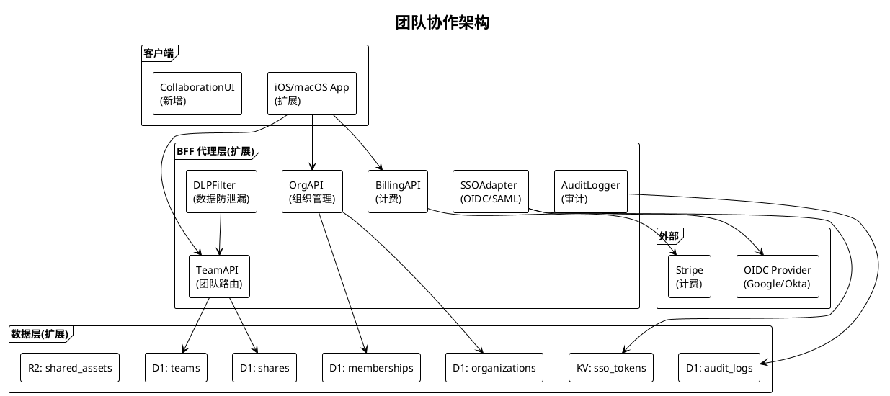
```plantuml
@startuml
!theme plain
title 团队协作架构
skinparam componentStyle rectangle
skinparam packageStyle frame

package "客户端" {
    [iOS/macOS App\n(扩展)] as App
    [CollaborationUI\n(新增)] as UI
}

package "BFF 代理层(扩展)" {
    [TeamAPI\n(团队路由)] as Team
    [OrgAPI\n(组织管理)] as Org
    [BillingAPI\n(计费)] as Bill
    [AuditLogger\n(审计)] as Audit
    [DLPFilter\n(数据防泄漏)] as DLP
    [SSOAdapter\n(OIDC/SAML)] as SSO
}

package "数据层(扩展)" {
    [D1: organizations] as OrgTbl
    [D1: teams] as TeamTbl
    [D1: memberships] as MemTbl
    [D1: shares] as ShareTbl
    [D1: audit_logs] as LogTbl
    [KV: sso_tokens] as SSO_KV
    [R2: shared_assets] as R2
}

package "外部" {
    [OIDC Provider\n(Google/Okta)] as OIDC
    [Stripe\n(计费)] as Stripe
}

App --> Team
App --> Org
App --> Bill
Team --> TeamTbl
Org --> OrgTbl
Org --> MemTbl
Team --> ShareTbl
Bill --> Stripe
Audit --> LogTbl
SSO --> SSO_KV
SSO --> OIDC
DLP --> Team
@enduml
```

#### 5.1.3 数据流图：团队对话协作

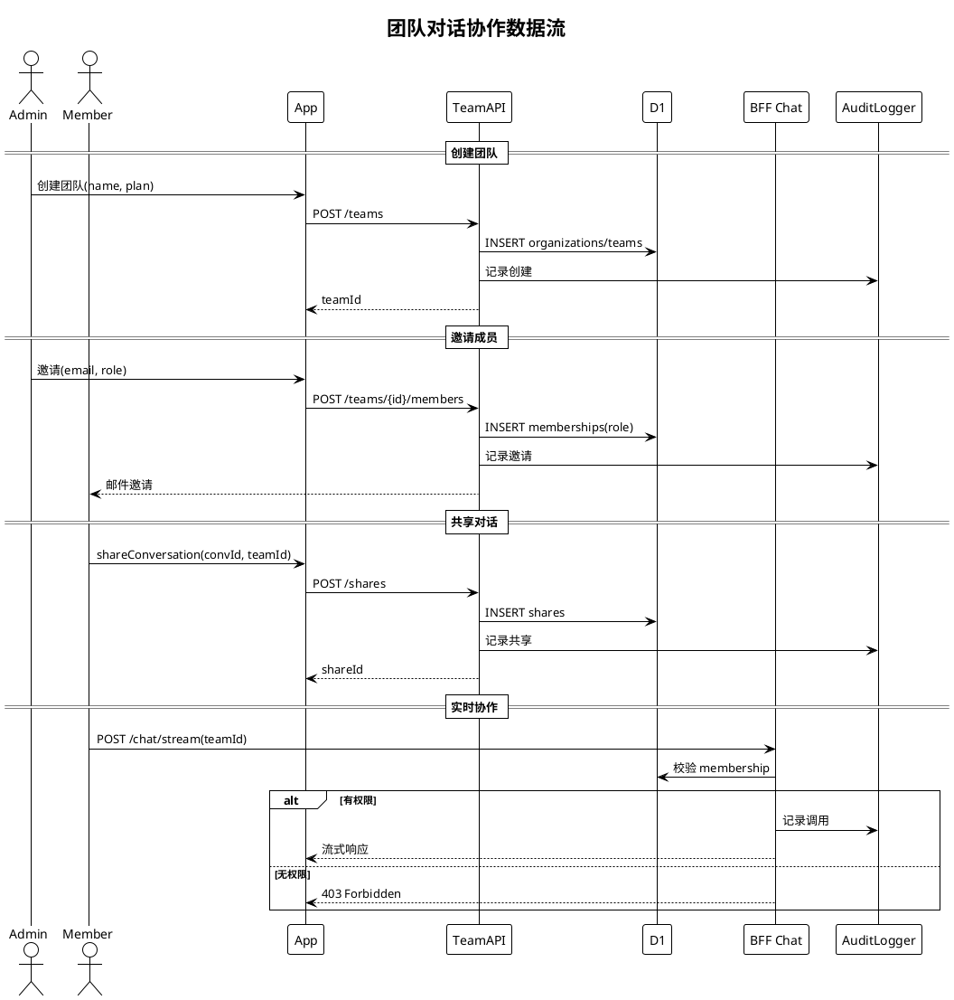
```plantuml
@startuml
!theme plain
title 团队对话协作数据流

actor Admin
actor Member
participant "App" as App
participant "TeamAPI" as Team
participant "D1" as DB
participant "BFF Chat" as Chat
participant "AuditLogger" as Audit

== 创建团队 ==
Admin -> App : 创建团队(name, plan)
App -> Team : POST /teams
Team -> DB : INSERT organizations/teams
Team -> Audit : 记录创建
Team --> App : teamId

== 邀请成员 ==
Admin -> App : 邀请(email, role)
App -> Team : POST /teams/{id}/members
Team -> DB : INSERT memberships(role)
Team -> Audit : 记录邀请
Team --> Member : 邮件邀请

== 共享对话 ==
Member -> App : shareConversation(convId, teamId)
App -> Team : POST /shares
Team -> DB : INSERT shares
Team -> Audit : 记录共享
Team --> App : shareId

== 实时协作 ==
Member -> Chat : POST /chat/stream(teamId)
Chat -> DB : 校验 membership
alt 有权限
    Chat -> Audit : 记录调用
    Chat --> App : 流式响应
else 无权限
    Chat --> App : 403 Forbidden
end
@enduml
```

#### 5.1.4 三层组织模型

- **个人（Personal）**：单用户，免费层，本地 SwiftData + 可选云同步，无团队功能。
- **团队（Team）**：1-50 人，单一组织下可创建多个团队，共享知识库与 Prompt 库，支持成员间协作。
- **企业（Enterprise）**：50+ 人，多团队 + 多组织层级，SSO 集成、审计日志、DLP、合规报告、专属 BFF 实例。

#### 5.1.5 权限粒度

| 角色 | 权限 | 适用 |
|------|------|------|
| 管理员（admin） | 全部管理 + 计费 + 审计 + 成员管理 | 团队/企业所有者 |
| 成员（member） | 创建/编辑自己的 + 共享读取 + 工具调用 | 普通成员 |
| 只读（readonly） | 仅读取共享资源，无编辑/工具调用 | 外部审阅者 |
| 访客（guest） | 受限访问指定资源，限时 | 跨组织协作 |

权限通过 D1 `memberships` 表的 `role` 字段记录，BFF 每次请求校验 `auth.userId` 是否为目标资源所属 team 的成员及对应角色。

#### 5.1.6 共享机制

- **对话模板**：用户可将常用对话保存为模板，团队内可见，新对话可基于模板创建。D1 新增 `conversation_templates` 表。
- **知识库（RAG）**：团队共享 RAG 文档库，存储于 R2（`shared_assets` bucket），团队成员可上传/检索；个人知识库与团队知识库隔离。
- **工具配置**：团队管理员统一配置 `ToolRegistry` 启用状态与权限策略，下发到成员设备；团队成员不可修改高危工具配置。
- **Prompt 库**：团队共享 Prompt 模板（系统提示词、Few-shot 示例），D1 新增 `prompt_library` 表，支持版本管理与标签分类。

#### 5.1.7 多用户协作

- **实时共同编辑**：基于 BFF SSE 推送（复用 `chat/stream` 通道），多成员同时编辑对话时通过 CRDT 合并光标位置与增量内容。
- **评论**：消息粒度评论，D1 新增 `comments` 表，关联 `message_id`，支持回复与 @ 提及。
- **版本历史**：对话每次保存生成版本快照（diff 形式），D1 新增 `conversation_versions` 表，支持回滚与对比。

#### 5.1.8 企业功能

- **SSO**：支持 OIDC（Google / Okta / Azure AD）与 SAML 2.0，`SSOAdapter` 与 IdP 交换 code 换 token，存入 KV `sso_tokens`。
- **审计日志**：所有团队/企业 API 调用经 `AuditLogger` 记录（actor / action / resource / timestamp / ip），D1 `audit_logs` 表，保留 1 年，可导出 CSV。
- **合规**：支持 GDPR 数据导出与删除请求（`/organizations/{id}/data-export` / `data-deletion`）；SOC 2 友好的日志与权限隔离。
- **DLP**：`DLPFilter` 在 BFF 层拦截敏感数据（信用卡号 / 身份证 / 自定义关键词），命中时拒绝写入共享资源并审计告警。

#### 5.1.9 商业化模式

| 套餐 | 价格 | 成员数 | 功能 | 适用 |
|------|------|--------|------|------|
| 免费 | $0 | 1 | 本地推理 + 有限云端 | 个人尝鲜 |
| Pro | $9.9/月 | 1 | 无限云端 + 端侧 MLX + RAG | 个人专业 |
| Team | $19.9/人/月 | ≤50 | Pro + 团队共享 + 协作 + 5GB R2 | 团队 |
| Enterprise | 定制 | 不限 | Team + SSO + 审计 + DLP + 专属 BFF | 企业 |

#### 5.1.10 技术选型

| 选项 | 说明 | 优点 | 缺点 | 选用 |
|------|------|------|------|------|
| 协作：CRDT | 自动合并 | 无冲突 | 复杂 | ✅（Yjs 移植） |
| 协作：OT | 经典 | 成熟 | 需中心化 | ❌ |
| 实时推送：SSE | 已用 | 复用 BFF | 单向 | ✅ |
| 实时推送：WebSocket | 双向 | 实时 | Workers 不原生支持 | ❌ |
| SSO：OIDC | 现代标准 | 主流 | 配置复杂 | ✅ |
| SSO：SAML 2.0 | 企业标准 | 兼容老 IdP | XML 重 | ✅（企业） |
| 计费：Stripe | 主流 | 全球 | 抽成 | ✅ |
| DLP：正则 + 关键词 | 简单 | 易实现 | 误报 | ✅ |
| DLP：ML 分类 | 智能 | 准确 | 训练成本 | ❌（远期） |

#### 5.1.11 实施路径

- **阶段 1（数据模型）**：D1 `schema.sql` 增加 8 张团队/企业表；BFF `matchRoute` 增加 `/teams` / `/organizations` 路由骨架。交付：可存储团队数据。
- **阶段 2（团队 CRUD 与权限）**：实现 `teams.js` / `organizations.js`；权限校验中间件；成员邀请邮件。交付：团队基础功能可用。
- **阶段 3（共享与协作）**：实现对话模板 / 知识库共享（R2）/ Prompt 库；CRDT 实时协作；评论与版本历史。交付：协作能力可用。
- **阶段 4（企业功能）**：实现 `SSOAdapter`（OIDC + SAML）；`AuditLogger`；`DLPFilter`；GDPR 端点。交付：企业就绪。
- **阶段 5（计费与商业化）**：集成 Stripe；实现 `billing.js` 套餐切换与用量计费；客户端订阅 UI。交付：可商业化。

#### 5.1.12 风险评估

| 风险 | 等级 | 影响 | 缓解措施 |
|------|------|------|----------|
| 多成员并发写入冲突 | 高 | 数据丢失 | CRDT 合并 + 乐观锁 |
| 权限校验遗漏 | 高 | 越权访问 | 中间件统一校验 + 单测覆盖 |
| SSO IdP 兼容性差异 | 中 | 集成失败 | 主流 IdP 测试矩阵 + 文档 |
| 审计日志膨胀 | 中 | 存储成本 | 1 年保留 + 自动归档 R2 |
| DLP 误报阻断正常业务 | 中 | 体验差 | 命中可申诉、白名单机制 |
| Stripe 计费 webhook 失败 | 中 | 套餐错乱 | 幂等处理 + 重试 + 对账 |
| R2 共享资源泄露 | 高 | 数据外泄 | 预签名 URL + 短时效 + 成员校验 |
| 个人/团队数据混用 | 中 | 隐私问题 | 强制 team_id 隔离 + 单测 |
| 跨地域 BFF 延迟 | 中 | 体验差 | Cloudflare 多区域部署 |
| 合规要求变化 | 中 | 重构 | 模块化设计、预留扩展点 |

#### 5.1.13 验收标准

1. D1 `schema.sql` 包含 8 张团队/企业表，迁移脚本可幂等执行。
2. `POST /teams` 创建团队返回 `teamId`，`POST /teams/{id}/members` 邀请成员后成员可在其 App 中看到团队。
3. 管理员可共享对话模板 / Prompt 库，团队成员可读取使用，非成员返回 403。
4. 团队知识库上传到 R2，预签名 URL 仅团队成员可访问，URL 时效 ≤1 小时。
5. 多成员同时编辑同一对话时，CRDT 合并无冲突，SSE 推送延迟 ≤500ms。
6. 消息粒度评论可创建/回复/@提及，关联 `message_id` 正确。
7. 对话版本历史保留最近 50 个版本，可回滚至任意版本。
8. OIDC SSO 流程能完成 Google 登录，access_token 存入 KV `sso_tokens`。
9. 所有团队 API 调用经 `AuditLogger` 记录，可在 `/audit?team_id=` 查询并导出 CSV。
10. `DLPFilter` 拦截信用卡号写入共享资源，命中时返回 422 并审计告警。
11. Stripe 计费 webhook 幂等处理，套餐切换实时生效。
12. `teams.js` / `organizations.js` / `billing.js` / `audit.js` / `SSOAdapterTests` / `DLPFilterTests` / `AuditLoggerTests` 全部通过。

---

### 5.2 visionOS 适配（2026-07-17，🟢 仅规划）

> **统合来源**：原 `doc/plans/2026-07-17-visionos-adaptation.md`（已统合到本文档）
>
> Xcode 工程无 visionOS target，3D UI / 空间手势 / 沉浸式场景全部未实现

#### 5.2.1 背景与目标

Aether 现已覆盖 iOS / iPad / macOS 三端原生 SwiftUI，使用 `#if os(iOS)` 条件编译与 `@Observable` / `@MainActor` 架构。视觉语言为液态玻璃 + 深空主题（`LiquidGlass` / `DeepSpace` / `NebulaGlow` 色板），契合 visionOS 空间计算美学。但当前 Xcode 工程未声明 visionOS target，`AetherCore` SPM 包仅声明 `.iOS(.v17)` / `.macOS(.v14)`，未适配 visionOS；UI 层依赖 `UIKit/AppKit` 的工具（ScreenshotTool、AppleScriptTool 等）与平台无关 UI 组件均需重新评估空间化呈现。

**目标：**

1. 在 Xcode 工程中新增 visionOS target，将 `AetherCore` SPM 平台声明扩展至 visionOS 1.0+。
2. 设计 3D 对话界面（沉浸式气泡 / 空间排列 / depth 层级），复用 SwiftUI 70%+ 代码。
3. 引入空间手势交互（捏合发送 / 滑动滚动 / 注视聚焦）。
4. 设计沉浸式场景（环境光照 / 玻璃材质 / parallax）。
5. 适配工具（SpatialTool / PinchTool / GazeTool），处理 Apple Vision Pro 硬件限制。
6. 保持现有 iOS/macOS 代码零改动。

#### 5.2.2 现状分析

| 维度 | 现状 | 文件位置 | 缺口 |
|------|------|----------|------|
| SPM 平台 | `.iOS(.v17)` / `.macOS(.v14)` | `AetherCore/Package.swift:6-9` | 无 visionOS 声明 |
| Xcode target | Aether-iOS / Aether-macOS / Watch / Widgets | `Aether.xcodeproj` | 无 visionOS target |
| UI 组件 | `MessageBubble` / `ChatView` 等 2D 组件 | `Aether/Views/Chat/` | 无 3D 空间化 |
| 设计令牌 | `LiquidGlass` / `DeepSpace` 等色板 | `ColorTokens.swift` | 已可复用，未做 depth |
| 平台工具 | 25 个工具，11 个 macOS 独有 | `ToolRegistry.swift` | visionOS 工具完全缺失 |
| 手势交互 | 触摸 / 鼠标 / 键盘 | `ChatInputBar.swift` | 无 pinch / gaze |
| 资源 | `Assets.xcassets` 8 语本地化 | `Resources/` | 需补 visionOS 适配 |

#### 5.2.3 架构图

```plantuml
@startuml
!theme plain
title visionOS 适配架构
skinparam componentStyle rectangle
skinparam packageStyle frame

package "visionOS App Target" {
    [AetherApp-visionOS\n(入口)] as App
    [SpatialChatView\n(3D 对话)] as SCV
    [ImmersiveSceneView\n(沉浸场景)] as ISV
    [SpatialInputManager\n(手势/眼动)] as SIM
}

package "复用层(SwiftUI 70%+)" {
    [ChatViewModel\n(已有)] as VM
    [MessageBubble\n(扩展)] as MB
    [ConversationList\n(已有)] as CL
    [DesignTokens\n(已有)] as DT
    [ToolRegistry\n(扩展)] as TR
}

package "空间化工具" {
    [SpatialTool\n(空间锚定)] as ST
    [PinchTool\n(捏合手势)] as PT
    [GazeTool\n(注视聚焦)] as GT
}

package "平台抽象" {
    [PlatformAdapter\n(条件编译)] as PA
    [OnDeviceInference\n(已有 MLX)] as ODI
}

App --> SCV
App --> ISV
SCV --> VM : @Observable
SCV --> MB : 3D 渲染
SCV --> SIM : 输入事件
SIM --> SCV : pinch/gaze 回调
ISV --> DT : 复用色板
ST --> TR : 注册
PT --> TR : 注册
GT --> TR : 注册
PA --> App : #if os(visionOS)
@enduml
```

#### 5.2.4 数据流图：空间交互

```plantuml
@startuml
!theme plain
title 空间手势与对话数据流

actor User
participant "SpatialInputManager" as SIM
participant "SpatialChatView" as SCV
participant "ChatViewModel" as VM
participant "ToolRegistry" as TR
participant "ImmersiveSceneView" as ISV

User -> SIM : 眼动注视气泡
SIM -> SCV : gazeFocus(messageId)
User -> SIM : 捏合手势
SIM -> SCV : pinch(commit)
alt 发送消息
    SCV -> VM : send(text)
    VM -> TR : 工具调用
    TR --> VM : 结果
    VM --> SCV : @Observable 更新
    SCV -> ISV : 触发沉浸式反馈(光晕)
else 滑动滚动
    SIM -> SCV : swipe(direction)
    SCV -> SCV : 滚动消息列表
end
@enduml
```

#### 5.2.5 3D 对话界面设计

- **沉浸式气泡**：每条消息渲染为 3D 玻璃材质球体或圆角立方体，使用 `RealityView` + `MeshResource.generateSphere`，材质采用 `PhysicallyBasedMaterial` 配合 `LiquidGlass` 色板半透明效果。
- **空间排列**：消息按时间序列沿 Z 轴递减 depth 排列（最新在前），用户可调节排列密度；长对话使用 `ScrollView` 包裹 `VStack`，超出视野的消息自动收缩为发光点。
- **Depth 层级**：用户气泡 z=0，AI 气泡 z=-0.2，引用卡片 z=-0.4，工具调用详情 z=-0.6；用户眼动聚焦时被注视气泡平滑前移至 z=0.1。

#### 5.2.6 空间手势交互

- **捏合发送**：`SpatialTapGesture().gestureSize` 配合 `PinchGesture`，捏合确认提交输入。
- **滑动滚动**：`DragGesture` 转 `ScrollGesture`，垂直方向滑动滚动消息列表，水平方向切换会话。
- **注视聚焦**：`HoverEffect` + `.hoverEffect(.highlight)` 监听眼动，被注视气泡高亮并展开详情。
- **远距离点按**：`SpatialTapGesture` 默认空格键点击等效。

#### 5.2.7 沉浸式场景

- **环境光照**：使用 `ImageBasedLight`（IBL）从 `deepSpace` 渐变环境贴图加载，气泡金属反光与玻璃折射自然。
- **玻璃材质**：复用 `LiquidGlass` 颜色 + `opacity(0.6)` + `blur(radius: 20)` 模拟空间玻璃材质。
- **Parallax**：头部轻微移动时气泡产生 parallax 位移（`Transform3D` 偏移），增强深度感。
- **沉浸模式**：`ImmersionStyle.full` 全沉浸模式用于专注对话，`mixed` 混合模式用于多任务场景。

#### 5.2.8 工具适配

- **SpatialTool（空间锚定）**：在空间中固定生成对话结果展示（如生成图片在 3D 空间悬浮），扩展 `RichMessageCard` 为 `SpatialCardView`。
- **PinchTool（捏合触发）**：通过捏合手势触发预设工具（如捏合 + 注视天气图标触发 `WeatherTool`），作为快捷入口。
- **GazeTool（注视触发）**：长注视某段文字 2 秒触发 `OCRTool` / 摘要工具，无手势操作。

现有跨平台工具（AlarmTool / ReminderTool / WeatherTool / OpenURLTool 等）大部分可在 visionOS 直接复用；macOS 独有工具（AppleScriptTool / TerminalCommandTool / SafariControlTool 等）在 visionOS 不可用，需在 `ToolRegistry+visionOS.swift` 中按平台条件注册。

#### 5.2.9 与现有 SwiftUI 代码复用

**估计复用率 70%+：**

- ViewModel 层（ChatViewModel / ConversationListVM / SettingsViewModel）：100% 复用。
- Service 层（LLM / RAG / Agent / Memory / OnDevice）：100% 复用。
- 设计令牌（ColorTokens / DesignTokens / TypographyTokens）：100% 复用。
- View 层（MessageBubble / ConversationList / MarkdownText）：60-70% 复用，需为 3D 适配。
- 平台依赖 UI（MenuBarPanel / ScreenshotTool 触发的截屏 UI）：0% 复用，需新建。

#### 5.2.10 硬件限制处理

| 限制 | 影响 | 缓解 |
|------|------|------|
| Vision Pro 16GB 统一内存 | 大模型加载受限 | 复用 MLX 端侧推理 2B 量化，禁用 11B+ |
| 续航约 2 小时 | 高耗能场景不可持续 | 默认低分辨率，复杂推理降级到 BFF |
| 无摄像头（visionOS 2.0+ Persona） | 拍照即问场景受限 | 依赖 SharePlay / 外部输入 |
| 输入手势有限 | 复杂文本输入慢 | 接入 Dictation 与 Bluetooth 键盘 |
| visionOS 2.0+ 才支持 API | 兼容性 | 最低部署 visionOS 2.0 |

#### 5.2.11 技术选型

| 选项 | 说明 | 优点 | 缺点 | 选用 |
|------|------|------|------|------|
| 渲染：RealityView | SwiftUI 原生空间视图 | 与 SwiftUI 集成深 | 仅 visionOS | ✅ |
| 渲染：RealityKit 直接 | 底层 API | 灵活 | 脱离 SwiftUI 体系 | ❌ |
| 渲染：SceneKit | 3D 框架 | 跨平台 | 性能不如 RealityView | ❌ |
| 手势：SpatialTapGesture | 原生 | 系统级 | 仅简单手势 | ✅ |
| 手势：自定义 ARKit | 底层 | 灵活 | 复杂、耗电 | ❌ |
| 沉浸：ImmersionStyle | 系统级 | 用户可控 | API 新 | ✅ |
| 工具复用：条件编译 | 已有模式 | 一致 | 重复代码 | ✅ |
| 工具复用：插件系统 | 复用 Task 21 | 解耦 | 依赖未完成 | ❌（先条件编译） |

#### 5.2.12 实施路径

- **阶段 1（平台声明与 target）**：`AetherCore/Package.swift` 增加 `.visionOS(.v2)`；Xcode 新增 `Aether-visionOS` target；`#if os(visionOS)` 条件编译骨架。交付：可编译的 visionOS App 壳。
- **阶段 2（3D 对话界面）**：实现 `SpatialChatView` 与 `SpatialMessageBubble`；接入 `ChatViewModel`；复用 `DesignTokens`。交付：基础 3D 对话可用。
- **阶段 3（空间手势）**：实现 `SpatialInputManager`；接入捏合发送、滑动滚动、注视聚焦；接入 `ImmersionStyle` 切换。交付：完整空间交互。
- **阶段 4（沉浸式场景）**：实现 `ImmersiveSceneView`；接入 IBL 环境光照、玻璃材质、parallax。交付：沉浸式视觉体验。
- **阶段 5（工具适配）**：实现 `ToolRegistry+visionOS.swift`；新增 `SpatialTool` / `PinchTool` / `GazeTool`；平台条件注册跨平台工具。交付：visionOS 工具可用。
- **阶段 6（性能与设备适配）**：16GB 内存下 MLX 2B 量化模型加载；续航优化（降级 BFF 推理）；Persona 集成。交付：上线就绪。

#### 5.2.13 风险评估

| 风险 | 等级 | 影响 | 缓解措施 |
|------|------|------|----------|
| SwiftUI RealityView API 变更频繁 | 高 | 重构成本 | 锁定 visionOS 2.0 最低版本 |
| 现有 UI 依赖 UIKit/AppKit | 中 | 编译失败 | 用 `#if !os(visionOS)` 隔离 |
| Vision Pro 用户基数小 | 中 | ROI 不足 | 共享 70% 代码、控制投入 |
| 续航瓶颈限制功能 | 中 | 体验差 | 默认低功耗模式 |
| MLX 2B 推理在 16GB 上 OOM | 高 | App 崩溃 | 严格内存预算、BFF 降级 |
| visionOS 模拟器性能不足 | 中 | 测试难 | 优先真机测试 |
| 空间手势学习成本高 | 中 | 用户流失 | 提供 onboarding 教程 |
| Persona API 隐私限制 | 中 | 视觉受限 | 文档明确、不滥用 |

#### 5.2.14 验收标准

1. `AetherCore/Package.swift` 声明 `.visionOS(.v2)`，SPM resolve 在 visionOS 工具链下成功。
2. Xcode 中存在 `Aether-visionOS` target，可在 Vision Pro 模拟器启动。
3. `SpatialChatView` 能渲染 3D 玻璃气泡，沿 Z 轴 depth 排列，至少 60fps 流畅。
4. 捏合手势可触发消息发送，滑动可滚动消息列表，注视气泡可触发高亮与详情展开。
5. `ImmersiveSceneView` 支持 `mixed` 与 `full` 两种沉浸模式切换，环境光照与玻璃材质正确呈现。
6. `ToolRegistry+visionOS.swift` 注册跨平台工具（≥10 个），macOS 独有工具不注册。
7. 新增 `SpatialTool` / `PinchTool` / `GazeTool` 三个空间化工具，LLM 可调用。
8. ViewModel / Service / DesignTokens 代码复用率 ≥70%，无 iOS/macOS 现有代码改动。
9. 16GB Vision Pro 上加载 MLX 2B Q4 模型可生成文本，连续 30 分钟推理无 OOM 崩溃。
10. `SpatialChatViewTests` / `SpatialInputManagerTests` / `ToolRegistryVisionOSTests` 全部通过。

---

## 六、后期功能展望（v1.1 ~ v3.0+）

> **统合来源**：原 `doc/plans/2026-07-22-future-direction-vision.md`（已统合到本文档）
>
> **本章定位**：总览性质，将分散在 4 个专题规划文档中的后期方向汇成一张总览图。对于与第四、五章（端侧多模态 / 插件系统 / 团队协作 / visionOS 适配）重复的实施细节，本章仅保留版本切片、优先级与依赖关系，不重复技术方案；对于专题文档未覆盖的新方向（iCloud / Handoff / Web / Android / 设计升级 / 新兴方向），本章保留完整规划。

### 6.1 端侧多模态展望（v1.3 ~ v1.6）

> **实施细节参见** 4.1 端侧多模态。本节给出 v1.3 ~ v1.6 的版本切片与优先级，专题文档中的架构图 / 内存预算表 / 技术选型表 / 5 阶段实施路径不再重复。
>
> **实施进度（v1.6 已发布）**：
> - v1.3 已交付协议抽象（`VisionInferenceEngine` / `ASREngine` / `TTSEngine` / `VoiceCloner` / `ImageGenerationEngine`）、`MultimodalFacade` 门面、`MemoryBudget` 全局内存预算器、`DeviceCapability` 设备能力分级、4 个多模态工具（`describe_image` / `transcribe_audio` / `clone_voice` / `generate_image`）、跨平台 OCRTool 改造、占位实现。UT 3290。
> - v1.4 已交付 Apple 原生引擎实现：`NativeVisionEngine`（Vision 框架 5 并发请求：分类 / 人脸 / 矩形 / 文字 / 条码）/ `NativeASREngine`（`SFSpeechURLRecognitionRequest` 文件识别）/ `NativeTTSEngine`（`AVSpeechSynthesizer.write` 收集 PCM Buffer 编码 WAV）。`MultimodalFacade` 默认从 Placeholder 切换为 Native 引擎，三端原生可用。新增 24 个测试用例，UT 3314。
> - v1.5 已交付跨平台扩展：Windows（WPF .NET 8）与 Android（Kotlin + Compose）双端落地，Rust 核心通过 FFI / JNI 跨端复用，详见 6.7 跨平台扩展展望。
> - v1.6 已交付：5 个引擎骨架实现 + 条件编译降级 + 40 个测试用例。`MLXVisionEngine` / `WhisperASREngine` / `MLXVoiceTTSEngine` / `OpenVoiceCloner` / `SDMobileEngine` 骨架就绪，`MultimodalFacade.createWithAutoFallback()` 静态工厂方法实现 MLX → Native → Placeholder 自动降级链路。MLX-VLM / Whisper.cpp / MLX-Voice / OpenVoice / SD Mobile 的真实推理依赖尚未集成（需引入 SPM 包 / Rust FFI），当前 5 个引擎均走降级/桩实现路径。

#### 6.1.1 端侧视觉理解（VLM）

- **版本归属**：v1.3（协议 + 占位）/ v1.4（Native 实现）/ v1.6（MLX-VLM 骨架已交付，真实推理待集成）
- **优先级**：P2
- **依赖**：`OnDeviceModelDownloader`（已有，需扩展支持多模态模型分发）/ 全局内存预算器（v1.3 已建）/ 模型仓库（待建，托管量化产物）/ CoreML 量化工具链。
- **关键交付**：iPhone 15 Pro 可加载 Qwen2-VL-2B Q4 模型并完成图像理解，首 token ≤2s；COCO 验证集图像描述准确率 >80%；`describe_image` 工具被 LLM 正确调用；内存峰值 ≤3GB。
- **当前状态**：v1.4 `NativeVisionEngine` 提供 5 个 Vision 请求并发执行（VNClassifyImageRequest / VNDetectFaceRectanglesRequest / VNDetectRectanglesRequest / VNRecognizeTextRequest / VNDetectBarcodesRequest），按 prompt 关键字聚焦返回；v1.6 `MLXVisionEngine` 骨架已交付（条件编译 `#if canImport(MLXLLM) && canImport(MLXLMCommon)`，不可用时降级到 `NativeVisionEngine`），MLX-VLM 真实推理待 SPM 依赖集成。

#### 6.1.2 端侧语音增强

- **版本归属**：v1.3（协议 + 占位）/ v1.4（Native 实现）/ v1.6（Whisper + MLX-Voice 骨架已交付，真实推理待集成）
- **优先级**：P2
- **依赖**：whisper.cpp Swift 绑定 / MLX-Voice 开源仓库 / OpenVoice v2 蒸馏模型 / `KeychainManager`（已有）/ `TTSVoiceCatalog`（已有，需扩展支持定制音色）。
- **关键交付**：离线状态下 Whisper tiny 中文 WER ≤15%；MLX-Voice TTS MOS ≥3.5；`VoiceCloner` 接受 5 秒样本生成定制音色；`VoiceService` 默认行为不变（SFSpeech + AVSpeech），现有调用方零改动。
- **当前状态**：v1.4 `NativeASREngine` 基于 `SFSpeechURLRecognitionRequest` 实现文件级识别（支持 wav/caf/m4a/mp3/aac，CI 环境跳过）；`NativeTTSEngine` 基于 `AVSpeechSynthesizer.write` 收集 PCM Buffer 编码为 WAV（含 44 字节 RIFF/WAVE 头）；v1.6 `WhisperASREngine`（`requiresNetwork = false`，降级到 `NativeASREngine`）与 `MLXVoiceTTSEngine`（条件编译 `#if canImport(MLXVoice)`，降级到 `NativeTTSEngine`）骨架已交付，whisper.cpp / MLX-Voice 真实推理待 Rust FFI / SPM 依赖集成。

#### 6.1.3 端侧图像生成

- **版本归属**：v1.3（占位）/ v1.6（SD Mobile 骨架已交付，真实推理待集成）
- **优先级**：P3
- **依赖**：apple/swift-coreml Stable Diffusion 仓库 / Draw Things app / CoreML 模型转换工具 / 全局内存预算器。
- **关键交付**：Mac 上 512×512 20 step 图像生成 ≤15s，内存峰值 ≤4GB；iPad Pro 可完成 256×256 4 step 生成 ≤30s；iPhone 15 Pro 限定 256×256 4 step，连续 5 次生成无 OOM；`generate_image` 工具被 LLM 正确调用，返回 PNG/JPEG 数据可在消息气泡内联显示。
- **当前状态**：v1.3 `PlaceholderImageGenerationEngine` 占位实现返回 `platformUnsupported` 错误；v1.6 `SDMobileEngine` 骨架已交付（条件编译 `#if canImport(CoreML)`，当前抛 `platformUnsupported`），SD Mobile 真实推理待 CoreML 模型集成。

#### 6.1.4 跨平台 OCR

- **版本归属**：v1.3（已交付）
- **优先级**：P1
- **依赖**：Vision 框架（已有）/ CoreML 模型转换 / ONNX Runtime Swift 包 / `VisionInferenceEngine`（v1.3 同期交付）。
- **关键交付**：`OCRTool` 在 iOS / iPadOS / macOS 三端均可执行 OCR，跨平台测试集准确率差异 <3%；1080p 图像 OCR ≤300ms（iPhone 15 Pro）；`ObjectDetectionEngine` 输出边界框 IoU >0.7（COCO val 子集）；Vision 置信度 <0.6 时自动降级到 VLM 路径。
- **当前状态**：v1.3 已改造 `OCRTool` 跨平台，基于 `VNRecognizeTextRequest`，zh-Hans + en，`.accurate` 精度；iOS / iPadOS / macOS 三端均可用。

#### 6.1.5 多模态融合

- **版本归属**：v1.3（Facade + MemoryBudget + DeviceCapability 已交付）/ v1.6（4 个接口已全部有引擎实现，含降级兜底）
- **优先级**：P2
- **依赖**：6.1.1 VLM / 6.1.2 语音增强 / 6.1.3 图像生成 / 6.1.4 OCR 全部交付后方可整合。
- **关键交付**：`MultimodalFacade` 4 个接口全部实现并注册到 `ToolRegistry`，LLM 可调用 4 个新工具；用户可一次输入"图片 + 文字"混合内容，VLM 正确理解并回答；全局内存预算器在峰值超限时自动降级，无 OOM 崩溃。
- **当前状态**：v1.3 已交付 `MultimodalFacade` 门面（5 个引擎注入接口 + 4 个工具方法 + 内存预算快照），4 个多模态工具已注册到 `ToolRegistry`；v1.4 默认引擎已切换为 Native 实现；v1.6 已交付 5 个新引擎骨架 + `createWithAutoFallback()` 静态工厂方法，4 个接口已全部有引擎实现（含 MLX → Native → Placeholder 降级兜底），待 SPM 依赖集成后切换到真实引擎。

#### 6.1.6 端侧多模态引擎状态汇总（v1.3 + v1.4 + v1.6）

| 引擎协议 | v1.3 占位实现 | v1.4 Native 实现 | v1.6 已交付（骨架 + 降级）|
|----------|--------------|------------------|--------------|
| `VisionInferenceEngine` | `PlaceholderVisionEngine` | `NativeVisionEngine`（Vision 框架）| `MLXVisionEngine`（MLX-VLM，条件编译，降级到 Native）|
| `ASREngine` | `PlaceholderASREngine` | `NativeASREngine`（SFSpeech 文件识别）| `WhisperASREngine`（whisper.cpp，离线，降级到 Native）|
| `TTSEngine` | `PlaceholderTTSEngine` | `NativeTTSEngine`（AVSpeechSynthesizer.write）| `MLXVoiceTTSEngine`（MLX-Voice，条件编译，降级到 Native）|
| `VoiceCloner` | `PlaceholderVoiceCloner` | —（仍为占位）| `OpenVoiceCloner`（OpenVoice v2，桩实现 + Keychain 存储）|
| `ImageGenerationEngine` | `PlaceholderImageGenerationEngine` | —（仍为占位）| `SDMobileEngine`（SD Mobile，条件编译，当前抛 `platformUnsupported`）|

### 6.2 跨设备协同与生态展望（v2.0 ~ v2.5）

> **实施细节参见** 5.1 团队协作（团队级权限部分）与 5.2 visionOS 适配。本节补充 iCloud / Handoff / Web / Android 伴侣的版本归属与依赖关系，以及 visionOS 适配的版本排期。

#### 6.2.1 iCloud 同步

- **背景**：当前 `Aether/Services/Repositories/SwiftDataConversationRepository.swift` 等仓储基于本地 SwiftData，无跨设备同步能力。用户在 iPhone 上的对话历史无法在 Mac 上继续。ROADMAP 中 J.1 标记为 `[~]` 部分实施（代码存在但 entitlements 未配置）。
- **目标**：对话历史、记忆、偏好设置跨 iPhone / iPad / Mac 自动同步；冲突自动解决，用户无感。
- **技术方案**：
  1. 将 SwiftData Store 包装为 `NSPersistentCloudKitContainer`（iOS 14+ / macOS 11+ 原生支持）。
  2. 配置 CloudKit container identifier，在 Xcode entitlements 中开启 `iCloud` + `CloudKit` 能力。
  3. 冲突解决策略：Last-Write-Wins（LWW）作为默认 + 字段级合并（针对 `tags` / `preferences` 等集合字段）。
  4. 大附件（图像 / 音频）走 CloudKit Assets，元数据走 Records，避免同步通道阻塞。
  5. 同步状态可视化：在设置页显示"上次同步时间 / 待同步条目数 / 冲突数"。
- **依赖**：Apple Developer Program（CloudKit 配额）/ entitlements 配置 / `NetworkMonitor`（已有，用于同步触发）/ `SwiftDataConversationRepository` 重构。
- **风险**：
  - **高**：CloudKit 免费配额限制（公共数据 1GB / 私有 1GB per user） → 大附件走用户自有 iCloud Drive，App 仅同步元数据。
  - **中**：冲突解决策略不当导致数据丢失 → 默认 LWW + 重要字段（如对话内容）保留历史版本可回溯。
  - **中**：跨时区时间戳不一致 → 统一用服务器时间 `Date()` + 时区元数据。
- **验收标准**：
  1. iPhone 上发送的消息在 Mac 上 ≤30s 内可见（同 Apple ID）。
  2. 同时编辑同一对话时冲突自动解决，无数据丢失。
  3. 离线 24 小时后重新联网，所有变更正确同步。
  4. 同步状态 UI 可见，用户可手动触发同步。
  5. 单条消息同步数据量 ≤2KB（不含附件），1000 条消息同步流量 ≤2MB。
- **优先级**：P1
- **版本归属**：v2.0

#### 6.2.2 Handoff 连续对话

- **背景**：当前 iPhone / Mac / iPad 三端独立运行，用户从 iPhone 切到 Mac 需要手动查找历史对话。Apple Handoff 能力未被利用。
- **目标**：支持 iPhone ↔ Mac ↔ iPad 对话无缝接续，用户在一端打开的对话在另一端锁屏 / Dock 上自动建议。
- **技术方案**：
  1. 使用 `NSUserActivity` 携带 `conversationId` + `lastMessageId` + `scrollPosition`。
  2. 在 `Views/Chat/ChatView.swift` 中 `onContinueUserActivity` 处理接续，恢复滚动位置。
  3. `Info.plist` 配置 `NSUserActivityTypes`，三端共享 activity type `com.aether.chat.continue`。
  4. 接续时若本地无该对话（同步未完成），先触发 iCloud 拉取再渲染。
- **依赖**：6.2.1 iCloud 同步（必须先完成）/ `NSUserActivity` API / `SwiftDataConversationRepository`。
- **风险**：
  - **中**：Handoff 触发不稳定（蓝牙 / WiFi 切换） → 提供"手动从历史中查找"兜底。
  - **低**：滚动位置恢复不精确 → 容忍 ±5 条消息偏差，UI 平滑过渡。
- **验收标准**：
  1. iPhone 上正在查看的对话，在 Mac 锁屏 / Dock 上 ≤5s 内出现 Handoff 建议。
  2. 点击建议后 Mac 端 ≤3s 内打开同一对话并恢复滚动位置。
  3. 跨设备切换 100 次无丢失 Handoff 状态。
- **优先级**：P2
- **版本归属**：v2.0

#### 6.2.3 visionOS 适配版本归属

> **实施细节参见** 5.2 visionOS 适配。

- **版本归属**：v2.0
- **优先级**：P3
- **依赖**：6.1.1 端侧 VLM（visionOS 场景核心）/ 6.4.1 AnimationTokens 与 6.4.3 响应式布局完成 / Apple Vision Pro 设备或 visionOS Simulator。
- **风险**：visionOS 生态未成熟、用户基数小 → 优先级 P3，作为技术预研，不强制排期。
- **关键交付**：visionOS target 可独立构建并在 Simulator 启动；3D 对话界面可显示消息气泡，pinch 可选中、gaze 可聚焦；端侧 VLM 在 visionOS 上可加载 2B 模型并完成图像理解；沉浸式场景 90Hz 稳定渲染。

#### 6.2.4 Web 伴侣应用

- **背景**：当前 Aether 仅 Apple 平台，Windows / Linux 用户无法访问。Aether SDK 已封装为独立 Swift Package，理论上可通过 SwiftWasm 编译到 WebAssembly。
- **目标**：基于 Aether SDK + WebAssembly 的轻量 Web 客户端，支持对话历史查看、消息发送、工具调用结果展示。
- **技术方案**：
  1. 用 SwiftWasm 将 `AetherSDK` 子集编译为 `.wasm` 模块（剔除平台专属 API）。
  2. 前端用 React + TypeScript 封装，通过 JSInterop 调用 wasm 模块。
  3. 数据同步：通过 BFF 网关（已有 `BFFProxyClient.swift` / `BFFConfig.swift`）与云端对话历史同步，不在浏览器本地持久化敏感数据。
  4. 鉴权：复用 Aether SDK 的 `AuthConfig`，支持 API Key / OAuth 两种模式。
  5. 限制：Web 版不支持端侧推理、不支持本地工具调用（Clipboard / File 等通过浏览器 API 替代）。
- **依赖**：SwiftWasm 工具链 / BFF 网关（已有，需扩展 Web 客户端 CORS）/ `AetherSDK` Swift Package。
- **风险**：
  - **高**：SwiftWasm 对 SwiftUI 不支持，需要前端用 React 重写视图层 → 接受，Web 版独立 UI。
  - **中**：wasm 模块体积大（>5MB） → 按需加载 + gzip 压缩 + 浏览器缓存。
  - **中**：浏览器端无原生 Keychain → 用 Web Crypto API + IndexedDB 模拟，明确告知用户安全限制。
- **验收标准**：
  1. Web 版可登录并查看对话历史。
  2. 可发送消息并接收流式回复。
  3. wasm 模块 gzip 后 ≤3MB，首屏加载 ≤3s。
  4. Windows / Linux / macOS 浏览器（Chrome / Firefox / Safari）测试通过。
- **优先级**：P3
- **版本归属**：v2.0

#### 6.2.5 Android 伴侣应用深化

- **背景**：v1.5 已交付 Android 首版（Kotlin + Compose），本节描述 v2.5 伴侣深化方向。考虑到 Android 用户基数与跨平台战略，需要原生 Android 体验而非仅 Web 兜底。
- **目标**：Kotlin + Jetpack Compose 客户端，复用 BFF 网关，本地 Room 持久化 + WorkManager 后台同步，提供与 iOS 版对等的对话与工具调用体验。
- **技术方案**：
  1. 全新 Android 工程，Kotlin + Jetpack Compose + Material 3。
  2. 网络层：Retrofit + OkHttp，调用 BFF 网关；SSE 流式响应用 OkHttp `EventSource`。
  3. 持久化：Room 数据库，schema 与 SwiftData 对齐（`Conversation` / `Message` / `Memory` 表）。
  4. 后台同步：WorkManager 定期拉取云端变更，冲突走 LWW。
  5. 鉴权：AccountManager + OAuth2，支持 Google 登录。
  6. 工具调用：复用 BFF 网关的工具代理路径，不在 Android 本地执行敏感工具（File / Clipboard 等）。
- **依赖**：BFF 网关 / OAuth2 服务端 / Android Studio / Material 3 组件库。
- **风险**：
  - **高**：双端 schema 同步成本高 → schema 走 BFF 网关统一定义，两端代码生成。
  - **中**：Android 端工具调用权限模型与 iOS 不一致 → 明确 Android 版工具白名单，敏感工具仅云端代理。
  - **中**：Compose 学习曲线 → 团队培训或借调 Android 工程师。
- **验收标准**：
  1. Android 版可登录、查看对话历史、发送消息、接收流式回复。
  2. 与 iOS 版跨设备同步（通过 BFF 网关中转），延迟 ≤10s。
  3. 后台 WorkManager 同步不耗电（24 小时耗电 ≤3%）。
  4. Material 3 设计与 iOS 版视觉对齐（同色板、同图标语义）。
- **优先级**：P3
- **版本归属**：v2.5

### 6.3 智能体生态扩展展望（v2.0 ~ v3.0）

> **实施细节参见** 4.2 插件系统（沙箱 / manifest 部分）。本节聚焦社区市场 / 热更新 / 多 Agent 协作 / MCP 共建的版本排期与新增能力。

#### 6.3.1 社区插件分发市场

- **背景**：当前 `Packages/AetherCore/Sources/AetherServices/Plugin/PluginManager.swift` 已实现本地插件加载与 wasmtime 沙箱，但插件只能手动放置目录，无标准化 manifest、无分发渠道、无版本管理。ROADMAP 中 G.4 工具市场 / 版本管理 / 社区分发三项保留 `[ ]`。
- **目标**：建立插件 manifest 标准（含 hooks / 权限 / 依赖）、语义化版本管理、官方市场 + GitHub 分发 + 企业私有仓库三渠道。
- **技术方案**：
  1. 在 `Packages/AetherCore/Sources/AetherFoundation/Models/PluginManifest.swift` 已有基础上扩展，新增字段：`hooks`（生命周期钩子）/ `permissions`（已有 `PluginPermission`）/ `dependencies`（插件间依赖）/ `minAppVersion` / `signature`。
  2. 官方市场：自建 CDN + 客户端插件商店 UI（SwiftUI），支持搜索 / 安装 / 评分 / 上报。
  3. GitHub 分发：解析 GitHub Releases，按 manifest 中 `repository` 字段拉取。
  4. 企业私有仓库：支持配置 manifest URL 列表，企业内网自管。
  5. 语义化版本：用 `Swift Package Manager` 的 `Version` 类型，支持 `^` / `~` / `>` 范围解析。
- **依赖**：CDN 基础设施 / GitHub API / `PluginManifest` 扩展 / 插件签名服务（v1.0 已有 `MCPSecurity` 签名校验，可复用）。
- **风险**：
  - **高**：社区插件安全审核成本高 → 强制签名 + 自动化静态扫描（wasm 模块反汇编检查危险 API）+ 用户举报机制。
  - **中**：插件兼容性破坏（升级后 API 不兼容） → `minAppVersion` 字段 + 市场展示兼容性矩阵。
  - **中**：企业私有仓库部署复杂 → 提供部署文档 + Docker 镜像。
- **验收标准**：
  1. 官方市场上架 ≥20 个高质量插件，覆盖文件 / 浏览器 / 笔记 / 日历等场景。
  2. 用户可在客户端搜索、安装、卸载、升级插件，全流程无需手动操作文件。
  3. 插件 manifest 签名校验通过率 100%，无签名插件被拒绝加载。
  4. GitHub 分发与私有仓库均能正常拉取并加载插件。
- **优先级**：P2
- **版本归属**：v2.5

#### 6.3.2 插件热更新

- **背景**：当前插件升级需用户手动重启 App，体验割裂。安全漏洞修复时无法快速推送补丁。
- **目标**：后台轮询 + 增量下载 + 签名校验 + 回滚机制，插件升级对用户无感。
- **技术方案**：
  1. 后台轮询：`BackgroundTasks` API（iOS）/ `launchd`（macOS）每日检查插件市场版本。
  2. 增量下载：用 `bsdiff` 算法生成 patch，客户端合成新版本，体积减少 70%+。
  3. 签名校验：复用 `MCPSecurity` 的 SHA256 + Ed25519 签名链路。
  4. 回滚机制：保留上一版本，新版本加载失败或运行错误率 >5% 时自动回滚。
  5. UI 提示：升级成功后 Toast 提示，用户可在设置页查看升级历史。
- **依赖**：6.3.1 社区市场 / `BackgroundTasks` API / `bsdiff` Swift 包 / `MCPSecurity`（已有）。
- **风险**：
  - **高**：热更新被苹果审核拒绝（视为绕过 App Store） → 仅更新插件 wasm 模块（属于插件资源范畴），不更新 App 二进制；参考 VS Code 扩展热更新模式。
  - **中**：增量下载 patch 合成失败 → 保留全量下载兜底。
  - **中**：回滚机制触发条件误判 → 错误率统计窗口 ≥1 小时，避免瞬时抖动触发回滚。
- **验收标准**：
  1. 后台轮询每日触发一次，新版本上架后 ≤24 小时全量用户升级。
  2. 增量下载体积 ≤全量包 30%。
  3. 签名校验失败时拒绝加载并上报。
  4. 回滚机制在新版本错误率 >5% 时 1 小时内自动触发，无用户干预。
- **优先级**：P2
- **版本归属**：v2.5

#### 6.3.3 多 Agent 协作增强

- **背景**：v1.1 已实现 `AgentInstance`（独立执行单元）与 `AgentMessageBus`（pub/sub 消息总线，支持 taskDelegation / resultDelivery / statusUpdate），并扩展 `researcher` / `critic` / `coordinator` 三新角色。但当前 `AgentOrchestrator` 的多 Agent 路由仍为基础实现，缺乏冲突仲裁（ArbiterAgent）、Agent 团队编排（orchestrateTeam）、UI 可视化协作图等高阶能力。ROADMAP 中 G.3 多 Agent 协作已标 `[x]`（v1.1 基础已落地）。
- **目标**：在 v1.1 基础上完善 Agent 间冲突仲裁、团队编排与 UI 可视化，支持用户定义 Agent 团队并指派复杂任务。
- **技术方案**：
  1. ~~新增 `AgentMessageBus`，基于 async stream 实现 Agent 间消息传递。~~（v1.1 已实现）
  2. 扩展 `AgentRole`（已有），新增 `delegates` 字段定义可委派的下游 Agent。
  3. `AgentOrchestrator` 新增 `orchestrateTeam(_:task:)` 方法，编排多 Agent 协作 DAG。
  4. 冲突仲裁：新增 `ArbiterAgent`，当多个 Agent 结果冲突时由 Arbiter 决策（多数表决 / 优先级 / 用户介入）。
  5. UI 可视化：扩展 `ConversationTreeView`，显示多 Agent 协作图（节点 = Agent，边 = 委派）。
- **依赖**：`AgentOrchestrator` / `AgentRole` / `DAGExecutionEngine`（已有）/ `Views/Conversation/ConversationTreeView`（已有）/ `AgentMessageBus`（v1.1 已实现）/ `AgentInstance`（v1.1 已实现）。
- **风险**：
  - **高**：多 Agent 协作成本高（token 消耗 ×N） → 默认关闭，用户显式开启"团队模式"；提供 token 预算上限。
  - **中**：Arbiter 决策不当导致死循环 → 设置最大轮次（默认 5），超限强制用户介入。
  - **中**：UI 可视化复杂度高 → 借鉴 LangGraph Studio 设计，节点可折叠。
- **验收标准**：
  1. 用户可定义 3+ Agent 团队并指派任务，全流程自动完成。
  2. Agent 间消息传递延迟 ≤500ms（端侧）。
  3. 冲突仲裁在 5 轮内决策，无死循环。
  4. UI 可视化清晰展示 Agent 协作图与中间结果。
- **优先级**：P3
- **版本归属**：v3.0（v1.1 已交付基础：AgentInstance + AgentMessageBus + 三新角色）

#### 6.3.4 MCP 生态共建

- **背景**：v1.1 已实现 `Aether/Services/MCP/MCPServer.swift`（`actor MCPServer`），接收外部 MCP 客户端（如 Claude Desktop）的 JSON-RPC 2.0 请求，反向暴露 14 个跨平台工具 / 资源 / Prompts，通过 `ServerStdioTransport` 读写 stdin/stdout。Aether 已具备 MCP 客户端 + Server 双向能力，但仍需参与 MCP 协议标准化讨论与贡献专用 Server。
- **目标**：参与 MCP 协议标准化讨论 + 完善 Aether 专用 MCP Server（暴露端侧多模态工具给其他客户端）。
- **技术方案**：
  1. 跟进 Anthropic MCP 协议演进，参与 GitHub Discussions 与 RFC 评审。
  2. ~~新增 `AetherMCPServer` 模块，基于 `MCPTransport`（已有 StdioTransport / SSETransport）反向暴露~~（v1.1 已实现 `MCPServer` + `ServerStdioTransport`）：
     - Tools：`describe_image` / `transcribe_audio` / `generate_image` / `clone_voice` / `recall_memory` / `plan_task`（v1.1 已暴露 14 个跨平台工具，多模态工具待 v1.3+ 端侧多模态落地后扩展）。
     - Resources：当前对话上下文 / 记忆库 / 偏好设置（只读）。
     - Prompts：Aether 内置 Prompt 模板（翻译 / 摘要 / 头脑风暴等）。
  3. 发布为独立可执行文件，支持 stdio + SSE 两种 transport（v1.1 已支持 stdio，SSE 待扩展）。
  4. 文档：在 `AetherSDK/Documentation.docc` 中补充"MCP Server 模式"章节。
- **依赖**：MCP 协议规范（外部）/ `MCPTransport` / `MCPToolAdapter`（已有）/ `MCPServer`（v1.1 已实现）/ `AetherSDK`。
- **风险**：
  - **中**：MCP 协议版本变动频繁 → 紧跟 spec minor 版本，提供兼容性矩阵。
  - **中**：Aether 专用 Server 与客户端模式共存导致资源冲突 → 模式切换开关，默认关闭 Server 模式（v1.1 已实现开关）。
- **验收标准**：
  1. `MCPServer` 可独立运行，Claude Desktop 等第三方客户端可接入（v1.1 已实现）。
  2. 暴露 ≥6 个工具 / 3 类资源 / 5+ Prompts（v1.1 已暴露 14 个跨平台工具）。
  3. MCP 协议兼容性测试通过（spec v2025-06-18 及以上）。
  4. 文档完整，第三方开发者可基于文档接入。
- **优先级**：P2
- **版本归属**：v2.5（v1.1 已交付基础：MCPServer + ServerStdioTransport + 14 工具白名单 + 设置 UI 开关）

### 6.4 设计与体验升级展望（v1.2 ~ v2.0）

> **本节为独立方向**，不依赖 4 个专题文档，但与 ROADMAP Phase H 直接相关。

#### 6.4.1 AnimationTokens 全面应用

- **背景**：当前 `Packages/AetherCore/Sources/AetherDesign/DesignTokens.swift` 已定义 `AnimationTokens`，但仅在部分视图（BrandSplash / ToastView）使用。消息气泡进出、主题切换、sheet 过渡仍使用 SwiftUI 默认动画，缺乏品牌识别度。ROADMAP H.1 动画统一项保留 `[ ]`。
- **目标**：将 `AnimationTokens` 应用到全部交互场景，建立"Aether 式"液态动效语言。
- **技术方案**：
  1. 消息气泡液态进出：用 `.transition(.asymmetric(insertion: .scale.combined(with: .opacity), removal: .move(edge: .trailing)))` + 自定义 `spring(response: 0.5, dampingFraction: 0.7)`。
  2. 主题切换过渡：用 `.animation(.easeInOut(duration: 0.3), value: theme)` 平滑过渡色板，避免硬切。
  3. sheet 过渡：自定义 `.presentationDetents` + spring 动画，匹配品牌节奏。
  4. 微交互动画：按钮按压 / 长按反馈 / 拖拽阴影 / 滚动视差，统一用 `AnimationTokens` 中的 `interactiveSpring`。
  5. 提供动画预览页（设置 → 开发者选项），便于设计与开发对齐。
- **依赖**：`AnimationTokens`（已有）/ `DesignTokens`（已有）/ `Views/` 全部视图文件。
- **风险**：
  - **中**：低配设备（iPhone SE）动画卡顿 → 检测设备能力，低配降级到简化动画。
  - **低**：动画过度使用导致疲劳 → 遵循"少即是多"原则，关键交互使用，常驻列表省略。
- **验收标准**：
  1. 消息气泡进出有液态过渡，无生硬切。
  2. 主题切换无明显闪烁，过渡 ≤300ms。
  3. iPhone SE 上动画 60fps 稳定（Instruments 验证）。
  4. `AnimationTokens` 在 ≥15 个视图文件中被引用。
- **优先级**：P1
- **版本归属**：v1.2

#### 6.4.2 Aether 专属图标集

- **背景**：当前 `Packages/AetherCore/Sources/AetherDesign/AetherIcons.swift` 已有部分自定义图标，但大量场景仍依赖 SF Symbols，导致品牌识别度低、跨平台一致性弱（visionOS / Android 上 SF Symbols 不可用）。
- **目标**：在 SF Symbols 之外创建 20+ 个 AetherIcons，覆盖对话 / 知识库 / 端侧模型 / 健康洞察 / Agent / MCP 等专属场景。
- **技术方案**：
  1. 用 SVG 设计 20+ 图标，导出为 SF Symbols `.symbolset` 格式（支持多色 / 层级）。
  2. 在 `AetherIcons.swift` 中注册，提供 `Image(aetherIcon: .conversation)` API。
  3. 图标分类：导航类（对话 / 历史 / 设置 / 知识库）/ 功能类（端侧模型 / 记忆 / Agent / MCP / 插件）/ 状态类（同步中 / 离线 / 加载 / 错误）/ 健康类（健康洞察 / 心率 / 睡眠）。
  4. 跨平台导出：iOS / macOS / visionOS 用 SF Symbols；Android 用 Vector Drawable；Web 用 SVG。
- **依赖**：`AetherIcons.swift`（已有，需扩展）/ 设计师产出 SVG / SF Symbols 工具链。
- **风险**：
  - **中**：图标设计风格不统一 → 制定图标设计规范（线宽 / 圆角 / 网格），所有图标遵循。
  - **低**：图标数量不足覆盖所有场景 → 优先 P1 场景，P2 场景后续补充。
- **验收标准**：
  1. `AetherIcons` 收录 ≥20 个图标，覆盖 4 大类。
  2. 三端（iOS / macOS / visionOS）渲染一致。
  3. Android 版有对应 Vector Drawable 导出。
  4. 在 `Views/` 中 ≥10 处替换 SF Symbols 为 AetherIcons。
- **优先级**：P2
- **版本归属**：v1.2

#### 6.4.3 响应式布局

- **背景**：当前 `Packages/AetherCore/Sources/AetherDesign/ResponsiveLayout.swift` 已定义基础响应式布局 token，但视图层未全面适配。iPhone SE 上拥挤、iPad Pro 上空旷、macOS 超宽屏上左右留白过多。ROADMAP H.1 响应式布局项保留 `[ ]`。
- **目标**：iPhone SE 紧凑布局 / iPad Pro 分栏 / macOS 超宽屏三栏，三端体验对齐。
- **技术方案**：
  1. 在 `ResponsiveLayout.swift` 中扩展 `LayoutSize` 枚举（compact / medium / large / xl），按 `horizontalSizeClass` + 实际宽度判定。
  2. iPhone SE（compact）：消息气泡宽度自适应，工具栏图标折叠到 `Menu`，输入框单行。
  3. iPad Pro（medium / large）：分栏布局（NavigationSplitView），左侧对话列表 + 右侧对话内容 + 可选第三栏（Agent 协作图 / 知识库）。
  4. macOS 超宽屏（xl）：三栏 + 工具面板常驻，支持拖拽调整栏宽。
  5. 提供布局预览：Xcode Preview 覆盖 4 种尺寸。
- **依赖**：`ResponsiveLayout.swift`（已有）/ `NavigationSplitView`（SwiftUI 原生）/ 各视图文件适配。
- **风险**：
  - **中**：iPad 分栏与 macOS 三栏共用代码复杂 → 抽象 `LayoutStrategy` 协议，按设备注入不同策略。
  - **低**：iPhone SE 适配工作量被低估 → 优先适配 P1 视图（ChatView / SettingsView），P2 视图后续。
- **验收标准**：
  1. iPhone SE（375pt）上无内容溢出、无截断、单手可达。
  2. iPad Pro 横屏分栏布局，可拖拽调整栏宽。
  3. macOS 超宽屏（≥1440pt）三栏布局，工具面板常驻。
  4. 同一视图代码三端复用率 ≥80%。
- **优先级**：P1
- **版本归属**：v1.2

#### 6.4.4 macOS 多窗口

- **背景**：当前 macOS 版为单窗口，用户无法并行处理多个对话。`Views/Chat/ConversationTreeView.swift` 已支持对话分支但仍在同一窗口内。
- **目标**：支持多对话并行窗口、拖拽排序、窗口状态持久化。
- **技术方案**：
  1. 用 `WindowGroup` + `MenuBarExtra` 双入口，`WindowGroup` 支持多实例。
  2. 每个窗口绑定独立 `ConversationId`，通过 `SceneStorage` 持久化窗口状态。
  3. 窗口拖拽排序：用 `NSWindow.setFrameAutosaveName` 自动保存位置。
  4. 提供菜单栏"新建窗口" + "显示所有对话"快捷操作。
- **依赖**：`WindowGroup`（SwiftUI 原生）/ `SwiftDataConversationRepository` / `SceneStorage`。
- **风险**：
  - **中**：多窗口共享 SwiftData 上下文导致数据竞争 → 每窗口独立 `ModelContext`，主上下文统一同步。
  - **低**：窗口状态恢复不完整 → 容忍窗口位置恢复，对话内容恢复走 iCloud 同步。
- **验收标准**：
  1. macOS 上可同时打开 ≥3 个对话窗口，互不干扰。
  2. 窗口位置与大小在 App 重启后恢复。
  3. 拖拽对话到独立窗口可创建新窗口。
  4. 多窗口切换无闪烁，无数据竞争崩溃。
- **优先级**：P2
- **版本归属**：v2.0

#### 6.4.5 动态星空背景

- **背景**：当前 Aether 视觉风格偏功能化，缺乏品牌氛围。Apple Liquid Glass 设计语言（2025 WWDC）提供了毛玻璃深度分层的范式，可借鉴。
- **目标**：粒子动画星空背景 + 毛玻璃深度分层 + 光晕呼吸效果，作为"Aether 品牌视觉"。
- **技术方案**：
  1. ~~用 `Canvas` + `TimelineView` 绘制粒子动画，~50 个粒子按布朗运动 + 缓慢漂移。~~（v1.1 已实现：`StarfieldBackgroundView`，80 颗粒子归一化坐标漂移 + 闪烁，固定种子 LCG 初始化）
  2. 毛玻璃深度分层：背景层（星空）+ 中层（消息列表 `.ultraThinMaterial`）+ 前层（输入框 `.regularMaterial`）。（v1.1 已集成到 ChatView / ConversationList / SettingsView 背景）
  3. 光晕呼吸效果：用 `phaseAnimator` 修改 `shadowRadius` 与 `opacity`，周期 4s。（v1.1 使用 `RadialGradient` 制造星云感，呼吸效果待 v1.2 扩展）
  4. 性能：iPhone 上限制粒子数 30，iPad 50，Mac 100；低电量模式自动禁用。（v1.1 固定 80 颗，低电量降级待扩展）
  5. 可配置：设置页可关闭动态背景，仅保留静态深色背景。（待扩展）
- **依赖**：`Canvas` / `TimelineView` / `phaseAnimator`（iOS 17+）/ `DesignTokens`（已有 `ColorTokens`，v1.1 新增 `AnimationTokens.starDrift`/`twinkle`）。
- **风险**：
  - **中**：动画耗电 → 低电量模式禁用，提供"静态"开关。
  - **中**：与消息列表滚动冲突 → 用 `drawingGroup()` 合成粒子层，避免主线程影响。
- **验收标准**：
  1. 星空背景在 iPhone 15 Pro 上 60fps 稳定。（v1.1 已实现，Canvas + TimelineView GPU 加速）
  2. 低电量模式自动降级到静态背景。（待扩展）
  3. 用户可在设置中开关动态背景。（待扩展）
  4. 视觉风格与 Aether 品牌色板一致（参考 `ColorTokens.swift`，v1.1 使用 `Color.starlight` 与 `Color.nebulaGlow`）。
- **优先级**：P3
- **版本归属**：v1.1（已交付基础：StarfieldBackgroundView + 80 粒子 + Canvas/TimelineView + 主界面集成；v1.2 扩展呼吸效果与可配置开关）

### 6.5 新兴方向探索（v3.0+ 远期）

> **本节为远期探索**，优先级与版本号可能随 Apple 平台演进调整。

#### 6.5.1 Apple Intelligence 集成

- **背景**：Apple 在 WWDC 2025 开放 Foundation Models 框架（端侧 3B 模型）与 Writing Tools API，Aether 当前未接入。端侧 3B 模型可与 MLX VLM 形成互补（Apple 模型系统级优化、MLX 模型用户自选）。
- **目标**：利用 Apple Foundation Models 框架 + Writing Tools API + Genmoji / Image Playground，作为端侧推理的系统级补充。
- **技术方案**：
  1. 新增 `AppleIntelligenceProvider`，实现 `LLMProvider` 协议，调用 `FoundationModels` 框架的 `LanguageModelSession`。
  2. 在 `ModelProviderFactory` 中注册为可选 Provider，用户在设置中切换。
  3. Writing Tools API：在全文本输入框接入系统级"重写 / 校对 / 摘要"菜单。
  4. Genmoji / Image Playground：在消息气泡内接入"生成表情 / 生成图像"快捷操作。
  5. 隐私：Apple Intelligence 默认端侧运行，与 Aether 隐私优先理念一致；提供"Apple 模型 / MLX 模型 / 云端模型"三选一对比。
- **依赖**：Apple Foundation Models 框架（iOS 18+ / macOS 15+）/ Writing Tools API / Genmoji API / Image Playground API。
- **风险**：
  - **中**：Apple Intelligence API 变动 → 抽象 `LLMProvider` 隔离，保留 MLX 兜底。
  - **低**：Apple 模型能力限制（3B） → 仅用于轻量任务（摘要 / 翻译），重任务走 MLX 或云端。
- **验收标准**：
  1. 用户可在设置中选择 Apple Intelligence 作为端侧 Provider。
  2. Writing Tools 在所有文本框可用。
  3. Genmoji / Image Playground 在消息气泡内可调用。
  4. Apple Intelligence 调用全端侧，无网络请求。
- **优先级**：P2
- **版本归属**：v3.0

#### 6.5.2 本地 RAG 增强检索

- **背景**：当前 `Aether/Services/RAG/RAGService.swift` 仅支持向量检索（基于 `EmbeddingService` + `SQLiteVecStore` / `BruteForceVectorStore`），无 BM25、无重排序、无查询改写、无多跳推理。检索准确率受限。
- **目标**：混合检索（向量 + BM25）+ 重排序（Cross-Encoder）+ 查询改写 + 多跳推理，端到端 Recall@5 ≥0.85。
- **技术方案**：
  1. 新增 `BM25Retriever`，用 SQLite FTS5 实现 BM25 关键词检索。
  2. 在 `RAGService` 中实现混合检索：向量检索 TopK=20 + BM25 TopK=20，RRF（Reciprocal Rank Fusion）融合为 TopK=10。
  3. 新增 `CrossEncoderReranker`，用 ONNX Runtime 加载 `ms-marco-MiniLM-L-12` 量化模型，对 Top10 重排序输出 Top5。
  4. 查询改写：用 LLM 改写用户查询为多版本（同义词扩展 / HyDE 假设文档），各版本独立检索后融合。
  5. 多跳推理：用 Agent 框架迭代检索 - 阅读 - 再检索，最多 3 跳。
- **依赖**：`RAGService` / `EmbeddingService` / SQLite FTS5 / ONNX Runtime Swift 包 / Cross-Encoder 量化模型。
- **风险**：
  - **中**：Cross-Encoder 推理慢（>1s） → 用 ONNX 量化 + CoreML 加速，目标 ≤200ms。
  - **中**：多跳推理 token 消耗高 → 默认 1 跳，用户开启"深度检索"才走多跳。
- **验收标准**：
  1. BEIR 基准测试集 Recall@5 ≥0.85。
  2. 单次检索端到端延迟 ≤800ms（含重排序）。
  3. 多跳推理模式准确率比单跳提升 ≥15%。
- **优先级**：P2
- **版本归属**：v3.0

#### 6.5.3 隐私计算

- **背景**：Aether 当前所有数据本地存储，跨设备同步走 iCloud（Apple 端到端加密）。但在"多用户协作"或"用户行为分析"场景下，需要在不出域原始数据的前提下完成计算。
- **目标**：联邦学习（多设备协同训练不共享原始数据）+ 差分隐私 + 同态加密。
- **技术方案**：
  1. 联邦学习：用 `Secure Aggregation` 协议，多设备本地训练偏好模型（如推荐记忆条目），仅上传梯度聚合。
  2. 差分隐私：在用户行为统计（工具使用频次 / 模型偏好）中注入拉普拉斯噪声，ε ≤1.0。
  3. 同态加密：在 BFF 网关侧对敏感字段（如对话摘要）做 CKKS 同态加密，云端不可见明文。
  4. 隐私仪表盘：在设置页展示"数据流向 / 加密方式 / 联邦训练贡献"。
- **依赖**：Apple `federated-learning` 框架（如有）/ CKKS 同态加密库（如 SEAL）/ 差分隐私库 / BFF 网关改造。
- **风险**：
  - **高**：同态加密性能损耗（10~100x） → 仅对极敏感字段（如个人健康摘要）启用，其他走传统加密。
  - **高**：联邦学习协议复杂 → 借鉴 Apple 私有 Federated Learning 实现，避免自研。
  - **中**：差分隐私噪声影响数据可用性 → ε 可配置，用户可在"隐私 - 数据贡献"中调整。
- **验收标准**：
  1. 联邦学习在 1000 设备规模下完成一轮训练 ≤24 小时。
  2. 差分隐私 ε=1.0 时统计误差 ≤5%。
  3. 同态加密字段延迟 ≤500ms（BFF 网关侧）。
  4. 隐私仪表盘清晰展示数据流向，用户可随时退出联邦学习。
- **优先级**：P3
- **版本归属**：v3.0+

#### 6.5.4 实时协作

- **背景**：当前 Aether 为单用户产品，无法多用户实时编辑同一对话（如团队头脑风暴、教师批改学生作文）。专题文档 `2026-07-17-team-collaboration.md` 已规划团队级权限，此处补充实时协作能力。
- **目标**：WebSocket 多用户实时对话 + Cursor 共享 + 评论批注。
- **技术方案**：
  1. WebSocket 服务：BFF 网关新增 WebSocket endpoint，按对话 ID 分流。
  2. 消息广播：用户发送消息后通过 WebSocket 实时推送到同对话的其他参与者。
  3. Cursor 共享：用 CRDT（Yjs 或 Swift 自研）同步各用户光标位置与选区。
  4. 评论批注：消息气泡支持行级评论，评论也走 WebSocket 实时同步。
  5. 权限：复用 `team-collaboration.md` 中的权限模型，区分 owner / editor / viewer。
- **依赖**：BFF 网关 WebSocket 支持 / Yjs 或等价 CRDT 库 / `team-collaboration.md` 权限模型。
- **风险**：
  - **高**：CRDT 实现复杂 → 优先用 Yjs Swift 绑定，不自研。
  - **中**：WebSocket 长连接耗电 → 移动端 30s 无活动降级到轮询，前台时恢复。
- **验收标准**：
  1. 3 用户同时编辑同一对话，消息 ≤1s 内同步。
  2. Cursor 共享与选区同步无冲突。
  3. 评论批注可独立线程管理。
  4. 权限模型生效，viewer 不能编辑只能查看。
- **优先级**：P3
- **版本归属**：v3.0+

#### 6.5.5 AI Workflow 自动化

- **背景**：当前 `Aether/Services/Agent/` 支持单次任务规划与执行，但无法定义可重复执行的自动化工作流（如"每天早 8 点：拉取日历 → 摘要新闻 → 推送提醒"）。用户需要更可视化的自动化能力。
- **目标**：可视化工作流编辑器（拖拽节点 + 条件分支 + 循环 + 定时触发），支持保存 / 复用 / 分享。
- **技术方案**：
  1. 新增 `WorkflowEditor` 视图，用 SwiftUI Canvas + 拖拽实现节点编辑器。
  2. 节点类型：触发器（定时 / 手动 / 事件）/ 条件（if-else）/ 循环（for / while）/ 动作（调用工具 / 调用 LLM / 调用 Agent）/ 输入输出。
  3. 工作流序列化为 JSON，存 SwiftData，可导入导出。
  4. 执行引擎：复用 `DAGExecutionEngine`（已有），扩展支持循环与条件分支。
  5. 定时触发：用 `BackgroundTasks` + `BGTaskScheduler`，定时拉起工作流。
- **依赖**：`DAGExecutionEngine` / `AgentOrchestrator` / `ToolRegistry` / `BGTaskScheduler` / SwiftUI Canvas。
- **风险**：
  - **高**：可视化编辑器复杂度高 → 参考 n8n / Zapier 设计，MVP 仅支持线性 + 条件分支，循环后置。
  - **中**：后台定时触发限制（iOS 后台策略） → 用户手动触发为主，定时作为辅助。
- **验收标准**：
  1. 用户可拖拽创建包含 ≥5 节点的工作流。
  2. 工作流可保存、复用、分享（导出 JSON）。
  3. 定时触发在 iOS 后台可执行（受系统限制，可能延迟 ≤15 分钟）。
  4. 工作流执行结果可追溯，每节点输入输出可查看。
- **优先级**：P2
- **版本归属**：v3.0

#### 6.5.6 多模态记忆

- **背景**：当前 `Aether/Services/Memory/MemoryService.swift` 仅存储文本记忆（偏好 / 事实 / 对话摘要）。用户上传的照片、语音备忘录无记忆化处理。
- **目标**：图像记忆（用户上传照片自动打标签入库）+ 音频记忆（语音备忘自动转写 + 摘要入库）。
- **技术方案**：
  1. 图像记忆：照片上传时调用 `VisionInferenceEngine`（v1.3）生成描述 + 标签，用 `EmbeddingService` 编码入向量库。
  2. 音频记忆：语音备忘调用 `ASREngine`（v1.3）转写，再调用 LLM 摘要，摘要入记忆库。
  3. 在 `MemoryService` 中新增 `rememberImage(_:)` / `rememberAudio(_:)` 方法。
  4. 召回时支持跨模态：用户问"上次去海边的照片"可召回图像记忆。
  5. 隐私：图像与音频原始数据存本地，记忆库仅存描述与向量；用户可一键删除某类记忆。
- **依赖**：6.1.1 VLM / 6.1.2 ASR / `MemoryService` / `EmbeddingService` / `RecallEngine`（已有）。
- **风险**：
  - **中**：图像 / 音频描述质量影响召回 → 用 LLM 二次精炼描述，用户可手动修正。
  - **中**：记忆库膨胀 → 老化压缩机制（已有 `AgingCompactor`）扩展支持多模态。
- **验收标准**：
  1. 用户上传 100 张照片后，可按"海边 / 宠物 / 食物"等标签召回。
  2. 语音备忘 30s 可在 ≤5s 内转写 + 摘要入库。
  3. 跨模态召回准确率 ≥75%（用户主观评估）。
  4. 用户可在设置中查看 / 编辑 / 删除多模态记忆。
- **优先级**：P3
- **版本归属**：v3.0+

### 6.6 风险集中点

| 风险点 | 涉及功能 | 缓解策略 |
|--------|----------|----------|
| 全局内存预算器 | VLM / Whisper / SD / 多模态融合 | v1.3 同期交付内存预算器，统一调度 |
| CloudKit 配额 | iCloud 同步 / 多模态记忆附件 | 大附件走用户 iCloud Drive，App 仅同步元数据 |
| Apple 平台 API 变动 | visionOS / Apple Intelligence / Visual Intelligence | 抽象协议隔离，保留 MLX 路径兜底 |
| 插件安全审核 | 社区市场 / 热更新 | 强制签名 + 静态扫描 + 举报机制 + 回滚 |
| 多 Agent token 成本 | 多 Agent 协作 / AI Workflow | 默认关闭，用户显式开启 + token 预算上限 |

### 6.7 跨平台扩展展望（v1.5 已交付 + 后续深化）

> **统合来源**：v1.5 跨平台扩展实施档案（Windows WPF .NET 8 + Android Kotlin/Compose + Rust JNI），本节补充后续深化方向。
>
> **本章定位**：v1.5 已完成 Windows 与 Android 双端首版交付，实现五端覆盖（iOS / iPad / macOS / Windows / Android）。本节给出 v1.5 交付摘要与后续深化（v2.0+）的版本归属与依赖关系。Rust 核心（aether-core + aether-core-ffi）通过 C ABI / JNI / WASM 统一 4 端，SSE 解析器消除多端重复实现。

#### 6.7.1 Windows 端交付（v1.5 已交付）

- **版本归属**：v1.5（已交付）
- **优先级**：P1
- **依赖**：aether-core-ffi（C ABI DLL）/ BFF 跨平台网关 / Markdig / DPAPI。
- **关键交付**：WPF .NET 8 应用，会话列表 / 设置页 UI、Markdown 渲染（Markdig）、8 种语言 i18n（.resx）、DPAPI 凭证加密、流式聊天接入、Rust FFI（DLL 调用 aether-core-ffi）。
- **当前状态**：v1.5 已交付 Windows 端首版，CI 14 个 job 全部 pass，Coverage 84.25%，UT 72。
- **已知限制**：仅 x64 架构，无 ARM64 支持；无端侧 MLX 推理（依赖 BFF 代理）。

#### 6.7.2 Android 端交付（v1.5 已交付）

- **版本归属**：v1.5（已交付）
- **优先级**：P1
- **依赖**：aether-core-ffi（JNI 绑定）/ BFF 跨平台网关 / Room / Markwon / Jetpack Compose。
- **关键交付**：Kotlin + Jetpack Compose 应用，RAG UI / Health UI、Room 数据库生产使用、消息长按菜单、Markdown 渲染（Markwon 4.6.2）、i18n、Rust JNI 接入（4 函数）。
- **当前状态**：v1.5 已交付 Android 端首版，UT 95，与 iOS / macOS 共享 Rust 核心。
- **已知限制**：无端侧 MLX 推理（依赖 BFF 代理）；JNI 累积器使用 thread_local 兜底，多线程调用存在状态隔离风险。

#### 6.7.3 Rust JNI / FFI 跨端复用（v1.5 已交付）

- **版本归属**：v1.5（已交付）
- **优先级**：P1
- **依赖**：aether-core / aether-core-ffi（C ABI / JNI / WASM）。
- **关键交付**：4 个 JNI 函数暴露给 Android——`parseWithTools`（带工具的 SSE 流式解析）/ `reset`（解析器状态重置）/ `cosineF64`（向量余弦相似度，双精度）/ `redact`（敏感信息脱敏）；Windows 端通过 DLL FFI 复用同一 aether-core-ffi。
- **当前状态**：v1.5 已交付，SSE 解析器统一 4 端（iOS / macOS / Windows / Android + WASM），消除多端重复实现。

#### 6.7.4 后续深化方向（v2.0+）

- **版本归属**：v2.0（Windows ARM64 / JNI 重构 / Web 伴侣）/ v2.5（Android 端侧推理 / Android 深化）
- **优先级**：P2
- **依赖**：v1.5 跨平台扩展已落地 / v2.0 跨端协作（iCloud 同步 / Web 伴侣）。
- **关键交付**：
  1. Windows ARM64 工具链评估与发布（v2.0）。
  2. JNI 累积器从 thread_local 兜底重构为显式上下文句柄，消除多线程状态隔离风险（v2.0）。
  3. Android 端侧 MLX / NNAPI 推理路径评估，补齐端侧多模态能力（v2.5）。
  4. Web 伴侣应用交付，实现跨端数据互通（v2.0）。
- **当前状态**：v1.5 已交付双端首版，后续深化排期至 v2.0 / v2.5。

---

## 七、技术债务与风险

### 7.1 技术债务表

| # | 债务项 | 来源 | 当前状态 | 影响 | 偿还计划 |
|---|--------|------|----------|------|----------|
| D1 | 插件 `loadPluginTools` TODO 未接 ToolRegistry | `PluginManager.swift:84` | 占位实现 | 插件工具无法被 LLM 调用 | v2.5 阶段 6 修复 |
| D2 | `checkForUpdates` 返回 nil | `PluginManager.swift:111` | 占位实现 | 插件热更新不可用 | v2.5 阶段 2 替换 |
| D3 | `PluginPermission` 仅 3 类权限 | `PluginPermission.swift` | 粒度粗 | 无法精细管控 contacts/health/location | v2.5 阶段 1 扩展 |
| D4 | iOS 插件无真隔离 | `PluginSandbox.swift` | 声明式伪沙箱 | iOS 插件安全风险 | 接受限制，iOS 降级为远程 BFF 执行 |
| D5 | `OCRTool` 仅 macOS 可用 | `OCRTool.swift` | `import AppKit` 依赖 | iOS 无法 OCR | v1.3 阶段 1 改造跨平台 |
| D6 | `MLXInferenceEngine` 仅文本生成 | `MLXInferenceEngine.swift` | 无图像理解 | 端侧多模态缺失 | v1.3 阶段 1 扩展 `generate(prompt:images:)` |
| D7 | `VoiceService` 仅系统级 ASR/TTS | `VoiceService.swift` | 在线依赖、机械感 | 离线语音不可用、自然度低 | v1.3 阶段 2 引入 Whisper/MLX-Voice |
| D8 | `MemoryService.recall` O(N×D) 暴力扫 | `MemoryService.swift:78-88` | 已有 sqlite-vec 但未完全切换 | 记忆量增长后检索延迟 | 已部分偿还，sqlite-vec 兜底 |
| D9 | `AgentOrchestrator.nextExecutableSubTask` 仅返回单个 | `AgentTask.swift` | 线性 DAG | 不支持并行执行 | 已扩展为 `nextExecutableSubTasks` 数组 |
| D10 | `RAGService` 无 BM25/重排序 | `RAGService.swift` | 纯向量检索 | 检索准确率受限 | v3.0 引入混合检索 + Cross-Encoder |
| D11 | BFF token 比较非常量时间 | `CloudflareWorkers/src/lib/auth.js` | 字符串直接比较 | 时序侧信道风险 | Rust 核心引入后用 `constant_time_eq` |
| D12 | 注入检测仅客户端有 | `PromptInjectionDetector.swift` | BFF/Android/Windows 无 | 服务端可被绕过 | Rust 核心后续模块统一强制 |
| D13 | SSE 解析 4 端重复 | Swift 2 处 + JS + Kotlin | 行为发散 | 维护成本高 | 已偿还，Rust 核心统一 |
| D14 | 余弦相似度 `@MainActor` 串行 | `SemanticCache.swift` | 标量循环、100 项 | 语义缓存性能瓶颈 | Rust 核心后续模块 + SIMD |
| D15 | token 计数粗估公式 | `String+TokenCount.swift` | CJK 误差大 | 上下文窗口管理不准 | Rust 核心后续模块 `tiktoken-rs` |
| D16 | iCloud 同步 entitlements 未配置 | ROADMAP J.1 `[~]` | 代码存在但未启用 | 跨设备同步不可用 | v2.0 配置 entitlements |
| D17 | `AetherCore` SPM 无 visionOS 声明 | `Package.swift:6-9` | 仅 iOS/macOS | visionOS 不可编译 | v2.0 增加 `.visionOS(.v2)` |
| D18 | 插件 manifest 无 hooks/dependencies | `PluginManifest.swift` | 字段缺失 | 生命周期钩子与依赖解析不可用 | v2.5 阶段 1 扩展 |
| D19 | 无插件审计日志 | — | 完全缺失 | 插件调用无记录 | v2.5 阶段 4 接入 `AuditLogger` |
| D20 | macOS 单窗口 | `AetherApp-macOS.swift` | 无多窗口 | 无法并行对话 | v2.0 `WindowGroup` 多实例 |

### 7.2 风险与应对（跨方向汇总）

| # | 风险 | 等级 | 涉及方向 | 影响 | 缓解措施 |
|---|------|------|----------|------|----------|
| R1 | 全局内存预算器缺失 | 高 | 端侧多模态 / visionOS | 多模态并发 OOM | v1.3 同期交付内存预算器，统一调度，超限自动降级 |
| R2 | CloudKit 免费配额限制 | 高 | iCloud 同步 / 多模态记忆 | 同步流量受限 | 大附件走用户 iCloud Drive，App 仅同步元数据 |
| R3 | Apple 平台 API 变动 | 中 | visionOS / Apple Intelligence / Visual Intelligence | 集成失败 | 抽象协议隔离（`LLMProvider` / `ChatSceneRenderer`），保留 MLX 路径兜底 |
| R4 | 插件安全审核成本高 | 高 | 社区市场 / 热更新 | 恶意插件 | 强制签名 + 静态扫描 + 举报机制 + 回滚 |
| R5 | 多 Agent token 成本高 | 高 | 多 Agent 协作 / AI Workflow | 用户成本不可控 | 默认关闭，用户显式开启 + token 预算上限 |
| R6 | 语音克隆滥用（深度伪造） | 高 | 端侧语音增强 | 伦理/法律风险 | 仅本人音色、合成语音加水印、UI 明确告知 |
| R7 | VLM 模型体积超 iPhone 内存 | 高 | 端侧多模态 | 加载失败 | 设备能力分级（2B/7B/11B），按设备加载 |
| R8 | 恶意 MCP Server 注入工具 | 高 | MCP 深度接入 | 数据泄露/破坏 | 公网强制确认 + 工具调用审计 + 黑名单 |
| R9 | LLM 分解生成循环依赖 | 高 | Agent 任务规划 | 引擎死锁 | 提交前拓扑排序校验、循环检测 |
| R10 | Rust/Swift 混合栈调试符号链路 | 中 | Rust 核心 | 调试困难 | 配置 `.dSYM` + Rust PDB；CI 构建保留符号 |
| R11 | xcframework 二进制增大仓库体积 | 中 | Rust 核心 | 仓库膨胀 | 用 CI 产物 + SPM binaryTarget 远程 URL，或 git-lfs |
| R12 | 公共 API 设计不当需大改 | 高 | Aether SDK | 用户断裂 | 1.0 前 beta 收集反馈、SemVer 严格 |
| R13 | 多成员并发写入冲突 | 高 | 团队协作 | 数据丢失 | CRDT 合并 + 乐观锁 |
| R14 | SSO IdP 兼容性差异 | 中 | 团队协作 | 集成失败 | 主流 IdP 测试矩阵 + 文档 |
| R15 | visionOS 生态未成熟 | 中 | visionOS 适配 | ROI 不足 | 优先级 P3，作为技术预研，共享 70% 代码控制投入 |
| R16 | 热更新被苹果审核拒绝 | 高 | 插件热更新 | 无法上线 | 仅更新插件 wasm 模块（资源范畴），不更新 App 二进制 |
| R17 | 同态加密性能损耗 | 高 | 隐私计算 | 体验差 | 仅对极敏感字段启用，其他走传统加密 |
| R18 | SwiftWasm 对 SwiftUI 不支持 | 高 | Web 伴侣 | 视图层重写 | 接受，Web 版独立 React UI |
| R19 | 双端 schema 同步成本高 | 高 | Android 伴侣 | 数据不一致 | schema 走 BFF 网关统一定义，两端代码生成 |
| R20 | 可视化工作流编辑器复杂度高 | 高 | AI Workflow | 交付延期 | 参考 n8n / Zapier，MVP 仅支持线性 + 条件分支，循环后置 |

### 7.3 性能基线

#### 7.3.1 端侧推理性能基线（v1.3 目标）

| 设备 | 模型 | 首 token 延迟 | token/s | 内存峰值 | 连续对话耗电 |
|------|------|---------------|---------|----------|--------------|
| iPhone 15 Pro (8GB) | Qwen2-VL-2B Q4 | ≤2s | ≥10 | ≤3GB | ≤15%/30min |
| iPad Pro (16GB) | Qwen2-VL-7B Q4 | ≤3s | ≥15 | ≤6GB | ≤18%/30min |
| Mac (16GB+) | Qwen2-VL-11B Q4 | ≤4s | ≥20 | ≤8GB | — |

#### 7.3.2 语音性能基线（v1.3 目标）

| 能力 | 模型 | 延迟 | 准确率/自然度 | 内存占用 |
|------|------|------|--------------|----------|
| ASR（在线） | SFSpeechRecognizer | ≤500ms | — | 系统级 |
| ASR（离线） | Whisper tiny | ≤1s | WER ≤15%（中文） | 75MB |
| ASR（离线高质量） | Whisper base | ≤2s | WER ≤10%（中文） | 150MB |
| TTS（系统） | AVSpeechSynthesizer | ≤300ms | MOS ~2.5 | 系统级 |
| TTS（自然） | MLX-Voice Kokoro | ≤1s | MOS ≥3.5 | 200MB |
| 语音克隆 | OpenVoice v2 蒸馏 | 5s 样本 | 可识别说话人 | 300MB |

#### 7.3.3 检索性能基线

| 能力 | v1.0 现状 | v3.0 目标 |
|------|-----------|-----------|
| 记忆召回（10K 条） | <100ms（sqlite-vec ANN） | <50ms（+ 重排序） |
| RAG 检索 | O(N×D) 暴力扫 | ≤800ms（含混合检索 + 重排序） |
| RAG Recall@5 | ~70% | ≥85%（BEIR 基准） |

#### 7.3.4 多模态性能基线（v1.6 目标）

| 能力 | 设备 | 延迟 | 内存峰值 |
|------|------|------|----------|
| OCR（1080p） | iPhone 15 Pro | ≤300ms | — |
| 图像生成（512×512 20 step） | Mac | ≤15s | ≤4GB |
| 图像生成（256×256 4 step） | iPad Pro | ≤30s | ≤2GB |
| 图像生成（256×256 4 step） | iPhone 15 Pro | — | 禁用（或限 5 次） |

---

## 附录

### 附录 A：术语表

| 术语 | 说明 |
|------|------|
| VLM | Vision-Language Model，视觉语言模型，支持图文理解 |
| ASR | Automatic Speech Recognition，自动语音识别 |
| TTS | Text-To-Speech，文本转语音 |
| MOS | Mean Opinion Score，平均主观意见分，TTS 自然度评测指标 |
| WER | Word Error Rate，词错误率，ASR 评测指标 |
| RAG | Retrieval-Augmented Generation，检索增强生成 |
| BM25 | Best Matching 25，关键词检索算法 |
| RRF | Reciprocal Rank Fusion，倒数排名融合，用于混合检索 |
| CRDT | Conflict-free Replicated Data Type，无冲突复制数据类型 |
| LWW | Last-Write-Wins，最后写入胜出，冲突解决策略 |
| MCP | Model Context Protocol，模型上下文协议 |
| Liquid Glass | Apple 2025 WWDC 推出的毛玻璃深度分层设计语言 |
| Foundation Models | Apple WWDC 2025 开放的端侧模型框架（3B 模型） |
| DAG | Directed Acyclic Graph，有向无环图，用于 Agent 任务编排 |
| ANN | Approximate Nearest Neighbor，近似最近邻，向量检索算法 |
| SIMD | Single Instruction Multiple Data，单指令多数据流，CPU 向量加速 |
| FFI | Foreign Function Interface，外部函数接口，跨语言调用 |
| WASM | WebAssembly，跨平台字节码格式 |
| WASI | WebAssembly System Interface，WASM 系统接口 |
| XPC | macOS 进程间通信机制，用于插件进程隔离 |
| SSO | Single Sign-On，单点登录 |
| OIDC | OpenID Connect，现代身份认证协议 |
| SAML | Security Assertion Markup Language，企业级身份认证协议 |
| DLP | Data Loss Prevention，数据防泄漏 |
| GDPR | General Data Protection Regulation，通用数据保护条例 |
| SOC 2 | Service Organization Control 2，服务组织控制审计标准 |
| CKKS | Cheon-Kim-Kim-Song，同态加密方案 |
| BPE | Byte-Pair Encoding，字节对编码，token 计数算法 |
| HyDE | Hypothetical Document Embedding，假设文档嵌入，查询改写技术 |
| Cross-Encoder | 交叉编码器，用于检索结果重排序 |
| Yjs | 流行的 CRDT 库，用于实时协作 |

### 附录 B：代码位置索引

| 模块 | 代码位置 | 说明 |
|------|----------|------|
| MCP 客户端 | `Aether/Services/MCP/` | 16 文件，含 MCPClient / MCPClientManager / MCPToolAdapter / MCPDiscoveryService / TrustBoundary |
| 长期记忆 | `Aether/Services/Memory/` | 12 文件，含 MemoryService / SemanticMemoryStore / RecallEngine / AgingCompactor / EncryptionLayer |
| Agent 规划 | `Aether/Services/Agent/` | 10 文件，含 AgentOrchestrator / HierarchicalDecomposer / DAGExecutionEngine / CheckpointManager |
| 端侧推理 | `Aether/Services/OnDevice/` | MLXInferenceEngine / OnDeviceModelDownloader / VisionInferenceEngine（规划） |
| 语音服务 | `Aether/Services/Voice/` | VoiceService / ASREngine（规划）/ TTSEngine（规划）/ VoiceCloner（规划） |
| RAG 服务 | `Aether/Services/RAG/` | RAGService / PDFExtractor / BM25Retriever（规划）/ CrossEncoderReranker（规划） |
| 工具注册 | `Aether/Services/Tools/ToolRegistry.swift` | 25 个工具，14 跨平台 + 11 macOS 独有 |
| OCR 工具 | `Aether/Services/Tools/OCRTool.swift` | 当前仅 macOS，v1.3 改造跨平台 |
| 仓储层 | `Aether/Services/Repositories/` | SwiftDataConversationRepository / MessageRepository / MemoryRepository / DocumentRepository |
| 插件系统 | `Packages/AetherCore/Sources/AetherServices/Plugin/` | PluginManager / PluginSandbox / PluginToolAdapter / PluginManifest |
| 安全 | `Packages/AetherCore/Sources/AetherServices/Security/` | PromptInjectionDetector / TelemetrySanitizer / MCPSecurity |
| 缓存 | `Packages/AetherCore/Sources/AetherServices/Cache/` | SemanticCache / RateLimiter |
| LLM 客户端 | `Packages/AetherCore/Sources/AetherServices/LLM/` | LLMProvider / SSEParser / BFFProxyClient / DeepSeekProvider / QwenProvider |
| 设计系统 | `Packages/AetherCore/Sources/AetherDesign/` | ColorTokens / TypographyTokens / DesignTokens / AnimationTokens / AetherIcons / ResponsiveLayout |
| 共享 UI | `Packages/AetherCore/Sources/AetherUI/` | Views/Components（EmptyState/Loading/Toast/Card）/ ThemeManager / LanguageManager |
| 基础模型 | `Packages/AetherCore/Sources/AetherFoundation/Models/` | Codable DTO + 协议（LLMProvider / ToolProtocol / ChatChunk） |
| Rust 核心 | `rust/` | aether-core（纯逻辑）/ aether-core-ffi（C ABI + JNI + WASM） |
| Rust Swift Wrapper | `Packages/AetherCore/Sources/AetherRust/` | SSE.swift / FFIError.swift / module.modulemap |
| Aether SDK | `Packages/AetherCore/Sources/AetherSDK/` | 12 文件，AetherClient / AetherConfig / AetherError / AetherTool / Documentation.docc |
| iOS App 入口 | `Aether/App/AetherApp-iOS.swift` | iOS 入口 |
| macOS App 入口 | `Aether/App/AetherApp-macOS.swift` | macOS 入口，含 MenuBarExtra |
| 视图层 | `Aether/Views/` | Chat / Settings / Conversation / Components |
| BFF 网关 | `CloudflareWorkers/` | worker.js / src/routes/ / src/lib/auth.js / src/lib/llm.js / schema.sql |
| Design Tokens | `DesignTokens/` | tokens.json / schema.json |
| Android 客户端 | `android/`（规划） | Kotlin + Jetpack Compose |
| Windows 客户端 | windows/（v1.5 已交付） | WPF .NET 8 |
| CI 配置 | `.github/workflows/ci.yml` | iOS + macOS + Android + Windows + Rust CI |

### 附录 C：与 ROADMAP 的对应关系

| ROADMAP 项 | ROADMAP 状态 | 本文档章节 | 备注 |
|------------|--------------|------------|------|
| Phase G.1~G.5（MCP / 记忆 / Agent / 插件 / MCP 安全） | `[x]` | 3.3 / 3.4 / 3.5 / 4.2 | 已落地 |
| Phase G.4（工具市场 / 社区分发） | `[x]` | 4.2 / 6.3.1 | v1.1 MVP 已落地（PluginMarketplaceService + View）；版本管理与热更新保留 `[ ]` |
| Phase H.1（动画 / 图标 / 响应式） | `[ ]` | 6.4.1 / 6.4.2 / 6.4.3 | v1.2 交付（v1.1 已新增 starDrift/twinkle token） |
| Phase H.2（MenuBarExtra / 对话树 / 富媒体） | `[x]` | 2.2 当前状态 | 已落地 |
| Phase H.4（VirtualizedMessageList） | `[x]` | 2.2 当前状态 | 已落地 |
| v1.1 MCP Server 反向暴露 | `[x]` | 2.2 当前状态 / 6.3.4 | v1.1 已落地（MCPServer + ServerStdioTransport） |
| v1.1 Agent 多步协作增强 | `[x]` | 2.2 当前状态 / 6.3.3 | v1.1 已落地（AgentInstance + AgentMessageBus + 三新角色） |
| v1.1 动态星空背景 | `[x]` | 2.2 当前状态 / 6.4.5 | v1.1 已落地（StarfieldBackgroundView + AnimationTokens） |
| Phase J.1（iCloud 同步） | `[~]` | 6.2.1 | v2.0 完整交付 |
| Phase J.3（Aether SDK） | `[x]` | 3.6 / 6.2.4 / 6.2.5 | 已落地，Web / Android 复用 |

### 附录 D：变更记录

| 日期 | 版本 | 变更 |
|------|------|------|
| 2026-07-23 | v1.0 | 初版创建，统合 12 份历史规划文档，覆盖 v1.0 已实施 + v1.1 ~ v3.0+ 规划 |
| 2026-07-23 | v1.1 | 更新 v1.1 已完成能力：2.2 当前状态表格新增 MCP Server / Agent 多步协作 / 插件市场 MVP / 动态星空背景四项；4.2 插件系统扩展 v1.1 已实现清单；6.3.3 多 Agent 协作与 6.3.4 MCP 共建标注 v1.1 已交付基础；6.4.5 动态星空背景版本归属从 v2.0 提前到 v1.1；里程碑交付摘要表 v1.1 标 ✅；Gantt 图 v1.1 标 done |

---

> **文档结束** · 本文档为 Aether 项目总体规划的单一权威来源，后续新规划应基于本文档延展。如需修改原始规划文档，请同步更新本文档对应章节。