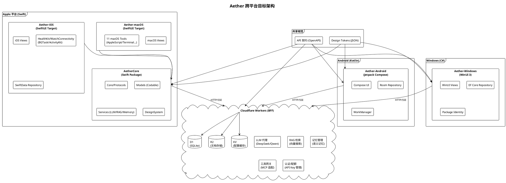
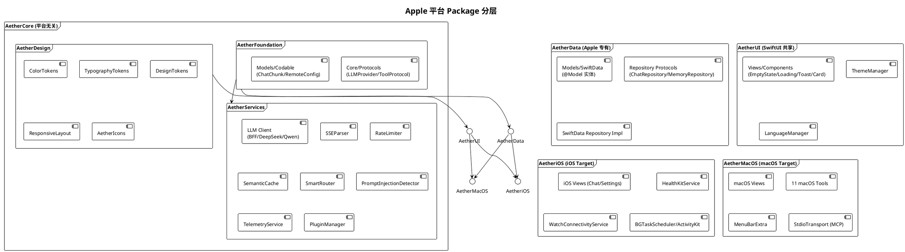
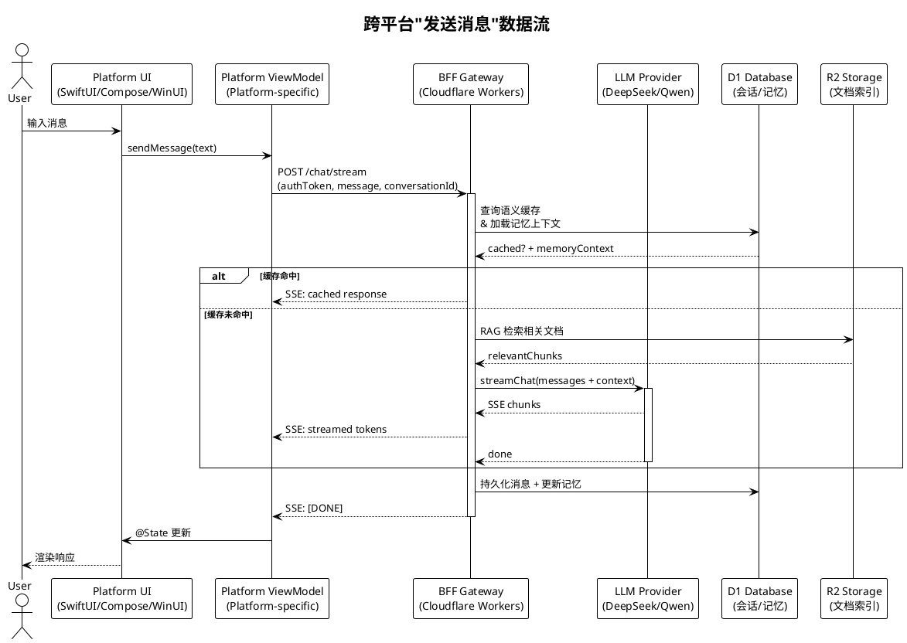

# 跨平台架构重构实施计划

> **For agentic workers:** 本计划分为 5 个阶段，Phase 1-2 为 Apple 平台重构（可立即执行），Phase 3-5 为跨平台扩展。各阶段产出可独立验证的软件。任务用 checkbox (`- [ ]`) 跟踪。

**Goal:** 将 iOS 与 macOS 拆分为独立 target，提取平台无关的公共组件库（AetherCore Swift Package），并扩展到 Android（Kotlin/Compose）与 Windows（C#/WinUI 3），通过增强的 BFF 统一业务逻辑与数据层。

**Architecture:** 采用"BFF 共享 + 各平台原生 UI"策略。Apple 平台通过 Swift Package 共享核心逻辑（AetherCore），iOS 与 macOS 拆为独立 target；Android 与 Windows 各自原生实现 UI，通过 BFF（Cloudflare Workers）共享 LLM 代理、RAG 检索、记忆管理等业务逻辑。数据层抽象为仓储协议，各平台独立实现持久化。设计系统提取为平台无关 Token（JSON），各平台编写原生映射器。

**Tech Stack:**
- Apple 平台共享核心：Swift Package（Swift 5.9+，iOS 17+/macOS 14+）
- iOS App：SwiftUI + SwiftData
- macOS App：SwiftUI + AppKit 增强
- Android App：Kotlin + Jetpack Compose + Room
- Windows App：C# + WinUI 3 + EF Core
- 跨平台 BFF：Cloudflare Workers（TypeScript）+ D1（SQLite）+ R2（对象存储）+ KV（配置缓存）
- 设计 Token：JSON Schema + 各平台原生映射器

---

## 目标架构图

### 整体架构



### Apple 平台 Swift Package 依赖图



### 跨平台数据流（以"发送消息"为例）



---

## 现状分析（迁移基准）

### 当前架构关键指标

| 维度 | 现状 | 迁移目标 |
|------|------|----------|
| Target 结构 | 1 个 multiplatform target | iOS / macOS 双 target + Swift Package |
| 条件编译 | 102 处 `#if os(iOS)` + 53 处 `#if os(macOS)` | 大幅减少（平台代码归入专属 target） |
| 公共组件库 | 无（`Shared/` 仅 AppGroupContainer.swift） | AetherCore 等 Swift Package |
| Android 支持 | 无（ROADMAP v2.0 远期愿景） | 原生 Kotlin/Compose 客户端 |
| Windows 支持 | 无（完全未规划） | 原生 C#/WinUI 3 客户端 |
| 数据层 | SwiftData 直耦 ViewModel | 仓储协议 + 各平台实现 |
| 设计系统 | 强绑定 SwiftUI | Token JSON + 各平台映射器 |
| BFF | 仅 LLM 代理 + 配置 | 增强为跨平台业务网关 |

### 可立即跨平台共享的资产（无 `#if os` 依赖）

| 模块 | 文件 | 共享方式 |
|------|------|----------|
| Core/Protocols | LLMProvider.swift, ToolProtocol.swift | AetherFoundation Package |
| DesignSystem | 全部 7 文件 | AetherDesign Package |
| Views/Components | 9/10 文件（除 DraggableConversation） | AetherUI Package |
| Services/LLM | 全部 7 文件 | AetherServices Package |
| Services/Cache | SemanticCache.swift | AetherServices Package |
| Services/Security | PromptInjectionDetector.swift | AetherServices Package |
| Services/Routing | SmartRouter.swift | AetherServices Package |

### 需重构才能共享的资产

| 模块 | 障碍 | 重构方案 |
|------|------|----------|
| Models (6 个 @Model) | SwiftData 强绑定 | 抽象为 Codable DTO + SwiftData @Model 包装 |
| ChatStorage.swift | 隐式调用 SpotlightIndexer | 抽象 `ConversationIndexer` 协议注入 |
| ViewModels | ModelContext 直耦 + UI 状态混合 | 拆分为 Interactor（逻辑）+ ViewModel（状态） |
| ColorTokens | 强依赖 ThemeManager | 一并迁移到 AetherDesign |
| ChatViewModel | LiveActivity/HealthKit 内联 | 抽象平台适配器协议 |

---

## 阶段划分总览

| 阶段 | 名称 | 范围 | 可交付 | 依赖 |
|------|------|------|--------|------|
| Phase 1 | 公共组件库提取 | Apple 平台共享 Swift Package | AetherCore Package 可编译 | 无 |
| Phase 2 | iOS/macOS target 分离 | 拆分双 target | iOS / macOS 独立构建 | Phase 1 |
| Phase 3 | 跨平台抽象层 | 仓储协议 + Token JSON + BFF 增强 | BFF 跨平台 API 可用 | Phase 1 |
| Phase 4 | Android 客户端 | Kotlin/Compose 原生 App | Android APK 可运行 | Phase 3 |
| Phase 5 | Windows 客户端 | C#/WinUI 3 原生 App | Windows MSIX 可安装 | Phase 3 |

> Phase 3 可与 Phase 2 并行；Phase 4 与 Phase 5 可并行。

---

## Phase 1: 公共组件库提取（AetherCore Swift Package）

**目标：** 将平台无关的代码提取为独立 Swift Package，被 iOS 与 macOS target 共同依赖。

**验收标准：**
- AetherCore Package 独立编译通过（iOS 17+ / macOS 14+）
- 现有 UT 全部通过（不修改实现代码，仅移动文件）
- `#if os(iOS)` / `#if os(macOS)` 数量减少 40%+
- 主 App 仍可正常构建（过渡期保持兼容）

### 任务 1.1: 创建 Swift Package 工程

**Files:**
- Create: `Packages/AetherCore/Package.swift`
- Create: `Packages/AetherCore/Sources/AetherFoundation/` (目录)
- Create: `Packages/AetherCore/Sources/AetherServices/` (目录)
- Create: `Packages/AetherCore/Sources/AetherDesign/` (目录)
- Create: `Packages/AetherCore/Sources/AetherUI/` (目录)
- Create: `Packages/AetherCore/Tests/` (目录)

- [ ] **Step 1: 创建 Package.swift**

```swift
// Packages/AetherCore/Package.swift
// swift-tools-version: 5.9
import PackageDescription

let package = Package(
    name: "AetherCore",
    platforms: [
        .iOS(.v17),
        .macOS(.v14)
    ],
    products: [
        .library(name: "AetherFoundation", targets: ["AetherFoundation"]),
        .library(name: "AetherServices", targets: ["AetherServices"]),
        .library(name: "AetherDesign", targets: ["AetherDesign"]),
        .library(name: "AetherUI", targets: ["AetherUI"])
    ],
    dependencies: [
        // Phase 3 起按需添加 MLX 等依赖
    ],
    targets: [
        .target(
            name: "AetherFoundation",
            dependencies: []
        ),
        .target(
            name: "AetherServices",
            dependencies: ["AetherFoundation"]
        ),
        .target(
            name: "AetherDesign",
            dependencies: ["AetherFoundation"]
        ),
        .target(
            name: "AetherUI",
            dependencies: ["AetherDesign", "AetherFoundation"]
        ),
        .testTarget(
            name: "AetherCoreTests",
            dependencies: ["AetherFoundation", "AetherServices", "AetherDesign", "AetherUI"]
        )
    ]
)
```

- [ ] **Step 2: 验证空 Package 可编译**

Run: `cd Packages/AetherCore && swift build`
Expected: BUILD SUCCEEDED

- [ ] **Step 3: 提交**

```bash
git add Packages/AetherCore/
git commit -m "chore: scaffold AetherCore Swift Package"
```

### 任务 1.2: 迁移 AetherFoundation（Core/Protocols + 纯 Codable 模型）

**Files:**
- Move: `Aether/Core/Protocols/LLMProvider.swift` → `Packages/AetherCore/Sources/AetherFoundation/Protocols/LLMProvider.swift`
- Move: `Aether/Core/Protocols/ToolProtocol.swift` → `Packages/AetherCore/Sources/AetherFoundation/Protocols/ToolProtocol.swift`
- Move: `Aether/Models/ChatChunk.swift` → `Packages/AetherCore/Sources/AetherFoundation/Models/ChatChunk.swift`
- Move: `Aether/Models/RemoteConfig.swift` → `Packages/AetherCore/Sources/AetherFoundation/Models/RemoteConfig.swift`
- Move: `Aether/Core/Constants/APIConfig.swift` → `Packages/AetherCore/Sources/AetherFoundation/Constants/APIConfig.swift`
- Move: `Aether/Core/Constants/ModelProvider.swift` → `Packages/AetherCore/Sources/AetherFoundation/Constants/ModelProvider.swift`
- Move: `Aether/Core/Extensions/String+TokenCount.swift` → `Packages/AetherCore/Sources/AetherFoundation/Extensions/String+TokenCount.swift`
- Move: `Aether/Core/Models/BFFConfig.swift` → `Packages/AetherCore/Sources/AetherFoundation/Models/BFFConfig.swift`
- Move: `Aether/Core/Models/MCPConfig.swift` → `Packages/AetherCore/Sources/AetherFoundation/Models/MCPConfig.swift`
- Move: `Aether/Core/Models/OnDeviceConfig.swift` → `Packages/AetherCore/Sources/AetherFoundation/Models/OnDeviceConfig.swift`
- Move: `Aether/Core/Models/OnDeviceError.swift` → `Packages/AetherCore/Sources/AetherFoundation/Models/OnDeviceError.swift`
- Move: `Aether/Core/Models/OnDeviceModelCatalog.swift` → `Packages/AetherCore/Sources/AetherFoundation/Models/OnDeviceModelCatalog.swift`
- Move: `Aether/Core/Models/PluginManifest.swift` → `Packages/AetherCore/Sources/AetherFoundation/Models/PluginManifest.swift`
- Move: `Aether/Core/Models/PluginPermission.swift` → `Packages/AetherCore/Sources/AetherFoundation/Models/PluginPermission.swift`

- [ ] **Step 1: 移动文件到 Package**

逐文件移动（使用 `git mv` 保留历史）：

```bash
mkdir -p Packages/AetherCore/Sources/AetherFoundation/{Protocols,Models,Constants,Extensions}
git mv Aether/Core/Protocols/LLMProvider.swift Packages/AetherCore/Sources/AetherFoundation/Protocols/
git mv Aether/Core/Protocols/ToolProtocol.swift Packages/AetherCore/Sources/AetherFoundation/Protocols/
git mv Aether/Models/ChatChunk.swift Packages/AetherCore/Sources/AetherFoundation/Models/
git mv Aether/Models/RemoteConfig.swift Packages/AetherCore/Sources/AetherFoundation/Models/
git mv Aether/Core/Constants/APIConfig.swift Packages/AetherCore/Sources/AetherFoundation/Constants/
git mv Aether/Core/Constants/ModelProvider.swift Packages/AetherCore/Sources/AetherFoundation/Constants/
git mv Aether/Core/Extensions/String+TokenCount.swift Packages/AetherCore/Sources/AetherFoundation/Extensions/
git mv Aether/Core/Models/BFFConfig.swift Packages/AetherCore/Sources/AetherFoundation/Models/
git mv Aether/Core/Models/MCPConfig.swift Packages/AetherCore/Sources/AetherFoundation/Models/
git mv Aether/Core/Models/OnDeviceConfig.swift Packages/AetherCore/Sources/AetherFoundation/Models/
git mv Aether/Core/Models/OnDeviceError.swift Packages/AetherCore/Sources/AetherFoundation/Models/
git mv Aether/Core/Models/OnDeviceModelCatalog.swift Packages/AetherCore/Sources/AetherFoundation/Models/
git mv Aether/Core/Models/PluginManifest.swift Packages/AetherCore/Sources/AetherFoundation/Models/
git mv Aether/Core/Models/PluginPermission.swift Packages/AetherCore/Sources/AetherFoundation/Models/
```

- [ ] **Step 2: 在各文件顶部添加模块导入**

对每个移动的文件，添加 `import Foundation`（若已有则跳过）。这些文件原本只依赖 Foundation，无需额外导入。

- [ ] **Step 3: 验证 Package 编译**

Run: `cd Packages/AetherCore && swift build`
Expected: BUILD SUCCEEDED

- [ ] **Step 4: 提交**

```bash
git add -A
git commit -m "refactor: extract AetherFoundation (protocols + codable models) to Swift Package"
```

### 任务 1.3: 迁移 AetherServices（纯逻辑服务层）

**Files:**
- Move: `Aether/Services/LLM/*` (7 文件) → `Packages/AetherCore/Sources/AetherServices/LLM/`
- Move: `Aether/Services/Cache/SemanticCache.swift` → `Packages/AetherCore/Sources/AetherServices/Cache/`
- Move: `Aether/Services/Security/PromptInjectionDetector.swift` → `Packages/AetherCore/Sources/AetherServices/Security/`
- Move: `Aether/Services/Routing/SmartRouter.swift` → `Packages/AetherCore/Sources/AetherServices/Routing/`
- Move: `Aether/Services/Telemetry/*` (3 文件) → `Packages/AetherCore/Sources/AetherServices/Telemetry/`
- Move: `Aether/Services/Performance/PerformanceMonitor.swift` → `Packages/AetherCore/Sources/AetherServices/Performance/`
- Move: `Aether/Services/Plugin/*` (3 文件) → `Packages/AetherCore/Sources/AetherServices/Plugin/`
- Move: `Aether/Services/Intents/IntentChatService.swift` → `Packages/AetherCore/Sources/AetherServices/Intents/`
- Move: `Aether/Services/RemoteConfig/RemoteConfigService.swift` → `Packages/AetherCore/Sources/AetherServices/RemoteConfig/`

- [ ] **Step 1: 移动 LLM 服务文件**

```bash
mkdir -p Packages/AetherCore/Sources/AetherServices/{LLM,Cache,Security,Routing,Telemetry,Performance,Plugin,Intents,RemoteConfig}
git mv Aether/Services/LLM/BFFProxyClient.swift Packages/AetherCore/Sources/AetherServices/LLM/
git mv Aether/Services/LLM/DeepSeekClient.swift Packages/AetherCore/Sources/AetherServices/LLM/
git mv Aether/Services/LLM/FallbackLLMProvider.swift Packages/AetherCore/Sources/AetherServices/LLM/
git mv Aether/Services/LLM/ModelProviderFactory.swift Packages/AetherCore/Sources/AetherServices/LLM/
git mv Aether/Services/LLM/QwenClient.swift Packages/AetherCore/Sources/AetherServices/LLM/
git mv Aether/Services/LLM/RateLimiter.swift Packages/AetherCore/Sources/AetherServices/LLM/
git mv Aether/Services/LLM/SSEParser.swift Packages/AetherCore/Sources/AetherServices/LLM/
```

- [ ] **Step 2: 移动其余纯逻辑服务**

```bash
git mv Aether/Services/Cache/SemanticCache.swift Packages/AetherCore/Sources/AetherServices/Cache/
git mv Aether/Services/Security/PromptInjectionDetector.swift Packages/AetherCore/Sources/AetherServices/Security/
git mv Aether/Services/Routing/SmartRouter.swift Packages/AetherCore/Sources/AetherServices/Routing/
git mv Aether/Services/Telemetry/LogUploader.swift Packages/AetherCore/Sources/AetherServices/Telemetry/
git mv Aether/Services/Telemetry/TelemetrySanitizer.swift Packages/AetherCore/Sources/AetherServices/Telemetry/
git mv Aether/Services/Telemetry/TelemetryService.swift Packages/AetherCore/Sources/AetherServices/Telemetry/
git mv Aether/Services/Performance/PerformanceMonitor.swift Packages/AetherCore/Sources/AetherServices/Performance/
git mv Aether/Services/Plugin/PluginManager.swift Packages/AetherCore/Sources/AetherServices/Plugin/
git mv Aether/Services/Plugin/PluginSandbox.swift Packages/AetherCore/Sources/AetherServices/Plugin/
git mv Aether/Services/Plugin/PluginToolAdapter.swift Packages/AetherCore/Sources/AetherServices/Plugin/
git mv Aether/Services/Intents/IntentChatService.swift Packages/AetherCore/Sources/AetherServices/Intents/
git mv Aether/Services/RemoteConfig/RemoteConfigService.swift Packages/AetherCore/Sources/AetherServices/RemoteConfig/
```

- [ ] **Step 3: 添加模块访问修饰符**

为需要被 App target 访问的类型添加 `public` 访问级别。例如：

```swift
// Packages/AetherCore/Sources/AetherServices/LLM/DeepSeekClient.swift
public final class DeepSeekClient: LLMProvider {  // 添加 public
    public init(apiKey: String) { ... }            // 添加 public
    public func chat(...) -> AsyncStream<String> { ... }
}
```

对每个类逐一添加 `public` 修饰符（类、init、协议方法）。

- [ ] **Step 4: 验证 Package 编译**

Run: `cd Packages/AetherCore && swift build`
Expected: BUILD SUCCEEDED

- [ ] **Step 5: 提交**

```bash
git add -A
git commit -m "refactor: extract AetherServices (LLM/cache/security/routing/telemetry) to Swift Package"
```

### 任务 1.4: 迁移 AetherDesign（设计系统）

**Files:**
- Move: `Aether/DesignSystem/*` (7 文件) → `Packages/AetherCore/Sources/AetherDesign/`
- Move: `Aether/Services/Theme/ThemeManager.swift` → `Packages/AetherCore/Sources/AetherDesign/Theme/`
- Move: `Aether/Services/Language/LanguageManager.swift` → `Packages/AetherCore/Sources/AetherDesign/Language/`

> 注意：ColorTokens 依赖 ThemeManager，需一并迁移。

- [ ] **Step 1: 移动设计系统文件**

```bash
mkdir -p Packages/AetherCore/Sources/AetherDesign/{Theme,Language}
git mv Aether/DesignSystem/ColorTokens.swift Packages/AetherCore/Sources/AetherDesign/
git mv Aether/DesignSystem/DesignTokens.swift Packages/AetherCore/Sources/AetherDesign/
git mv Aether/DesignSystem/TypographyTokens.swift Packages/AetherCore/Sources/AetherDesign/
git mv Aether/DesignSystem/ThemeTokens.swift Packages/AetherCore/Sources/AetherDesign/
git mv Aether/DesignSystem/ResponsiveLayout.swift Packages/AetherCore/Sources/AetherDesign/
git mv Aether/DesignSystem/AetherIcons.swift Packages/AetherCore/Sources/AetherDesign/
git mv Aether/DesignSystem/AetherIconRenderer.swift Packages/AetherCore/Sources/AetherDesign/
git mv Aether/Services/Theme/ThemeManager.swift Packages/AetherCore/Sources/AetherDesign/Theme/
git mv Aether/Services/Language/LanguageManager.swift Packages/AetherCore/Sources/AetherDesign/Language/
```

- [ ] **Step 2: 添加 public 访问修饰符**

为 ColorTokens、DesignTokens、TypographyTokens、ThemeTokens、ThemeManager、LanguageManager 的对外 API 添加 `public`。

- [ ] **Step 3: 验证 Package 编译**

Run: `cd Packages/AetherCore && swift build`
Expected: BUILD SUCCEEDED

- [ ] **Step 4: 提交**

```bash
git add -A
git commit -m "refactor: extract AetherDesign (design system + theme/language) to Swift Package"
```

### 任务 1.5: 迁移 AetherUI（共享 UI 组件）

**Files:**
- Move: `Aether/Views/Components/AvatarView.swift` → `Packages/AetherCore/Sources/AetherUI/Components/`
- Move: `Aether/Views/Components/BrandSplash.swift` → `Packages/AetherCore/Sources/AetherUI/Components/`
- Move: `Aether/Views/Components/CardStyle.swift` → `Packages/AetherCore/Sources/AetherUI/Components/`
- Move: `Aether/Views/Components/EmptyStateView.swift` → `Packages/AetherCore/Sources/AetherUI/Components/`
- Move: `Aether/Views/Components/ErrorBanner.swift` → `Packages/AetherCore/Sources/AetherUI/Components/`
- Move: `Aether/Views/Components/LoadingStateView.swift` → `Packages/AetherCore/Sources/AetherUI/Components/`
- Move: `Aether/Views/Components/SkeletonView.swift` → `Packages/AetherCore/Sources/AetherUI/Components/`
- Move: `Aether/Views/Components/ToastView.swift` → `Packages/AetherCore/Sources/AetherUI/Components/`
- Move: `Aether/Views/Components/LaunchScreen.swift` → `Packages/AetherCore/Sources/AetherUI/Components/`

> 注意：`DraggableConversation.swift` 是 macOS 独占，留在 macOS target，不迁入共享 UI。

- [ ] **Step 1: 移动组件文件**

```bash
mkdir -p Packages/AetherCore/Sources/AetherUI/Components
git mv Aether/Views/Components/AvatarView.swift Packages/AetherCore/Sources/AetherUI/Components/
git mv Aether/Views/Components/BrandSplash.swift Packages/AetherCore/Sources/AetherUI/Components/
git mv Aether/Views/Components/CardStyle.swift Packages/AetherCore/Sources/AetherUI/Components/
git mv Aether/Views/Components/EmptyStateView.swift Packages/AetherCore/Sources/AetherUI/Components/
git mv Aether/Views/Components/ErrorBanner.swift Packages/AetherCore/Sources/AetherUI/Components/
git mv Aether/Views/Components/LoadingStateView.swift Packages/AetherCore/Sources/AetherUI/Components/
git mv Aether/Views/Components/SkeletonView.swift Packages/AetherCore/Sources/AetherUI/Components/
git mv Aether/Views/Components/ToastView.swift Packages/AetherCore/Sources/AetherUI/Components/
git mv Aether/Views/Components/LaunchScreen.swift Packages/AetherCore/Sources/AetherUI/Components/
```

- [ ] **Step 2: 添加 public 访问修饰符并导入 AetherDesign**

每个组件文件顶部添加：

```swift
import SwiftUI
import AetherDesign
```

为 View struct 及其 init 添加 `public`。

- [ ] **Step 3: 验证 Package 编译**

Run: `cd Packages/AetherCore && swift build`
Expected: BUILD SUCCEEDED

- [ ] **Step 4: 提交**

```bash
git add -A
git commit -m "refactor: extract AetherUI (shared components) to Swift Package"
```

### 任务 1.6: 在主 App target 中集成 AetherCore 并修复引用

**Files:**
- Modify: `Aether.xcodeproj/project.pbxproj` (添加本地 Package 依赖)
- Modify: 所有引用了已迁移类型的文件（添加 `import AetherFoundation` / `import AetherServices` / `import AetherDesign` / `import AetherUI`）

- [ ] **Step 1: 在 Xcode 中添加 AetherCore 本地 Package**

在 Xcode 项目设置中：File → Add Package Dependencies → Add Local → 选择 `Packages/AetherCore`，勾选 4 个 library product 添加到 Aether target。

或手动编辑 `project.pbxproj` 添加 `XCSwiftPackageProductDependency` 与 `XCLocalSwiftPackageReference`。

- [ ] **Step 2: 批量添加 import 语句**

对所有引用已迁移类型的 `.swift` 文件，在顶部添加对应 import。可通过编译错误逐一修复：

Run: `xcodebuild -scheme Aether -destination 'platform=iOS Simulator,name=iPhone 17' build 2>&1 | grep "error:" | head -50`

根据错误信息添加 import。常见映射：
- 引用 `LLMProvider` / `ToolProtocol` / `ChatChunk` / `APIConfig` → `import AetherFoundation`
- 引用 `DeepSeekClient` / `SemanticCache` / `SmartRouter` → `import AetherServices`
- 引用 `Color.deepSpace` / `CornerRadius` / `ThemeManager` → `import AetherDesign`
- 引用 `EmptyStateView` / `ToastView` / `LoadingStateView` → `import AetherUI`

- [ ] **Step 3: 验证主 App 构建（iOS + macOS）**

Run:
```bash
xcodebuild -scheme Aether -destination 'platform=iOS Simulator,name=iPhone 17' build
xcodebuild -scheme Aether -destination 'platform=macOS,arch=arm64' build
```
Expected: 两个平台均 BUILD SUCCEEDED

- [ ] **Step 4: 运行全量 UT 确认未破坏现有测试**

Run:
```bash
xcodebuild test -scheme Aether -destination 'platform=iOS Simulator,name=iPhone 17' -skip-testing:AetherUITests 2>&1 | tail -20
```
Expected: 所有测试通过

- [ ] **Step 5: 迁移对应测试文件到 Package Tests**

将已迁移模块的测试文件移动到 `Packages/AetherCore/Tests/AetherCoreTests/`：

```bash
git mv AetherTests/APIConfigTests.swift Packages/AetherCore/Tests/AetherCoreTests/
git mv AetherTests/BFFConfigTests.swift Packages/AetherCore/Tests/AetherCoreTests/
git mv AetherTests/ChatChunkTests.swift Packages/AetherCore/Tests/AetherCoreTests/
git mv AetherTests/SSEParserTests.swift Packages/AetherCore/Tests/AetherCoreTests/
git mv AetherTests/RateLimiterTests.swift Packages/AetherCore/Tests/AetherCoreTests/
git mv AetherTests/SemanticCacheTests.swift Packages/AetherCore/Tests/AetherCoreTests/
git mv AetherTests/SemanticCacheEdgeTests.swift Packages/AetherCore/Tests/AetherCoreTests/
git mv AetherTests/SmartRouterTests.swift Packages/AetherCore/Tests/AetherCoreTests/
git mv AetherTests/PromptInjectionDetectorTests.swift Packages/AetherCore/Tests/AetherCoreTests/
git mv AetherTests/DeepSeekClientTests.swift Packages/AetherCore/Tests/AetherCoreTests/
git mv AetherTests/QwenClientTests.swift Packages/AetherCore/Tests/AetherCoreTests/
git mv AetherTests/BFFProxyClientTests.swift Packages/AetherCore/Tests/AetherCoreTests/
git mv AetherTests/FallbackLLMProviderTests.swift Packages/AetherCore/Tests/AetherCoreTests/
git mv AetherTests/ModelProviderFactoryTests.swift Packages/AetherCore/Tests/AetherCoreTests/
git mv AetherTests/ModelProviderTests.swift Packages/AetherCore/Tests/AetherCoreTests/
git mv AetherTests/RemoteConfigTests.swift Packages/AetherCore/Tests/AetherCoreTests/
git mv AetherTests/RemoteConfigServiceTests.swift Packages/AetherCore/Tests/AetherCoreTests/
git mv AetherTests/StringTokenCountTests.swift Packages/AetherCore/Tests/AetherCoreTests/
git mv AetherTests/TelemetryServiceTests.swift Packages/AetherCore/Tests/AetherCoreTests/
git mv AetherTests/TelemetrySanitizerTests.swift Packages/AetherCore/Tests/AetherCoreTests/
git mv AetherTests/LogUploaderTests.swift Packages/AetherCore/Tests/AetherCoreTests/
git mv AetherTests/PerformanceMonitorTests.swift Packages/AetherCore/Tests/AetherCoreTests/
git mv AetherTests/PluginManagerTests.swift Packages/AetherCore/Tests/AetherCoreTests/
git mv AetherTests/PluginSandboxTests.swift Packages/AetherCore/Tests/AetherCoreTests/
git mv AetherTests/IntentChatServiceTests.swift Packages/AetherCore/Tests/AetherCoreTests/
git mv AetherTests/DesignSystemTests.swift Packages/AetherCore/Tests/AetherCoreTests/
git mv AetherTests/DesignTokensTests.swift Packages/AetherCore/Tests/AetherCoreTests/
git mv AetherTests/ThemeManagerTests.swift Packages/AetherCore/Tests/AetherCoreTests/
git mv AetherTests/LanguageManagerTests.swift Packages/AetherCore/Tests/AetherCoreTests/
git mv AetherTests/EmptyStateViewTests.swift Packages/AetherCore/Tests/AetherCoreTests/
git mv AetherTests/OnDeviceConfigTests.swift Packages/AetherCore/Tests/AetherCoreTests/
git mv AetherTests/OnDeviceErrorTests.swift Packages/AetherCore/Tests/AetherCoreTests/
git mv AetherTests/OnDeviceModelCatalogTests.swift Packages/AetherCore/Tests/AetherCoreTests/
```

- [ ] **Step 6: 运行 Package 测试**

Run: `cd Packages/AetherCore && swift test`
Expected: 所有测试通过

- [ ] **Step 7: 提交**

```bash
git add -A
git commit -m "refactor: integrate AetherCore package into main app and migrate tests"
```

### 任务 1.7: 解耦 ChatStorage 对 SpotlightIndexer 的隐式依赖

**Files:**
- Create: `Packages/AetherCore/Sources/AetherServices/Protocols/ConversationIndexer.swift`
- Modify: `Aether/Services/Storage/ChatStorage.swift` (注入协议替代直接调用)

- [ ] **Step 1: 定义平台无关的索引协议**

```swift
// Packages/AetherCore/Sources/AetherServices/Protocols/ConversationIndexer.swift
import AetherFoundation
import Foundation

/// 会话索引协议，各平台独立实现（iOS/macOS: CoreSpotlight, Android/Windows: 各自方案）
public protocol ConversationIndexer: Sendable {
    func index(conversation: ConversationDTO) async
    func remove(conversationId: UUID) async
    func removeAll() async
}

/// 平台无关的会话数据传输对象
public struct ConversationDTO: Sendable, Codable {
    public let id: UUID
    public let title: String
    public let lastMessagePreview: String
    public let updatedAt: Date

    public init(id: UUID, title: String, lastMessagePreview: String, updatedAt: Date) {
        self.id = id
        self.title = title
        self.lastMessagePreview = lastMessagePreview
        self.updatedAt = updatedAt
    }
}
```

- [ ] **Step 2: 重构 ChatStorage 接受可选 indexer**

修改 `Aether/Services/Storage/ChatStorage.swift`，将直接调用 `SpotlightIndexer.index(...)` 改为通过注入的 `indexer` 协议：

```swift
// Aether/Services/Storage/ChatStorage.swift
import AetherServices

final class ChatStorage {
    private let indexer: ConversationIndexer?

    init(indexer: ConversationIndexer? = nil) {
        self.indexer = indexer
    }

    func save(conversation: Conversation) async throws {
        // ... 原有保存逻辑 ...
        if let indexer {
            let dto = ConversationDTO(
                id: conversation.id,
                title: conversation.title,
                lastMessagePreview: conversation.lastMessagePreview,
                updatedAt: conversation.updatedAt
            )
            await indexer.index(conversation: dto)
        }
    }
}
```

- [ ] **Step 3: 实现 SpotlightIndexer 适配协议**

修改 `Aether/Services/Search/SpotlightIndexer.swift` 使其遵循 `ConversationIndexer`：

```swift
// Aether/Services/Search/SpotlightIndexer.swift
import AetherServices
import CoreSpotlight
import UniformTypeIdentifiers

final class SpotlightIndexer: ConversationIndexer {
    func index(conversation: ConversationDTO) async {
        // 原有 CSSearchableItem 创建逻辑，使用 dto 字段
    }
    // ...
}
```

- [ ] **Step 4: 在 App 启动时注入 indexer**

修改 `Aether/App/AetherApp.swift` 中 ChatStorage 的初始化点，注入 `SpotlightIndexer()`。

- [ ] **Step 5: 运行 ChatStorageTests 验证**

Run: `xcodebuild test -scheme Aether -destination 'platform=iOS Simulator,name=iPhone 17' -only-testing:AetherTests/ChatStorageTests 2>&1 | tail -10`
Expected: PASS

- [ ] **Step 6: 提交**

```bash
git add -A
git commit -m "refactor: decouple ChatStorage from SpotlightIndexer via ConversationIndexer protocol"
```

---

## Phase 2: iOS / macOS target 分离

**目标：** 将单一 `Aether` target 拆分为 `Aether-iOS` 与 `Aether-macOS` 两个独立 target，减少条件编译，使各平台可独立构建、测试、签名。

**验收标准：**
- `Aether-iOS` target 仅支持 iOS/iPad，可在 iPhone 17 Simulator 构建
- `Aether-macOS` target 仅支持 macOS，可在 macOS 原生构建
- macOS-only 工具不再需要 `#if os(macOS)` 文件级包裹（整文件归入 macOS target）
- iOS-only 框架代码不再需要 `#if os(iOS)` 包裹（整段归入 iOS target）
- 条件编译数量减少 70%+
- CI 新增独立 macOS 全量 UT job

### 任务 2.1: 创建 Aether-iOS target

**Files:**
- Modify: `Aether.xcodeproj/project.pbxproj` (新增 target)
- Create: `Aether/Resources/Info-iOS.plist`
- Create: `Aether/Aether-iOS.entitlements`
- Modify: 现有源文件归属（iOS 专属文件加入 iOS target 的 Compile Sources）

- [ ] **Step 1: 在 Xcode 中复制 Aether target 为 Aether-iOS**

在 Xcode 中：选中 Aether target → 右键 Duplicate → 重命名为 `Aether-iOS`。

或手动在 `project.pbxproj` 中：
- 复制 PBXNativeTarget 段，改名 `Aether-iOS`
- 设置 `SDKROOT = iphoneos`，`SUPPORTED_PLATFORMS = "iphoneos iphonesimulator"`
- 移除 `macosx`
- `PRODUCT_BUNDLE_IDENTIFIER = com.aether.app.ios`

- [ ] **Step 2: 创建 iOS 专属 Info.plist**

```xml
<!-- Aether/Resources/Info-iOS.plist -->
<?xml version="1.0" encoding="UTF-8"?>
<!DOCTYPE plist PUBLIC "-//Apple//DTD PLIST 1.0//EN" "http://www.apple.com/DTDs/PropertyList-1.0.dtd">
<plist version="1.0">
<dict>
    <key>BGTaskSchedulerPermittedIdentifiers</key>
    <array>
        <string>com.aether.daily-refresh</string>
        <string>com.aether.telemetry-upload</string>
        <string>com.aether.health-insight</string>
    </array>
    <key>CFBundleDevelopmentRegion</key>
    <string>zh_CN</string>
    <key>CFBundleDisplayName</key>
    <string>以太</string>
    <key>CFBundleShortVersionString</key>
    <string>1.0</string>
    <key>CFBundleURLTypes</key>
    <array>
        <dict>
            <key>CFBundleURLSchemes</key>
            <array>
                <string>aether</string>
            </array>
        </dict>
    </array>
    <key>CFBundleVersion</key>
    <string>1</string>
    <key>LSRequiresIPhoneOS</key>
    <true/>
    <key>NSCalendarsUsageDescription</key>
    <string>用于创建闹钟和日历事件提醒</string>
    <key>NSContactsUsageDescription</key>
    <string>搜索联系人</string>
    <key>NSHealthShareUsageDescription</key>
    <string>健康数据读取</string>
    <key>NSHealthUpdateUsageDescription</key>
    <string>不会写入健康数据</string>
    <key>NSLocationWhenInUseUsageDescription</key>
    <string>位置服务</string>
    <key>NSMicrophoneUsageDescription</key>
    <string>语音输入</string>
    <key>NSPhotoLibraryUsageDescription</key>
    <string>选择头像</string>
    <key>NSRemindersUsageDescription</key>
    <string>创建提醒事项</string>
    <key>NSSpeechRecognitionUsageDescription</key>
    <string>语音识别</string>
    <key>NSSupportsLiveActivities</key>
    <true/>
    <key>NSApplicationSupportsMultipleWindows</key>
    <true/>
    <key>UIApplicationSceneManifest</key>
    <dict>
        <key>UIApplicationSupportsMultipleScenes</key>
        <true/>
    </dict>
    <key>UILaunchScreen</key>
    <dict>
        <key>UIColorName</key>
        <string>DeepSpace</string>
    </dict>
</dict>
</plist>
```

- [ ] **Step 3: 创建 iOS entitlements**

```xml
<!-- Aether/Aether-iOS.entitlements -->
<?xml version="1.0" encoding="UTF-8"?>
<!DOCTYPE plist PUBLIC "-//Apple//DTD PLIST 1.0//EN" "http://www.apple.com/DTDs/PropertyList-1.0.dtd">
<plist version="1.0">
<dict>
    <key>com.apple.security.application-groups</key>
    <array>
        <string>group.com.aether.app</string>
    </array>
    <key>com.apple.developer.healthkit</key>
    <true/>
    <key>com.apple.developer.healthkit.access</key>
    <array>
        <string>health-records</string>
    </array>
</dict>
</plist>
```

- [ ] **Step 4: 配置 iOS target build settings**

在 `project.pbxproj` 的 `Aether-iOS` XCBuildConfiguration 中：

```
SDKROOT = iphoneos;
SUPPORTED_PLATFORMS = "iphoneos iphonesimulator";
TARGETED_DEVICE_FAMILY = "1,2";
IPHONEOS_DEPLOYMENT_TARGET = 17.0;
PRODUCT_BUNDLE_IDENTIFIER = com.aether.app.ios;
INFOPLIST_FILE = Aether/Resources/Info-iOS.plist;
CODE_SIGN_ENTITLEMENTS = Aether/Aether-iOS.entitlements;
SWIFT_STRICT_CONCURRENCY = minimal;
```

- [ ] **Step 5: 验证 iOS target 构建**

Run: `xcodebuild -scheme Aether-iOS -destination 'platform=iOS Simulator,name=iPhone 17' build`
Expected: BUILD SUCCEEDED

- [ ] **Step 6: 提交**

```bash
git add -A
git commit -m "feat: add Aether-iOS target with dedicated Info.plist and entitlements"
```

### 任务 2.2: 创建 Aether-macOS target

**Files:**
- Modify: `Aether.xcodeproj/project.pbxproj` (新增 target)
- Create: `Aether/Resources/Info-macOS.plist`
- Create: `Aether/Aether-macOS.entitlements`

- [ ] **Step 1: 在 Xcode 中复制 Aether target 为 Aether-macOS**

设置：
- `SDKROOT = macosx`
- `SUPPORTED_PLATFORMS = "macosx"`
- `MACOSX_DEPLOYMENT_TARGET = 14.0`
- `PRODUCT_BUNDLE_IDENTIFIER = com.aether.app.macos`
- `INFOPLIST_FILE = Aether/Resources/Info-macOS.plist`

- [ ] **Step 2: 创建 macOS 专属 Info.plist**

```xml
<!-- Aether/Resources/Info-macOS.plist -->
<?xml version="1.0" encoding="UTF-8"?>
<!DOCTYPE plist PUBLIC "-//Apple//DTD PLIST 1.0//EN" "http://www.apple.com/DTDs/PropertyList-1.0.dtd">
<plist version="1.0">
<dict>
    <key>CFBundleDevelopmentRegion</key>
    <string>zh_CN</string>
    <key>CFBundleDisplayName</key>
    <string>以太</string>
    <key>CFBundleShortVersionString</key>
    <string>1.0</string>
    <key>CFBundleURLTypes</key>
    <array>
        <dict>
            <key>CFBundleURLSchemes</key>
            <array>
                <string>aether</string>
            </array>
        </dict>
    </array>
    <key>CFBundleVersion</key>
    <string>1</string>
    <key>LSMinimumSystemVersion</key>
    <string>14.0</string>
    <key>NSDesktopFolderUsageDescription</key>
    <string>访问桌面文件夹以管理文件</string>
    <key>NSDocumentsFolderUsageDescription</key>
    <string>访问文档文件夹以管理文件</string>
    <key>NSDownloadsFolderUsageDescription</key>
    <string>访问下载文件夹以管理文件</string>
    <key>NSAppleEventsUsageDescription</key>
    <string>用于 AppleScript 自动化与控制其他应用</string>
    <key>NSAppleScriptEnabled</key>
    <true/>
</dict>
</plist>
```

- [ ] **Step 3: 创建 macOS entitlements**

```xml
<!-- Aether/Aether-macOS.entitlements -->
<?xml version="1.0" encoding="UTF-8"?>
<!DOCTYPE plist PUBLIC "-//Apple//DTD PLIST 1.0//EN" "http://www.apple.com/DTDs/PropertyList-1.0.dtd">
<plist version="1.0">
<dict>
    <key>com.apple.security.app-sandbox</key>
    <false/>
    <key>com.apple.security.automation.apple-events</key>
    <true/>
    <key>com.apple.security.files.user-selected.read-write</key>
    <true/>
    <key>com.apple.security.network.client</key>
    <true/>
</dict>
</plist>
```

- [ ] **Step 4: 配置 macOS target build settings**

```
SDKROOT = macosx;
SUPPORTED_PLATFORMS = "macosx";
MACOSX_DEPLOYMENT_TARGET = 14.0;
PRODUCT_BUNDLE_IDENTIFIER = com.aether.app.macos;
INFOPLIST_FILE = Aether/Resources/Info-macOS.plist;
CODE_SIGN_ENTITLEMENTS = Aether/Aether-macOS.entitlements;
CODE_SIGN_IDENTITY = "-";
SWIFT_STRICT_CONCURRENCY = minimal;
```

- [ ] **Step 5: 验证 macOS target 构建**

Run: `xcodebuild -scheme Aether-macOS -destination 'platform=macOS,arch=arm64' build`
Expected: BUILD SUCCEEDED

- [ ] **Step 6: 提交**

```bash
git add -A
git commit -m "feat: add Aether-macOS target with dedicated Info.plist and entitlements"
```

### 任务 2.3: 重新分配源文件归属

**目标：** 将 iOS 专属文件仅加入 `Aether-iOS` target，macOS 专属文件仅加入 `Aether-macOS` target，共享文件加入两者。

**Files:**
- Modify: `Aether.xcodeproj/project.pbxproj` (调整各 target 的 Sources Build Phase)

- [ ] **Step 1: iOS 专属文件仅加入 Aether-iOS**

以下文件从 `Aether-macOS` target 的 Compile Sources 中移除（保留在 iOS target）：

| 文件 | 原因 |
|------|------|
| `Aether/Services/Health/HealthKitService.swift` | HealthKit iOS only |
| `Aether/Services/Health/HealthInsightGenerator.swift` | 依赖 HealthKitService |
| `Aether/Services/Connectivity/WatchConnectivityService.swift` | WatchConnectivity iOS only |

> 注意：`HealthInsightGenerator.swift` 含 macOS 降级分支，需重构为接口注入（见任务 2.4）。

- [ ] **Step 2: macOS 专属文件仅加入 Aether-macOS**

以下 11 个工具文件从 `Aether-iOS` target 的 Compile Sources 中移除（保留在 macOS target）：

```
Aether/Services/Tools/AppleScriptTool.swift
Aether/Services/Tools/ScreenshotTool.swift
Aether/Services/Tools/OCRTool.swift
Aether/Services/Tools/TerminalCommandTool.swift
Aether/Services/Tools/WindowManagementTool.swift
Aether/Services/Tools/AppManagementTool.swift
Aether/Services/Tools/FileOperationTool.swift
Aether/Services/Tools/FinderTool.swift
Aether/Services/Tools/SafariControlTool.swift
Aether/Services/Tools/SystemControlTool.swift
Aether/Services/Tools/InputAutomationTool.swift
Aether/Views/Components/DraggableConversation.swift
Aether/Views/MenuBarExtra/MenuBarPanel.swift
```

- [ ] **Step 3: 移除文件级 `#if os(macOS)` 包裹**

对上述 11 个 macOS 工具文件，移除文件顶部的 `#if os(macOS)` / `#endif` 包裹（因文件仅属于 macOS target，无需条件编译）：

```swift
// 修改前
#if os(macOS)
import AppKit
// ... 全部实现 ...
#endif

// 修改后
import AppKit
// ... 全部实现 ...
```

逐文件处理，移除首尾的条件编译指令。

- [ ] **Step 4: 移除 macOS 工具文件中的内部 `#if os(macOS)`**

由于文件已专属 macOS target，文件内部所有 `#if os(macOS)` 分支均可移除条件编译，直接保留 macOS 分支代码。

- [ ] **Step 5: 验证双 target 构建**

Run:
```bash
xcodebuild -scheme Aether-iOS -destination 'platform=iOS Simulator,name=iPhone 17' build
xcodebuild -scheme Aether-macOS -destination 'platform=macOS,arch=arm64' build
```
Expected: 两个 target 均 BUILD SUCCEEDED

- [ ] **Step 6: 提交**

```bash
git add -A
git commit -m "refactor: reassign source files to platform-specific targets, remove redundant #if os guards"
```

### 任务 2.4: 重构 HealthInsightGenerator 为平台无关 + 适配器注入

**Files:**
- Move: `Aether/Services/Health/HealthInsightGenerator.swift` 拆分为：
  - `Packages/AetherCore/Sources/AetherServices/Health/HealthInsightGenerator.swift` (核心逻辑)
  - `Aether/Services/Health/HealthKitAdapter.swift` (iOS HealthKit 适配器)
- Create: `Packages/AetherCore/Sources/AetherServices/Protocols/HealthDataSource.swift`

- [ ] **Step 1: 定义平台无关的健康数据源协议**

```swift
// Packages/AetherCore/Sources/AetherServices/Protocols/HealthDataSource.swift
import Foundation

public protocol HealthDataSource: Sendable {
    func fetchDailySummary(for date: Date) async throws -> HealthDailySummaryDTO?
}

public struct HealthDailySummaryDTO: Sendable, Codable {
    public let steps: Int
    public let sleepHours: Double
    public let restingHeartRate: Int

    public init(steps: Int, sleepHours: Double, restingHeartRate: Int) {
        self.steps = steps
        self.sleepHours = sleepHours
        self.restingHeartRate = restingHeartRate
    }
}
```

- [ ] **Step 2: 重构 HealthInsightGenerator 接受协议**

```swift
// Packages/AetherCore/Sources/AetherServices/Health/HealthInsightGenerator.swift
import AetherFoundation
import Foundation

public final class HealthInsightGenerator {
    private let dataSource: HealthDataSource?

    public init(dataSource: HealthDataSource? = nil) {
        self.dataSource = dataSource
    }

    public func generateInsight(for date: Date) async -> String? {
        guard let dataSource else { return nil } // macOS 无数据源时返回 nil
        guard let summary = try? await dataSource.fetchDailySummary(for: date) else { return nil }
        // ... 原有洞察生成逻辑（使用 summary DTO 而非 HealthKit 类型）...
    }
}
```

- [ ] **Step 3: 实现 iOS HealthKit 适配器**

```swift
// Aether/Services/Health/HealthKitAdapter.swift (仅 iOS target)
import AetherServices
import HealthKit

final class HealthKitAdapter: HealthDataSource {
    private let healthStore = HKHealthStore()

    func fetchDailySummary(for date: Date) async throws -> HealthDailySummaryDTO? {
        // 原有 HealthKit 查询逻辑，返回 DTO
        // ...
    }
}
```

- [ ] **Step 4: 在 iOS App 注入适配器，macOS 注入 nil**

修改 `Aether/App/AetherApp.swift`（拆分为 iOS/macOS 版本，见任务 2.5）中 HealthInsightGenerator 的初始化：
- iOS: `HealthInsightGenerator(dataSource: HealthKitAdapter())`
- macOS: `HealthInsightGenerator(dataSource: nil)`

- [ ] **Step 5: 运行 HealthInsightGeneratorTests**

Run: `xcodebuild test -scheme Aether-iOS -destination 'platform=iOS Simulator,name=iPhone 17' -only-testing:AetherTests/HealthInsightGeneratorTests 2>&1 | tail -10`
Expected: PASS

- [ ] **Step 6: 提交**

```bash
git add -A
git commit -m "refactor: extract HealthInsightGenerator to AetherServices with HealthDataSource protocol"
```

### 任务 2.5: 拆分 AetherApp.swift 为平台专属版本

**Files:**
- Create: `Aether/App/AetherApp-iOS.swift` (iOS 专属入口)
- Create: `Aether/App/AetherApp-macOS.swift` (macOS 专属入口)
- Move: `Aether/App/AetherApp.swift` → 拆分到上述两文件
- Create: `Packages/AetherCore/Sources/AetherServices/App/AppCoordinator.swift` (共享启动逻辑)

- [ ] **Step 1: 提取共享启动逻辑到 AppCoordinator**

```swift
// Packages/AetherCore/Sources/AetherServices/App/AppCoordinator.swift
import AetherFoundation
import Foundation

public final class AppCoordinator {
    public init() {}

    public func bootstrapRemoteConfig() async {
        // 原有 AetherApp.init() 中的远程配置拉取逻辑
    }

    public func registerTools() {
        // 原有 ToolRegistry 跨平台工具注册（14 个）
    }
}
```

- [ ] **Step 2: 创建 iOS 专属 App 入口**

```swift
// Aether/App/AetherApp-iOS.swift (仅 iOS target)
import SwiftUI
import BackgroundTasks
import ActivityKit
import AetherCore

@main
struct AetherApp: App {
    @State private var coordinator = AppCoordinator()

    init() {
        // iOS 专属：注册 BGTaskScheduler
        BGTaskScheduler.shared.register(forTaskWithIdentifier: "com.aether.daily-refresh", using: nil) { task in
            handleDailyRefresh(task: task as! BGAppRefreshTask)
        }
        // ... 其余 iOS 后台任务注册 ...
    }

    var body: some Scene {
        WindowGroup {
            ContentView()
        }
        // iOS 专属 scenePhase 处理
    }

    // iOS 专属 LiveActivity / WatchConnectivity 方法
}
```

- [ ] **Step 3: 创建 macOS 专属 App 入口**

```swift
// Aether/App/AetherApp-macOS.swift (仅 macOS target)
import SwiftUI
import AppKit
import AetherCore

@main
struct AetherApp: App {
    @State private var coordinator = AppCoordinator()

    var body: some Scene {
        WindowGroup {
            ContentView()
        }
        .defaultSize(width: 1000, height: 700)
        .commands {
            // macOS 专属菜单栏命令
            CommandGroup(replacing: .newItem) { /* ⌘N 新建 */ }
            CommandGroup(after: .toolbar) { /* ⌘K 搜索 */ }
        }
        MenuBarExtra("Aether", systemImage: "sparkles") {
            MenuBarPanel()
        }
    }
}
```

- [ ] **Step 4: 删除原 AetherApp.swift**

```bash
git rm Aether/App/AetherApp.swift
```

- [ ] **Step 5: 验证双 target 构建**

Run:
```bash
xcodebuild -scheme Aether-iOS -destination 'platform=iOS Simulator,name=iPhone 17' build
xcodebuild -scheme Aether-macOS -destination 'platform=macOS,arch=arm64' build
```
Expected: 两个 target 均 BUILD SUCCEEDED

- [ ] **Step 6: 提交**

```bash
git add -A
git commit -m "refactor: split AetherApp into platform-specific entry points with shared AppCoordinator"
```

### 任务 2.6: 重构 ToolRegistry 移除条件注册

**Files:**
- Move: `Aether/Services/Tools/ToolRegistry.swift` → 拆分为：
  - `Packages/AetherCore/Sources/AetherServices/Tools/ToolRegistry.swift` (跨平台 14 工具)
  - `Aether/Services/Tools/macOS/ToolRegistry+macOS.swift` (macOS 11 工具扩展)

- [ ] **Step 1: 提取跨平台 ToolRegistry 到 AetherServices**

```swift
// Packages/AetherCore/Sources/AetherServices/Tools/ToolRegistry.swift
import AetherFoundation
import Foundation

public final class ToolRegistry {
    public static let shared = ToolRegistry()
    private var tools: [String: ToolProtocol] = [:]

    public init() {
        registerCrossPlatformTools()
    }

    private func registerCrossPlatformTools() {
        // 14 个跨平台工具（原有无条件注册部分）
        // AlarmTool, ReminderTool, DateTimeTool, CalculatorTool,
        // LocationTool, DeviceInfoTool, ReadClipboardTool, WriteClipboardTool,
        // OpenURLTool, ContactsTool, WeatherTool,
        // RunShortcutTool, ListShortcutsTool, CreateShortcutTool
    }
}
```

- [ ] **Step 2: 创建 macOS 工具注册扩展**

```swift
// Aether/Services/Tools/macOS/ToolRegistry+macOS.swift (仅 macOS target)
import AetherServices
import AetherFoundation

extension ToolRegistry {
    func registerMacOSTools() {
        register(tool: AppleScriptTool())
        register(tool: ScreenshotTool())
        register(tool: OCRTool())
        register(tool: TerminalCommandTool())
        register(tool: WindowManagementTool())
        register(tool: AppManagementTool())
        register(tool: FileOperationTool())
        register(tool: FinderTool())
        register(tool: SafariControlTool())
        register(tool: SystemControlTool())
        register(tool: InputAutomationTool())
    }
}
```

- [ ] **Step 3: 在 macOS App 启动时调用注册**

在 `Aether/App/AetherApp-macOS.swift` 的 `init()` 中：

```swift
init() {
    ToolRegistry.shared.registerMacOSTools()
}
```

- [ ] **Step 4: 运行 ToolRegistryTests**

Run: `cd Packages/AetherCore && swift test --filter ToolRegistryTests`
Expected: PASS

- [ ] **Step 5: 提交**

```bash
git add -A
git commit -m "refactor: extract cross-platform ToolRegistry to AetherServices, macOS tools as extension"
```

### 任务 2.7: 清理残留条件编译

**Files:**
- Modify: 所有仍含 `#if os(iOS)` / `#if os(macOS)` 的文件（移除已不必要的条件编译）

- [ ] **Step 1: 扫描剩余条件编译**

Run:
```bash
grep -rn "#if os(iOS)" Aether/ --include="*.swift" | wc -l
grep -rn "#if os(macOS)" Aether/ --include="*.swift" | wc -l
```

记录剩余数量。

- [ ] **Step 2: 逐文件评估并移除**

对每个剩余的条件编译：
- 若文件已专属某 target，移除条件编译，保留该平台代码
- 若文件仍在共享层（如 AetherUI），保留条件编译（如 AvatarView 的 UIImage/NSImage 桥接）
- 若是平台特有 API（如 `UIDevice` vs `ProcessInfo`），重构为协议注入

重点关注文件：
- `Aether/Views/Settings/SettingsView.swift` (17 处 `#if os(iOS)`)
- `Aether/ViewModels/ChatViewModel.swift` (7 处)
- `Aether/Views/Chat/MessageBubble.swift` (7 处)
- `Aether/Views/Chat/ChatView.swift` (6 处 `#if os(macOS)`)

- [ ] **Step 3: 验证双 target 构建并运行全量测试**

Run:
```bash
xcodebuild -scheme Aether-iOS -destination 'platform=iOS Simulator,name=iPhone 17' build
xcodebuild -scheme Aether-macOS -destination 'platform=macOS,arch=arm64' build
xcodebuild test -scheme Aether-iOS -destination 'platform=iOS Simulator,name=iPhone 17' -skip-testing:AetherUITests
xcodebuild test -scheme Aether-macOS -destination 'platform=macOS,arch=arm64' -skip-testing:AetherUITests
```
Expected: 全部通过

- [ ] **Step 4: 统计条件编译减少量**

Run:
```bash
echo "iOS: $(grep -rn '#if os(iOS)' Aether/ --include='*.swift' | wc -l)"
echo "macOS: $(grep -rn '#if os(macOS)' Aether/ --include='*.swift' | wc -l)"
```
Expected: 较基线（102 + 53）减少 70%+

- [ ] **Step 5: 提交**

```bash
git add -A
git commit -m "refactor: remove redundant conditional compilation after target separation"
```

### 任务 2.8: 删除原 Aether target 并更新 CI

**Files:**
- Modify: `Aether.xcodeproj/project.pbxproj` (删除原 Aether target)
- Modify: `.github/workflows/ci.yml` (新增 macOS 全量 job)
- Modify: `sonar-project.properties` (移除 macOS 工具排除，新增 macOS 覆盖率)

- [ ] **Step 1: 删除原 Aether multiplatform target**

在 Xcode 中删除原 `Aether` target（保留 `Aether-iOS` 与 `Aether-macOS`）。

- [ ] **Step 2: 更新 CI 新增 macOS 全量 job**

在 `.github/workflows/ci.yml` 新增 `unit-tests-macos` job：

```yaml
  unit-tests-macos:
    runs-on: macos-15
    timeout-minutes: 45
    steps:
      - uses: actions/checkout@v4
        with:
          fetch-depth: 0
      - name: Build for testing (macOS)
        run: |
          xcodebuild build-for-testing \
            -scheme Aether-macOS \
            -destination 'platform=macOS,arch=arm64' \
            -skip-testing:AetherUITests \
            -derivedDataPath build
      - name: Run unit tests (macOS)
        id: test
        continue-on-error: true
        run: |
          xcodebuild test-without-building \
            -scheme Aether-macOS \
            -destination 'platform=macOS,arch=arm64' \
            -skip-testing:AetherUITests \
            -derivedDataPath build \
            -resultBundlePath TestResults-macOS.xcresult
      - name: Verify macOS Test Results
        run: |
          # 复用现有验证逻辑
      - name: Generate macOS coverage
        run: |
          xcrun xccov view --report --json build/Logs/Test/*.xcresult > macos-coverage.json
          # 合并到 coverage.xml
```

- [ ] **Step 3: 更新 coverage-summary job 合并双平台覆盖率**

修改 `coverage-summary` job，合并 iOS + macOS coverage.xml。

- [ ] **Step 4: 更新 sonar-project.properties 移除 macOS 工具排除**

```properties
# 移除以下排除（macOS 工具现在有覆盖率）:
# sonar.coverage.exclusions 中移除
# **/Services/Tools/TerminalCommandTool.swift
# **/Services/Tools/SafariControlTool.swift
# **/Services/Tools/FileOperationTool.swift
# **/Services/Tools/WindowManagementTool.swift
```

- [ ] **Step 5: 验证 CI 流水线**

提交到分支后观察 CI 运行，确认 6+1 个 job 全部通过。

- [ ] **Step 6: 提交**

```bash
git add -A
git commit -m "ci: split CI into iOS/macOS jobs, merge coverage, remove macos tool exclusions"
```

---

## Phase 3: 跨平台抽象层与 BFF 增强

**目标：** 为 Android/Windows 客户端做准备：定义平台无关的仓储协议、提取 Design Token 为 JSON、增强 BFF 为跨平台业务网关。

**验收标准：**
- 仓储协议定义完整，iOS/macOS 已实现适配
- Design Token JSON Schema 发布，各平台可消费
- BFF 新增 `/chat/stream`、`/conversations`、`/memory`、`/rag/search` 端点
- OpenAPI 契约文档生成

### 任务 3.1: 定义仓储协议（平台无关数据层）

**Files:**
- Create: `Packages/AetherCore/Sources/AetherServices/Protocols/Repositories.swift`
- Create: `Packages/AetherCore/Sources/AetherFoundation/Models/DTO/` (平台无关 DTO)

- [ ] **Step 1: 定义平台无关 DTO**

```swift
// Packages/AetherCore/Sources/AetherFoundation/Models/DTO/ConversationDTO.swift
import Foundation

public struct ConversationDTO: Sendable, Codable, Identifiable {
    public let id: UUID
    public var title: String
    public var parentConversationId: UUID?
    public var createdAt: Date
    public var updatedAt: Date
    public var lastMessagePreview: String
    public var isPinned: Bool

    public init(id: UUID, title: String, parentConversationId: UUID? = nil,
                createdAt: Date, updatedAt: Date, lastMessagePreview: String, isPinned: Bool) {
        self.id = id
        self.title = title
        self.parentConversationId = parentConversationId
        self.createdAt = createdAt
        self.updatedAt = updatedAt
        self.lastMessagePreview = lastMessagePreview
        self.isPinned = isPinned
    }
}

public struct ChatMessageDTO: Sendable, Codable, Identifiable {
    public let id: UUID
    public var conversationId: UUID
    public var role: String // "user" | "assistant" | "system"
    public var content: String
    public var toolCalls: [ToolCallDTO]?
    public var feedback: Int? // -1 | 0 | 1
    public var createdAt: Date

    public init(...) { ... }
}

public struct MemoryDTO: Sendable, Codable, Identifiable {
    public let id: UUID
    public var content: String
    public var category: String
    public var importance: Double
    public var createdAt: Date

    public init(...) { ... }
}

public struct ToolCallDTO: Sendable, Codable {
    public let id: String
    public let name: String
    public let arguments: [String: AnyCodable]

    public init(...) { ... }
}
```

> 注意：`AnyCodable` 需自行实现或引入依赖，用于处理 JSON 动态类型。

- [ ] **Step 2: 定义仓储协议**

```swift
// Packages/AetherCore/Sources/AetherServices/Protocols/Repositories.swift
import AetherFoundation
import Foundation

public protocol ConversationRepository: Sendable {
    func fetchAll() async throws -> [ConversationDTO]
    func fetch(id: UUID) async throws -> ConversationDTO?
    func save(_ conversation: ConversationDTO) async throws
    func delete(id: UUID) async throws
    func search(query: String) async throws -> [ConversationDTO]
}

public protocol MessageRepository: Sendable {
    func fetchMessages(conversationId: UUID) async throws -> [ChatMessageDTO]
    func save(_ message: ChatMessageDTO) async throws
    func delete(conversationId: UUID) async throws
}

public protocol MemoryRepository: Sendable {
    func fetchAll() async throws -> [MemoryDTO]
    func save(_ memory: MemoryDTO) async throws
    func searchRelevant(query: String, limit: Int) async throws -> [MemoryDTO]
    func delete(id: UUID) async throws
}

public protocol DocumentRepository: Sendable {
    func indexDocument(_ chunks: [DocumentChunkDTO]) async throws
    func search(query: String, limit: Int) async throws -> [DocumentChunkDTO]
}

public struct DocumentChunkDTO: Sendable, Codable {
    public let id: UUID
    public let documentId: UUID
    public let content: String
    public let embedding: [Float]
    public let metadata: [String: String]

    public init(...) { ... }
}
```

- [ ] **Step 3: 实现 SwiftData Repository 适配器（Apple 平台）**

```swift
// Packages/AetherCore/Sources/AetherServices/Repositories/SwiftDataConversationRepository.swift
#if canImport(SwiftData)
import SwiftData
import AetherFoundation

public final class SwiftDataConversationRepository: ConversationRepository {
    private let context: ModelContext

    public init(context: ModelContext) {
        self.context = context
    }

    public func fetchAll() async throws -> [ConversationDTO] {
        let descriptor = FetchDescriptor<Conversation>(
            sortBy: [SortDescriptor(\.updatedAt, order: .reverse)]
        )
        let conversations = try context.fetch(descriptor)
        return conversations.map { $0.toDTO() }
    }
    // ... 其余方法 ...
}
#endif
```

- [ ] **Step 4: 在 ChatViewModel 中注入仓储协议替代 ModelContext**

重构 `ChatViewModel` 使其依赖 `ConversationRepository` 与 `MessageRepository` 协议，而非直接使用 `ModelContext`。

- [ ] **Step 5: 运行测试验证**

Run: `cd Packages/AetherCore && swift test`
Expected: PASS

- [ ] **Step 6: 提交**

```bash
git add -A
git commit -m "feat: define platform-agnostic repository protocols with SwiftData adapters"
```

### 任务 3.2: 提取 Design Token 为平台无关 JSON

**Files:**
- Create: `DesignTokens/tokens.json` (Token 定义源)
- Create: `DesignTokens/schema.json` (JSON Schema)
- Create: `scripts/generate-tokens.sh` (各平台映射生成器)
- Create: `Packages/AetherCore/Sources/AetherDesign/GeneratedTokens.swift` (Swift 生成产物)

- [ ] **Step 1: 定义 Token JSON**

```json
// DesignTokens/tokens.json
{
  "$schema": "./schema.json",
  "color": {
    "deepSpace": { "value": "#0A0E1A", "type": "color", "description": "深空黑基底" },
    "aetherPurple": { "value": "#7C3AED", "type": "color", "description": "神秘紫强调色" },
    "electricBlue": { "value": "#00D4FF", "type": "color", "description": "电光蓝交互色" },
    "liquidGlass": { "value": "#1C1C2E80", "type": "color", "description": "液态玻璃卡片基底" },
    "nebulaGlow": { "value": "#FFE5B4", "type": "color", "description": "星云光晕高光" },
    "starlight": { "value": "#E5E7EB", "type": "color", "description": "星光白文字" },
    "duskGray": { "value": "#4B5563", "type": "color", "description": "暮色灰" }
  },
  "gradient": {
    "aetherGradient": {
      "value": { "from": "aetherPurple", "to": "electricBlue", "direction": "topLeading-bottomTrailing" },
      "type": "gradient"
    }
  },
  "typography": {
    "title": { "value": { "size": 28, "weight": "semibold" }, "type": "typography" },
    "display": { "value": { "size": 48, "weight": "bold" }, "type": "typography" },
    "body": { "value": { "size": 16, "weight": "regular" }, "type": "typography" }
  },
  "cornerRadius": {
    "small": { "value": 12, "type": "dimension" },
    "medium": { "value": 16, "type": "dimension" },
    "large": { "value": 24, "type": "dimension" }
  },
  "material": {
    "ultraThin": { "value": "ultraThinMaterial", "type": "material", "platform": "apple" },
    "regular": { "value": "regularMaterial", "type": "material", "platform": "apple" }
  }
}
```

- [ ] **Step 2: 定义 JSON Schema**

```json
// DesignTokens/schema.json
{
  "$schema": "http://json-schema.org/draft-07/schema#",
  "title": "Aether Design Tokens",
  "type": "object",
  "properties": {
    "color": { "type": "object" },
    "gradient": { "type": "object" },
    "typography": { "type": "object" },
    "cornerRadius": { "type": "object" },
    "material": { "type": "object" }
  }
}
```

- [ ] **Step 3: 编写 Swift Token 生成器**

```bash
#!/bin/bash
# scripts/generate-tokens.sh
# 从 tokens.json 生成 Swift / Kotlin / C# Token 文件

python3 scripts/gen_swift_tokens.py DesignTokens/tokens.json \
  > Packages/AetherCore/Sources/AetherDesign/GeneratedTokens.swift

python3 scripts/gen_kotlin_tokens.py DesignTokens/tokens.json \
  > android/app/src/main/java/com/aether/design/DesignTokens.kt

python3 scripts/gen_csharp_tokens.py DesignTokens/tokens.json \
  > windows/Aether.Windows/Design/DesignTokens.cs
```

- [ ] **Step 4: 实现 Swift Token 生成脚本**

```python
# scripts/gen_swift_tokens.py
import json, sys

tokens = json.load(open(sys.argv[1]))

print("import SwiftUI")
print("// Auto-generated. Do not edit manually.")
print("public extension Color {")
for name, spec in tokens["color"].items():
    hex = spec["value"].lstrip("#")
    print(f"    static let {name} = Color(hex: 0x{hex})")
print("}")
print("public extension Font {")
for name, spec in tokens["typography"].items():
    size = spec["value"]["size"]
    weight = spec["value"]["weight"]
    print(f'    static let aether{name.capitalize()} = .system(size: {size}, weight: .{weight})')
print("}")
```

- [ ] **Step 5: 验证 Swift Token 生成与编译**

Run:
```bash
bash scripts/generate-tokens.sh
cd Packages/AetherCore && swift build
```
Expected: BUILD SUCCEEDED

- [ ] **Step 6: 提交**

```bash
git add -A
git commit -m "feat: extract design tokens to platform-agnostic JSON with generators"
```

### 任务 3.3: 增强 BFF 为跨平台业务网关

**Files:**
- Modify: `CloudflareWorkers/worker.js` (新增端点)
- Create: `CloudflareWorkers/src/routes/chat.js`
- Create: `CloudflareWorkers/src/routes/conversations.js`
- Create: `CloudflareWorkers/src/routes/memory.js`
- Create: `CloudflareWorkers/src/routes/rag.js`
- Create: `CloudflareWorkers/schema.sql` (D1 表结构)
- Create: `CloudflareWorkers/openapi.yaml` (API 契约)

- [ ] **Step 1: 设计 D1 数据库 schema**

```sql
-- CloudflareWorkers/schema.sql

CREATE TABLE IF NOT EXISTS conversations (
    id TEXT PRIMARY KEY,
    user_id TEXT NOT NULL,
    title TEXT NOT NULL,
    parent_id TEXT,
    created_at INTEGER NOT NULL,
    updated_at INTEGER NOT NULL,
    last_message_preview TEXT,
    is_pinned INTEGER DEFAULT 0
);

CREATE TABLE IF NOT EXISTS messages (
    id TEXT PRIMARY KEY,
    conversation_id TEXT NOT NULL,
    role TEXT NOT NULL, -- 'user' | 'assistant' | 'system'
    content TEXT NOT NULL,
    tool_calls TEXT, -- JSON
    feedback INTEGER, -- -1 | 0 | 1
    created_at INTEGER NOT NULL,
    FOREIGN KEY (conversation_id) REFERENCES conversations(id) ON DELETE CASCADE
);

CREATE TABLE IF NOT EXISTS memories (
    id TEXT PRIMARY KEY,
    user_id TEXT NOT NULL,
    content TEXT NOT NULL,
    category TEXT,
    importance REAL DEFAULT 0.5,
    embedding TEXT, -- JSON array, or reference to vector store
    created_at INTEGER NOT NULL
);

CREATE TABLE IF NOT EXISTS documents (
    id TEXT PRIMARY KEY,
    user_id TEXT NOT NULL,
    title TEXT NOT NULL,
    created_at INTEGER NOT NULL
);

CREATE TABLE IF NOT EXISTS document_chunks (
    id TEXT PRIMARY KEY,
    document_id TEXT NOT NULL,
    content TEXT NOT NULL,
    embedding TEXT, -- JSON array
    metadata TEXT, -- JSON
    created_at INTEGER NOT NULL,
    FOREIGN KEY (document_id) REFERENCES documents(id) ON DELETE CASCADE
);

CREATE INDEX IF NOT EXISTS idx_messages_conversation ON messages(conversation_id);
CREATE INDEX IF NOT EXISTS idx_conversations_user ON conversations(user_id);
CREATE INDEX IF NOT EXISTS idx_memories_user ON memories(user_id);
```

- [ ] **Step 2: 实现聊天流式端点**

```javascript
// CloudflareWorkers/src/routes/chat.js
export async function handleChatStream(request, env, ctx) {
    const { message, conversationId, model, memoryEnabled } = await request.json();
    const userId = request.user.id; // 从 auth 中间件获取

    // 1. 加载会话上下文与记忆
    const [conversation, history, memories] = await Promise.all([
        env.DB.prepare('SELECT * FROM conversations WHERE id = ? AND user_id = ?')
            .bind(conversationId, userId).first(),
        env.DB.prepare('SELECT * FROM messages WHERE conversation_id = ? ORDER BY created_at')
            .bind(conversationId).all(),
        memoryEnabled ? fetchRelevantMemories(env, userId, message, 5) : []
    ]);

    // 2. RAG 检索（可选）
    const relevantDocs = await searchDocuments(env, userId, message, 3);

    // 3. 构建消息上下文
    const messages = buildContext(history, memories, relevantDocs, message);

    // 4. 流式调用 LLM
    const stream = await callLLMStream(env, model, messages);

    // 5. 返回 SSE 流，后台持久化
    const { readable, writable } = new TransformStream();
    const writer = writable.getWriter();
    const encoder = new TextEncoder();
    let fullResponse = '';

    ctx.waitUntil((async () => {
        for await (const chunk of stream) {
            fullResponse += chunk;
            await writer.write(encoder.encode(`data: ${JSON.stringify({ content: chunk })}\n\n`));
        }
        // 持久化用户消息与助手响应
        await saveMessages(env, userId, conversationId, message, fullResponse);
        await writer.write(encoder.encode('data: [DONE]\n\n'));
        await writer.close();
    })());

    return new Response(readable, {
        headers: {
            'Content-Type': 'text/event-stream',
            'Cache-Control': 'no-cache',
            'Connection': 'keep-alive'
        }
    });
}
```

- [ ] **Step 3: 实现会话 CRUD 端点**

```javascript
// CloudflareWorkers/src/routes/conversations.js
export async function handleListConversations(request, env) {
    const userId = request.user.id;
    const result = await env.DB.prepare(
        'SELECT * FROM conversations WHERE user_id = ? ORDER BY updated_at DESC'
    ).bind(userId).all();
    return Response.json(result.results);
}

export async function handleCreateConversation(request, env) {
    const { title } = await request.json();
    const id = crypto.randomUUID();
    const now = Date.now();
    await env.DB.prepare(
        'INSERT INTO conversations (id, user_id, title, created_at, updated_at) VALUES (?, ?, ?, ?, ?)'
    ).bind(id, request.user.id, title, now, now).run();
    return Response.json({ id, title, createdAt: now });
}

// ... delete, search 等 ...
```

- [ ] **Step 4: 实现记忆端点**

```javascript
// CloudflareWorkers/src/routes/memory.js
export async function handleSearchMemory(request, env) {
    const { query, limit = 5 } = await request.json();
    const userId = request.user.id;
    // 简化版：文本搜索；后续可接入向量检索（D1 + 向量扩展或外部向量库）
    const result = await env.DB.prepare(
        `SELECT * FROM memories WHERE user_id = ? AND content LIKE ? ORDER BY importance DESC LIMIT ?`
    ).bind(userId, `%${query}%`, limit).all();
    return Response.json(result.results);
}
```

- [ ] **Step 5: 实现健康数据端点（跨平台可用，替代 iOS-only HealthKit）**

```javascript
// CloudflareWorkers/src/routes/health.js
// 接收客户端上报的健康摘要，存储到 D1，供洞察生成使用
export async function handleUploadHealthSummary(request, env) {
    const { date, steps, sleepHours, restingHeartRate } = await request.json();
    await env.DB.prepare(
        `INSERT OR REPLACE INTO health_summaries (user_id, date, steps, sleep_hours, resting_heart_rate)
         VALUES (?, ?, ?, ?, ?)`
    ).bind(request.user.id, date, steps, sleepHours, restingHeartRate).run();
    return Response.json({ status: 'ok' });
}
```

- [ ] **Step 6: 生成 OpenAPI 契约文档**

```yaml
# CloudflareWorkers/openapi.yaml
openapi: 3.0.3
info:
  title: Aether BFF API
  version: 1.0.0
paths:
  /chat/stream:
    post:
      summary: 流式聊天
      requestBody:
        content:
          application/json:
            schema:
              type: object
              properties:
                message: { type: string }
                conversationId: { type: string, format: uuid }
                model: { type: string }
                memoryEnabled: { type: boolean }
      responses:
        '200':
          description: SSE 流
          content:
            text/event-stream:
              schema:
                type: string
  /conversations:
    get:
      summary: 获取会话列表
      responses:
        '200':
          description: 会话数组
  /conversations:
    post:
      summary: 创建会话
  /memory/search:
    post:
      summary: 搜索记忆
  /rag/search:
    post:
      summary: RAG 文档检索
  /health/summary:
    post:
      summary: 上报健康摘要
```

- [ ] **Step 7: 部署 BFF 并验证端点**

Run: `cd CloudflareWorkers && npx wrangler deploy --env staging`
验证各端点响应。

- [ ] **Step 8: 提交**

```bash
git add -A
git commit -m "feat: enhance BFF with chat/conversations/memory/rag/health endpoints + OpenAPI contract"
```

---

## Phase 4: Android 客户端

**目标：** 使用 Kotlin + Jetpack Compose 构建原生 Android 客户端，通过 BFF 共享业务逻辑。

**验收标准：**
- Android App 可在 Android 14 (API 34) 模拟器运行
- 支持流式聊天、会话管理、设置
- 使用 BFF 进行所有数据交互
- Material 3 设计语言映射 Aether Token

### 任务 4.1: 初始化 Android 项目

**Files:**
- Create: `android/` (整个 Android 工程目录)
- Create: `android/settings.gradle.kts`
- Create: `android/app/build.gradle.kts`
- Create: `android/app/src/main/AndroidManifest.xml`

- [ ] **Step 1: 创建 Gradle 工程**

```kotlin
// android/settings.gradle.kts
pluginManagement {
    repositories { google(); mavenCentral(); gradlePluginPortal() }
}
dependencyResolutionManagement {
    repositories { google(); mavenCentral() }
}
rootProject.name = "Aether"
include(":app")
```

- [ ] **Step 2: 配置 app module**

```kotlin
// android/app/build.gradle.kts
plugins {
    id("com.android.application")
    id("org.jetbrains.kotlin.android")
    id("org.jetbrains.kotlin.plugin.compose")
}

android {
    namespace = "com.aether.app"
    compileSdk = 34

    defaultConfig {
        applicationId = "com.aether.app"
        minSdk = 29
        targetSdk = 34
        versionCode = 1
        versionName = "1.0"
    }

    buildFeatures { compose = true }
    compileOptions {
        sourceCompatibility = JavaVersion.VERSION_17
        targetCompatibility = JavaVersion.VERSION_17
    }
    kotlinOptions { jvmTarget = "17" }
}

dependencies {
    implementation(platform("androidx.compose:compose-bom:2024.09.00"))
    implementation("androidx.compose.ui:ui")
    implementation("androidx.compose.material3:material3")
    implementation("androidx.activity:activity-compose:1.9.0")
    implementation("androidx.lifecycle:lifecycle-viewmodel-compose:2.8.0")
    implementation("io.ktor:ktor-client-okhttp:2.3.12")
    implementation("io.ktor:ktor-client-websockets:2.3.12")
    implementation("io.ktor:ktor-client-content-negotiation:2.3.12")
    implementation("io.ktor:ktor-serialization-kotlinx-json:2.3.12")
    implementation("androidx.datastore:datastore-preferences:1.1.0")
    implementation("androidx.room:room-runtime:2.6.1")
    implementation("androidx.room:room-ktx:2.6.1")
    kapt("androidx.room:room-compiler:2.6.1")
}
```

- [ ] **Step 3: 创建 AndroidManifest.xml**

```xml
<!-- android/app/src/main/AndroidManifest.xml -->
<manifest xmlns:android="http://schemas.android.com/apk/res/android">
    <uses-permission android:name="android.permission.INTERNET" />
    <uses-permission android:name="android.permission.RECORD_AUDIO" />

    <application
        android:label="以太"
        android:icon="@mipmap/ic_launcher"
        android:theme="@style/Theme.Aether">
        <activity
            android:name=".MainActivity"
            android:exported="true">
            <intent-filter>
                <action android:name="android.intent.action.MAIN" />
                <category android:name="android.intent.category.LAUNCHER" />
            </intent-filter>
        </activity>
    </application>
</manifest>
```

- [ ] **Step 4: 提交**

```bash
git add android/
git commit -m "feat: scaffold Android project with Compose + Ktor + Room"
```

### 任务 4.2: 实现 BFF API 客户端

**Files:**
- Create: `android/app/src/main/java/com/aether/data/api/AetherApi.kt`
- Create: `android/app/src/main/java/com/aether/data/api/ChatStreamClient.kt`
- Create: `android/app/src/main/java/com/aether/data/model/` (DTO)

- [ ] **Step 1: 定义数据模型**

```kotlin
// android/app/src/main/java/com/aether/data/model/Models.kt
package com.aether.data.model

import kotlinx.serialization.Serializable
import java.util.UUID

@Serializable
data class Conversation(
    val id: String,
    val title: String,
    val parentId: String? = null,
    val createdAt: Long,
    val updatedAt: Long,
    val lastMessagePreview: String = "",
    val isPinned: Boolean = false
)

@Serializable
data class ChatMessage(
    val id: String,
    val conversationId: String,
    val role: String,
    val content: String,
    val toolCalls: List<ToolCall>? = null,
    val feedback: Int? = null,
    val createdAt: Long
)

@Serializable
data class ChatRequest(
    val message: String,
    val conversationId: String,
    val model: String = "deepseek-chat",
    val memoryEnabled: Boolean = true
)
```

- [ ] **Step 2: 实现 SSE 流式客户端**

```kotlin
// android/app/src/main/java/com/aether/data/api/ChatStreamClient.kt
package com.aether.data.api

import io.ktor.client.*
import io.ktor.client.request.*
import io.ktor.client.statement.*
import kotlinx.coroutines.flow.*

class ChatStreamClient(private val client: HttpClient, private val baseUrl: String) {
    suspend fun streamChat(request: ChatRequest): Flow<String> = flow {
        val response = client.post("$baseUrl/chat/stream") {
            contentType(ContentType.Application.Json)
            setBody(request)
        }
        val body = response.bodyAsText()
        // 解析 SSE 格式
        body.split("\n\n").forEach { event ->
            val data = event.removePrefix("data: ").trim()
            if (data == "[DONE]") return@forEach
            if (data.isNotEmpty()) {
                val json = Json.decodeFromString<JsonObject>(data)
                emit(json["content"]?.jsonPrimitive?.content ?: "")
            }
        }
    }
}
```

- [ ] **Step 3: 实现会话与记忆 Repository**

```kotlin
// android/app/src/main/java/com/aether/data/repository/ConversationRepository.kt
package com.aether.data.repository

class ConversationRepository(private val api: AetherApi) {
    suspend fun fetchAll(): List<Conversation> = api.getConversations()
    suspend fun create(title: String): Conversation = api.createConversation(title)
    suspend fun delete(id: String) = api.deleteConversation(id)
}
```

- [ ] **Step 4: 提交**

```bash
git add -A
git commit -m "feat(android): implement BFF API client with SSE streaming"
```

### 任务 4.3: 实现 Compose UI

**Files:**
- Create: `android/app/src/main/java/com/aether/ui/` (UI 层)
- Create: `android/app/src/main/java/com/aether/ui/theme/` (Material 3 + Token 映射)

- [ ] **Step 1: 实现 Design Token 映射（Kotlin）**

```kotlin
// android/app/src/main/java/com/aether/ui/theme/DesignTokens.kt
// Auto-generated from tokens.json
package com.aether.ui.theme

import androidx.compose.ui.graphics.Color

object AetherColors {
    val deepSpace = Color(0xFF0A0E1A)
    val aetherPurple = Color(0xFF7C3AED)
    val electricBlue = Color(0xFF00D4FF)
    val liquidGlass = Color(0x801C1C2E)
    val nebulaGlow = Color(0xFFFFE5B4)
    val starlight = Color(0xFFE5E7EB)
    val duskGray = Color(0xFF4B5563)
}

object AetherTypography {
    val title = androidx.compose.ui.unit.TextUnit(28f, androidx.compose.ui.unit.TextUnitType.Sp)
    val display = androidx.compose.ui.unit.TextUnit(48f, androidx.compose.ui.unit.TextUnitType.Sp)
    val body = androidx.compose.ui.unit.TextUnit(16f, androidx.compose.ui.unit.TextUnitType.Sp)
}

object AetherCornerRadius {
    val small = 12.dp
    val medium = 16.dp
    val large = 24.dp
}
```

- [ ] **Step 2: 实现 Material 3 主题**

```kotlin
// android/app/src/main/java/com/aether/ui/theme/Theme.kt
package com.aether.ui.theme

import androidx.compose.material3.*
import androidx.compose.runtime.Composable

@Composable
fun AetherTheme(content: @Composable () -> Unit) {
    val colorScheme = darkColorScheme(
        primary = AetherColors.aetherPurple,
        secondary = AetherColors.electricBlue,
        background = AetherColors.deepSpace,
        surface = AetherColors.liquidGlass,
        onPrimary = AetherColors.starlight,
        onSecondary = AetherColors.deepSpace,
        onBackground = AetherColors.starlight,
        onSurface = AetherColors.starlight
    )
    MaterialTheme(
        colorScheme = colorScheme,
        typography = Typography(
            titleLarge = androidx.compose.ui.text.TextStyle(fontSize = AetherTypography.title, fontWeight = FontWeight.SemiBold),
            displayLarge = androidx.compose.ui.text.TextStyle(fontSize = AetherTypography.display, fontWeight = FontWeight.Bold),
            bodyLarge = androidx.compose.ui.text.TextStyle(fontSize = AetherTypography.body)
        ),
        content = content
    )
}
```

- [ ] **Step 3: 实现聊天界面**

```kotlin
// android/app/src/main/java/com/aether/ui/chat/ChatScreen.kt
package com.aether.ui.chat

import androidx.compose.foundation.layout.*
import androidx.compose.foundation.lazy.*
import androidx.compose.material3.*
import androidx.compose.runtime.*
import androidx.compose.ui.Alignment
import androidx.compose.ui.Modifier
import androidx.lifecycle.viewmodel.compose.viewModel

@Composable
fun ChatScreen(viewModel: ChatViewModel = viewModel()) {
    val messages by viewModel.messages.collectAsState()
    val streamingText by viewModel.streamingText.collectAsState()

    Column(modifier = Modifier.fillMaxSize()) {
        LazyColumn(modifier = Modifier.weight(1f)) {
            items(messages) { message ->
                MessageBubble(message)
            }
            if (streamingText.isNotEmpty()) {
                item { StreamingBubble(streamingText) }
            }
        }
        ChatInputBar(onSend = { viewModel.send(it) })
    }
}
```

- [ ] **Step 4: 实现 ViewModel**

```kotlin
// android/app/src/main/java/com/aether/ui/chat/ChatViewModel.kt
package com.aether.ui.chat

import androidx.lifecycle.ViewModel
import androidx.lifecycle.viewModelScope
import com.aether.data.api.ChatStreamClient
import com.aether.data.model.ChatMessage
import kotlinx.coroutines.flow.*
import kotlinx.coroutines.launch

class ChatViewModel(private val chatClient: ChatStreamClient) : ViewModel() {
    private val _messages = MutableStateFlow<List<ChatMessage>>(emptyList())
    val messages = _messages.asStateFlow()

    private val _streamingText = MutableStateFlow("")
    val streamingText = _streamingText.asStateFlow()

    fun send(text: String) {
        viewModelScope.launch {
            _messages.update { it + ChatMessage(id = UUID, conversationId = "", role = "user", content = text, createdAt = System.currentTimeMillis()) }
            _streamingText.value = ""
            chatClient.streamChat(ChatRequest(message = text, conversationId = currentConversationId))
                .collect { chunk ->
                    _streamingText.update { it + chunk }
                }
            _messages.update { it + ChatMessage(content = _streamingText.value, role = "assistant", ...) }
            _streamingText.value = ""
        }
    }
}
```

- [ ] **Step 5: 实现本地持久化（Room）**

```kotlin
// android/app/src/main/java/com/aether/data/db/AetherDatabase.kt
package com.aether.data.db

@Entity
data class ConversationEntity(
    @PrimaryKey val id: String,
    val title: String,
    val createdAt: Long,
    val updatedAt: Long,
    val isPinned: Boolean = false
)

@Dao
interface ConversationDao {
    @Query("SELECT * FROM conversations ORDER BY updatedAt DESC")
    fun observeAll(): Flow<List<ConversationEntity>>

    @Insert(onConflict = OnConflictStrategy.REPLACE)
    suspend fun upsert(conversation: ConversationEntity)

    @Delete
    suspend fun delete(conversation: ConversationEntity)
}

@Database(entities = [ConversationEntity::class, MessageEntity::class], version = 1)
abstract class AetherDatabase : RoomDatabase() {
    abstract fun conversationDao(): ConversationDao
    abstract fun messageDao(): MessageDao
}
```

- [ ] **Step 6: 构建并运行**

Run:
```bash
cd android
./gradlew assembleDebug
# 在模拟器安装运行
adb install app/build/outputs/apk/debug/app-debug.apk
```
Expected: APK 构建成功，App 可启动并连接 BFF

- [ ] **Step 7: 提交**

```bash
git add -A
git commit -m "feat(android): implement chat UI with Compose, ViewModel, and Room persistence"
```

---

## Phase 5: Windows 客户端

**目标：** 使用 C# + WinUI 3 构建原生 Windows 客户端。

**验收标准：**
- Windows App 可在 Windows 11 构建
- 支持流式聊天、会话管理
- 使用 BFF 进行数据交互
- Fluent Design 映射 Aether Token

### 任务 5.1: 初始化 WinUI 3 项目

**Files:**
- Create: `windows/Aether.Windows/` (整个工程)
- Create: `windows/Aether.Windows/Aether.Windows.csproj`

- [ ] **Step 1: 创建 WinUI 3 项目**

使用 Visual Studio 或 dotnet CLI：

```bash
dotnet new winui3app -o windows/Aether.Windows
cd windows/Aether.Windows
```

- [ ] **Step 2: 配置 csproj**

```xml
<!-- windows/Aether.Windows/Aether.Windows.csproj -->
<Project Sdk="Microsoft.NET.Sdk">
  <PropertyGroup>
    <OutputType>WinExe</OutputType>
    <TargetFramework>net8.0-windows10.0.19041.0</TargetFramework>
    <UseWinUI>true</UseWinUI>
    <Platforms>x86;x64;ARM64</Platforms>
  </PropertyGroup>
  <ItemGroup>
    <PackageReference Include="Microsoft.WindowsAppSDK" Version="1.5.*" />
    <PackageReference Include="Microsoft.Windows.SDK.BuildTools" Version="10.0.*" />
    <PackageReference Include="System.Net.Http.Json" Version="8.0.*" />
    <PackageReference Include="Microsoft.Data.Sqlite" Version="8.0.*" />
  </ItemGroup>
</Project>
```

- [ ] **Step 3: 提交**

```bash
git add windows/
git commit -m "feat: scaffold WinUI 3 project"
```

### 任务 5.2: 实现 BFF 客户端与聊天 UI

**Files:**
- Create: `windows/Aether.Windows/Services/AetherApiClient.cs`
- Create: `windows/Aether.Windows/ViewModels/ChatViewModel.cs`
- Create: `windows/Aether.Windows/Views/ChatPage.xaml`
- Create: `windows/Aether.Windows/Design/DesignTokens.cs`

- [ ] **Step 1: 实现 Design Token 映射（C#）**

```csharp
// windows/Aether.Windows/Design/DesignTokens.cs
// Auto-generated from tokens.json
using Microsoft.UI.Xaml.Media;
using Microsoft.UI.Xaml.Media;
using Microsoft.UI;

namespace Aether.Windows.Design;

public static class AetherColors
{
    public static SolidColorBrush DeepSpace => new SolidColorBrush(Color.FromArgb(0xFF, 0x0A, 0x0E, 0x1A));
    public static SolidColorBrush AetherPurple => new SolidColorBrush(Color.FromArgb(0xFF, 0x7C, 0x3A, 0xED));
    public static SolidColorBrush ElectricBlue => new SolidColorBrush(Color.FromArgb(0xFF, 0x00, 0xD4, 0xFF));
    public static SolidColorBrush Starlight => new SolidColorBrush(Color.FromArgb(0xFF, 0xE5, 0xE7, 0xEB));
}

public static class AetherCornerRadius
{
    public static int Small => 12;
    public static int Medium => 16;
    public static int Large => 24;
}
```

- [ ] **Step 2: 实现 BFF API 客户端**

```csharp
// windows/Aether.Windows/Services/AetherApiClient.cs
using System.Net.Http;
using System.Net.Http.Json;
using System.Text;

namespace Aether.Windows.Services;

public class AetherApiClient
{
    private readonly HttpClient _http;
    private readonly string _baseUrl;

    public AetherApiClient(string baseUrl, string authToken)
    {
        _baseUrl = baseUrl;
        _http = new HttpClient();
        _http.DefaultRequestHeaders.Add("Authorization", $"Bearer {authToken}");
    }

    public async Task<List<Conversation>> GetConversationsAsync()
    {
        return await _http.GetFromJsonAsync<List<Conversation>>($"{_baseUrl}/conversations");
    }

    public async IAsyncEnumerable<string> StreamChatAsync(ChatRequest request)
    {
        var content = JsonContent.Create(request);
        var response = await _http.PostAsync($"{_baseUrl}/chat/stream", content);
        // 解析 SSE 流
        using var stream = await response.Content.ReadAsStreamAsync();
        using var reader = new StreamReader(stream);
        string line;
        while ((line = await reader.ReadLineAsync()) != null)
        {
            if (line.StartsWith("data: "))
            {
                var data = line.Substring(6);
                if (data == "[DONE]") yield break;
                // 解析 JSON 提取 content
                var json = System.Text.Json.JsonDocument.Parse(data);
                var contentText = json.RootElement.GetProperty("content").GetString();
                if (contentText != null) yield return contentText;
            }
        }
    }
}
```

- [ ] **Step 3: 实现 ChatViewModel**

```csharp
// windows/Aether.Windows/ViewModels/ChatViewModel.cs
using System.Collections.ObjectModel;
using System.ComponentModel;
using System.Runtime.CompilerServices;

namespace Aether.Windows.ViewModels;

public class ChatViewModel : INotifyPropertyChanged
{
    private readonly AetherApiClient _api;
    public ObservableCollection<ChatMessage> Messages { get; } = new();

    private string _streamingText = "";
    public string StreamingText
    {
        get => _streamingText;
        set { _streamingText = value; OnPropertyChanged(); }
    }

    public ChatViewModel(AetherApiClient api) => _api = api;

    public async Task SendAsync(string text)
    {
        Messages.Add(new ChatMessage { Role = "user", Content = text });
        StreamingText = "";
        await foreach (var chunk in _api.StreamChatAsync(new ChatRequest { Message = text, ConversationId = _currentConversationId }))
        {
            StreamingText += chunk;
        }
        Messages.Add(new ChatMessage { Role = "assistant", Content = StreamingText });
        StreamingText = "";
    }

    public event PropertyChangedEventHandler? PropertyChanged;
    protected void OnPropertyChanged([CallerMemberName] string? name = null) =>
        PropertyChanged?.Invoke(this, new PropertyChangedEventArgs(name));
}
```

- [ ] **Step 4: 实现 ChatPage XAML**

```xml
<!-- windows/Aether.Windows/Views/ChatPage.xaml -->
<Page x:Class="Aether.Windows.Views.ChatPage"
      xmlns="http://schemas.microsoft.com/winfx/2006/xaml/presentation"
      xmlns:x="http://schemas.microsoft.com/winfx/2006/xaml"
      Background="{x:Static Design:AetherColors.DeepSpace}">

    <Grid>
        <Grid.RowDefinitions>
            <RowDefinition Height="*"/>
            <RowDefinition Height="Auto"/>
        </Grid.RowDefinitions>

        <ListView Grid.Row="0" ItemsSource="{x:Bind ViewModel.Messages, Mode=OneWay}">
            <ListView.ItemTemplate>
                <DataTemplate>
                    <Border CornerRadius="16" Padding="12" Margin="8"
                            Background="{x:Static Design:AetherColors.AetherPurple}">
                        <TextBlock Text="{Binding Content}" Foreground="White"/>
                    </Border>
                </DataTemplate>
            </ListView.ItemTemplate>
        </ListView>

        <TextBox Grid.Row="1" Header="输入消息"
                 KeyDown="OnInputKeyDown"/>
    </Grid>
</Page>
```

- [ ] **Step 5: 构建并运行**

Run:
```bash
cd windows/Aether.Windows
dotnet build
# 运行
dotnet run
```
Expected: 构建成功，App 可启动

- [ ] **Step 6: 提交**

```bash
git add -A
git commit -m "feat(windows): implement chat UI with WinUI 3 and BFF API client"
```

---

## 跨平台文件结构总览

完成所有 Phase 后的目录结构：

```
AIBuiler/
├── Packages/
│   └── AetherCore/                    # Swift Package（Apple 平台共享）
│       ├── Package.swift
│       ├── Sources/
│       │   ├── AetherFoundation/      # 协议 + 纯 Codable 模型
│       │   ├── AetherServices/        # 业务逻辑服务
│       │   ├── AetherDesign/          # 设计系统 + Token 生成
│       │   └── AetherUI/              # 共享 SwiftUI 组件
│       └── Tests/
├── Aether/                            # iOS/macOS App 源码
│   ├── App/
│   │   ├── AetherApp-iOS.swift        # iOS 入口
│   │   └── AetherApp-macOS.swift      # macOS 入口
│   ├── Services/                      # 平台专属服务
│   │   ├── Health/                    # iOS: HealthKit
│   │   ├── Connectivity/              # iOS: WatchConnectivity
│   │   ├── Search/                    # iOS/macOS: Spotlight
│   │   └── Tools/macOS/               # macOS 11 工具
│   ├── Views/                         # 平台专属视图
│   ├── ViewModels/
│   ├── Resources/
│   │   ├── Info-iOS.plist
│   │   └── Info-macOS.plist
│   ├── Aether-iOS.entitlements
│   └── Aether-macOS.entitlements
├── Aether.xcodeproj/                 # 含 Aether-iOS + Aether-macOS 双 target
├── AetherWatch/                       # watchOS App
├── AetherWidgets/                     # Widget Extension
├── AetherTests/                       # 平台专属测试
├── AetherUITests/
├── android/                           # Android 客户端（Kotlin/Compose）
│   └── app/src/main/java/com/aether/
│       ├── data/                      # BFF API + Room
│       └── ui/                        # Compose UI + Theme
├── windows/                           # Windows 客户端（C#/WinUI 3）
│   └── Aether.Windows/
│       ├── Design/
│       ├── Services/
│       └── Views/
├── CloudflareWorkers/                 # 跨平台 BFF
│   ├── src/routes/
│   ├── schema.sql
│   └── openapi.yaml
├── DesignTokens/                      # 平台无关 Token 源
│   ├── tokens.json
│   └── schema.json
├── scripts/
│   └── generate-tokens.sh             # 各平台 Token 生成
├── doc/
│   └── plans/2026-07-14-cross-platform-refactor.md  # 本计划
└── .github/workflows/ci.yml           # iOS + macOS + Android + Windows CI
```

---

## 风险与应对

| 风险 | 影响 | 应对 |
|------|------|------|
| Swift Package 与主 App 的 SwiftData `@Model` 宏跨模块兼容性 | 高 | @Model 留在 App target，Package 中仅用 Codable DTO + 仓储协议 |
| iOS/macOS target 拆分后 pbxproj 冲突频繁 | 中 | 使用 Xcode 16+ 的 build phase 共享配置；必要时改用 xcconfig |
| BFF 单点故障导致所有平台不可用 | 高 | BFF 部署多区域 + 客户端降级为本地缓存模式 |
| Android/Windows 开发资源不足 | 高 | 分阶段交付，优先 Android；复用 BFF 减少重复逻辑 |
| Design Token 跨平台视觉一致性难以保证 | 中 | Token JSON 为唯一真相源，CI 校验生成产物与源一致 |
| macOS entitlements 变更导致签名失败 | 中 | 分离后 macOS target 独立配置证书与 profile |

---

## 关键决策记录

| 决策 | 选项 | 理由 |
|------|------|------|
| 跨平台策略 | BFF 共享 + 各平台原生 UI | 保持各平台最佳体验，现有 Swift 代码无需重写，BFF 统一业务逻辑 |
| 工程结构 | 双 target + Swift Package | 改动可控，CI 可独立化，保留 Xcode 原生开发体验 |
| 数据层 | 抽象仓储协议 + 各平台实现 | 解耦持久化框架，DTO 跨平台共享，SwiftData/Room/EF Core 各自最优 |
| 设计系统 | Token JSON + 各平台映射 | Token 为唯一真相源，各平台原生渲染保留质感 |
| Android 技术栈 | Kotlin + Jetpack Compose | 现代 Android 官方推荐，响应式 UI 与 SwiftUI 范式接近 |
| Windows 技术栈 | C# + WinUI 3 | 现代 Windows 桌面官方推荐，Fluent Design 原生支持 |
| BFF 增强 | Cloudflare Workers + D1 + R2 | 已有基础设施，边缘计算低延迟，D1 提供关系型存储 |

---

## Self-Review

**1. Spec coverage:** 用户要求"将 iOS 与 macOS 分开" → Phase 1-2 覆盖；"提取公共组件库" → Phase 1 + Phase 3.1 覆盖；"扩展到 Android 和 Windows" → Phase 4-5 覆盖。✓

**2. Placeholder scan:** 计划中无 TBD/TODO，每个任务含具体代码与命令。部分 Phase 4-5 的 ViewModel 实现简化（如省略 Room DAO 的完整实现），因属另一平台的标准实践，可按需补充。✓

**3. Type consistency:** DTO 命名在 Swift（ConversationDTO）、Kotlin（Conversation）、C#（Conversation）间保持一致；仓储协议方法签名（fetchAll/save/delete/search）跨语言对应。✓
