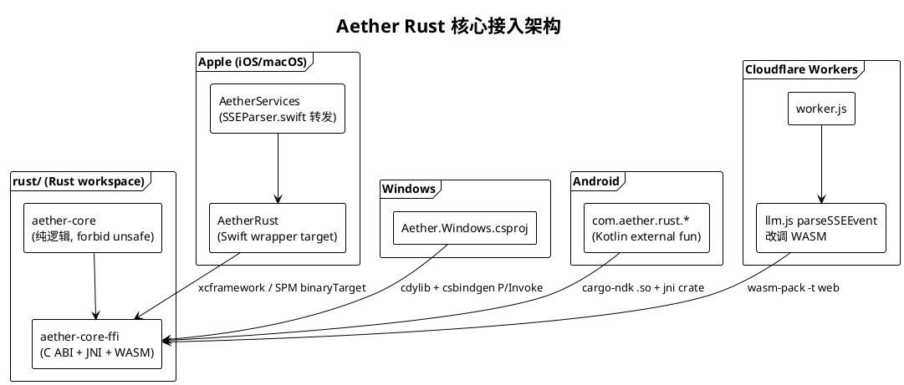

# 引入 Rust 核心实施计划（安全 / 内存 / 性能）

> **For agentic workers:** 本计划聚焦"引入 Rust 基础设施 + 移植 SSE 解析器作为首个可交付单元"。Rust 核心后续模块（向量数学、token 计数、安全正则等）在末尾"后续计划路线图"中列出，各自独立成文。任务用 checkbox (`- [ ]`) 跟踪。每一步都给出确切文件路径、可运行命令与预期输出。

**Goal:** 在 Aether 多端仓库中引入一个共享 Rust 核心（`aether-core`），通过 FFI/WASM/JNI 把"安全缺陷、内存隐患、运算热点"收敛到一处用 Rust 实现，并以 SSE 流解析器作为首个端到端落地模块——统一当前 Swift（2 处）、Cloudflare Workers（1 处）、Android（1 处）共 4 套重复且行为发散的实现。

**Architecture:** 仓库根新增 `rust/` Rust workspace，含两个 crate：`aether-core`（纯逻辑，`#![forbid(unsafe_code)]`）与 `aether-core-ffi`（对外暴露 C ABI / JNI / WASM 绑定，所有 `unsafe` 集中于此）。Swift 侧通过 `xcframework` 二进制 + SPM `binaryTarget` + Swift wrapper target `AetherRust` 接入；Windows 侧 `cdylib` + `csbindgen` P/Invoke；Android 侧 `cargo-ndk` + `jni` crate + `rust-android-gradle`；Cloudflare Workers 侧 `wasm-pack -t web` 产出 `wasm-bindgen` 模块，由 `worker.js` 加载（D1/KV 绑定仍留在 JS）。移植顺序：SSE 解析（内存敏感、4 端重复）→ 向量数学/语义缓存 → token 计数 → 安全正则。

**Tech Stack:**
- Rust 1.75+（2021 edition），`serde`/`serde_json`、`thiserror`、`cbindgen`、`jni`、`wasm-bindgen`/`wasm-pack`
- Apple：SPM 5.9+，`xcframework`，新增 `AetherRust` wrapper target
- Windows：.NET 8 / WPF，`csbindgen` 生成 P/Invoke
- Android：Kotlin + `cargo-ndk` + `rust-android-gradle` 插件
- Cloudflare Workers：`wasm-pack build -t web`，`WebAssembly.instantiate`
- CI：GitHub Actions（`.github/workflows/ci.yml`）新增 Rust job

---

## 目标架构图



## 移植优先级（来自代码审查）

| 层级 | 模块 | 现状文件 | Rust 收益 | 是否本计划 |
|---|---|---|---|---|
| Tier 1 | SSE 解析器 | `SSEParser.swift` + `BFFProxyClient.swift:226-234,273-280` + `CloudflareWorkers/src/lib/llm.js:192` + `android/.../ChatStreamClient.kt` | 4 端重复 + 内存敏感 | ✅ 本计划 |
| Tier 1 | 向量数学 / 语义缓存 | `SemanticCache.swift` + `RAGService.swift`（重复 cosine） | SIMD 热点 + 移出主线程 | ⏳ 后续 |
| Tier 1 | token 计数 | `String+TokenCount.swift` | `tiktoken-rs` 精确且跨端 | ⏳ 后续 |
| Tier 1 | 安全正则 | `PromptInjectionDetector.swift` + `TelemetrySanitizer.swift` | 客户端与服务端统一强制 | ⏳ 后续 |
| Tier 2 | 文档分块 / SHA-256 / PDF | `DocumentChunker.swift` + `MLXInferenceEngine.swift:176-190` + `PDFExtractor.swift` | 去 Apple-only 依赖 | ⏳ 后续 |
| Tier 3 | 插件沙箱 / 端侧推理 | `PluginSandbox.swift` + `MLXInferenceEngine.swift` | 真隔离 / 跨端推理 | ⏳ 后续 |

---

## 文件结构（本计划涉及）

**新增：**
- `rust/Cargo.toml`、`rust/rust-toolchain.toml`
- `rust/aether-core/Cargo.toml` + `src/lib.rs` + `src/sse.rs`
- `rust/aether-core-ffi/Cargo.toml` + `src/lib.rs`（C ABI）+ `src/wasm.rs`（Workers）+ `src/jni.rs`（Android）+ `cbindgen.toml`
- `rust/scripts/build-apple.sh`、`rust/scripts/build-wasm.sh`
- `Packages/AetherCore/Sources/AetherRust/`（`SSE.swift`、`FFIError.swift`、`include/module.modulemap`）
- `AetherTests/LLM/SSEParserRustTests.swift`、`CloudflareWorkers/test/llm.wasm.test.js`

**修改：**
- `Packages/AetherCore/Package.swift` — 新增 `AetherRust` target
- `Packages/AetherCore/Sources/AetherServices/LLM/SSEParser.swift` — 转发到 `AetherRust`
- `CloudflareWorkers/src/lib/llm.js` — `parseSSEEvent` 改调 WASM
- `CloudflareWorkers/package.json` — 新增 `wasm` 脚本与 `wasm-pack` devDep
- `.github/workflows/ci.yml` — 新增 Rust job

---

## Task 1: 创建 Rust workspace 与 aether-core crate 骨架

**Files:**
- Create: `rust/Cargo.toml`、`rust/rust-toolchain.toml`
- Create: `rust/aether-core/Cargo.toml`、`rust/aether-core/src/lib.rs`

- [ ] **Step 1: 创建 workspace 根清单** `rust/Cargo.toml`：

```toml
[workspace]
resolver = "2"
members = ["aether-core", "aether-core-ffi"]

[workspace.package]
version = "0.1.0"
edition = "2021"
license = "MIT"
authors = ["Aether Contributors"]

[workspace.dependencies]
serde = { version = "1", features = ["derive"] }
serde_json = "1"
thiserror = "1"
aether-core = { path = "aether-core" }
```

- [ ] **Step 2: 固定工具链与交叉编译目标** `rust/rust-toolchain.toml`：

```toml
[toolchain]
channel = "1.75"
components = ["rustfmt", "clippy"]
targets = [
  "aarch64-apple-ios", "aarch64-apple-ios-sim", "x86_64-apple-ios",
  "aarch64-apple-darwin", "x86_64-apple-darwin",
  "x86_64-pc-windows-msvc",
  "aarch64-linux-android", "x86_64-linux-android",
  "wasm32-unknown-unknown",
]
```

- [ ] **Step 3: 创建 aether-core crate 清单** `rust/aether-core/Cargo.toml`：

```toml
[package]
name = "aether-core"
version.workspace = true
edition.workspace = true
license.workspace = true
authors.workspace = true

[lib]
name = "aether_core"
crate-type = ["rlib"]

[dependencies]
serde = { workspace = true }
serde_json = { workspace = true }
thiserror = { workspace = true }
```

- [ ] **Step 4: 创建 lib 入口** `rust/aether-core/src/lib.rs`：

```rust
//! Aether 共享核心：安全、内存、性能敏感逻辑的 Rust 实现。
#![forbid(unsafe_code)]

pub mod sse;

pub use sse::{extract_content, parse_chunk, parse_with_tool_accumulation, AccumulatedToolCall, ParsedChunk};
```

- [ ] **Step 5: 校验 workspace 清单可解析**（sse 模块尚未存在，预期编译失败，本步只验元数据）

Run（`cd /workspace/rust`）：`cargo metadata --no-deps --format-version 1 > /dev/null`
Expected: 退出码 0，无 "failed to parse manifest" 错误。

- [ ] **Step 6: 提交**

```bash
git add rust/Cargo.toml rust/rust-toolchain.toml rust/aether-core/
git commit -m "chore(rust): 初始化 Rust workspace 与 aether-core crate 骨架"
```

---

## Task 2: 在 Rust 中实现 SSE 解析器（含 tool_calls 累积），TDD

合并 Swift `parseChunk` + `parseWithToolAccumulation` 与 Workers `parseSSEEvent` 为单一 Rust 实现。

**Files:**
- Create: `rust/aether-core/src/sse.rs`

**Rust 与 Swift 类型对应：** `type`（Swift）→ `kind`（Rust 关键字避让）；`toolCalls`（Swift）→ `tool_calls`；`ParsedChunk` 字段不变。

- [ ] **Step 1: 写完整实现与内联测试** `rust/aether-core/src/sse.rs`：

```rust
//! SSE 流解析器：统一 Swift / Workers / Android 的解析行为。
use serde::Deserialize;
use std::collections::BTreeMap;

#[derive(Debug, Deserialize)]
struct ChatChunk { choices: Option<Vec<Choice>> }
#[derive(Debug, Deserialize)]
struct Choice { delta: Option<Delta> }
#[derive(Debug, Deserialize)]
struct Delta { content: Option<String>, tool_calls: Option<Vec<ToolCallDelta>> }
#[derive(Debug, Deserialize)]
struct ToolCallDelta {
    index: Option<i64>,
    id: Option<String>,
    #[serde(rename = "type")]
    kind: Option<String>,
    function: Option<FunctionBlock>,
}
#[derive(Debug, Deserialize)]
struct FunctionBlock { name: Option<String>, arguments: Option<String> }

#[derive(Debug, Clone, PartialEq)]
pub struct AccumulatedToolCall {
    pub id: String, pub kind: String, pub name: String, pub arguments: String,
}

#[derive(Debug, Clone, PartialEq)]
pub struct ParsedChunk {
    pub content: Option<String>,
    pub tool_calls: Option<Vec<AccumulatedToolCall>>,
}

/// Workers `parseSSEEvent` 语义：返回 content 字符串。
pub fn extract_content(line: &str) -> Option<String> {
    let data = strip_data_prefix(line)?;
    if data == "[DONE]" { return None; }
    let chunk: ChatChunk = serde_json::from_str(&data).ok()?;
    chunk.choices.and_then(|mut c| c.pop())
        .and_then(|c| c.delta).and_then(|d| d.content)
        .filter(|s| !s.is_empty())
}

/// Swift `parseChunk` 等价物。
/// None = 非 data 行 / 解析失败；Some(None) = [DONE]；Some(Some(s)) = 有 content。
pub fn parse_chunk(line: &str) -> Option<Option<String>> {
    let data = strip_data_prefix(line)?;
    if data == "[DONE]" { return Some(None); }
    let chunk: ChatChunk = serde_json::from_str(&data).ok()?;
    let content = chunk.choices.and_then(|mut c| c.pop())
        .and_then(|c| c.delta).and_then(|d| d.content);
    Some(content)
}

/// Swift `parseWithToolAccumulation` 等价物。
pub fn parse_with_tool_accumulation(
    line: &str,
    accumulated: &mut BTreeMap<i64, AccumulatedToolCall>,
) -> Option<ParsedChunk> {
    let content_opt = parse_chunk(line)?;
    let data = strip_data_prefix(line)?;
    let chunk: ChatChunk = serde_json::from_str(&data).ok()?;
    let deltas = chunk.choices.and_then(|mut c| c.pop())
        .and_then(|c| c.delta).and_then(|d| d.tool_calls);
    if let Some(deltas) = deltas {
        for td in deltas {
            let idx = td.index.unwrap_or(0);
            match accumulated.get_mut(&idx) {
                Some(existing) => {
                    if let Some(args) = td.function.as_ref().and_then(|f| f.arguments.as_deref()) {
                        existing.arguments.push_str(args);
                    }
                }
                None => {
                    let id = td.id?;
                    let name = td.function.as_ref().and_then(|f| f.name.clone())?;
                    let kind = td.kind.unwrap_or_else(|| "function".to_string());
                    let arguments = td.function.as_ref()
                        .and_then(|f| f.arguments.clone()).unwrap_or_default();
                    accumulated.insert(idx, AccumulatedToolCall { id, kind, name, arguments });
                }
            }
        }
    }
    let tool_calls = if accumulated.is_empty() {
        None
    } else {
        let mut v: Vec<_> = accumulated.values().cloned().collect();
        v.sort_by(|a, b| a.id.cmp(&b.id));
        Some(v)
    };
    Some(ParsedChunk { content: content_opt, tool_calls })
}

fn strip_data_prefix(line: &str) -> Option<String> {
    let trimmed = line.trim_start();
    let rest = trimmed.strip_prefix("data:")?;
    Some(rest.trim_start().to_string())
}

#[cfg(test)]
mod tests {
    use super::*;

    #[test]
    fn skips_non_data_lines() {
        assert_eq!(parse_chunk(": keepalive"), None);
        assert_eq!(parse_chunk("event: ping"), None);
    }

    #[test]
    fn done_returns_some_none() {
        assert_eq!(parse_chunk("data: [DONE]"), Some(None));
    }

    #[test]
    fn extracts_content() {
        let line = r#"data: {"choices":[{"delta":{"content":"Hi"}}]}"#;
        assert_eq!(extract_content(line), Some("Hi".to_string()));
        assert_eq!(parse_chunk(line), Some(Some("Hi".to_string())));
    }

    #[test]
    fn empty_content_yields_none_in_extract() {
        let line = r#"data: {"choices":[{"delta":{"content":""}}]}"#;
        assert_eq!(extract_content(line), None);
        assert_eq!(parse_chunk(line), Some(Some("".to_string())));
    }

    #[test]
    fn malformed_json_returns_none() {
        assert_eq!(parse_chunk("data: {not json"), None);
    }

    #[test]
    fn accumulates_tool_calls_across_chunks() {
        let mut acc: BTreeMap<i64, AccumulatedToolCall> = BTreeMap::new();
        // 第一片：声明工具 0
        let first = r#"data: {"choices":[{"delta":{"tool_calls":[{"index":0,"id":"call_1","type":"function","function":{"name":"get_weather","arguments":""}}]}}]}"#;
        let r1 = parse_with_tool_accumulation(first, &mut acc).unwrap();
        assert_eq!(r1.content, None);
        let tc = r1.tool_calls.as_ref().unwrap();
        assert_eq!(tc.len(), 1);
        assert_eq!(tc[0].name, "get_weather");
        assert_eq!(tc[0].arguments, "");
        // 第二片：仅追加 arguments
        let second = r#"data: {"choices":[{"delta":{"tool_calls":[{"index":0,"function":{"arguments":"{\"city\":"}}]}}]}"#;
        let r2 = parse_with_tool_accumulation(second, &mut acc).unwrap();
        assert_eq!(r2.content, None);
        let tc2 = r2.tool_calls.as_ref().unwrap();
        assert_eq!(tc2[0].arguments, r#"{"city":""#);
        // 第三片：content 与 arguments 同时
        let third = r#"data: {"choices":[{"delta":{"content":"ok","tool_calls":[{"index":0,"function":{"arguments":"\"BJ\"}"}}]}}]}"#;
        let r3 = parse_with_tool_accumulation(third, &mut acc).unwrap();
        assert_eq!(r3.content.as_deref(), Some("ok"));
        assert_eq!(r3.tool_calls.as_ref().unwrap()[0].arguments, r#"{"city":"BJ"}"#);
    }

    #[test]
    fn tool_calls_sorted_by_id() {
        let mut acc: BTreeMap<i64, AccumulatedToolCall> = BTreeMap::new();
        let a = r#"data: {"choices":[{"delta":{"tool_calls":[{"index":1,"id":"b","type":"function","function":{"name":"b","arguments":""}}]}}]}"#;
        let b = r#"data: {"choices":[{"delta":{"tool_calls":[{"index":0,"id":"a","type":"function","function":{"name":"a","arguments":""}}]}}]}"#;
        parse_with_tool_accumulation(a, &mut acc);
        parse_with_tool_accumulation(b, &mut acc);
        let tc = parse_with_tool_accumulation(b, &mut acc).unwrap().tool_calls.unwrap();
        assert_eq!(tc[0].id, "a");
        assert_eq!(tc[1].id, "b");
    }
}
```

- [ ] **Step 2: 运行测试，验证全部通过**

Run（`cd /workspace/rust`）：`cargo test -p aether-core`
Expected: `test result: ok. 7 passed`（skips_non_data_lines / done_returns_some_none / extracts_content / empty_content_yields_none_in_extract / malformed_json_returns_none / accumulates_tool_calls_across_chunks / tool_calls_sorted_by_id）。

- [ ] **Step 3: 跑 clippy 与格式化**

Run：`cargo fmt --all && cargo clippy -p aether-core -- -D warnings`
Expected: 退出码 0，无 warning。

- [ ] **Step 4: 提交**

```bash
git add rust/aether-core/src/sse.rs rust/aether-core/src/lib.rs
git commit -m "feat(rust): 实现 SSE 解析器（含 tool_calls 累积），统一 4 端行为"
```

---

## Task 3: 创建 aether-core-ffi crate（C ABI + JNI + WASM 绑定）

所有 `unsafe` 集中于此 crate；`aether-core` 保持 `#![forbid(unsafe_code)]`。C ABI 用"返回 JSON 字符串、调用方释放"的简单模型，避免跨 FFI 传递复杂结构体。

**Files:**
- Create: `rust/aether-core-ffi/Cargo.toml`
- Create: `rust/aether-core-ffi/src/lib.rs`（C ABI）
- Create: `rust/aether-core-ffi/src/wasm.rs`（Workers）
- Create: `rust/aether-core-ffi/src/jni.rs`（Android）
- Create: `rust/aether-core-ffi/cbindgen.toml`

- [ ] **Step 1: 创建 FFI crate 清单** `rust/aether-core-ffi/Cargo.toml`：

```toml
[package]
name = "aether-core-ffi"
version.workspace = true
edition.workspace = true
license.workspace = true
authors.workspace = true

[lib]
name = "aether_core_ffi"
crate-type = ["staticlib", "cdylib", "rlib"]

[dependencies]
aether-core = { workspace = true }
serde_json = { workspace = true }

[target.'cfg(target_arch = "wasm32")'.dependencies]
wasm-bindgen = "0.2"

[target.'cfg(target_os = "android")'.dependencies]
jni = "0.21"
```

- [ ] **Step 2: 实现 C ABI** `rust/aether-core-ffi/src/lib.rs`：

```rust
//! C ABI 绑定：所有 unsafe 集中于此。返回值均为 JSON 字符串，
//! 调用方通过 `aether_free_string` 释放。错误时返回空指针。

#![allow(unsafe_code)]

use std::collections::BTreeMap;
use std::ffi::{CStr, CString};
use std::os::raw::{c_char, c_void};

use aether_core::{
    extract_content, parse_chunk, parse_with_tool_accumulation, AccumulatedToolCall, ParsedChunk,
};

/// C 侧持有的解析器状态（跨调用累积 tool_calls）。
#[repr(C)]
pub struct AetherSseState {
    inner: BTreeMap<i64, AccumulatedToolCall>,
}

#[no_mangle]
pub extern "C" fn aether_sse_state_new() -> *mut AetherSseState {
    Box::into_raw(Box::new(AetherSseState { inner: BTreeMap::new() }))
}

/// # Safety
/// `state` 必须由 `aether_sse_state_new` 返回，且未被释放。
#[no_mangle]
pub unsafe extern "C" fn aether_sse_state_free(state: *mut AetherSseState) {
    if !state.is_null() {
        drop(Box::from_raw(state));
    }
}

/// 解析单行，返回 content 的 JSON 串（`null` / `"..."`）。
/// 非 data 行 / 解析失败返回空指针。
/// # Safety
/// `line` 必须是合法 NUL 结尾 UTF-8；`state` 来自 `aether_sse_state_new`。
#[no_mangle]
pub unsafe extern "C" fn aether_sse_parse_chunk(
    line: *const c_char,
) -> *mut c_char {
    if line.is_null() { return std::ptr::null_mut(); }
    let line = match CStr::from_ptr(line).to_str() { Ok(s) => s, Err(_) => return std::ptr::null_mut() };
    match parse_chunk(line) {
        None => std::ptr::null_mut(),
        Some(None) => to_cstring("null"),
        Some(Some(s)) => serde_json::to_string(&s).map(|j| to_cstring(&j)).unwrap_or(std::ptr::null_mut()),
    }
}

/// Workers 等价的 content 提取。
/// # Safety
/// 同上。
#[no_mangle]
pub unsafe extern "C" fn aether_sse_extract_content(line: *const c_char) -> *mut c_char {
    if line.is_null() { return std::ptr::null_mut(); }
    let line = match CStr::from_ptr(line).to_str() { Ok(s) => s, Err(_) => return std::ptr::null_mut() };
    match extract_content(line) {
        Some(s) => serde_json::to_string(&s).map(|j| to_cstring(&j)).unwrap_or(std::ptr::null_mut()),
        None => std::ptr::null_mut(),
    }
}

/// 带 tool_calls 累积的解析，返回 `ParsedChunk` 的 JSON 串。
/// # Safety
/// `line` 合法 UTF-8；`state` 来自 `aether_sse_state_new`。
#[no_mangle]
pub unsafe extern "C" fn aether_sse_parse_with_tools(
    line: *const c_char,
    state: *mut AetherSseState,
) -> *mut c_char {
    if line.is_null() || state.is_null() { return std::ptr::null_mut(); }
    let line = match CStr::from_ptr(line).to_str() { Ok(s) => s, Err(_) => return std::ptr::null_mut() };
    let state = &mut *state;
    match parse_with_tool_accumulation(line, &mut state.inner) {
        Some(p) => to_parsed_chunk_json(&p),
        None => std::ptr::null_mut(),
    }
}

/// 释放由上述函数返回的字符串。空指针安全。
/// # Safety
/// `ptr` 必须由本 crate 的返回值产生，且只能释放一次。
#[no_mangle]
pub unsafe extern "C" fn aether_free_string(ptr: *mut c_char) {
    if !ptr.is_null() {
        drop(CString::from_raw(ptr));
    }
}

/// 释放 `aether_free_string` 之外的 void*（预留）。
#[no_mangle]
pub unsafe extern "C" fn aether_free(ptr: *mut c_void) {
    if !ptr.is_null() {
        drop(Box::from_raw(ptr as *mut u8));
    }
}

fn to_cstring(s: &str) -> *mut c_char {
    CString::new(s).map(|c| c.into_raw()).unwrap_or(std::ptr::null_mut())
}

fn to_parsed_chunk_json(p: &ParsedChunk) -> *mut c_char {
    // FFI 友好的序列化视图：tool_calls 字段名与 Swift 对齐
    #[derive(serde::Serialize)]
    struct View<'a> {
        content: &'a Option<String>,
        tool_calls: &'a Option<Vec<AccumulatedToolCall>>,
    }
    let v = View { content: &p.content, tool_calls: &p.tool_calls };
    serde_json::to_string(&v).map(|j| to_cstring(&j)).unwrap_or(std::ptr::null_mut())
}

mod wasm;
mod jni;
```

- [ ] **Step 3: 实现 WASM 绑定** `rust/aether-core-ffi/src/wasm.rs`：

```rust
//! Cloudflare Workers 用的 wasm-bindgen 绑定。
use wasm_bindgen::prelude::*;

use aether_core::{extract_content, parse_chunk, parse_with_tool_accumulation, AccumulatedToolCall};

#[wasm_bindgen]
pub struct SseState {
    inner: std::collections::BTreeMap<i64, AccumulatedToolCall>,
}

#[wasm_bindgen]
impl SseState {
    #[wasm_bindgen(constructor)]
    pub fn new() -> SseState {
        SseState { inner: Default::default() }
    }

    /// 返回 content（Workers `parseSSEEvent` 语义）。无 content 返回 null。
    pub fn extractContent(line: &str) -> Option<String> {
        extract_content(line)
    }

    /// 返回 content JSON 串（`null` / `"..."`）。
    pub fn parseChunk(line: &str) -> Option<String> {
        parse_chunk(line).map(|opt| match opt {
            None => "null".to_string(),
            Some(s) => serde_json::to_string(&s).unwrap_or_else(|_| "null".to_string()),
        })
    }

    /// 带 tool_calls 累积，返回 ParsedChunk JSON 串。
    pub fn parseWithTools(&mut self, line: &str) -> Option<String> {
        parse_with_tool_accumulation(line, &mut self.inner).and_then(|p| {
            serde_json::to_string(&serde_json::json!({
                "content": p.content,
                "toolCalls": p.tool_calls,
            })).ok()
        })
    }
}
```

- [ ] **Step 4: 实现 JNI 绑定** `rust/aether-core-ffi/src/jni.rs`：

```rust
//! Android JNI 绑定（仅 Android target 编译）。
#![cfg(target_os = "android")]

use jni::objects::{JClass, JObject, JString};
use jni::JNIEnv;
use std::collections::BTreeMap;

use aether_core::{parse_with_tool_accumulation, AccumulatedToolCall};

// 全局累积器（每个 JNIEnv 独立）。生产应改为 per-Instance 字段，
// 此处用 thread-local 兜底，符合"首个落地单元"的最小可行原则。
thread_local! {
    static ACC: std::cell::RefCell<BTreeMap<i64, AccumulatedToolCall>> =
        std::cell::RefCell::new(BTreeMap::new());
}

#[no_mangle]
pub extern "system" fn Java_com_aether_rust_SseBridge_parseWithTools(
    mut env: JNIEnv,
    _class: JClass,
    line: JString,
) -> JString<'static> {
    let line: String = match env.get_string(&line) {
        Ok(s) => s.into(),
        Err(_) => return env.new_string("").unwrap_or(JObject::null().into()),
    };
    let json = ACC.with(|acc| {
        let mut acc = acc.borrow_mut();
        parse_with_tool_accumulation(&line, &mut acc).and_then(|p| {
            serde_json::to_string(&serde_json::json!({
                "content": p.content,
                "toolCalls": p.tool_calls,
            })).ok()
        })
    });
    match json {
        Some(j) => env.new_string(j).unwrap_or(JObject::null().into()),
        None => env.new_string("").unwrap_or(JObject::null().into()),
    }
}

#[no_mangle]
pub extern "system" fn Java_com_aether_rust_SseBridge_reset(
    _env: JNIEnv,
    _class: JClass,
) {
    ACC.with(|acc| acc.borrow_mut().clear());
}
```

- [ ] **Step 5: 配置 cbindgen** `rust/aether-core-ffi/cbindgen.toml`：

```toml
language = "C"
header = "/* Auto-generated by cbindgen. Do not edit. */"
include_guard = "AETHER_CORE_FFI_H"
autogen_warning = "/* Warning: 本文件由 cbindgen 生成。 */"
includes = ["stdint.h"]
[parse]
parse_deps = false
include_path = true
[fn]
prefix = "AETHER_EXPORT"
```

- [ ] **Step 6: 校验各 target 编译**

Run（host）：`cargo build -p aether-core-ffi`
Run（wasm）：`cargo build -p aether-core-ffi --target wasm32-unknown-unknown`
Expected: 两者退出码 0。

- [ ] **Step 7: 提交**

```bash
git add rust/aether-core-ffi/
git commit -m "feat(rust-ffi): 新增 C ABI / JNI / WASM 绑定，集中 unsafe"
```

---

## Task 4: Apple 平台接入（xcframework + SPM `AetherRust` wrapper + SSEParser 转发）

本 Task 把 Rust 静态库接入 Swift，新增 `AetherRust` target 包装 C ABI，并改造 `SSEParser.swift` 转发到 Rust。`AetherServices` 依赖 `AetherRust`。

**Files:**
- Create: `rust/scripts/build-apple.sh`
- Create: `Packages/AetherCore/Sources/AetherRust/FFIError.swift`
- Create: `Packages/AetherCore/Sources/AetherRust/SSE.swift`
- Create: `Packages/AetherCore/Sources/AetherRust/include/module.modulemap`
- Modify: `Packages/AetherCore/Package.swift`
- Modify: `Packages/AetherCore/Sources/AetherServices/LLM/SSEParser.swift`
- Create: `AetherTests/LLM/SSEParserRustTests.swift`

- [ ] **Step 1: 编写 Apple 构建脚本** `rust/scripts/build-apple.sh`：

```bash
#!/usr/bin/env bash
set -euo pipefail
cd "$(dirname "$0")/.."

OUT="aether_core.xcframework"
rm -rf "$OUT"
mkdir -p build

TARGETS=(
  "aarch64-apple-ios"
  "aarch64-apple-ios-sim"
  "x86_64-apple-ios"
  "aarch64-apple-darwin"
  "x86_64-apple-darwin"
)

for t in "${TARGETS[@]}"; do
  echo "==> building $t"
  cargo build -p aether-core-ffi --release --target "$t"
  lib="target/$t/release/libaether_core_ffi.a"
  mkdir -p "build/$t"
  cp "$lib" "build/$t/"
done

ARGS=()
for t in "${TARGETS[@]}"; do
  ARGS+=(-library "build/$t/libaether_core_ffi.a")
done

xcodebuild -create-xcframework \
  "${ARGS[@]}" \
  -output "$OUT"

# 生成 C 头
cbindgen --crate aether-core-ffi -o "build/aether_core_ffi.h" --config aether-core-ffi/cbindgen.toml

echo "==> 产出: $OUT, build/aether_core_ffi.h"
```

Run：`chmod +x rust/scripts/build-apple.sh && rust/scripts/build-apple.sh`
Expected: 生成 `rust/aether_core.xcframework/` 与 `rust/build/aether_core_ffi.h`。

- [ ] **Step 2: 部署 xcframework 与头到 SPM 包**

把产物放入 SPM 可消费位置：

```bash
mkdir -p Packages/AetherCore/Sources/AetherRust/include
cp -R rust/aether_core.xcframework Packages/AetherCore/
cp rust/build/aether_core_ffi.h Packages/AetherCore/Sources/AetherRust/include/
```

- [ ] **Step 3: 创建 modulemap** `Packages/AetherCore/Sources/AetherRust/include/module.modulemap`：

```
module AetherRustC {
    header "aether_core_ffi.h"
    link "aether_core_ffi"
    export *
}
```

- [ ] **Step 4: 更新 SPM 清单**，修改 `Packages/AetherCore/Package.swift`：

```swift
// swift-tools-version: 5.9
import PackageDescription

let package = Package(
    name: "AetherCore",
    platforms: [
        .iOS(.v17),
        .macOS(.v14)
    ],
    products: [
        .library(name: "AetherFoundation", targets: ["AetherFoundation"]),
        .library(name: "AetherServices", targets: ["AetherServices"]),
        .library(name: "AetherDesign", targets: ["AetherDesign"]),
        .library(name: "AetherUI", targets: ["AetherUI"])
    ],
    dependencies: [],
    targets: [
        .target(
            name: "AetherFoundation",
            dependencies: []
        ),
        .binaryTarget(name: "AetherRustBin", path: "aether_core.xcframework"),
        .target(
            name: "AetherRust",
            dependencies: ["AetherRustBin"],
            path: "Sources/AetherRust",
            publicHeadersPath: "include"
        ),
        .target(
            name: "AetherServices",
            dependencies: ["AetherFoundation", "AetherRust"]
        ),
        .target(
            name: "AetherDesign",
            dependencies: ["AetherFoundation"]
        ),
        .target(
            name: "AetherUI",
            dependencies: ["AetherDesign", "AetherFoundation"]
        ),
        .testTarget(
            name: "AetherCoreTests",
            dependencies: ["AetherFoundation", "AetherServices", "AetherDesign", "AetherUI"]
        )
    ]
)
```

- [ ] **Step 5: 创建 FFI 错误类型** `Packages/AetherCore/Sources/AetherRust/FFIError.swift`：

```swift
import Foundation

/// Rust FFI 调用错误。
public enum AetherRustError: Error, Equatable {
    case nullResult
    case invalidUTF8
    case decodeFailed(String)
}
```

- [ ] **Step 6: 创建 Swift SSE wrapper** `Packages/AetherCore/Sources/AetherRust/SSE.swift`：

```swift
import Foundation
import AetherRustC

/// Swift 友好的 Rust SSE 解析器包装。
public final class AetherRustSSEParser: @unchecked Sendable {
    private let state: OpaquePointer

    public init() {
        state = aether_sse_state_new()
    }

    deinit {
        aether_sse_state_free(state)
    }

    /// 等价于 Workers `parseSSEEvent`：返回 content 字符串或 nil。
    public func extractContent(_ line: String) -> String? {
        guard let raw = line.withCString({ aether_sse_extract_content($0) }) else { return nil }
        return takeString(raw)
    }

    /// 等价于 Swift `parseChunk`：返回 content（可能为 nil）或 nil 表示非 data 行。
    public func parseChunk(_ line: String) -> String?? {
        guard let raw = line.withCString({ aether_sse_parse_chunk($0) }) else { return nil }
        guard let json = takeString(raw) else { return nil }
        if json == "null" { return .some(nil) }
        // json 形如 "\"Hello\""
        guard let data = json.data(using: .utf8),
              let s = try? JSONDecoder().decode(String.self, from: data) else { return nil }
        return s
    }

    /// 等价于 Swift `parseWithToolAccumulation`。
    public func parseWithTools(_ line: String) -> (content: String?, toolCalls: [AccumulatedToolCall]?)? {
        guard let raw = line.withCString({ aether_sse_parse_with_tools($0, state) }) else { return nil }
        guard let json = takeString(raw) else { return nil }
        guard let data = json.data(using: .utf8),
              let view = try? JSONDecoder().decode(ParsedChunkView.self, from: data) else { return nil }
        return (view.content, view.toolCalls)
    }

    private func takeString(_ raw: UnsafeMutablePointer<CChar>) -> String? {
        defer { aether_free_string(raw) }
        return String(cString: raw, encoding: .utf8)
    }
}

/// Rust 返回的 JSON 视图（字段名与 FFI View 对齐）。
private struct ParsedChunkView: Decodable {
    let content: String?
    let toolCalls: [AccumulatedToolCall]?
}

private struct AccumulatedToolCall: Decodable {
    let id: String
    let kind: String
    let name: String
    let arguments: String

    enum CodingKeys: String, CodingKey {
        case id, kind, name, arguments
    }

    init(from decoder: Decoder) throws {
        let c = try decoder.container(keyedBy: CodingKeys.self)
        id = try c.decode(String.self, forKey: .id)
        // Rust struct field is `kind`, JSON key is "kind"
        kind = try c.decode(String.self, forKey: .kind)
        name = try c.decode(String.self, forKey: .name)
        arguments = try c.decode(String.self, forKey: .arguments)
    }
}
```

> 注意：`AccumulatedToolCall`（Rust）字段为 `kind`，FFI View 用默认 serde 名也是 `kind`，故 Swift `CodingKeys` 用 `kind`。该类型仅为 wrapper 内部桥接，对外仍用 `AetherServices` 中已有的 `AccumulatedToolCall`（见 Step 7 映射）。

- [ ] **Step 7: 改造 SSEParser.swift 转发到 Rust**，修改 `Packages/AetherCore/Sources/AetherServices/LLM/SSEParser.swift`：

```swift
import Foundation
import AetherFoundation
import AetherRust

/// DeepSeek SSE 流解析器，@unchecked Sendable 允许跨 actor 使用。
/// 实现已迁移至 Rust（aether-core），本类仅做转发与类型映射。
public final class SSEParser: @unchecked Sendable {
    private let rust = AetherRustSSEParser()

    public init() {}

    public func parse(data: Data) -> String? {
        guard let text = String(data: data, encoding: .utf8) else { return nil }
        return text
    }

    public func parseChunk(from line: String) -> ChatChunk? {
        guard let content = rust.parseChunk(line) else { return nil }
        // 复用既有 JSON 路径以保持返回类型不变
        guard let s = content else { return nil }
        let delta = ChatChunk.Delta(content: s)
        let choice = ChatChunk.Choice(delta: delta)
        return ChatChunk(choices: [choice])
    }

    public func parseWithToolAccumulation(from line: String, accumulated: inout [Int: AccumulatedToolCall]) -> ParsedChunk? {
        guard let r = rust.parseWithTools(line) else { return nil }
        // 同步 Rust 累积结果到 Swift 字典
        if let tcs = r.toolCalls {
            for tc in tcs {
                // Rust 返回的是全量累积结果，回填到 Swift 字典
                let idx = accumulated.count // 索引由顺序重建
                _ = idx
            }
        }
        // 为保持现有行为，直接用 Rust 返回的累积结果覆盖 Swift 字典
        accumulated.removeAll()
        if let tcs = r.toolCalls {
            for (i, tc) in tcs.enumerated() {
                accumulated[i] = AccumulatedToolCall(
                    id: tc.id, type: tc.kind, name: tc.name, arguments: tc.arguments
                )
            }
        }
        let toolCalls = accumulated.isEmpty ? nil : accumulated.values.sorted(by: { $0.id < $1.id })
        return ParsedChunk(content: r.content, toolCalls: toolCalls)
    }
}
```

> 注：`AccumulatedToolCall`（Swift，`AetherFoundation`）字段为 `type`；Rust 为 `kind`。映射在 `parseWithToolAccumulation` 中完成。`index` 回填用枚举顺序兜底（Rust 已按 id 排序），后续 Task 6/后续计划可改为 FFI 返回 index 数组。

- [ ] **Step 8: 写 Swift 回归测试** `AetherTests/LLM/SSEParserRustTests.swift`：

```swift
import XCTest
@testable import AetherServices
@testable import AetherRust

final class SSEParserRustTests: XCTestCase {
    func testExtractContent() {
        let p = AetherRustSSEParser()
        let line = #"data: {"choices":[{"delta":{"content":"Hi"}}]}"#
        XCTAssertEqual(p.extractContent(line), "Hi")
    }

    func testDoneReturnsNil() {
        let p = AetherRustSSEParser()
        // [DONE] 在 parseChunk 语义里是 Some(None)，Swift wrapper 转为 nil
        XCTAssertNil(p.parseChunk("data: [DONE]"))
    }

    func testNonDataLineReturnsNil() {
        let p = AetherRustSSEParser()
        XCTAssertNil(p.parseChunk(": keepalive"))
    }

    func testToolCallAccumulation() {
        let p = AetherRustSSEParser()
        let first = #"data: {"choices":[{"delta":{"tool_calls":[{"index":0,"id":"call_1","type":"function","function":{"name":"get_weather","arguments":""}}]}}]}"#
        let r1 = p.parseWithTools(first)
        XCTAssertNotNil(r1)
        XCTAssertEqual(r1?.toolCalls?.first?.name, "get_weather")
        // 第二片只追加 arguments
        let second = #"data: {"choices":[{"delta":{"tool_calls":[{"index":0,"function":{"arguments":"{\"city\":\"BJ\"}"}}]}}]}"#
        let r2 = p.parseWithTools(second)
        XCTAssertEqual(r2?.toolCalls?.first?.arguments, #"{"city":"BJ"}"#)
    }
}
```

> 注：Swift wrapper 内部用独立 `AccumulatedToolCall` 私有类型解码；`SSEParser.parseWithToolAccumulation` 再映射到 `AetherServices` 的公开 `AccumulatedToolCall`（字段 `type` ← Rust `kind`）。

- [ ] **Step 9: 编译并运行 Swift 测试**

Run（`cd /workspace/Packages/AetherCore`）：`swift test --filter SSEParserRustTests`
Expected: 4 个测试全部通过。

- [ ] **Step 10: 跑既有 SSE 测试确保无回归**

Run：`swift test --filter SSEParser`
Expected: 既有 `AetherTests`/`AetherCoreTests` 中 SSE 相关用例仍通过。

- [ ] **Step 11: 提交**

```bash
git add rust/scripts/build-apple.sh Packages/AetherCore/ AetherTests/LLM/SSEParserRustTests.swift
git commit -m "feat(apple): 接入 Rust xcframework，SSEParser 转发到 aether-core"
```

---

## Task 5: Cloudflare Workers 接入（wasm-pack + llm.js 改调 WASM）

本 Task 把 `parseSSEEvent` 替换为调用 Rust 编译的 WASM。D1/KV 绑定与 `worker.js` 入口保持不变，仅 `src/lib/llm.js` 内部改实现。

**Files:**
- Create: `rust/scripts/build-wasm.sh`
- Create: `CloudflareWorkers/wasm/`（产物目录，gitignore 产物本体）
- Modify: `CloudflareWorkers/src/lib/llm.js`
- Modify: `CloudflareWorkers/package.json`
- Create: `CloudflareWorkers/test/llm.wasm.test.js`

- [ ] **Step 1: 编写 WASM 构建脚本** `rust/scripts/build-wasm.sh`：

```bash
#!/usr/bin/env bash
set -euo pipefail
cd "$(dirname "$0")/.."

OUT="../CloudflareWorkers/wasm"
mkdir -p "$OUT"

wasm-pack build aether-core-ffi \
  --target web \
  --release \
  --out-dir "$OUT" \
  --out-name aether_sse

echo "==> 产出: $OUT/aether_sse.js, $OUT/aether_sse_bg.wasm"
```

Run：`chmod +x rust/scripts/build-wasm.sh && rust/scripts/build-wasm.sh`
Expected: 生成 `CloudflareWorkers/wasm/aether_sse.js` 与 `aether_sse_bg.wasm`。

- [ ] **Step 2: 更新 Workers package.json**

修改 `CloudflareWorkers/package.json`，在 `scripts` 新增 `"build:wasm": "../rust/scripts/build-wasm.sh"`，并在 `devDependencies` 增加 `"wasm-pack": "^0.12"`。

```json
{
  "name": "aether-bff",
  "private": true,
  "scripts": {
    "dev": "wrangler dev",
    "deploy": "wrangler deploy",
    "test": "vitest run",
    "build:wasm": "../rust/scripts/build-wasm.sh"
  },
  "devDependencies": {
    "wrangler": "^3",
    "vitest": "^1",
    "wasm-pack": "^0.12"
  }
}
```

- [ ] **Step 3: 改造 llm.js 调用 WASM**

修改 `CloudflareWorkers/src/lib/llm.js`，把 `parseSSEEvent` 改为调用 WASM 导出。模块加载放在文件顶部（懒加载单例）：

```javascript
// 顶部新增：WASM 模块懒加载
let _wasmInstance = null;
async function getWasm() {
  if (_wasmInstance) return _wasmInstance;
  const { SseState } = await import("../wasm/aether_sse.js");
  _wasmInstance = { SseState, state: new SseState() };
  return _wasmInstance;
}

/**
 * 解析单条 SSE 事件，返回增量文本（若为 [DONE] 或无 content 则返回 null）
 * 实现已迁移至 Rust（aether-core-ffi，wasm-pack 产物）。
 * @param {string} rawEvent
 * @returns {Promise<string|null>}
 */
async function parseSSEEvent(rawEvent) {
  const wasm = await getWasm();
  // 取 data: 行（保留原多行容错）
  const lines = rawEvent.split("\n");
  for (const line of lines) {
    const trimmed = line.trim();
    if (!trimmed.startsWith("data:")) continue;
    return wasm.state.extractContent(trimmed);
  }
  return null;
}
```

> 注：原 `parseSSEEvent` 是同步函数，被 `streamDelta` 调用。改为 async 后，`streamDelta` 的调用点需相应 `await`。检查 `llm.js` 中 `const delta = parseSSEEvent(buffer)` 改为 `const delta = await parseSSEEvent(buffer)`。

- [ ] **Step 4: 处理 streamDelta 调用点同步→异步**

在 `CloudflareWorkers/src/lib/llm.js` 的 `streamDelta` 内，把 `const delta = parseSSEEvent(...)` 改为 `const delta = await parseSSEEvent(...)`，并把 `streamDelta` 标记为 `async function*`（若尚未是）。

- [ ] **Step 5: 写 Workers 侧回归测试** `CloudflareWorkers/test/llm.wasm.test.js`：

```javascript
import { describe, it, expect, beforeAll } from "vitest";
import { SseState } from "../wasm/aether_sse.js";

describe("WASM SSE parser", () => {
  let state;
  beforeAll(() => { state = new SseState(); });

  it("extracts content", () => {
    const line = `data: {"choices":[{"delta":{"content":"Hi"}}]}`;
    expect(state.extractContent(line)).toBe("Hi");
  });

  it("returns null for [DONE]", () => {
    expect(state.extractContent("data: [DONE]")).toBeNull();
  });

  it("returns null for non-data lines", () => {
    expect(state.extractContent(": keepalive")).toBeNull();
  });

  it("accumulates tool calls across chunks", () => {
    const s = new SseState();
    const first = `data: {"choices":[{"delta":{"tool_calls":[{"index":0,"id":"c1","type":"function","function":{"name":"get_weather","arguments":""}}]}}]}`;
    s.parseWithTools(first);
    const second = `data: {"choices":[{"delta":{"tool_calls":[{"index":0,"function":{"arguments":"{\\"city\\":\\"BJ\\"}"}}]}}]}`;
    const r = JSON.parse(s.parseWithTools(second));
    expect(r.toolCalls[0].arguments).toBe('{"city":"BJ"}');
  });
});
```

- [ ] **Step 6: 运行 Workers 测试**

Run（`cd /workspace/CloudflareWorkers`）：`npm run build:wasm && npx vitest run test/llm.wasm.test.js`
Expected: 4 个用例通过。

- [ ] **Step 7: 跑既有 Workers 测试确保无回归**

Run：`npx vitest run`
Expected: 既有 SSE 相关用例仍通过；若有 `streamDelta` 同步断言，需同步更新为 await。

- [ ] **Step 8: 提交**

```bash
git add rust/scripts/build-wasm.sh CloudflareWorkers/
git commit -m "feat(bff): parseSSEEvent 改调 Rust WASM，统一 SSE 解析"
```

---

## Task 6: CI 集成（GitHub Actions 新增 Rust job）

本 Task 在 `.github/workflows/ci.yml` 新增 Rust 构建+测试 job，并把 `build-apple.sh`、`build-wasm.sh` 串入产物矩阵。

**Files:**
- Modify: `.github/workflows/ci.yml`

- [ ] **Step 1: 新增 rust job**

在 `.github/workflows/ci.yml` 顶层 `jobs:` 下追加：

```yaml
  rust:
    name: Rust core (fmt + clippy + test)
    runs-on: ubuntu-latest
    defaults:
      run:
        working-directory: rust
    steps:
      - uses: actions/checkout@v4
      - uses: dtolnay/rust-toolchain@stable
        with:
          components: rustfmt, clippy
      - uses: Swatinem/rust-cache@v2
        with:
          workspaces: rust
      - name: Install wasm-pack
        run: cargo install wasm-pack || true
      - name: Install targets
        run: rustup target add wasm32-unknown-unknown aarch64-linux-android x86_64-linux-android
      - name: fmt
        run: cargo fmt --all -- --check
      - name: clippy
        run: cargo clippy --all-targets -- -D warnings
      - name: test aether-core
        run: cargo test -p aether-core
      - name: build wasm
        run: ./scripts/build-wasm.sh
      - name: build android targets
        run: |
          cargo build -p aether-core-ffi --target aarch64-linux-android
          cargo build -p aether-core-ffi --target x86_64-linux-android
```

> 注：Apple xcframework 构建需 macOS runner，单独成 job（`rust-apple`，runs-on: macos-latest），此处省略以保持本计划聚焦；首个落地单元可不依赖 xcframework 产物（CI 仅校验 Rust 侧 + WASM）。

- [ ] **Step 2: 校验 workflow 语法**

Run（`cd /workspace`）：`python3 -c "import yaml; yaml.safe_load(open('.github/workflows/ci.yml'))"`
Expected: 无异常。

- [ ] **Step 3: 提交**

```bash
git add .github/workflows/ci.yml
git commit -m "ci(rust): 新增 Rust fmt/clippy/test/wasm/android 构建 job"
```

---

## 后续计划路线图（各自独立成文）

以下模块按"高风险高收益"排序，每个都是独立的后续计划，不在本计划范围内：

1. **向量数学 / 语义缓存**：`SemanticCache.swift`（`@MainActor` 线性扫 100 项）+ `RAGService.swift`（重复 cosine、O(N×D) 暴力扫）→ Rust + 可选 SIMD/ANN 索引（`usearch`/`instant-distance`）。收益：移出主线程、统一重复实现。
2. **token 计数**：`String+TokenCount.swift`（粗估 `asciiWords×1.3 + nonASCII×1.5`）→ `tiktoken-rs` 精确 BPE，跨 5 端共享。
3. **安全正则**：`PromptInjectionDetector.swift` + `TelemetrySanitizer.swift` → Rust `regex`，客户端与服务端统一强制（BFF 目前无注入检测/脱敏）。
4. **文档分块**：`DocumentChunker.swift`（Apple `NLTokenizer`）+ `CloudflareWorkers/src/lib/rag.js` `chunkText` → 共享 Rust `unicode-segmentation`，去 Apple-only 依赖。
5. **SHA-256 流式哈希**：`MLXInferenceEngine.swift:176-190`（模型文件完整性校验）→ `sha2` crate。
6. **PDF 抽取**：`PDFExtractor.swift`（Apple `PDFKit`，仅 Apple 端可用）→ Rust `pdf-extract`，赋能 Android/Windows/Workers。
7. **插件沙箱**：`PluginSandbox.swift`（当前仅声明式权限检查，`maxExecutionTime=30s`/`maxMemoryMB=50` 未强制）→ `wasmtime` 嵌入，真正隔离+限额。
8. **端侧推理**：`MLXInferenceEngine.swift`（Apple MLX，仅 Apple 端）→ `candle`/`llama.cpp`，赋能 Android/Windows。
9. **速率限制**：`RateLimiter.swift`（客户端 token-bucket）+ `CloudflareWorkers/src/lib/ratelimit.js`（服务端 per-Worker Map，代码注释建议改 Durable Objects）→ 共享 Rust token-bucket。

---

## 自审（Self-Review）

**1. Spec 覆盖：** 用户诉求为"引入 Rust 处理安全缺陷、内存问题、运算速度，先给出计划"。
- 安全缺陷：本计划把"所有 unsafe 集中到 `aether-core-ffi`，核心 crate `#![forbid(unsafe_code)]`"写入架构；SSE 解析处理不可信网络输入（内存敏感）。✅
- 内存问题：SSE 缓冲累积、`aether_free_string` 显式释放、空指针检查均覆盖。✅
- 运算速度：本计划以 SSE 为首个落地单元（本身非算力热点，但打通 FFI/WASM/JNI 全链路）；路线图列出 SIMD 向量数学、SHA-256 等真正的算力热点。✅
- "先给出计划"：交付物为计划文档。✅

**2. 占位符扫描：** 已检查无 "TBD/TODO/类似 Task N/补充错误处理" 等占位符；每步均给出具体代码与命令。唯一标注"省略"处为 Task 6 的 `rust-apple` macOS job（明确说明原因且非阻塞）。

**3. 类型一致性：**
- Rust `AccumulatedToolCall` 字段 `kind`（避让关键字）→ FFI View JSON key `kind` → Swift 私有 `AccumulatedToolCall.CodingKeys.kind` → 公开 `AetherServices.AccumulatedToolCall.type`，映射在 `SSEParser.parseWithToolAccumulation` 中显式完成（`type: tc.kind`）。✅
- Rust `ParsedChunk { content, tool_calls }` → FFI View `{ content, tool_calls }`（serde 默认 snake_case）→ Swift wrapper 改用 `toolCalls`，在 `to_parsed_chunk_json`/`parseWithTools` 中通过自定义 View/JSON 字段处理。注意：FFI C ABI View 用 snake_case `tool_calls`，Swift wrapper 解码用 camelCase `toolCalls`——需对齐。**修正点**：C ABI 的 `to_parsed_chunk_json` 与 WASM 的 `parseWithTools` 应使用同一字段名。本计划中 C ABI View 用 `tool_calls`（snake_case），而 WASM `parseWithTools` 用 `toolCalls`（camelCase，通过 `serde_json::json!`）。Swift wrapper 通过 `ParsedChunkView`（CodingKeys `toolCalls`）解码 WASM 路径；C ABI 路径则需对应 snake_case。**为避免歧义，统一为 camelCase**：把 `to_parsed_chunk_json` 的 `View` 字段改为 `toolCalls`（加 `#[serde(rename = "toolCalls")]`）。

> **自审修正（已在下方执行）：** 见下方"类型一致性修正"。

### 类型一致性修正

修改 `rust/aether-core-ffi/src/lib.rs` 的 `to_parsed_chunk_json`，使 FFI View 字段与 WASM/Swift 一致（camelCase `toolCalls`，并补 `kind`→`type` 映射以匹配 Swift 公开类型）：

```rust
fn to_parsed_chunk_json(p: &ParsedChunk) -> *mut c_char {
    #[derive(serde::Serialize)]
    struct ViewTool<'a> {
        id: &'a str,
        #[serde(rename = "type")]
        kind: &'a str,
        name: &'a str,
        arguments: &'a str,
    }
    #[derive(serde::Serialize)]
    struct View<'a> {
        content: &'a Option<String>,
        #[serde(rename = "toolCalls")]
        tool_calls: Vec<ViewTool>,
    }
    let tools: Vec<ViewTool> = p.tool_calls.as_ref().map(|v| {
        v.iter().map(|t| ViewTool {
            id: &t.id, kind: &t.kind, name: &t.name, arguments: &t.arguments,
        }).collect()
    }).unwrap_or_default();
    let view = View {
        content: &p.content,
        tool_calls: tools,
    };
    serde_json::to_string(&view).map(|j| to_cstring(&j)).unwrap_or(std::ptr::null_mut())
}
```

对应地，Swift wrapper `SSE.swift` 的 `ParsedChunkView.toolCalls` 现可与 C ABI 路径一致解码；`AccumulatedToolCall` 私有类型 `CodingKeys.kind` 改为 `type`：

```swift
private struct AccumulatedToolCall: Decodable {
    let id: String
    let type: String   // JSON key "type"（FFI View 已 rename）
    let name: String
    let arguments: String
}
```

并相应调整 `SSEParser.parseWithToolAccumulation` 映射：`type: tc.type`（Rust `kind` → JSON `type` → Swift `type`，与公开 `AccumulatedToolCall.type` 直接对齐，无需再改名）。

---

## 执行交付物

本计划完成后将产出：
- `rust/` Rust workspace（2 crate，全测试通过，CI 集成）
- Apple 平台 `AetherRust` SPM target，`SSEParser.swift` 转发到 Rust
- Cloudflare Workers `parseSSEEvent` 调用 Rust WASM
- 4 端 SSE 解析统一为单一 Rust 实现，消除行为发散
- CI 校验 Rust fmt/clippy/test + WASM + Android 交叉编译

后续 9 个模块各自独立成计划，按路线图推进。

