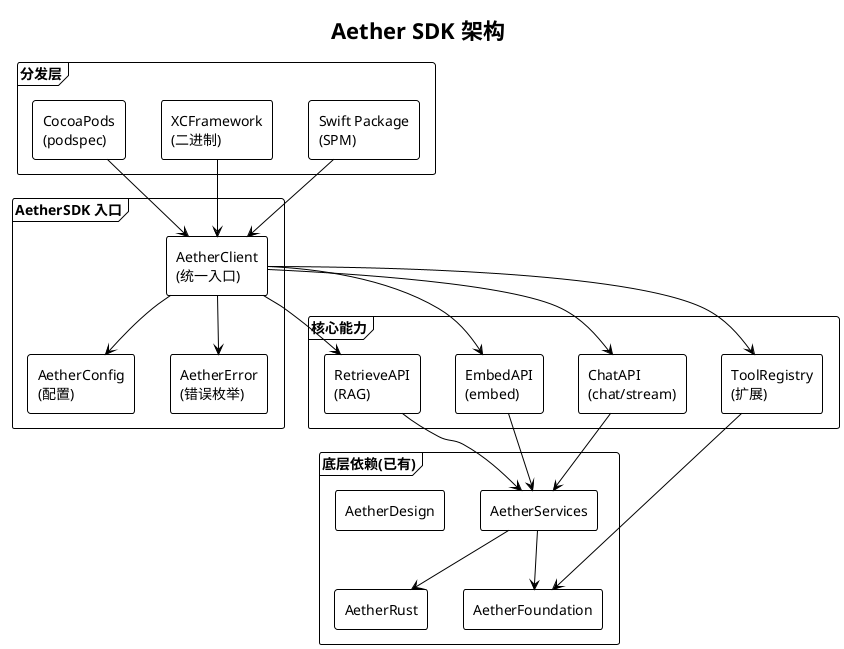
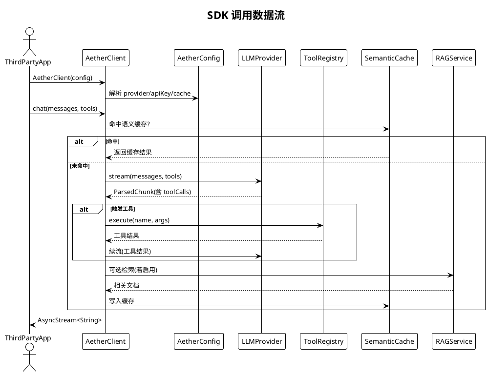

# Aether SDK 规划

> **状态：已实施** · **P3 远期规划 · Task 24** · 日期：2026-07-17 · 范围：API 设计、分发方式、鉴权、核心 API、工具扩展、配置 API、错误处理、与 AetherCore SPM 关系、文档与示例

## 一、背景与目标

Aether 已在 `Packages/AetherCore/` 下沉淀出可复用 SPM 包（AetherFoundation / AetherServices / AetherDesign / AetherUI / AetherRust），含 `LLMProvider` 协议、`ToolProtocol` 协议、`ToolRegistry` 注册中心、RAG 服务、Plugin 系统与 Rust 核心 FFI。但这些模块当前作为 App 内部依赖，未对外暴露公共 API，第三方开发者无法集成 Aether 的对话/工具/RAG 能力到自身 App。`Packages/AetherCore/Package.swift` 仅有 4 个 product 库，无 `AetherSDK` 顶层入口，无 DocC 文档，无示例工程。

本规划目标：
1. 将 `AetherCore` SPM 包升级为公共 `AetherSDK`，对外暴露统一入口。
2. 设计 API：`AetherClient.chat()` / `stream()` / `embed()` / `retrieve()`。
3. 支持多分发方式：Swift Package / XCFramework / CocoaPods。
4. 提供鉴权方案：API Key / OAuth 2.0 / JWT / 设备绑定。
5. 提供工具扩展 API：注册自定义工具 / 工具权限模型。
6. 提供配置 API：LLM Provider / 缓存 / RAG / 限流。
7. 设计错误处理与重试策略。
8. 提供 DocC 文档、Sample App、Playground。

## 二、现状分析

| 维度 | 现状 | 文件位置 | 缺口 |
|------|------|----------|------|
| SPM 产品 | 4 个 product 库 | `AetherCore/Package.swift:11-15` | 无 `AetherSDK` 顶层入口 |
| 公共 API | `LLMProvider` / `ToolProtocol` 已 public | `LLMProvider.swift` | 无统一 Client |
| 工具注册 | `ToolRegistry.shared` 单例 | `ToolRegistry.swift:16` | 无第三方注册入口 |
| 鉴权 | BFF Token（KV 存） | `worker.js:259` | 无 OAuth/JWT |
| 文档 | `doc/API.md` 描述内部 API | `doc/API.md` | 无 DocC、无公共 API 文档 |
| 示例 | 无 | — | 完全缺失 |
| 错误处理 | `OnDeviceError` 枚举 + NSError | `OnDeviceError.swift` | 无统一 `AetherError` |

## 三、设计方案

### 3.1 架构图



### 3.2 数据流图：SDK 调用



### 3.3 API 设计

**核心 API（`AetherClient`）：**

```swift
public final class AetherClient: @unchecked Sendable {
    public init(config: AetherConfig) throws
    public func chat(messages: [AetherMessage], tools: [AetherTool] = []) async throws -> String
    public func stream(messages: [AetherMessage], tools: [AetherTool] = []) -> AsyncStream<AetherChunk>
    public func embed(texts: [String]) async throws -> [[Float]]
    public func retrieve(query: String, topK: Int = 5) async throws -> [AetherDocument]
}
```

**配置 API（`AetherConfig`）：**

```swift
public struct AetherConfig {
    public var provider: AetherProvider           // .deepSeek / .qwen / .bff / .onDevice
    public var apiKey: String                     // 或 OAuth token
    public var baseURL: URL?                      // 自定义 BFF
    public var cache: CacheConfig?                // 语义缓存开关与 TTL
    public var rag: RAGConfig?                    // 知识库 ID 与 topK
    public var rateLimit: RateLimitConfig?        // QPS / 并发
    public var auth: AuthConfig                    // .apiKey / .oauth / .jwt / .deviceBound
}
```

**工具扩展 API：**

```swift
public protocol AetherTool: Sendable {
    var definition: AetherToolDefinition { get }
    func execute(arguments: [String: Any]) async throws -> String
}

public extension AetherClient {
    func register(tool: AetherTool)               // 注册自定义工具
    func unregister(tool name: String)
    func setToolPermission(name: String, _ perm: ToolPermission)  // .alwaysAllow / .requireApproval / .deny
}
```

### 3.4 鉴权方案

| 方案 | 适用 | 实现 | 选用 |
|------|------|------|------|
| API Key | 个人开发者 | Header `X-API-Key`，BFF KV 校验 | ✅（默认） |
| OAuth 2.0 | 企业/团队 | Authorization Code Flow，BFF 颁发 access_token | ✅（企业） |
| JWT | 服务间 | RS256 签名，BFF 验证公钥 | ✅（BFF 内部） |
| 设备绑定 | 防滥用 | DeviceID + API Key 绑定，BFF 校验 | ✅（可选） |

### 3.5 错误处理与重试

```swift
public enum AetherError: Error {
    case authFailed(reason: String)               // 401
    case rateLimited(retryAfter: TimeInterval)    // 429
    case providerError(code: Int, message: String) // 上游 4xx/5xx
    case networkUnreachable                       // 离线
    case toolExecutionFailed(name: String, error: Error)
    case ragRetrievalFailed(reason: String)
    case invalidConfig(reason: String)
    case onDeviceInferenceFailed(error: OnDeviceError)
}

public struct RetryPolicy {
    public var maxAttempts: Int = 3
    public var initialDelay: TimeInterval = 1.0
    public var backoffMultiplier: Double = 2.0   // 指数退避
    public var retryableErrors: [AetherError] = [.networkUnreachable, .providerError(code: 503, message: "")]
}
```

`AetherClient` 内部对 `RetryPolicy.retryableErrors` 自动重试，其他错误立即抛出；调用方可覆盖默认策略。

### 3.6 与现有 AetherCore 关系

**升级而非替换。** `AetherCore` SPM 包保留，新增 `AetherSDK` target 作为顶层入口，依赖 `AetherServices` / `AetherFoundation` / `AetherRust`；`Package.swift` 增加 `.library(name: "AetherSDK", targets: ["AetherSDK"])` product 与 target。`AetherSDK` 内部将现有 `LLMProvider` / `ToolRegistry` / `RAGService` / `SemanticCache` 包装为公共 `AetherClient`，暴露 `public` API。现有 App 内部代码可直接使用 `AetherClient`（向后兼容）或继续使用底层 `LLMProvider`。

### 3.7 文档与示例

- **DocC 文档：** `AetherSDK/Sources/AetherSDK/Documentation.docc/` 含 `AetherClient` / `AetherConfig` / `AetherTool` / `AetherError` 的 Article 与 Tutorial，CI 自动生成并发布到 GitHub Pages。
- **Sample App：** `Examples/AetherSDKSample/` 独立 Xcode 工程，演示 chat / stream / 工具注册 / RAG 检索 4 个核心场景。
- **Playground：** `Examples/AetherPlayground.playground` 提供可交互式 API 探索。

## 四、技术选型

| 选项 | 说明 | 优点 | 缺点 | 选用 |
|------|------|------|------|------|
| 分发：Swift Package | 官方 | 主流、Xcode 原生 | 不便闭源 | ✅（首选） |
| 分发：XCFramework | 二进制 | 闭源友好、版本固定 | 体积大、调试难 | ✅（企业） |
| 分发：CocoaPods | 老牌 | 老项目兼容 | 衰退 | ✅（兼容） |
| 入口：AetherClient 类 | OOP | 易用 | 实例化 | ✅ |
| 入口：函数式 API | 顶层函数 | 简洁 | 配置难 | ❌ |
| 鉴权：API Key | 简单 | 主流 | 弱 | ✅ |
| 鉴权：OAuth 2.0 | 标准 | 强 | 复杂 | ✅（企业） |
| 重试：自定义 | 灵活 | 控制强 | 需实现 | ✅ |
| 重试：Retry library | 第三方 | 成熟 | 依赖 | ❌ |

## 五、实施路径

**阶段 1（SDK 骨架）：** `AetherCore/Package.swift` 新增 `AetherSDK` target 与 product；定义 `AetherClient` / `AetherConfig` / `AetherError` / `AetherMessage` / `AetherChunk` 公共类型。交付：可 import 的 SDK 骨架。

**阶段 2（核心 API）：** 实现 `chat()` / `stream()` / `embed()` / `retrieve()`，内部委托现有 `LLMProvider` / `RAGService`；接入 `SemanticCache`。交付：核心对话能力可用。

**阶段 3（工具扩展）：** 实现 `AetherTool` 协议与 `register` / `setToolPermission`；桥接 `ToolRegistry`；提供 `AetherToolDefinition` 类型。交付：自定义工具可注册。

**阶段 4（鉴权与重试）：** 实现 `AuthConfig` 四种方案；`RetryPolicy` 与 `AetherError` 自动重试。交付：完整鉴权与容错。

**阶段 5（分发与文档）：** 输出 XCFramework；编写 `podspec`；生成 DocC 文档；交付 Sample App 与 Playground。交付：可分发、有文档。

## 六、风险评估

| 风险 | 等级 | 影响 | 缓解措施 |
|------|------|------|----------|
| 公共 API 设计不当需大改 | 高 | 用户断裂 | 1.0 前 beta 收集反馈、SemVer 严格 |
| Rust FFI XCFramework 跨架构 | 高 | 集成失败 | 多 slice fat binary、CI 自动构建 |
| 鉴权泄露（API Key 嵌入） | 高 | 滥用 | 推荐 BFF 代理、Keychain 存储 |
| 工具权限模型不完善 | 中 | 越权调用 | 三级权限（alwaysAllow/requireApproval/deny） |
| 第三方工具崩溃影响 SDK | 中 | 稳定性 | 工具沙箱（复用 PluginSandbox） |
| 文档滞后 | 中 | 用户流失 | DocC 与代码同 PR、CI 校验 |
| 多分发方式版本不一致 | 中 | 兼容问题 | 单一 source of truth（SPM 为主） |
| CocoaPods 维护衰退 | 低 | 分发受限 | 标注 deprecated，引导 SPM |

## 七、验收标准

1. `AetherCore/Package.swift` 声明 `AetherSDK` product 与 target，`import AetherSDK` 可成功。
2. `AetherClient.chat(messages:)` 能完成单轮对话，返回非空字符串。
3. `AetherClient.stream(messages:)` 返回 `AsyncStream<AetherChunk>`，逐 chunk yield。
4. `AetherClient.embed(texts:)` 返回 `[[Float]]`，维度与 Provider 一致。
5. `AetherClient.retrieve(query:topK:)` 返回相关文档列表（启用 RAG 时）。
6. 自定义工具实现 `AetherTool` 协议后可通过 `register(tool:)` 注册，LLM 可调用。
7. `AetherError` 覆盖 8 种错误类型，`RetryPolicy` 对网络错误自动重试 3 次。
8. `AuthConfig` 支持 API Key / OAuth 2.0 / JWT / 设备绑定四种方案，BFF 端配套验证。
9. XCFramework 包含 ios-arm64 / ios-arm64-simulator / macos-arm64 三个 slice，可在三端集成。
10. DocC 文档生成无 warning，Sample App 4 个场景可运行，`AetherClientTests` / `AetherConfigTests` / `AetherToolRegistryTests` / `RetryPolicyTests` 全部通过。
