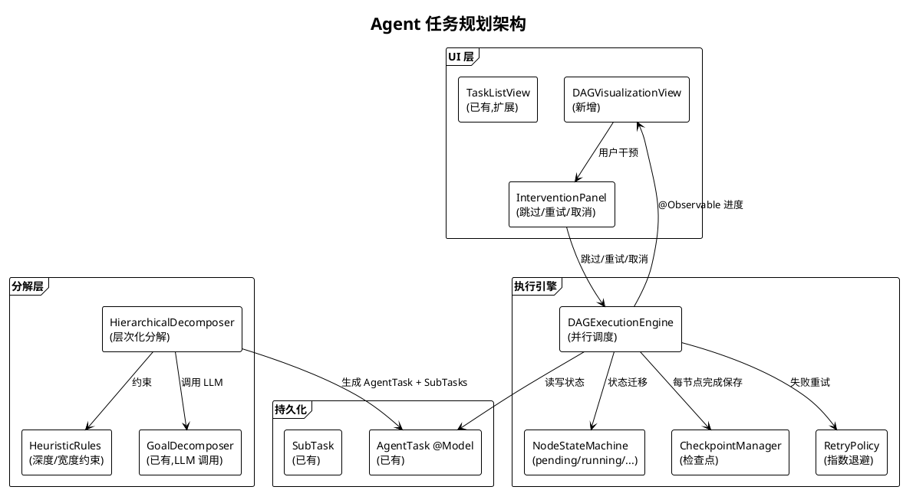
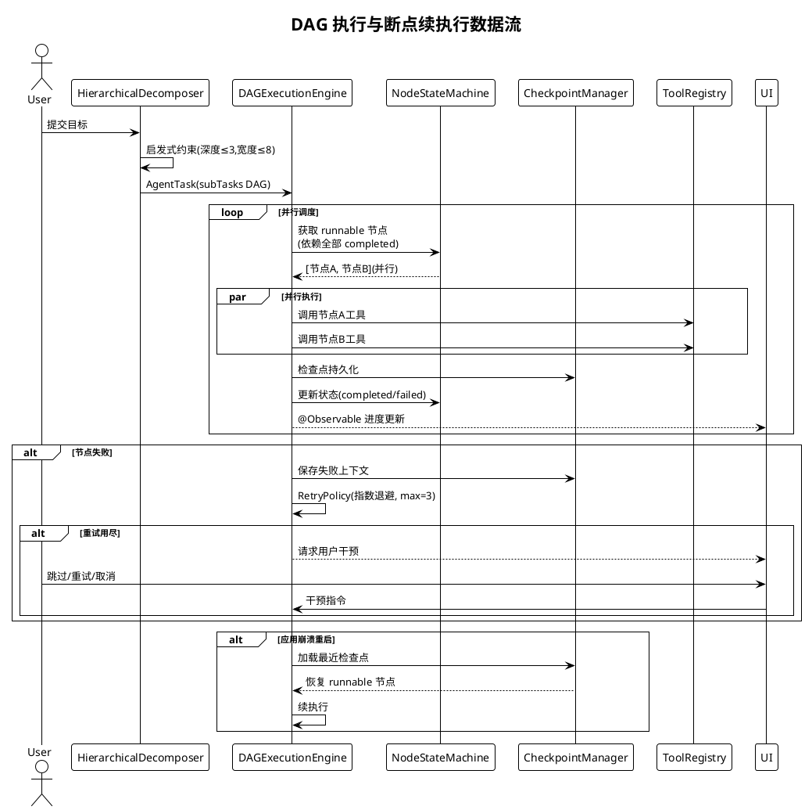

# Agent 任务规划规划

> **P3 远期规划 · Task 20** · 日期：2026-07-17 · 范围：多步目标分解、DAG 执行引擎、断点续执行、与 AgentOrchestrator 关系、UI 可视化、性能基线

## 一、背景与目标

Aether 已在 `Aether/Services/Agent/` 下实现 `AgentOrchestrator`（任务编排）、`GoalDecomposer`（LLM 目标分解）与 `AgentRole`（多角色协作），并在 `Aether/Core/Models/AgentTask.swift` 中定义了 `AgentTask` / `SubTask` / `SubTaskStatus` 数据模型。现有能力支持基于 DAG 依赖的子任务调度、断点续执行（`resumeInProgressTask`）与 reviewer 角色审查重试。但当前实现仍为线性 DAG 执行（`nextExecutableSubTask` 仅返回单一下一个可执行节点），不支持并行执行；任务持久化依赖 SwiftData 全量保存，缺乏细粒度检查点；UI 层仅有 `TaskListView` / `StepCardView` 的线性展示，无 DAG 可视化与用户干预入口。

本规划目标：
1. 增强 LLM 驱动的层次化目标分解算法，引入启发式规则约束分解深度与宽度。
2. 实现支持并行节点的 DAG 执行引擎（节点状态机：pending / running / completed / failed / skipped）。
3. 完善断点续执行：细粒度检查点持久化、失败重试策略、任务恢复机制。
4. 明确与现有 `AgentOrchestrator` 的关系（扩展而非替换）。
5. 设计 DAG 可视化 UI，支持进度展示与用户干预（跳过/重试/取消）。
6. 建立性能基线（任务复杂度 / 执行时长 / 成功率）。

## 二、现状分析

| 维度 | 现状 | 文件位置 | 缺口 |
|------|------|----------|------|
| 目标分解 | `GoalDecomposer.decompose()` 单次 LLM 调用 | `GoalDecomposer.swift` | 无层次化、无启发式约束 |
| DAG 执行 | `nextExecutableSubTask()` 线性取首个 | `AgentTask.swift:96-106` | 不支持并行节点 |
| 节点状态 | pending/inProgress/completed/failed/skipped | `AgentTask.swift:192-203` | 无 running 细粒度进度 |
| 断点续执行 | `resumeInProgressTask()` 启动恢复 | `AgentOrchestrator.swift:325` | 无检查点、无重试策略 |
| UI | `TaskListView` 线性列表 | `TaskListView.swift` | 无 DAG 可视化、无干预 |
| 性能基线 | 无 | — | 缺失 |

## 三、设计方案

### 3.1 架构图

### 3.2 数据流图：DAG 执行与断点续执行

### 3.3 层次化目标分解算法

**LLM 驱动 + 启发式约束：**
1. 第一层分解由 `GoalDecomposer` 调用 LLM 生成粗粒度子任务（≤5 个）。
2. 对每个子任务判断是否需要进一步分解（复杂度启发式：描述长度 > 100 字或含"并且/然后"等连接词）。
3. 递归分解，约束：最大深度 3 层、每层最大宽度 8、总子任务数 ≤ 50。
4. 生成 DAG 依赖：同层兄弟节点默认串行依赖，可标注 `parallel: true` 的节点无相互依赖。

### 3.4 DAG 执行引擎与节点状态机

**节点状态机：** `pending → running → completed` / `pending → running → failed → (retry) → running` / `pending → skipped`。

**并行调度：** `DAGExecutionEngine` 每轮获取所有 `dependencies` 均为 `completed` 的 `pending` 节点，并行提交执行（受最大并发数 4 限制）。复用 `AgentTask.nextExecutableSubTask()` 逻辑但改为返回数组。

**检查点：** 每个节点完成（无论成功/失败）后，`CheckpointManager` 立即 `modelContext.save()`，并记录 `checkpointAt` 时间戳与已完成节点 ID 集合。

**重试策略：** 失败节点按指数退避重试（1s / 2s / 4s），最大 3 次；用尽后标记 `failed` 并触发用户干预。

### 3.5 断点续执行

- **任务持久化：** `AgentTask` 与 `SubTask` 已为 SwiftData `@Model`，状态变更即时保存。
- **恢复机制：** 扩展现有 `resumeInProgressTask()`，启动时扫描 `status == .inProgress` 的任务，加载检查点，从最后一个 `completed` 节点后续执行。
- **失败重试：** `RetryPolicy` 封装退避逻辑，与 `AgentOrchestrator.enableReview` 的审查重试正交（审查是结果质量校验，重试是执行失败恢复）。

### 3.6 与现有 AgentOrchestrator 的关系

**扩展而非替换。** `AgentOrchestrator` 保留为对外编排入口（`startTask` / `executeAll` / `cancel`），内部将 `executeAll()` 的循环调度委托给新的 `DAGExecutionEngine`；`GoalDecomposer` 调用前包装 `HierarchicalDecomposer` 做层次化分解与启发式约束。现有 `AgentRole` 多角色协作（planner/executor/reviewer）保持不变，reviewer 审查作为节点完成后的可选钩子。

### 3.7 UI 设计

- **DAG 可视化：** 新增 `DAGVisualizationView`，使用 SwiftUI Canvas 绘制节点（圆角矩形）与依赖边（贝塞尔曲线），节点颜色映射状态（灰=pending、蓝=running、绿=completed、红=failed、黄=skipped）。
- **进度展示：** 顶部进度条显示 `completed/total` 比例；点击节点展开详情（标题/描述/结果/耗时）。
- **用户干预：** `InterventionPanel` 在节点 `failed` 时浮现按钮：跳过 / 重试 / 取消整个任务。

## 四、技术选型

| 选项 | 说明 | 优点 | 缺点 | 选用 |
|------|------|------|------|------|
| DAG 引擎：自研 | 基于 `SubTask.dependencies` | 与现有模型对齐 | 需实现并行调度 | ✅ |
| DAG 引擎：Swift Concurrency | `TaskGroup` 并行 | 语言原生 | 需重构状态管理 | ✅（结合） |
| DAG 引擎：第三方库 | 如 GraphLib | 成熟 | 引入依赖、SwiftData 兼容差 | ❌ |
| 可视化：SwiftUI Canvas | 自绘 | 灵活、无依赖 | 需手动布局 | ✅ |
| 可视化：WebView + D3 | JS 渲染 | 成熟布局 | 重、跨进程通信复杂 | ❌ |
| 检查点：SwiftData 增量 | 复用现有 | 一致 | — | ✅ |

## 五、实施路径

**阶段 1（层次化分解）：** 实现 `HierarchicalDecomposer` 与 `HeuristicRules`，包装 `GoalDecomposer`。交付：分解质量提升、深度宽度受控。

**阶段 2（并行 DAG 引擎）：** 实现 `DAGExecutionEngine`，支持并行节点调度；扩展 `nextExecutableSubTask` 为 `nextExecutableSubTasks`（返回数组）。交付：并行执行能力。

**阶段 3（检查点与重试）：** 实现 `CheckpointManager` 与 `RetryPolicy`，扩展 `resumeInProgressTask` 加载检查点。交付：断点续执行完善。

**阶段 4（UI 可视化）：** 实现 `DAGVisualizationView` 与 `InterventionPanel`，扩展 `TaskListView` 集成。交付：DAG 可视化与用户干预。

**阶段 5（性能基线）：** 建立基准测试集（简单/中等/复杂三级任务），采集执行时长与成功率。交付：性能基线文档。

## 六、风险评估

| 风险 | 等级 | 影响 | 缓解措施 |
|------|------|------|----------|
| LLM 分解生成循环依赖 | 高 | 引擎死锁 | 提交前拓扑排序校验、循环检测 |
| 并行节点竞争 ToolRegistry | 中 | 工具状态不一致 | 工具调用加 actor 串行化 |
| 检查点频繁保存导致性能下降 | 中 | 执行卡顿 | 节流保存（最多每 500ms 一次） |
| DAG 可视化大图渲染卡顿 | 中 | UI 掉帧 | 节点数 > 30 时折叠子图 |
| 任务恢复后状态不一致 | 高 | 重复执行/遗漏 | 检查点包含已完成节点 ID 集合，幂等恢复 |
| 用户干预与引擎并发冲突 | 中 | 状态错乱 | 干预操作经 `@MainActor` 串行化 |
| 启发式约束过度限制分解 | 中 | 复杂任务分解不足 | 约束参数可配置、用户可覆盖 |

## 七、验收标准

1. `HierarchicalDecomposer` 生成的子任务 DAG 深度 ≤ 3、宽度 ≤ 8、总数 ≤ 50，无循环依赖。
2. `DAGExecutionEngine` 能并行执行无依赖关系的节点，4 个并行节点耗时 ≈ 单节点耗时（而非 4 倍）。
3. 应用崩溃重启后，`resumeInProgressTask` 能从最后一个 `completed` 节点续执行，不重复已完成节点。
4. 节点失败后 `RetryPolicy` 自动重试 3 次（指数退避），用尽后标记 `failed` 并通知 UI。
5. `DAGVisualizationView` 正确渲染节点与依赖边，节点颜色实时反映状态，节点数 ≤ 30 时 60fps 流畅。
6. 用户可通过 `InterventionPanel` 跳过 `failed` 节点（状态变 `skipped`，后续依赖节点自动 `skipped`）。
7. 性能基线：简单任务（≤3 子任务）平均成功率 ≥ 95%，中等任务（4-10 子任务）≥ 85%，复杂任务（11-30 子任务）≥ 70%。
8. `HierarchicalDecomposerTests`、`DAGExecutionEngineTests`、`CheckpointManagerTests`、`RetryPolicyTests` 全部通过。
9. `AgentOrchestrator` 对外接口（`startTask` / `executeAll` / `cancel`）保持不变，现有调用方零改动。
