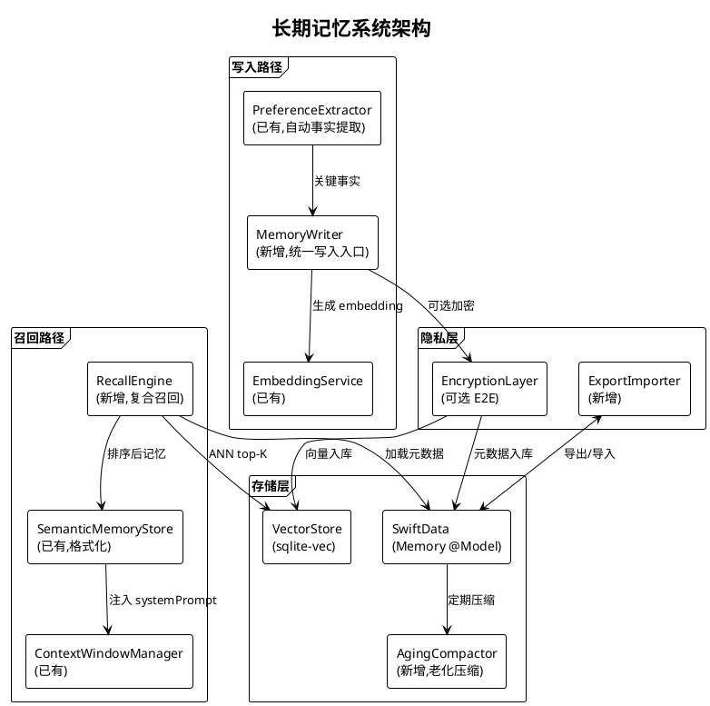
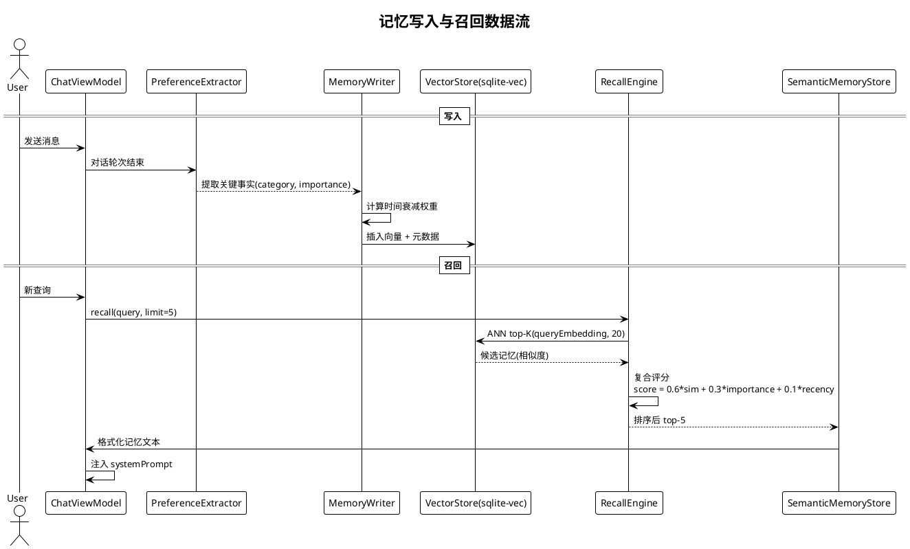

# 长期记忆系统规划

> **P3 远期规划 · Task 19** · 日期：2026-07-17 · 范围：跨会话长期记忆向量库、嵌入策略、召回算法、隐私评估、与 SemanticMemoryStore 集成、记忆老化与压缩

## 一、背景与目标

Aether 已具备短期语义记忆能力：`MemoryService` 通过 Qwen embedding 生成向量并存入 SwiftData，`SemanticMemoryStore` 封装检索并格式化注入 systemPrompt。但当前实现存在明显短板：记忆全量存储于 SwiftData 单表，`recall` 采用 O(N×D) 暴力扫描（`MemoryService.swift:78-88`），无 ANN 索引，记忆量增长后检索延迟劣化；缺少时间衰减与重要性加权；无老化压缩机制；隐私层面仅本地存储，无端到端加密与导出能力。

本规划目标：
1. 选型并接入跨会话长期记忆向量库，支撑万级以上记忆条目的亚秒级召回。
2. 设计多源嵌入策略（自动事实提取 + 用户主动记忆 + 时间衰减权重）。
3. 实现复合召回算法（top-K 相似度 + 时间衰减 + 重要性评分）。
4. 建立隐私模型（本地优先、可选端到端加密、可删除、可导出）。
5. 与现有 `SemanticMemoryStore` / `MemoryService` 无缝集成。
6. 引入记忆老化与压缩策略，控制存储增长。

## 二、现状分析

| 维度 | 现状 | 文件位置 | 缺口 |
|------|------|----------|------|
| 向量存储 | SwiftData `Memory.embedding: [Double]` | `Memory.swift` | 无 ANN 索引，暴力扫描 |
| 检索算法 | 余弦相似度全量排序 top-K | `MemoryService.swift:80-88` | 无时间衰减、无重要性加权 |
| 嵌入来源 | 用户对话显式 `remember()` | `MemoryService.swift:44` | 无自动事实提取 |
| 老化压缩 | 无 | — | 记忆无限增长 |
| 隐私 | 本地 SwiftData | — | 无加密、无导出 |
| 集成点 | `SemanticMemoryStore.formatMemoriesForPrompt` | `SemanticMemoryStore.swift:37` | 格式化能力可复用 |

## 三、设计方案

### 3.1 架构图



### 3.2 数据流图：记忆写入与召回



### 3.3 嵌入策略

**三源写入：**
1. **自动事实提取**：复用现有 `PreferenceExtractor`，每轮对话结束后提取偏好/事实/指令，按 `category` 分类，`importance` 由 LLM 评分（0.0-1.0）。
2. **用户主动记忆**：用户显式 `"记住：我是素食者"` 触发 `MemoryService.remember()`，`importance` 默认 0.8（高于自动提取）。
3. **时间衰减权重**：写入时记录 `createdAt`，召回时计算 `recency = exp(-Δt/τ)`，半衰期 τ=30 天。

### 3.4 复合召回算法

```
finalScore = 0.6 × cosineSimilarity
           + 0.3 × importance
           + 0.1 × recency
```
流程：ANN 检索 top-20 候选 → 计算复合评分 → 取 top-5 → 去重（同 `category` 仅保留最高分）→ 经 `SemanticMemoryStore.formatMemoriesForPrompt` 格式化注入。

### 3.5 老化与压缩策略

- **老化**：90 天未命中的记忆 `importance *= 0.8`；180 天仍 `importance < 0.2` 的记忆归档。
- **压缩**：同 `category` 下语义相似度 > 0.92 的记忆合并，保留最高 `importance` 版本，其余归档。
- **归档**：从 `VectorStore` 移除向量，元数据保留 `archivedAt` 时间戳，可恢复。

### 3.6 与现有 SemanticMemoryStore 集成

保持 `SemanticMemoryStore` 的对外接口不变（`retrieveRelevantMemories` / `formatMemoriesForPrompt`），内部将 `recall` 委托从 `MemoryService.recall` 改为新的 `RecallEngine`。`MemoryService` 保留为写入入口，新增 `MemoryWriter` 封装老化权重计算与加密。

## 四、技术选型

| 向量库选项 | 类型 | 优点 | 缺点 | 选用 |
|-----------|------|------|------|------|
| sqlite-vec | SQLite 扩展 | 与 SwiftData 同库、零运维、ANN | 需编译扩展 | ✅ |
| FAISS | 嵌入式库 | 工业级性能 | C++ 依赖重、iOS 集成难 | ❌ |
| Milvus Lite | 嵌入式 | 高性能 | Python 生态、Apple 平台不友好 | ❌ |
| 自研 brute-force | 纯 Swift | 简单 | O(N) 无法扩展 | ❌（已有） |

**加密选项：** CryptoKit `AES-GCM`（密钥由 Keychain 派生，可选 iCloud Keychain 同步）。

## 五、实施路径

**阶段 1（向量库接入）：** 引入 sqlite-vec，在 `MemoryService` 写入路径双写（SwiftData + sqlite-vec），`recall` 切换为 sqlite-vec ANN。交付：检索性能从 O(N) 降至 O(log N)。

**阶段 2（复合召回）：** 实现 `RecallEngine`，引入重要性评分与时间衰减；扩展 `Memory` 模型增加 `lastAccessedAt` 字段。交付：召回质量提升。

**阶段 3（老化压缩）：** 实现 `AgingCompactor`，后台定期（每周）执行老化与合并。交付：存储增长可控。

**阶段 4（隐私与导出）：** 引入 `EncryptionLayer`（可选开关），实现 JSON 导出/导入。交付：合规可导出。

## 六、风险评估

| 风险 | 等级 | 影响 | 缓解措施 |
|------|------|------|----------|
| sqlite-vec 在 iOS 沙箱加载失败 | 高 | 召回不可用 | 降级为现有 SwiftData 暴力扫描 |
| 记忆量增长导致写入延迟 | 中 | 对话卡顿 | 写入异步、批量提交 |
| 时间衰减误降重要记忆 | 中 | 召回遗漏 | 用户主动记忆不衰减、importance 阈值可调 |
| 端到端加密密钥丢失 | 高 | 记忆永久不可读 | Keychain 恢复码机制、导出明文备份选项 |
| 自动事实提取误写入敏感信息 | 高 | 隐私泄露 | 提取前经 `Redactor` 脱敏、用户可审查 |
| 老化压缩误删记忆 | 中 | 数据丢失 | 归档而非删除、30 天可恢复窗口 |

**隐私评估：** 默认全部本地存储（SwiftData + sqlite-vec 均在 App Group 容器）；端到端加密为可选项，启用后向量与元数据均加密存储；用户可在设置页一键导出 JSON（含向量与元数据）或清空全部记忆；不上传任何记忆到云端（除非用户显式通过 BFF `/memory/search` 同步，且该路径需独立授权）。

## 七、验收标准

1. sqlite-vec 集成后，10,000 条记忆的 `recall` 召回延迟 < 100ms（现有暴力扫描 > 500ms）。
2. 复合召回算法上线后，人工标注的"相关记忆"召回率 ≥ 85%（对比纯相似度召回的 70%）。
3. 用户主动记忆（`"记住：..."`）的 `importance` 不随时间衰减。
4. 启用端到端加密后，App Group 容器内的 sqlite-vec 与 SwiftData 文件均为密文。
5. 设置页可导出全部记忆为 JSON，可在另一台设备导入恢复。
6. 老化压缩运行 4 周后，归档记忆数可查，存储增长速率下降 50%+。
7. `RecallEngineTests`、`AgingCompactorTests`、`EncryptionLayerTests`、`ExportImporterTests` 全部通过。
8. `SemanticMemoryStore` 对外接口不变，现有调用方零改动。
