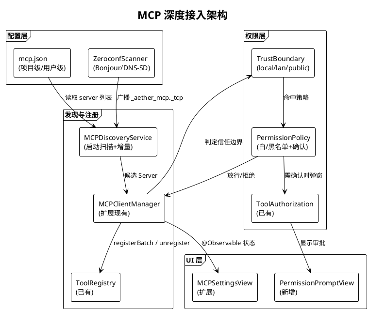
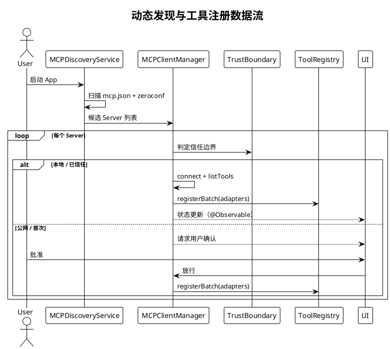

# MCP 协议深度接入规划

> **P3 远期规划 · Task 18** · 日期：2026-07-17 · 范围：MCP Server 动态发现、工具自动注册、权限模型、安全评估、与 ToolRegistry 集成、用户配置 UI

## 一、背景与目标

Aether 已在 `Aether/Services/MCP/` 下实现了基础 MCP 客户端（`MCPClient`、`MCPClientManager`、`MCPToolAdapter`），支持 stdio 与 SSE 两种传输，并在连接成功后将工具自动注册到 `ToolRegistry`。但当前接入方式仍是"手动配置 + 单次连接"模式：用户需逐个填写 Server 地址，无网络发现能力；权限仅依赖 `ToolAuthorization` 的运行时确认，缺少信任边界与黑白名单；外部 Server 的攻击面未做系统评估。

本规划目标：
1. 引入基于 `mcp.json` 配置文件与 zeroconf（Bonjour/DNS-SD）的动态发现协议，降低配置成本。
2. 建立启动扫描 + 运行时增量注册的工具自动注册流程，与现有 `ToolRegistry.shared.registerBatch` 对齐。
3. 构建分层权限模型（本地 / 局域网 / 公网三档信任边界 + 白名单 / 黑名单 / 用户确认三种策略）。
4. 系统评估外部 MCP Server 攻击面并给出缓解措施。
5. 在 `MCPSettingsView` 上扩展动态发现与权限审批 UI。

## 二、现状分析

| 维度 | 现状 | 文件位置 | 缺口 |
|------|------|----------|------|
| 配置方式 | 用户手动填 `MCPConfig` | `MCPConfig.swift` | 无 `mcp.json`、无网络发现 |
| 注册流程 | `connect()` 成功后一次性 `registerBatch` | `MCPClientManager.swift:84` | 无启动扫描、无增量注册 |
| 权限模型 | `ToolAuthorization` 运行时确认 | `ToolAuthorization.swift` | 无信任边界、无黑白名单 |
| 安全评估 | 无 | — | 攻击面未梳理 |
| UI | `MCPSettingsView` 静态列表 | `MCPSettingsView.swift` | 无发现、无审批流 |

## 三、设计方案

### 3.1 架构图



### 3.2 数据流图：动态发现与工具注册



### 3.3 mcp.json 配置文件格式

```json
{
  "servers": [
    {
      "id": "local-fs",
      "name": "本地文件系统",
      "transport": { "type": "stdio", "command": "mcp-fs", "args": [] },
      "trust": "local",
      "autoConnect": true,
      "toolWhitelist": ["fs_read", "fs_list"]
    }
  ],
  "discovery": {
    "zeroconf": true,
    "zeroconfType": "_aether_mcp._tcp.",
    "scanIntervalSec": 60
  },
  "policy": {
    "defaultTrust": "lan",
    "blacklist": ["malicious.example.com"]
  }
}
```

### 3.4 权限模型

**信任边界三档：**
- **local**：本机 stdio 子进程，默认放行（仍受 `ToolAuthorization` 约束）。
- **lan**：局域网 SSE，需用户首次确认；白名单工具自动放行。
- **public**：公网 SSE，强制每次确认或拒绝（黑名单优先）。

**三种策略：** 白名单（自动放行） / 黑名单（自动拒绝） / 用户确认（弹窗 `PermissionPromptView`）。策略优先级：黑名单 > 白名单 > 用户确认。

### 3.5 与现有 ToolRegistry 集成

复用 `MCPClientManager.connect()` 成功后的 `registerBatch` 路径（`MCPClientManager.swift:84`）。新增 `MCPDiscoveryService` 在启动时调用 `mgr.connect(config:)`，运行时通过 zeroconf 回调增量调用同一接口。断开时复用 `disconnect(serverID:)` 已有的 `unregister` 逻辑。

## 四、技术选型

| 选项 | 说明 | 优点 | 缺点 | 选用 |
|------|------|------|------|------|
| 配置格式：JSON | `mcp.json` | 与 `MCPConfig` Codable 对齐 | 无注释 | ✅ |
| 配置格式：YAML | `mcp.yaml` | 支持注释 | 需引入解析库 | ❌ |
| 发现协议：Bonjour | `NetService` iOS/macOS 原生 | 系统级、低功耗 | 仅 Apple 平台 | ✅ |
| 发现协议：手动扫描 | 定期 HTTP 探测 | 跨平台 | 高延迟、耗电 | ❌ |
| 权限存储：SwiftData | 复用现有 `@Model` | 一致性 | — | ✅ |
| 权限存储：UserDefaults | 轻量 | 简单 | 不适合结构化数据 | ❌ |

## 五、实施路径

**阶段 1（基线增强）：** 定义 `mcp.json` schema，扩展 `MCPClientManager` 读取配置文件批量连接；新增 `TrustBoundary` 与 `PermissionPolicy` 类型。交付：配置驱动连接。

**阶段 2（动态发现）：** 实现 `MCPDiscoveryService`，集成 `NetService` 扫描 `_aether_mcp._tcp`；启动扫描 + 60s 周期增量。交付：局域网自动发现。

**阶段 3（权限 UI）：** 新增 `PermissionPromptView`，扩展 `MCPSettingsView` 显示候选 Server 与审批流。交付：完整审批闭环。

**阶段 4（安全加固）：** 引入签名校验（Server 公钥指纹）、工具调用审计（复用 `ToolAuditLogger`）、速率限制。交付：生产可用安全基线。

## 六、风险评估

| 风险 | 等级 | 影响 | 缓解措施 |
|------|------|------|----------|
| 恶意 Server 注入工具诱导调用危险操作 | 高 | 数据泄露/破坏 | 公网强制确认 + 工具调用审计 + 黑名单 |
| Server 拒绝服务（listTools 返回海量工具） | 中 | 注册风暴、UI 卡顿 | 单 Server 工具数上限 100，增量注册节流 |
| 数据泄露（Server 收集对话内容） | 高 | 隐私违规 | 工具调用参数脱敏（复用 `Redactor`） |
| zeroconf 在 iOS 后台不可用 | 中 | 后台无法发现 | 前台扫描 + 配置文件兜底 |
| stdio Server 逃逸沙箱 | 高 | 系统破坏 | macOS 启用 App Sandbox，限制子进程权限 |
| 配置文件被篡改 | 中 | 加载恶意 Server | `mcp.json` 校验签名（企业部署） |

**攻击面评估：** 外部 MCP Server 的主要攻击面为（1）恶意工具伪装成常用名诱导 LLM 误调；（2）资源读取越权（`resources/read` 返回敏感文件）；（3）提示模板注入（`prompts/get` 返回含 prompt injection 的内容）。缓解：工具名加 Server 前缀（`serverID__toolName`）、资源读取受 `ToolAuthorization` 二次确认、提示模板经 `PromptInjectionDetector` 过滤。

## 七、验收标准

1. `mcp.json` 放置于 App Support 后，启动 App 自动连接所有 `autoConnect: true` 的 Server，工具注册到 `ToolRegistry`。
2. 局域网内启动声明 `_aether_mcp._tcp` 的 Server，App 在 60s 内发现并提示用户。
3. 公网 Server 首次连接必弹 `PermissionPromptView`，用户拒绝后不再注册其工具。
4. 黑名单中的 Server 永不连接；白名单工具自动放行不弹窗。
5. 所有 MCP 工具调用经 `ToolAuditLogger` 记录，可在设置页查看审计日志。
6. `MCPSettingsView` 显示已连接/候选/已拒绝三组 Server，支持手动连接/断开/审批。
7. 新增 `MCPDiscoveryServiceTests`、`TrustBoundaryTests`、`PermissionPolicyTests` 全部通过。
