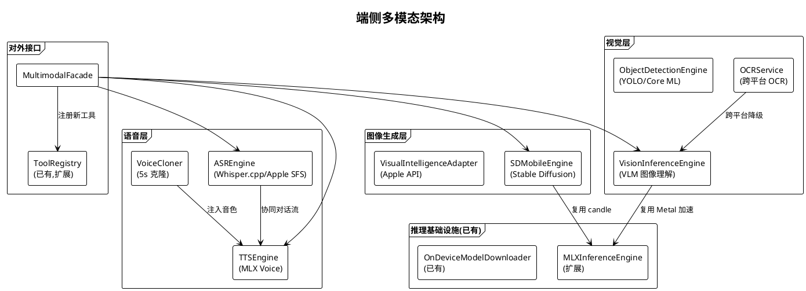
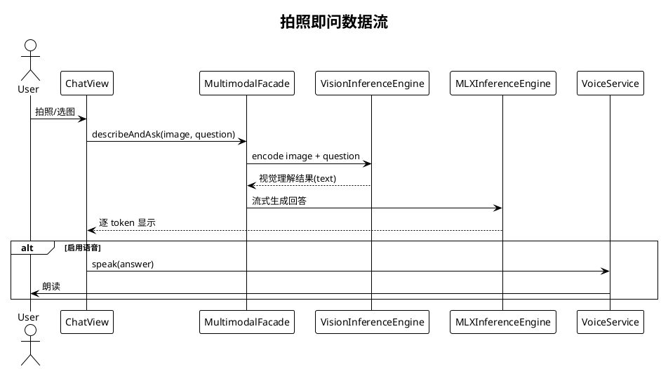

# 端侧多模态规划

> **P3 远期规划 · Task 22** · 日期：2026-07-17 · 范围：端侧视觉（图像理解/OCR/目标检测）、端侧语音（ASR/TTS/语音克隆）、端侧图像生成、内存预算、性能基线、与 MLXInferenceEngine/VoiceService/OCRTool 集成

## 一、背景与目标

Aether 已在 `Aether/Services/OnDevice/MLXInferenceEngine.swift` 实现 MLX 文本模型流式推理（actor 隔离 + Rust candle 兜底），在 `Aether/Services/Voice/VoiceService.swift` 实现 SFSpeechRecognizer 识别与 AVSpeechSynthesizer 合成，在 `Aether/Services/Tools/OCRTool.swift` 实现 macOS Vision 框架 OCR。但当前能力均为单模态：MLX 仅支持文本生成，VoiceService 仅支持系统级 ASR/TTS（无音色克隆），OCRTool 仅 macOS 可用且仅做文字识别，无图像理解、目标检测与端侧图像生成能力。

本规划目标：
1. 引入端侧视觉模型，支持图像理解（VLM）、OCR（跨平台）、目标检测。
2. 引入端侧语音增强：高质量 ASR、自然 TTS、语音克隆。
3. 引入端侧图像生成（Stable Diffusion Mobile / Apple Visual Intelligence）。
4. 建立跨设备内存预算与性能基线。
5. 扩展现有 `MLXInferenceEngine` / `VoiceService` / `OCRTool`，不替换。
6. 落地用户场景：拍照即问、实时翻译、语音克隆、离线图像生成。

## 二、现状分析

| 维度 | 现状 | 文件位置 | 缺口 |
|------|------|----------|------|
| 文本推理 | MLX/candle 流式生成，actor 隔离 | `MLXInferenceEngine.swift` | 仅文本，无视觉 |
| ASR | SFSpeechRecognizer（zh-CN），在线 | `VoiceService.swift:65` | 在线依赖、无音色克隆 |
| TTS | AVSpeechSynthesizer 系统音色 | `VoiceService.swift:122` | 机械感强、无定制音色 |
| OCR | Vision VNRecognizeTextRequest，macOS only | `OCRTool.swift` | 仅 macOS、仅文字 |
| 图像生成 | 无 | — | 完全缺失 |
| 多模态融合 | `APIMessage.images` 字段已预留 | `LLMProvider.swift:20` | 仅云端 Provider 用，端侧未对接 |

## 三、设计方案

### 3.1 架构图

### 3.2 数据流图：拍照即问

### 3.3 端侧视觉

**VLM 图像理解：** 选用 MLX 适配的 Llama 3.2 Vision（11B/90B 量化版）与 Qwen2-VL（2B/7B Q4）作为备选；iPhone 15 Pro 限定 2B 量化版本，Mac 上可加载 7B+。复用 `MLXInferenceEngine` 的 `ModelContainer.load` 路径，扩展 `generate(prompt:images:)` 接口。

**OCR 跨平台化：** iOS 上 Vision 已支持 `VNRecognizeTextRequest`，将 `OCRTool` 移除 `import AppKit` 依赖改为 `#if os(macOS)` 截屏分支 + iOS PhotosUI 取图分支；Vision API 跨平台共享。

**目标检测：** Core ML 集成 YOLOv8n（nano，3.2M 参数）mlmodelc，输出边界框；用于"指着物体提问"场景。

### 3.4 端侧语音

**ASR 升级：** 默认 SFSpeechRecognizer（在线），离线降级 Whisper.cpp（tiny/base 量化版，base 模型 ~150MB）。通过 `ASREngine` 协议抽象，`VoiceService` 持有具体实现。

**TTS 升级：** 引入 MLX Voice（Apple 开源 Kokoro/Matcha-TTS 端侧版），自然度远超 AVSpeechSynthesizer；通过 `TTSEngine` 协议抽象，`VoiceService` 内部委托。

**语音克隆：** 5 秒样本克隆，基于 OpenVoice v2 端侧蒸馏版本（~300MB）；用户首次录音后生成音色嵌入存 Keychain，后续 TTS 注入。

### 3.5 端侧图像生成

**Stable Diffusion Mobile：** 复用 apple/swift-coreml Stable Diffusion 适配（512x512 20 step），Mac 上 8GB 内存可用；iPhone 15 Pro 上启用 256x256 4 step 加速版。

**Apple Visual Intelligence API：** iOS 18.1+/macOS 15.1+ 系统级图像理解/生成 API（如适用），作为兜底与系统集成入口。

### 3.6 内存预算与性能基线

| 设备 | 总内存 | 多模态预算 | 视觉模型 | 语音模型 | 图像生成 |
|------|--------|-----------|----------|----------|----------|
| iPhone 15 Pro (8GB) | 8GB | ≤3GB | 2B Q4(1.5GB) | Whisper tiny(75MB) | 禁用 |
| iPad Pro (16GB) | 16GB | ≤6GB | 7B Q4(4.5GB) | Whisper base(150MB) | SD Mobile(2GB) |
| Mac (16GB+) | 16GB+ | ≤8GB | 11B Q4(7GB) | Whisper base(150MB) | SD Mobile(4GB) |

**性能基线：** 首 token 延迟 ≤2s（VLM）、≤500ms（ASR）；token/s ≥10（iPhone）/≥20（Mac）；OCR ≤300ms（1080p）；图像生成 ≤15s（Mac）/≤30s（iPad）；连续对话 30 分钟耗电 ≤15%。

### 3.7 与现有组件集成

**扩展而非替换。** `MLXInferenceEngine` 新增 `generate(prompt:images:)` 重载，复用 `ModelContainer.perform`；`VoiceService` 新增 `asrEngine` 与 `ttsEngine` 可注入属性，默认保持现有 SFSpeechRecognizer/AVSpeechSynthesizer；`OCRTool` 改造为跨平台并接入 `VisionInferenceEngine` 作为 VLM 兜底。新增 `MultimodalFacade` 统一对外暴露 `describeAndAsk` / `transcribeAudio` / `synthesizeSpeech` / `generateImage` 接口，注册 4 个新工具（`describe_image` / `transcribe_audio` / `clone_voice` / `generate_image`）到 `ToolRegistry`。

## 四、技术选型

| 选项 | 说明 | 优点 | 缺点 | 选用 |
|------|------|------|------|------|
| VLM：MLX Llama 3.2 Vision | Apple 官方适配 | Metal 加速 | 11B 较大 | ✅ |
| VLM：Qwen2-VL MLX | 备选中文优化 | 中文好 | 适配较新 | ✅（备选） |
| OCR：Vision 框架 | 已用 | 跨平台、Apple 原生 | 仅文字 | ✅ |
| 检测：Core ML YOLOv8n | nano 量化 | 小、快 | 需转换 mlmodelc | ✅ |
| ASR：SFSpeechRecognizer | 已用 | 系统级 | 在线 | ✅（默认） |
| ASR：Whisper.cpp | 离线兜底 | 多语言 | 体积大 | ✅（离线） |
| TTS：MLX Voice/Kokoro | 自然 | 端侧自然 | 较新 | ✅ |
| TTS：AVSpeechSynthesizer | 已用 | 系统级 | 机械感 | ✅（兜底） |
| 语音克隆：OpenVoice v2 | 5s 克隆 | 跨语言 | 蒸馏复杂 | ✅ |
| 图像生成：SD Mobile | apple/swift-coreml | 端侧可用 | 内存占用高 | ✅ |
| 图像生成：Apple Visual Intelligence | 系统级 | 集成深 | API 受限 | ✅（兜底） |

## 五、实施路径

**阶段 1（视觉理解）：** 扩展 `MLXInferenceEngine.generate(prompt:images:)`；实现 `VisionInferenceEngine`；改造 `OCRTool` 跨平台；注册 `describe_image` 工具。交付：拍照即问可用。

**阶段 2（语音增强）：** 实现 `ASREngine` / `TTSEngine` 协议与 Whisper.cpp 集成；`VoiceService` 支持切换引擎；保留 SFSpeechRecognizer 默认。交付：离线 ASR 可用。

**阶段 3（语音克隆）：** 实现 `VoiceCloner`（OpenVoice v2 蒸馏）；新增 `clone_voice` 工具与音色管理 UI。交付：5s 克隆可用。

**阶段 4（图像生成）：** 集成 apple/swift-coreml Stable Diffusion；实现 `SDMobileEngine`；新增 `generate_image` 工具；iOS 18.1+ 接入 Visual Intelligence。交付：离线图像生成。

**阶段 5（性能基线）：** 建立多设备基准测试集，采集首 token 延迟、token/s、内存峰值、耗电；输出性能基线文档。交付：可验收的性能数据。

## 六、风险评估

| 风险 | 等级 | 影响 | 缓解措施 |
|------|------|------|----------|
| VLM 模型体积超出 iPhone 内存 | 高 | 加载失败 | 设备能力分级（2B/7B/11B），按设备加载 |
| Whisper.cpp 与 MLX 内存冲突 | 中 | OOM | 互斥使用、空闲卸载 |
| 语音克隆滥用（深度伪造） | 高 | 伦理/法律 | 仅本人音色、加水印、明确告知 |
| SD Mobile 推理发热严重 | 中 | 体验差 | 限制 step、散热提示 |
| Apple Visual Intelligence API 变更 | 中 | 兜底失效 | 保留 SD 路径作为备选 |
| 模型下载流量大 | 中 | 用户不满 | 仅 WiFi 下载、增量更新 |
| Core ML 模型转换精度损失 | 中 | 检测漏检 | 保留 ONNX 验证集对比 |
| 多模态并发内存峰值 | 高 | App 崩溃 | 全局内存预算器、超限自动降级 |

## 七、验收标准

1. `MLXInferenceEngine.generate(prompt:images:)` 能在 iPhone 15 Pro 上加载 Qwen2-VL-2B Q4 模型并完成图像理解，首 token 延迟 ≤2s。
2. `OCRTool` 在 iOS 与 macOS 上均可执行 OCR，跨平台测试通过。
3. `VoiceService` 能切换 SFSpeechRecognizer 与 Whisper.cpp 引擎，离线状态下 Whisper tiny 能完成中文识别（WER ≤15%）。
4. `VoiceCloner` 接受 5 秒样本生成定制音色，TTS 自然度评分（MOS）≥3.5。
5. `SDMobileEngine` 在 Mac 上 512x512 20 step 图像生成 ≤15s，内存峰值 ≤4GB。
6. `MultimodalFacade` 4 个接口全部实现并注册到 `ToolRegistry`，LLM 可调用 4 个新工具。
7. 设备能力分级正确：iPhone 15 Pro 自动选择 2B 模型，Mac 自动选择 11B 模型。
8. 连续 30 分钟多模态对话耗电 ≤15%，无 OOM 崩溃。
9. `VisionInferenceEngineTests` / `ASREngineTests` / `TTSEngineTests` / `VoiceClonerTests` / `SDMobileEngineTests` 全部通过。
10. `MLXInferenceEngine` / `VoiceService` / `OCRTool` 对外接口保持兼容，现有调用方零改动。
