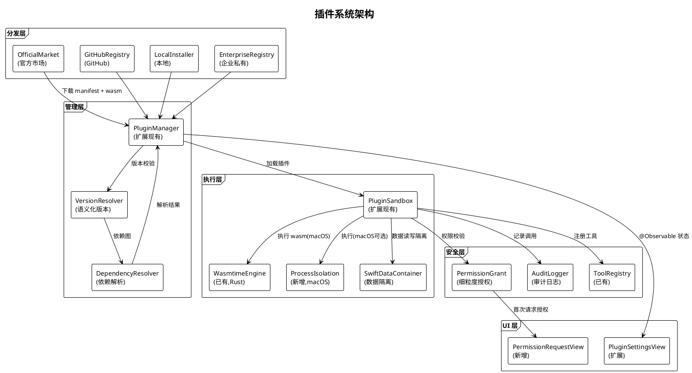
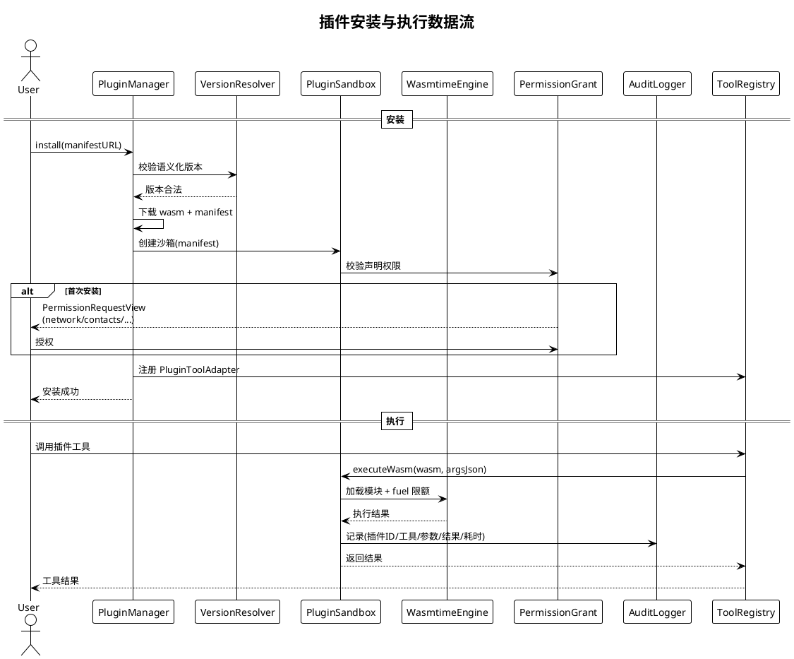

# 插件系统规划

> **P3 远期规划 · Task 21** · 日期：2026-07-17 · 范围：插件 manifest 格式、沙箱隔离、版本管理、分发渠道、与 PluginManager/PluginSandbox 集成、安全模型

## 一、背景与目标

Aether 已在 `Packages/AetherCore/Sources/AetherServices/Plugin/` 下实现 `PluginManager`（安装/卸载/版本管理/热更新）、`PluginSandbox`（声明式权限校验 + Rust wasmtime 真隔离）、`PluginToolAdapter`（工具适配），并在 `PluginManifest.swift` 中定义了 manifest 结构（id/name/version/author/tools/permissions/entryPoint）。`PluginSandbox` 已在 macOS 上集成 wasmtime（iOS 降级为声明式伪沙箱），支持 fuel 与内存限额。但当前系统仍存在缺口：manifest 格式未标准化（无 hooks 字段）、版本管理仅占位（`checkForUpdates` 返回 nil）、无分发渠道、权限粒度粗（仅 network/fileSystem/clipboard 三类）、无审计日志。

本规划目标：
1. 标准化插件 manifest 格式（JSON，含 name/version/permissions/tools/hooks）。
2. 完善沙箱隔离方案（WASM 沙箱为主、进程隔离为辅、SwiftData Container 数据隔离）。
3. 实现语义化版本管理与依赖解析。
4. 建立多分发渠道（官方市场/GitHub/本地/企业私有）。
5. 扩展现有 `PluginManager` / `PluginSandbox`，不替换。
6. 细化安全模型（权限粒度、用户授权、审计日志）。

## 二、现状分析

| 维度 | 现状 | 文件位置 | 缺口 |
|------|------|----------|------|
| Manifest | `PluginManifest`（id/name/version/tools/permissions/entryPoint） | `PluginManifest.swift` | 无 hooks、无依赖声明 |
| 沙箱 | wasmtime（macOS）+ 声明式（iOS） | `PluginSandbox.swift` | iOS 无真隔离、无数据隔离 |
| 版本管理 | `checkForUpdates` 返回 nil | `PluginManager.swift:111` | 占位、无依赖解析 |
| 分发渠道 | 仅本地安装 | `PluginManager.install` | 无市场/GitHub/企业 |
| 权限粒度 | network/fileSystem/clipboard | `PluginPermission.swift` | 缺 contacts/health/location 等 |
| 审计日志 | 无 | — | 插件调用无记录 |
| 集成点 | `PluginToolAdapter` → ToolRegistry | `PluginToolAdapter.swift` | TODO 未接 ToolRegistry |

## 三、设计方案

### 3.1 架构图



### 3.2 数据流图：插件安装与执行



### 3.3 插件 Manifest 格式

```json
{
  "id": "com.aether.plugin.weather-plus",
  "name": "天气增强",
  "version": "1.2.0",
  "author": "Aether Contributors",
  "description": "增强的天气查询插件",
  "minAppVersion": "1.0.0",
  "dependencies": [
    { "id": "com.aether.plugin.geo-base", "version": ">=1.0.0" }
  ],
  "permissions": [
    { "type": "network", "reason": "获取天气数据" },
    { "type": "location", "reason": "本地天气查询" }
  ],
  "tools": [
    {
      "name": "get_forecast",
      "description": "获取 7 天预报",
      "parameters": { "type": "object", "properties": { "city": { "type": "string" } } }
    }
  ],
  "hooks": [
    { "event": "message_received", "handler": "onMessage" }
  ],
  "entryPoint": "main.wasm",
  "signature": "base64-ed25519-signature"
}
```

### 3.4 沙箱隔离方案

**三层隔离：**
1. **WASM 沙箱（主）**：复用 `PluginSandbox.executeWasm()`，Rust wasmtime 强制 fuel（CPU）与线性内存上限。iOS 降级为声明式权限校验（无 WASM 执行）。
2. **进程隔离（辅，macOS）**：高风险插件（声明 `fileSystem` + `network`）可选在独立 `XPC` 子进程执行，崩溃不影响主进程。
3. **SwiftData Container（数据隔离）**：每个插件分配独立 SwiftData Store（`plugin_<id>.store`），插件间数据不可互访；主 App 通过 `PluginDataBridge` 协议按需读取。

### 3.5 版本管理与依赖解析

- **语义化版本**：`MAJOR.MINOR.PATCH`，`VersionResolver` 校验 `version` 与 `minAppVersion` 兼容性。
- **依赖解析**：`DependencyResolver` 构建依赖图，使用回溯算法解析版本约束（`>=1.0.0` / `^1.2.0` / `~1.2.0`）；检测冲突并报错。
- **兼容性检查**：安装前校验 `minAppVersion` ≤ 当前 App 版本；卸载时检查是否有其他插件依赖，有则警告。

### 3.6 分发渠道

| 渠道 | 协议 | 签名 | 适用场景 |
|------|------|------|----------|
| 官方市场 | HTTPS + manifest 索引 | 必须 | 普通用户 |
| GitHub | Release URL + manifest | 推荐 | 开源社区 |
| 本地安装 | 文件选择器 | 可选 | 开发调试 |
| 企业私有 | HTTPS + 企业证书 | 必须 | 企业内网 |

### 3.7 与现有 PluginManager / PluginSandbox 集成

**扩展而非替换。** `PluginManager` 保留 `install` / `uninstall` / `loadPluginTools` 接口，新增 `installFromURL` / `resolveDependencies` 方法；`PluginSandbox` 保留 `executeWasm` / `canExecute` 接口，新增 `executeInProcess`（macOS XPC）与 `PluginDataBridge`。修复 `PluginManager.loadPluginTools` 中 TODO（`PluginManager.swift:84` 注释的 `ToolRegistry.shared.register`），正式接入 `ToolRegistry`。

### 3.8 安全模型

**权限粒度（扩展 `PluginPermission.PermissionType`）：** network / fileSystem / clipboard / contacts / health / location / camera / microphone / notifications。

**用户授权：** 首次安装时 `PermissionRequestView` 逐项展示权限与 `reason`，用户可全选/部分授权/拒绝；运行时调用需权限的工具时二次校验已授权范围。

**审计日志：** 每次 `executeWasm` 调用经 `AuditLogger` 记录（插件 ID / 工具名 / 参数摘要 / 结果摘要 / 耗时 / 是否成功），可在设置页查看与导出。

## 四、技术选型

| 选项 | 说明 | 优点 | 缺点 | 选用 |
|------|------|------|------|------|
| 沙箱：WASM wasmtime | 已有 Rust 集成 | 真隔离、跨平台 | iOS 不支持 | ✅（macOS） |
| 沙箱：进程隔离 XPC | macOS 原生 | 强隔离 | 仅 macOS、开销大 | ✅（高风险） |
| 沙箱：SwiftData Container | 独立 Store | 数据隔离 | 需手动桥接 | ✅ |
| 沙箱：JavaScriptCore | JS 执行 | iOS 可用 | 性能弱、生态小 | ❌ |
| 版本解析：自研 | 语义化版本算法 | 轻量 | 需实现 | ✅ |
| 分发：HTTPS + manifest | 标准 | 简单 | — | ✅ |

## 五、实施路径

**阶段 1（Manifest 标准化）：** 扩展 `PluginManifest` 增加 `dependencies` / `hooks` / `minAppVersion` / `signature` 字段；扩展 `PluginPermission.PermissionType` 增加细粒度权限。交付：标准化格式。

**阶段 2（版本与依赖）：** 实现 `VersionResolver` 与 `DependencyResolver`，替换 `checkForUpdates` 占位实现。交付：依赖解析可用。

**阶段 3（分发渠道）：** 实现 `installFromURL`（官方市场/GitHub/企业），扩展 `PluginSettingsView` 浏览与安装 UI。交付：多渠道分发。

**阶段 4（数据隔离与审计）：** 实现 `SwiftDataContainer` 与 `PluginDataBridge`；接入 `AuditLogger`（复用 `ToolAuditLogger`）。交付：数据隔离与审计。

**阶段 5（进程隔离）：** macOS 实现 `executeInProcess`（XPC），高风险插件可选启用。交付：强隔离。

**阶段 6（ToolRegistry 接入）：** 修复 `loadPluginTools` TODO，正式注册 `PluginToolAdapter` 到 `ToolRegistry`。交付：插件工具可用。

## 六、风险评估

| 风险 | 等级 | 影响 | 缓解措施 |
|------|------|------|----------|
| 恶意插件 WASM 逃逸 | 高 | 系统破坏 | wasmtime 沙箱 + 签名校验 + macOS XPC 兜底 |
| 插件权限滥用（过度申请） | 高 | 隐私泄露 | 用户逐项授权 + 审计日志 + 市场审核 |
| 依赖解析死循环 | 中 | 安装卡死 | 依赖图深度限制 10、超时熔断 |
| iOS 无 WASM 执行能力 | 高 | iOS 插件不可用 | iOS 降级为声明式 + 远程 BFF 执行 |
| 插件冲突（同名工具） | 中 | 工具调用错乱 | 工具名加插件 ID 前缀 `pluginID__toolName` |
| 企业私有仓库凭证泄露 | 高 | 企业数据泄露 | OAuth2 + 证书 pinning |
| 热更新后状态不一致 | 中 | 插件异常 | 热更新前卸载工具、更新后重新加载 |
| 审计日志膨胀 | 低 | 存储占用 | 30 天自动清理、可导出后清理 |

## 七、验收标准

1. `PluginManifest` 支持完整字段（含 `dependencies` / `hooks` / `minAppVersion` / `signature`），Codable 往返测试通过。
2. `VersionResolver` 正确解析 `>=1.0.0` / `^1.2.0` / `~1.2.0` 三种约束；`DependencyResolver` 检测循环依赖并报错。
3. macOS 上 `PluginSandbox.executeWasm` 执行带 fuel 限额的 WASM，超限时返回 `ok:false`。
4. 首次安装插件时 `PermissionRequestView` 展示所有声明权限与 `reason`，用户拒绝的权限对应工具调用被拦截。
5. 每个插件的 SwiftData 数据存储于独立 `plugin_<id>.store`，插件 A 无法读取插件 B 的数据。
6. 插件工具调用经 `AuditLogger` 记录，设置页可查看最近 100 条日志并导出 JSON。
7. 通过 `installFromURL` 可从 HTTPS 链接安装插件，manifest 签名不匹配时拒绝安装。
8. `PluginManager.loadPluginTools` 正式将 `PluginToolAdapter` 注册到 `ToolRegistry`，LLM 可调用插件工具。
9. `VersionResolverTests`、`DependencyResolverTests`、`SwiftDataContainerTests`、`AuditLoggerTests` 全部通过。
10. `PluginManager` / `PluginSandbox` 对外接口保持兼容，现有调用方零改动。
