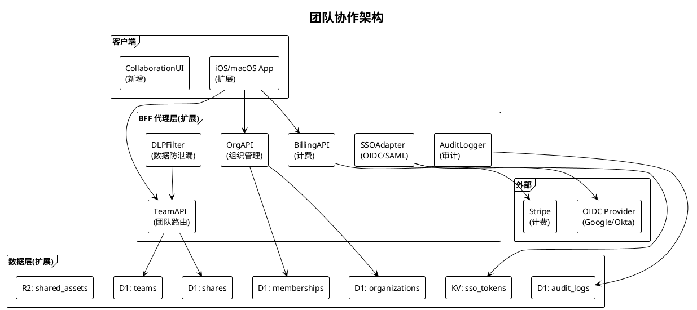
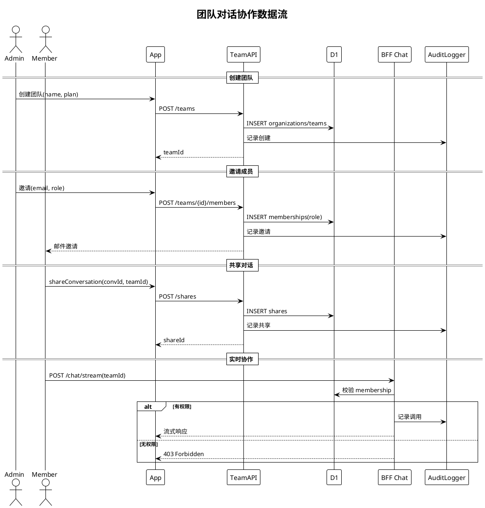

# 团队协作规划

> **P3 远期规划 · Task 25** · 日期：2026-07-17 · 范围：组织模型、权限粒度、共享机制、多用户协作、BFF 团队 API、企业功能、商业化模式

## 一、背景与目标

Aether 当前为单用户端侧产品：SwiftData 本地存储 `Conversation` / `ChatMessage` / `Memory` 等模型，BFF（`CloudflareWorkers/`）仅做个人 LLM 代理与限流，KV `bff_tokens` 按 token 维度记录用户身份，D1 `DB` 存储对话/记忆/RAG 文档。无组织、团队、共享、协作概念，无 SSO/审计/合规能力，不满足企业部署与商业化分层需求。

本规划目标：
1. 设计三层组织模型：个人 / 团队 / 企业。
2. 设计四级权限粒度：管理员 / 成员 / 只读 / 访客。
3. 实现共享机制：对话模板 / 知识库 / 工具配置 / Prompt 库。
4. 实现多用户协作：实时共同编辑 / 评论 / 版本历史。
5. 扩展 BFF 代理层：新增团队 API / 组织管理 / 计费。
6. 提供企业功能：SSO / 审计日志 / 合规 / DLP。
7. 设计商业化模式：免费 / Pro / Team / Enterprise。

## 二、现状分析

| 维度 | 现状 | 文件位置 | 缺口 |
|------|------|----------|------|
| 用户模型 | BFF Token 单用户 | `worker.js:259` | 无组织/团队概念 |
| 数据存储 | SwiftData 本地 | `Conversation.swift` | 无共享/协作 |
| BFF 路由 | chat/conversations/memory/rag/health | `worker.js:97-170` | 无团队/组织/计费路由 |
| 鉴权 | X-BFF-Token（KV） | `src/lib/auth.js` | 无 SSO/OAuth |
| 审计 | 无 | — | 完全缺失 |
| 计费 | 无 | — | 完全缺失 |
| 共享 | 无 | — | 完全缺失 |

## 三、设计方案

### 3.1 架构图

### 3.2 数据流图：团队对话协作

### 3.3 三层组织模型

**个人（Personal）：** 单用户，免费层，本地 SwiftData + 可选云同步，无团队功能。

**团队（Team）：** 1-50 人，单一组织下可创建多个团队，共享知识库与 Prompt 库，支持成员间协作。

**企业（Enterprise）：** 50+ 人，多团队 + 多组织层级，SSO 集成、审计日志、DLP、合规报告、专属 BFF 实例。

### 3.4 权限粒度

| 角色 | 权限 | 适用 |
|------|------|------|
| 管理员（admin） | 全部管理 + 计费 + 审计 + 成员管理 | 团队/企业所有者 |
| 成员（member） | 创建/编辑自己的 + 共享读取 + 工具调用 | 普通成员 |
| 只读（readonly） | 仅读取共享资源，无编辑/工具调用 | 外部审阅者 |
| 访客（guest） | 受限访问指定资源，限时 | 跨组织协作 |

权限通过 D1 `memberships` 表的 `role` 字段记录，BFF 每次请求校验 `auth.userId` 是否为目标资源所属 team 的成员及对应角色。

### 3.5 共享机制

- **对话模板：** 用户可将常用对话保存为模板，团队内可见，新对话可基于模板创建。D1 新增 `conversation_templates` 表。
- **知识库（RAG）：** 团队共享 RAG 文档库，存储于 R2（`shared_assets` bucket），团队成员可上传/检索；个人知识库与团队知识库隔离。
- **工具配置：** 团队管理员统一配置 `ToolRegistry` 启用状态与权限策略，下发到成员设备；团队成员不可修改高危工具配置。
- **Prompt 库：** 团队共享 Prompt 模板（系统提示词、Few-shot 示例），D1 新增 `prompt_library` 表，支持版本管理与标签分类。

### 3.6 多用户协作

- **实时共同编辑：** 基于 BFF SSE 推送（复用 `chat/stream` 通道），多成员同时编辑对话时通过 CRDT 合并光标位置与增量内容。
- **评论：** 消息粒度评论，D1 新增 `comments` 表，关联 `message_id`，支持回复与 @ 提及。
- **版本历史：** 对话每次保存生成版本快照（diff 形式），D1 新增 `conversation_versions` 表，支持回滚与对比。

### 3.7 与 BFF 代理层关系

**扩展而非替换。** `CloudflareWorkers/worker.js` 中 `matchRoute` 新增 `/teams` / `/organizations` / `/billing` / `/audit` 路由族；`src/lib/auth.js` 扩展支持 OAuth 2.0 access_token 校验（除现有 BFF Token）；新增 `src/routes/teams.js` / `organizations.js` / `billing.js` / `audit.js` 模块；D1 `schema.sql` 增加 `organizations` / `teams` / `memberships` / `shares` / `prompt_library` / `comments` / `conversation_versions` / `audit_logs` 表。

### 3.8 企业功能

- **SSO：** 支持 OIDC（Google / Okta / Azure AD）与 SAML 2.0，`SSOAdapter` 与 IdP 交换 code 换 token，存入 KV `sso_tokens`。
- **审计日志：** 所有团队/企业 API 调用经 `AuditLogger` 记录（actor / action / resource / timestamp / ip），D1 `audit_logs` 表，保留 1 年，可导出 CSV。
- **合规：** 支持 GDPR 数据导出与删除请求（`/organizations/{id}/data-export` / `data-deletion`）；SOC 2 友好的日志与权限隔离。
- **DLP：** `DLPFilter` 在 BFF 层拦截敏感数据（信用卡号 / 身份证 / 自定义关键词），命中时拒绝写入共享资源并审计告警。

### 3.9 商业化模式

| 套餐 | 价格 | 成员数 | 功能 | 适用 |
|------|------|--------|------|------|
| 免费 | $0 | 1 | 本地推理 + 有限云端 | 个人尝鲜 |
| Pro | $9.9/月 | 1 | 无限云端 + 端侧 MLX + RAG | 个人专业 |
| Team | $19.9/人/月 | ≤50 | Pro + 团队共享 + 协作 + 5GB R2 | 团队 |
| Enterprise | 定制 | 不限 | Team + SSO + 审计 + DLP + 专属 BFF | 企业 |

## 四、技术选型

| 选项 | 说明 | 优点 | 缺点 | 选用 |
|------|------|------|------|------|
| 协作：CRDT | 自动合并 | 无冲突 | 复杂 | ✅（Yjs 移植） |
| 协作：OT | 经典 | 成熟 | 需中心化 | ❌ |
| 实时推送：SSE | 已用 | 复用 BFF | 单向 | ✅ |
| 实时推送：WebSocket | 双向 | 实时 | Workers 不原生支持 | ❌ |
| SSO：OIDC | 现代标准 | 主流 | 配置复杂 | ✅ |
| SSO：SAML 2.0 | 企业标准 | 兼容老 IdP | XML 重 | ✅（企业） |
| 计费：Stripe | 主流 | 全球 | 抽成 | ✅ |
| DLP：正则 + 关键词 | 简单 | 易实现 | 误报 | ✅ |
| DLP：ML 分类 | 智能 | 准确 | 训练成本 | ❌（远期） |

## 五、实施路径

**阶段 1（数据模型）：** D1 `schema.sql` 增加 8 张团队/企业表；BFF `matchRoute` 增加 `/teams` / `/organizations` 路由骨架。交付：可存储团队数据。

**阶段 2（团队 CRUD 与权限）：** 实现 `teams.js` / `organizations.js`；权限校验中间件；成员邀请邮件。交付：团队基础功能可用。

**阶段 3（共享与协作）：** 实现对话模板 / 知识库共享（R2）/ Prompt 库；CRDT 实时协作；评论与版本历史。交付：协作能力可用。

**阶段 4（企业功能）：** 实现 `SSOAdapter`（OIDC + SAML）；`AuditLogger`；`DLPFilter`；GDPR 端点。交付：企业就绪。

**阶段 5（计费与商业化）：** 集成 Stripe；实现 `billing.js` 套餐切换与用量计费；客户端订阅 UI。交付：可商业化。

## 六、风险评估

| 风险 | 等级 | 影响 | 缓解措施 |
|------|------|------|----------|
| 多成员并发写入冲突 | 高 | 数据丢失 | CRDT 合并 + 乐观锁 |
| 权限校验遗漏 | 高 | 越权访问 | 中间件统一校验 + 单测覆盖 |
| SSO IdP 兼容性差异 | 中 | 集成失败 | 主流 IdP 测试矩阵 + 文档 |
| 审计日志膨胀 | 中 | 存储成本 | 1 年保留 + 自动归档 R2 |
| DLP 误报阻断正常业务 | 中 | 体验差 | 命中可申诉、白名单机制 |
| Stripe 计费 webhook 失败 | 中 | 套餐错乱 | 幂等处理 + 重试 + 对账 |
| R2 共享资源泄露 | 高 | 数据外泄 | 预签名 URL + 短时效 + 成员校验 |
| 个人/团队数据混用 | 中 | 隐私问题 | 强制 team_id 隔离 + 单测 |
| 跨地域 BFF 延迟 | 中 | 体验差 | Cloudflare 多区域部署 |
| 合规要求变化 | 中 | 重构 | 模块化设计、预留扩展点 |

## 七、验收标准

1. D1 `schema.sql` 包含 8 张团队/企业表，迁移脚本可幂等执行。
2. `POST /teams` 创建团队返回 `teamId`，`POST /teams/{id}/members` 邀请成员后成员可在其 App 中看到团队。
3. 管理员可共享对话模板 / Prompt 库，团队成员可读取使用，非成员返回 403。
4. 团队知识库上传到 R2，预签名 URL 仅团队成员可访问，URL 时效 ≤1 小时。
5. 多成员同时编辑同一对话时，CRDT 合并无冲突，SSE 推送延迟 ≤500ms。
6. 消息粒度评论可创建/回复/@提及，关联 `message_id` 正确。
7. 对话版本历史保留最近 50 个版本，可回滚至任意版本。
8. OIDC SSO 流程能完成 Google 登录，access_token 存入 KV `sso_tokens`。
9. 所有团队 API 调用经 `AuditLogger` 记录，可在 `/audit?team_id=` 查询并导出 CSV。
10. `DLPFilter` 拦截信用卡号写入共享资源，命中时返回 422 并审计告警。
11. Stripe 计费 webhook 幂等处理，套餐切换实时生效。
12. `teams.js` / `organizations.js` / `billing.js` / `audit.js` / `SSOAdapterTests` / `DLPFilterTests` / `AuditLoggerTests` 全部通过。
