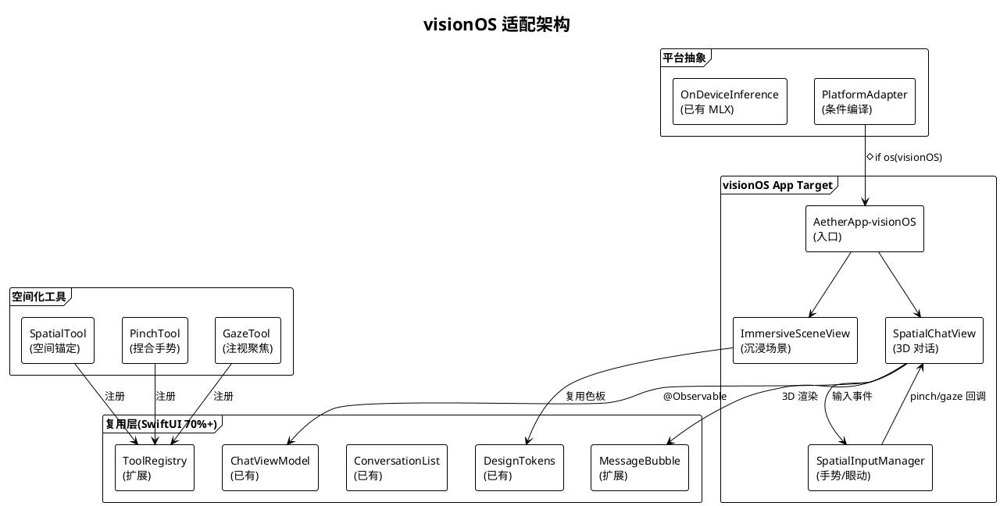
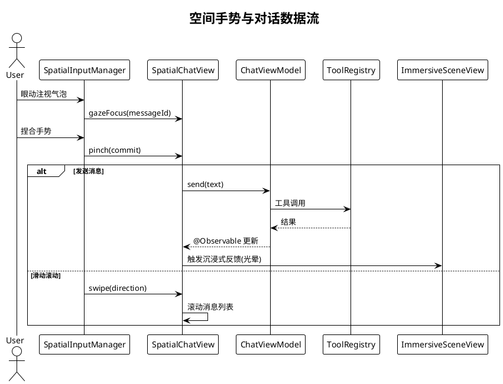

# visionOS 适配规划

> **P3 远期规划 · Task 23** · 日期：2026-07-17 · 范围：visionOS 1.0+ 平台特性、3D 对话界面、空间手势交互、沉浸式场景、SwiftUI 代码复用率、工具适配、硬件限制

## 一、背景与目标

Aether 现已覆盖 iOS / iPad / macOS 三端原生 SwiftUI，使用 `#if os(iOS)` 条件编译与 `@Observable` / `@MainActor` 架构。视觉语言为液态玻璃 + 深空主题（`LiquidGlass` / `DeepSpace` / `NebulaGlow` 色板），契合 visionOS 空间计算美学。但当前 Xcode 工程未声明 visionOS target，`AetherCore` SPM 包仅声明 `.iOS(.v17)` / `.macOS(.v14)`，未适配 visionOS；UI 层依赖 `UIKit/AppKit` 的工具（ScreenshotTool、AppleScriptTool 等）与平台无关 UI 组件均需重新评估空间化呈现。

本规划目标：
1. 在 Xcode 工程中新增 visionOS target，将 `AetherCore` SPM 平台声明扩展至 visionOS 1.0+。
2. 设计 3D 对话界面（沉浸式气泡 / 空间排列 / depth 层级），复用 SwiftUI 70%+ 代码。
3. 引入空间手势交互（捏合发送 / 滑动滚动 / 注视聚焦）。
4. 设计沉浸式场景（环境光照 / 玻璃材质 / parallax）。
5. 适配工具（SpatialTool / PinchTool / GazeTool），处理 Apple Vision Pro 硬件限制。
6. 保持现有 iOS/macOS 代码零改动。

## 二、现状分析

| 维度 | 现状 | 文件位置 | 缺口 |
|------|------|----------|------|
| SPM 平台 | `.iOS(.v17)` / `.macOS(.v14)` | `AetherCore/Package.swift:6-9` | 无 visionOS 声明 |
| Xcode target | Aether-iOS / Aether-macOS / Watch / Widgets | `Aether.xcodeproj` | 无 visionOS target |
| UI 组件 | `MessageBubble` / `ChatView` 等 2D 组件 | `Aether/Views/Chat/` | 无 3D 空间化 |
| 设计令牌 | `LiquidGlass` / `DeepSpace` 等色板 | `ColorTokens.swift` | 已可复用，未做 depth |
| 平台工具 | 26 个工具，11 个 macOS 独有 | `ToolRegistry.swift` | visionOS 工具完全缺失 |
| 手势交互 | 触摸 / 鼠标 / 键盘 | `ChatInputBar.swift` | 无 pinch / gaze |
| 资源 | `Assets.xcassets` 8 语本地化 | `Resources/` | 需补 visionOS 适配 |

## 三、设计方案

### 3.1 架构图

### 3.2 数据流图：空间交互

### 3.3 3D 对话界面设计

**沉浸式气泡：** 每条消息渲染为 3D 玻璃材质球体或圆角立方体，使用 `RealityView` + `MeshResource.generateSphere`，材质采用 `PhysicallyBasedMaterial` 配合 `LiquidGlass` 色板半透明效果。

**空间排列：** 消息按时间序列沿 Z 轴递减 depth 排列（最新在前），用户可调节排列密度；长对话使用 `ScrollView` 包裹 `VStack`，超出视野的消息自动收缩为发光点。

**Depth 层级：** 用户气泡 z=0，AI 气泡 z=-0.2，引用卡片 z=-0.4，工具调用详情 z=-0.6；用户眼动聚焦时被注视气泡平滑前移至 z=0.1。

### 3.4 空间手势交互

- **捏合发送：** `SpatialTapGesture().gestureSize` 配合 `PinchGesture`，捏合确认提交输入。
- **滑动滚动：** `DragGesture` 转 `ScrollGesture`，垂直方向滑动滚动消息列表，水平方向切换会话。
- **注视聚焦：** `HoverEffect` + `.hoverEffect(.highlight)` 监听眼动，被注视气泡高亮并展开详情。
- **远距离点按：** `SpatialTapGesture` 默认空格键点击等效。

### 3.5 沉浸式场景

- **环境光照：** 使用 `ImageBasedLight`（IBL）从 `deepSpace` 渐变环境贴图加载，气泡金属反光与玻璃折射自然。
- **玻璃材质：** 复用 `LiquidGlass` 颜色 + `opacity(0.6)` + `blur(radius: 20)` 模拟空间玻璃材质。
- **Parallax：** 头部轻微移动时气泡产生 parallax 位移（`Transform3D` 偏移），增强深度感。
- **沉浸模式：** `ImmersionStyle.full` 全沉浸模式用于专注对话，`mixed` 混合模式用于多任务场景。

### 3.6 工具适配

**SpatialTool（空间锚定）：** 在空间中固定生成对话结果展示（如生成图片在 3D 空间悬浮），扩展 `RichMessageCard` 为 `SpatialCardView`。
**PinchTool（捏合触发）：** 通过捏合手势触发预设工具（如捏合 + 注视天气图标触发 `WeatherTool`），作为快捷入口。
**GazeTool（注视触发）：** 长注视某段文字 2 秒触发 `OCRTool` / 摘要工具，无手势操作。

现有跨平台工具（AlarmTool / ReminderTool / WeatherTool / OpenURLTool 等）大部分可在 visionOS 直接复用；macOS 独有工具（AppleScriptTool / TerminalCommandTool / SafariControlTool 等）在 visionOS 不可用，需在 `ToolRegistry+visionOS.swift` 中按平台条件注册。

### 3.7 与现有 SwiftUI 代码复用

**估计复用率 70%+：**
- ViewModel 层（ChatViewModel / ConversationListVM / SettingsViewModel）：100% 复用。
- Service 层（LLM / RAG / Agent / Memory / OnDevice）：100% 复用。
- 设计令牌（ColorTokens / DesignTokens / TypographyTokens）：100% 复用。
- View 层（MessageBubble / ConversationList / MarkdownText）：60-70% 复用，需为 3D 适配。
- 平台依赖 UI（MenuBarPanel / ScreenshotTool 触发的截屏 UI）：0% 复用，需新建。

### 3.8 硬件限制处理

| 限制 | 影响 | 缓解 |
|------|------|------|
| Vision Pro 16GB 统一内存 | 大模型加载受限 | 复用 MLX 端侧推理 2B 量化，禁用 11B+ |
| 续航约 2 小时 | 高耗能场景不可持续 | 默认低分辨率，复杂推理降级到 BFF |
| 无摄像头（visionOS 2.0+ Persona） | 拍照即问场景受限 | 依赖 SharePlay / 外部输入 |
| 输入手势有限 | 复杂文本输入慢 | 接入 Dictation 与 Bluetooth 键盘 |
| visionOS 2.0+ 才支持 API | 兼容性 | 最低部署 visionOS 2.0 |

## 四、技术选型

| 选项 | 说明 | 优点 | 缺点 | 选用 |
|------|------|------|------|------|
| 渲染：RealityView | SwiftUI 原生空间视图 | 与 SwiftUI 集成深 | 仅 visionOS | ✅ |
| 渲染：RealityKit 直接 | 底层 API | 灵活 | 脱离 SwiftUI 体系 | ❌ |
| 渲染：SceneKit | 3D 框架 | 跨平台 | 性能不如 RealityView | ❌ |
| 手势：SpatialTapGesture | 原生 | 系统级 | 仅简单手势 | ✅ |
| 手势：自定义 ARKit | 底层 | 灵活 | 复杂、耗电 | ❌ |
| 沉浸：ImmersionStyle | 系统级 | 用户可控 | API 新 | ✅ |
| 工具复用：条件编译 | 已有模式 | 一致 | 重复代码 | ✅ |
| 工具复用：插件系统 | 复用 Task 21 | 解耦 | 依赖未完成 | ❌（先条件编译） |

## 五、实施路径

**阶段 1（平台声明与 target）：** `AetherCore/Package.swift` 增加 `.visionOS(.v2)`；Xcode 新增 `Aether-visionOS` target；`#if os(visionOS)` 条件编译骨架。交付：可编译的 visionOS App 壳。

**阶段 2（3D 对话界面）：** 实现 `SpatialChatView` 与 `SpatialMessageBubble`；接入 `ChatViewModel`；复用 `DesignTokens`。交付：基础 3D 对话可用。

**阶段 3（空间手势）：** 实现 `SpatialInputManager`；接入捏合发送、滑动滚动、注视聚焦；接入 `ImmersionStyle` 切换。交付：完整空间交互。

**阶段 4（沉浸式场景）：** 实现 `ImmersiveSceneView`；接入 IBL 环境光照、玻璃材质、parallax。交付：沉浸式视觉体验。

**阶段 5（工具适配）：** 实现 `ToolRegistry+visionOS.swift`；新增 `SpatialTool` / `PinchTool` / `GazeTool`；平台条件注册跨平台工具。交付：visionOS 工具可用。

**阶段 6（性能与设备适配）：** 16GB 内存下 MLX 2B 量化模型加载；续航优化（降级 BFF 推理）；Persona 集成。交付：上线就绪。

## 六、风险评估

| 风险 | 等级 | 影响 | 缓解措施 |
|------|------|------|----------|
| SwiftUI RealityView API 变更频繁 | 高 | 重构成本 | 锁定 visionOS 2.0 最低版本 |
| 现有 UI 依赖 UIKit/AppKit | 中 | 编译失败 | 用 `#if !os(visionOS)` 隔离 |
| Vision Pro 用户基数小 | 中 | ROI 不足 | 共享 70% 代码、控制投入 |
| 续航瓶颈限制功能 | 中 | 体验差 | 默认低功耗模式 |
| MLX 2B 推理在 16GB 上 OOM | 高 | App 崩溃 | 严格内存预算、BFF 降级 |
| visionOS 模拟器性能不足 | 中 | 测试难 | 优先真机测试 |
| 空间手势学习成本高 | 中 | 用户流失 | 提供 onboarding 教程 |
| Persona API 隐私限制 | 中 | 视觉受限 | 文档明确、不滥用 |

## 七、验收标准

1. `AetherCore/Package.swift` 声明 `.visionOS(.v2)`，SPM resolve 在 visionOS 工具链下成功。
2. Xcode 中存在 `Aether-visionOS` target，可在 Vision Pro 模拟器启动。
3. `SpatialChatView` 能渲染 3D 玻璃气泡，沿 Z 轴 depth 排列，至少 60fps 流畅。
4. 捏合手势可触发消息发送，滑动可滚动消息列表，注视气泡可触发高亮与详情展开。
5. `ImmersiveSceneView` 支持 `mixed` 与 `full` 两种沉浸模式切换，环境光照与玻璃材质正确呈现。
6. `ToolRegistry+visionOS.swift` 注册跨平台工具（≥10 个），macOS 独有工具不注册。
7. 新增 `SpatialTool` / `PinchTool` / `GazeTool` 三个空间化工具，LLM 可调用。
8. ViewModel / Service / DesignTokens 代码复用率 ≥70%，无 iOS/macOS 现有代码改动。
9. 16GB Vision Pro 上加载 MLX 2B Q4 模型可生成文本，连续 30 分钟推理无 OOM 崩溃。
10. `SpatialChatViewTests` / `SpatialInputManagerTests` / `ToolRegistryVisionOSTests` 全部通过。
